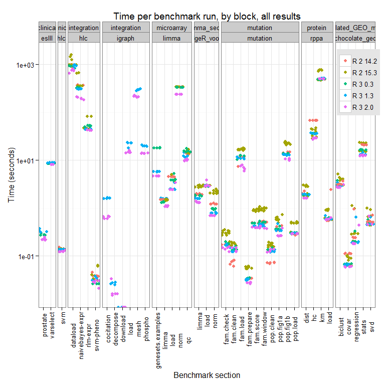

# renjin-blog-may2015
Ieuan Clay  
Tuesday, June 16, 2015  

## GenBench: Realworld Genomics Benchmarks for R

### Pre-amble

Bioinformatics is growing as a [market](https://www.linux.com/community/blogs/131-business-or-qenterprise/775480-bioinformatics-market-is-growing-at-a-cagr-of-254-from-2012-2019-by-transparency-market-researc) and as a field. Just looking at the diversity of questions covered by [Bioconductor](http://www.bioconductor.org/packages/release/BiocViews.html#___BiologicalQuestion).

Forked from and inspired by [GenBase](https://github.com/mitdbg/genbase), GenBench is an attempt to build up some ~ecologically valid~ benchmarks and tests for bioinformatics. A nice example of this is ~RforProteomics~, see their [project](http://lgatto.github.com/RforProteomics/) and accompanying [paper](http://arxiv.org/pdf/1305.6559.pdf).

This benchmark does not cover all possible operations performed in bioinformatics/genomics. In particular, we chose to not focus on (pre-)processing of raw data and instead focus on higher-level processing typical for a rage of datatypes.

We also chose to use real-world data, to allow not just benchmarking of clock speeds upon completion of a given analysis, but also to allow for testing.

Generally speaking, we do not endorse any of the methods used as *"standards"* or *"recommended"*, in fact, because we aim to start simple and avoid as far as possible non-essential packages, methods may be very much not recommended. Future updates will implement more advanced methods, a wider range of packages, etc. 

__Suggestions and contributions for datasets or methods are welcome.__

This project was developed with support/inspiration/coffee from [BeDataDriven](https://www.bedatadriven.com). All Hail!


### This post
In this post we wanted to get feedback on ~"version 1.0"~ of [GenBench](https://github.com/biolion/genbench), and thought a nice way to do that would be to run a little experiment in the hope it would generate interest/support/glory.

Currently (as of June 2015) [GenBench](https://github.com/biolion/genbench) includes 10 benchmark scripts, each containing several microbenchmarks, covering topics from microarray analysis with [limma](http://bioinf.wehi.edu.au/limma/), graphs with [iGraph](http://igraph.org/r/) and some machine learning as might be applied to patient profiling. We thought this was enough to make some comparisons across different versions of R, to examine the real-world effects of recent upgrades to [GNU R](http://www.r-project.org/).

Specifically, we ran the full suite of benchmarks against the following releases (complied from [source](http://cran.rstudio.com/) using this [script](https://github.com/biolion/genbench-articles/blob/master/renjin-blog-may2015/install-r-sources.sh):

- R-2.14.2
- R-2.15.3
- R-3.0.3
- R-3.1.3
- R-3.2.0 

## The Benchmarks
### The Data

All data is publicly available, sourced from various places (for further information please see the individual README accompanying each benchmark, and please let us know if something is incorrect/missing/...):

(a) Gene Expression Data
  - 3' Microarray
    - [Ramsey and Fontes, 2013](http://www.ncbi.nlm.nih.gov/pubmed/23954399)
      - [dataset](http://www.ncbi.nlm.nih.gov/sites/GDSbrowser?acc=GDS5070)
      - [data](http://www.ncbi.nlm.nih.gov/geo/query/acc.cgi?acc=GSE45417)
      - [full article](http://www.ncbi.nlm.nih.gov/pmc/articles/PMC3783546/)

  - mRNAseq
    - Data sourced from [ReCount](http://bowtie-bio.sourceforge.net/recount/)
      - Specifically, the "gilad" study, [PMID: 20009012](http://www.ncbi.nlm.nih.gov/pubmed?term=20009012)

(b) Protein Expression Data
  - RPPA platform
    - Data was sourced from [Hoadley et al](http://www.cell.com/cell/abstract/S0092-8674(14)00876-9), using the [TCGA portal](https://tcga-data.nci.nih.gov/docs/publications/TCGApancan_2014/)
  - Mass Spectrometry is not yet implemented

(c) Genetics Data
  - Population studies were simulated using [data](http://tcga-data.nci.nih.gov/docs/publications/laml_2012/) from the [AML paper](http://www.nejm.org/doi/full/10.1056/NEJMoa1301689) authored by the TCGA consortium
  - Pedigree studies were simulated using data obtained from the nice people at [Genomes Unzipped](http://genomesunzipped.org/members), who make [their own genomic data](http://genomesunzipped.org/data) publicly available

(d) Simulated matrices (to allow for testing scale, as in orginal [GenBase](https://github.com/mitdbg/genbase) project 

(e) Clinical data and Data Integration
  - Data sourced from package [ncvreg](http://cran.r-project.org/web/packages/ncvreg/ncvreg.pdf), further references below:

    - heart dataset
      - Hastie, T., Tibshirani, R., and Friedman, J. (2001). The Elements of Statistical Learning. Springer. 
      - Rousseauw, J., et al. (1983). Coronary risk factor screening in three rural communities. South African Medical Journal, 64, 430-436.
    - prostate dataset
      - Hastie, T., Tibshirani, R., and Friedman, J. (2001). The Elements of Statistical Learning. Springer. 
      - Stamey, T., et al. (1989). Prostate specific antigen in the diagnosis and treatment of adenocarcinoma of the prostate. II. Radical prostatectomy treated patients. Journal of Urology, 16: 1076-1083.
    - lung dataset
      - package [survival](http://CRAN.R-project.org/package=survival)
      - Kalbfleisch D and Prentice RL (1980), The Statistical Analysis of Failure Time Data. Wiley, New York.

  - [gene RIFs](http://www.ncbi.nlm.nih.gov/gene/about-generif) provided interaction data to be used for graphical modelling with [igraph](http://igraph.sourceforge.net/)
  - We also reproduce aspects of integrative analysis carried out in the Human Liver Cohort project:
    - [synapse entry](https://www.synapse.org/#!Synapse:syn299418)
    - [Schadt et al, 2008](http://journals.plos.org/plosbiology/article?id=10.1371/journal.pbio.0060107)
    
### The Code

(a) Gene Expression Data
  - 3' Microarray
Methods typical for microarrays including RMA and MAS150 normalisation, differential expression with limma, and some gene-set tests.

  - mRNAseq
Methods typical for mRNAseq expression analyses, including the Voom/edgeR/limma approach (The "DEseq" approach is to come).

(b) Protein Expression Data
Focussing on classification, RPPA [data](https://tcga-data.nci.nih.gov/docs/publications/TCGApancan_2014/) from [Hoadley et al](http://www.cell.com/cell/abstract/S0092-8674(14)00876-9) was used a range of unpsupervised clustering methods including hierarchical, kmeans, random forrest, bayesian

(c) Genetics Data
This section is still quite under-developed, focussing on summarisation of allele frequencies, and some sliding window methods. Implementation of "proper" genetics analysis methods is a burning priority!

(d) Simulated data
Focus on the linear algebra and stats operations below: 

  - Linear Regression: build regression model to predict drug response from expression data

  - Covariance: determine which pairs of genes have expression values that are correlated

  - SVD: reduce the dimensionality of the problem to the top 50 components

  - Biclustering: simultaneously cluster rows and columns in the expression matrix to find related genes

  - Statistics: determine if certain sets of genes are highly expressed compared to the entire set of genes

(e) Clinical data and Data Integration
Alongside some graphical methods using iGraph, we focus on machine learning approaches including clustering, and prediction using naive Bayes and robust linear model approaches


## The Experiment
Prepare the environment and connect to the database (GenBench also contains code for working from local files, and for setting up your own database).

```
## Warning: package 'RJDBC' was built under R version 3.1.3
```

```
## Loading required package: DBI
```

```
## Warning: package 'DBI' was built under R version 3.1.3
```

```
## Loading required package: rJava
```

```
## Warning: package 'rJava' was built under R version 3.1.3
```

```
## Warning: package 'plyr' was built under R version 3.1.3
```

```
## Warning: package 'ggplot2' was built under R version 3.1.3
```


```r
# load packages
library(RJDBC)
library(plyr)
library(ggplot2)
# set the seed
set.seed(8008)
# connect to the database
conn <- dbConnect(
  drv = JDBC("renjin-blog-may2015/mysql-connector-java-5.1.35.jar",
             driverClass = "com.mysql.jdbc.Driver", 
             identifier.quote="`"),
  "connection string", user="foo", password="bar"
  )
```

Load the data that we will examine:


```r
res <- dbGetQuery(conn,statement="
                  
                  SELECT
                    *
                  FROM
                    meta m
                    JOIN timings t ON m.meta_id=t.meta_id
                  WHERE
                    MONTHNAME(m.insert_ts) = 'June' AND
                    YEAR(m.insert_ts) = 2015 AND
                  t.variable='elapsed' AND
                  m.sys_name='Linux' AND
                  m.lang!='not set'
                  ;
                  "
                  )
table(res$lang_major, res$lang_minor)
```

```
##    
##      1.1
##   3 2580
```

Plot it out

```r
g <- ggplot(data = res)
g +
  geom_jitter(aes(y=value, x=block, colour=variable), 
              position = position_jitter(width = .5)) +
  facet_grid(sys_name + sys_release + lang + lang_major + lang_minor ~ benchmark_group + benchmark, scales = "free_x") +
  scale_y_log10() +
  theme_bw() +
  theme(axis.text.x  = element_text(angle=90, vjust=0.5)) +
  ggtitle("Time per benchmark run, by block") +
  ylab("Time (seconds)") +
  xlab("Benchmark section")
```

 

Do some stats


Examine those results
x | y
--- | ---
  61 | 2015-06-12 15:02:26.0 | 20150609153342 | TEMPLATE | TEMPLATE | Linux | 3.14-0.bpo.1-amd64 | R | 3 | 1.1 |   61 | TEMPLATE | elapsed |   0.017
  62 | 2015-06-12 15:02:27.0 | 20150609153343 | TEMPLATE | TEMPLATE | Linux | 3.14-0.bpo.1-amd64 | R | 3 | 1.1 |   62 | TEMPLATE | elapsed |   0.017
  63 | 2015-06-12 15:02:28.0 | 20150609153344 | TEMPLATE | TEMPLATE | Linux | 3.14-0.bpo.1-amd64 | R | 3 | 1.1 |   63 | TEMPLATE | elapsed |   0.017
  64 | 2015-06-12 15:02:29.0 | 20150609153345 | TEMPLATE | TEMPLATE | Linux | 3.14-0.bpo.1-amd64 | R | 3 | 1.1 |   64 | TEMPLATE | elapsed |   0.018
  65 | 2015-06-12 15:02:29.0 | 20150609153346 | TEMPLATE | TEMPLATE | Linux | 3.14-0.bpo.1-amd64 | R | 3 | 1.1 |   65 | TEMPLATE | elapsed |   0.018
  66 | 2015-06-12 15:02:30.0 | 20150609153347 | TEMPLATE | TEMPLATE | Linux | 3.14-0.bpo.1-amd64 | R | 3 | 1.1 |   66 | TEMPLATE | elapsed |   0.018
  67 | 2015-06-12 15:02:31.0 | 20150609153348 | TEMPLATE | TEMPLATE | Linux | 3.14-0.bpo.1-amd64 | R | 3 | 1.1 |   67 | TEMPLATE | elapsed |   0.018
  68 | 2015-06-12 15:02:31.0 | 20150609153349 | TEMPLATE | TEMPLATE | Linux | 3.14-0.bpo.1-amd64 | R | 3 | 1.1 |   68 | TEMPLATE | elapsed |   0.018
  69 | 2015-06-12 15:02:32.0 | 20150609153350 | TEMPLATE | TEMPLATE | Linux | 3.14-0.bpo.1-amd64 | R | 3 | 1.1 |   69 | TEMPLATE | elapsed |   0.018
  70 | 2015-06-12 15:02:33.0 | 20150609153351 | TEMPLATE | TEMPLATE | Linux | 3.14-0.bpo.1-amd64 | R | 3 | 1.1 |   70 | TEMPLATE | elapsed |   0.018
  71 | 2015-06-12 15:02:33.0 | 20150609192329 | TEMPLATE | TEMPLATE | Linux | 3.14-0.bpo.1-amd64 | R | 3 | 1.1 |   71 | TEMPLATE | elapsed |   0.017
  72 | 2015-06-12 15:02:34.0 | 20150609192330 | TEMPLATE | TEMPLATE | Linux | 3.14-0.bpo.1-amd64 | R | 3 | 1.1 |   72 | TEMPLATE | elapsed |   0.018
  73 | 2015-06-12 15:02:34.0 | 20150609192331 | TEMPLATE | TEMPLATE | Linux | 3.14-0.bpo.1-amd64 | R | 3 | 1.1 |   73 | TEMPLATE | elapsed |   0.017
  74 | 2015-06-12 15:02:35.0 | 20150609192332 | TEMPLATE | TEMPLATE | Linux | 3.14-0.bpo.1-amd64 | R | 3 | 1.1 |   74 | TEMPLATE | elapsed |   0.018
  75 | 2015-06-12 15:02:36.0 | 20150609192333 | TEMPLATE | TEMPLATE | Linux | 3.14-0.bpo.1-amd64 | R | 3 | 1.1 |   75 | TEMPLATE | elapsed |   0.017
  76 | 2015-06-12 15:02:36.0 | 20150609192334 | TEMPLATE | TEMPLATE | Linux | 3.14-0.bpo.1-amd64 | R | 3 | 1.1 |   76 | TEMPLATE | elapsed |   0.018
  77 | 2015-06-12 15:02:37.0 | 20150609192335 | TEMPLATE | TEMPLATE | Linux | 3.14-0.bpo.1-amd64 | R | 3 | 1.1 |   77 | TEMPLATE | elapsed |   0.019
  78 | 2015-06-12 15:02:38.0 | 20150609192336 | TEMPLATE | TEMPLATE | Linux | 3.14-0.bpo.1-amd64 | R | 3 | 1.1 |   78 | TEMPLATE | elapsed |   0.018
  79 | 2015-06-12 15:02:39.0 | 20150609192337 | TEMPLATE | TEMPLATE | Linux | 3.14-0.bpo.1-amd64 | R | 3 | 1.1 |   79 | TEMPLATE | elapsed |   0.017
  80 | 2015-06-12 15:02:39.0 | 20150609192338 | TEMPLATE | TEMPLATE | Linux | 3.14-0.bpo.1-amd64 | R | 3 | 1.1 |   80 | TEMPLATE | elapsed |   0.018
  81 | 2015-06-12 15:02:40.0 | 20150610133532 | TEMPLATE | TEMPLATE | Linux | 3.14-0.bpo.1-amd64 | R | 3 | 1.1 |   81 | TEMPLATE | elapsed |   0.020
  82 | 2015-06-12 15:02:40.0 | 20150610133533 | TEMPLATE | TEMPLATE | Linux | 3.14-0.bpo.1-amd64 | R | 3 | 1.1 |   82 | TEMPLATE | elapsed |   0.020
  83 | 2015-06-12 15:02:41.0 | 20150610133534 | TEMPLATE | TEMPLATE | Linux | 3.14-0.bpo.1-amd64 | R | 3 | 1.1 |   83 | TEMPLATE | elapsed |   0.018
  84 | 2015-06-12 15:02:42.0 | 20150610133535 | TEMPLATE | TEMPLATE | Linux | 3.14-0.bpo.1-amd64 | R | 3 | 1.1 |   84 | TEMPLATE | elapsed |   0.019
  85 | 2015-06-12 15:02:43.0 | 20150610133536 | TEMPLATE | TEMPLATE | Linux | 3.14-0.bpo.1-amd64 | R | 3 | 1.1 |   85 | TEMPLATE | elapsed |   0.019
  86 | 2015-06-12 15:02:43.0 | 20150610133537 | TEMPLATE | TEMPLATE | Linux | 3.14-0.bpo.1-amd64 | R | 3 | 1.1 |   86 | TEMPLATE | elapsed |   0.018
  87 | 2015-06-12 15:02:44.0 | 20150610133538 | TEMPLATE | TEMPLATE | Linux | 3.14-0.bpo.1-amd64 | R | 3 | 1.1 |   87 | TEMPLATE | elapsed |   0.019
  88 | 2015-06-12 15:02:44.0 | 20150610133539 | TEMPLATE | TEMPLATE | Linux | 3.14-0.bpo.1-amd64 | R | 3 | 1.1 |   88 | TEMPLATE | elapsed |   0.018
  89 | 2015-06-12 15:02:45.0 | 20150610133540 | TEMPLATE | TEMPLATE | Linux | 3.14-0.bpo.1-amd64 | R | 3 | 1.1 |   89 | TEMPLATE | elapsed |   0.019
  90 | 2015-06-12 15:02:46.0 | 20150610133541 | TEMPLATE | TEMPLATE | Linux | 3.14-0.bpo.1-amd64 | R | 3 | 1.1 |   90 | TEMPLATE | elapsed |   0.019
  91 | 2015-06-12 15:02:46.0 | 20150610174414 | TEMPLATE | TEMPLATE | Linux | 3.14-0.bpo.1-amd64 | R | 3 | 1.1 |   91 | TEMPLATE | elapsed |   0.018
  92 | 2015-06-12 15:02:47.0 | 20150610174415 | TEMPLATE | TEMPLATE | Linux | 3.14-0.bpo.1-amd64 | R | 3 | 1.1 |   92 | TEMPLATE | elapsed |   0.019
  93 | 2015-06-12 15:02:48.0 | 20150610174416 | TEMPLATE | TEMPLATE | Linux | 3.14-0.bpo.1-amd64 | R | 3 | 1.1 |   93 | TEMPLATE | elapsed |   0.018
  94 | 2015-06-12 15:02:48.0 | 20150610174417 | TEMPLATE | TEMPLATE | Linux | 3.14-0.bpo.1-amd64 | R | 3 | 1.1 |   94 | TEMPLATE | elapsed |   0.018
  95 | 2015-06-12 15:02:49.0 | 20150610174418 | TEMPLATE | TEMPLATE | Linux | 3.14-0.bpo.1-amd64 | R | 3 | 1.1 |   95 | TEMPLATE | elapsed |   0.019
  96 | 2015-06-12 15:02:50.0 | 20150610174419 | TEMPLATE | TEMPLATE | Linux | 3.14-0.bpo.1-amd64 | R | 3 | 1.1 |   96 | TEMPLATE | elapsed |   0.019
  97 | 2015-06-12 15:02:51.0 | 20150610174420 | TEMPLATE | TEMPLATE | Linux | 3.14-0.bpo.1-amd64 | R | 3 | 1.1 |   97 | TEMPLATE | elapsed |   0.019
  98 | 2015-06-12 15:02:51.0 | 20150610174421 | TEMPLATE | TEMPLATE | Linux | 3.14-0.bpo.1-amd64 | R | 3 | 1.1 |   98 | TEMPLATE | elapsed |   0.018
  99 | 2015-06-12 15:02:52.0 | 20150610174422 | TEMPLATE | TEMPLATE | Linux | 3.14-0.bpo.1-amd64 | R | 3 | 1.1 |   99 | TEMPLATE | elapsed |   0.018
 100 | 2015-06-12 15:02:52.0 | 20150610174423 | TEMPLATE | TEMPLATE | Linux | 3.14-0.bpo.1-amd64 | R | 3 | 1.1 |  100 | TEMPLATE | elapsed |   0.018
 101 | 2015-06-12 15:02:53.0 | 20150612150148 | TEMPLATE | TEMPLATE | Linux | 3.14-0.bpo.1-amd64 | R | 3 | 1.1 |  101 | TEMPLATE | elapsed |   0.018
 102 | 2015-06-12 15:02:54.0 | 20150612150149 | TEMPLATE | TEMPLATE | Linux | 3.14-0.bpo.1-amd64 | R | 3 | 1.1 |  102 | TEMPLATE | elapsed |   0.018
 103 | 2015-06-12 15:02:54.0 | 20150612150150 | TEMPLATE | TEMPLATE | Linux | 3.14-0.bpo.1-amd64 | R | 3 | 1.1 |  103 | TEMPLATE | elapsed |   0.018
 104 | 2015-06-12 15:02:55.0 | 20150612150151 | TEMPLATE | TEMPLATE | Linux | 3.14-0.bpo.1-amd64 | R | 3 | 1.1 |  104 | TEMPLATE | elapsed |   0.018
 105 | 2015-06-12 15:02:56.0 | 20150612150152 | TEMPLATE | TEMPLATE | Linux | 3.14-0.bpo.1-amd64 | R | 3 | 1.1 |  105 | TEMPLATE | elapsed |   0.017
 106 | 2015-06-12 15:02:56.0 | 20150612150153 | TEMPLATE | TEMPLATE | Linux | 3.14-0.bpo.1-amd64 | R | 3 | 1.1 |  106 | TEMPLATE | elapsed |   0.018
 107 | 2015-06-12 15:02:57.0 | 20150612150154 | TEMPLATE | TEMPLATE | Linux | 3.14-0.bpo.1-amd64 | R | 3 | 1.1 |  107 | TEMPLATE | elapsed |   0.018
 108 | 2015-06-12 15:02:58.0 | 20150612150155 | TEMPLATE | TEMPLATE | Linux | 3.14-0.bpo.1-amd64 | R | 3 | 1.1 |  108 | TEMPLATE | elapsed |   0.017
 109 | 2015-06-12 15:02:58.0 | 20150612150156 | TEMPLATE | TEMPLATE | Linux | 3.14-0.bpo.1-amd64 | R | 3 | 1.1 |  109 | TEMPLATE | elapsed |   0.018
 110 | 2015-06-12 15:02:59.0 | 20150612150157 | TEMPLATE | TEMPLATE | Linux | 3.14-0.bpo.1-amd64 | R | 3 | 1.1 |  110 | TEMPLATE | elapsed |   0.018
 141 | 2015-06-12 15:03:35.0 | 20150609153205 | eslII | clinical | Linux | 3.14-0.bpo.1-amd64 | R | 3 | 1.1 |  141 | varselect | elapsed |   9.224
 141 | 2015-06-12 15:03:35.0 | 20150609153205 | eslII | clinical | Linux | 3.14-0.bpo.1-amd64 | R | 3 | 1.1 |  141 | prostate | elapsed |   0.349
 142 | 2015-06-12 15:03:36.0 | 20150609153216 | eslII | clinical | Linux | 3.14-0.bpo.1-amd64 | R | 3 | 1.1 |  142 | varselect | elapsed |   9.594
 142 | 2015-06-12 15:03:36.0 | 20150609153216 | eslII | clinical | Linux | 3.14-0.bpo.1-amd64 | R | 3 | 1.1 |  142 | prostate | elapsed |   0.323
 143 | 2015-06-12 15:03:37.0 | 20150609153226 | eslII | clinical | Linux | 3.14-0.bpo.1-amd64 | R | 3 | 1.1 |  143 | varselect | elapsed |   9.189
 143 | 2015-06-12 15:03:37.0 | 20150609153226 | eslII | clinical | Linux | 3.14-0.bpo.1-amd64 | R | 3 | 1.1 |  143 | prostate | elapsed |   0.330
 144 | 2015-06-12 15:03:38.0 | 20150609153237 | eslII | clinical | Linux | 3.14-0.bpo.1-amd64 | R | 3 | 1.1 |  144 | varselect | elapsed |   9.237
 144 | 2015-06-12 15:03:38.0 | 20150609153237 | eslII | clinical | Linux | 3.14-0.bpo.1-amd64 | R | 3 | 1.1 |  144 | prostate | elapsed |   0.339
 145 | 2015-06-12 15:03:39.0 | 20150609153247 | eslII | clinical | Linux | 3.14-0.bpo.1-amd64 | R | 3 | 1.1 |  145 | varselect | elapsed |   9.256
 145 | 2015-06-12 15:03:39.0 | 20150609153247 | eslII | clinical | Linux | 3.14-0.bpo.1-amd64 | R | 3 | 1.1 |  145 | prostate | elapsed |   0.330
 146 | 2015-06-12 15:03:40.0 | 20150609153258 | eslII | clinical | Linux | 3.14-0.bpo.1-amd64 | R | 3 | 1.1 |  146 | varselect | elapsed |   9.406
 146 | 2015-06-12 15:03:40.0 | 20150609153258 | eslII | clinical | Linux | 3.14-0.bpo.1-amd64 | R | 3 | 1.1 |  146 | prostate | elapsed |   0.395
 147 | 2015-06-12 15:03:42.0 | 20150609153309 | eslII | clinical | Linux | 3.14-0.bpo.1-amd64 | R | 3 | 1.1 |  147 | varselect | elapsed |   9.456
 147 | 2015-06-12 15:03:42.0 | 20150609153309 | eslII | clinical | Linux | 3.14-0.bpo.1-amd64 | R | 3 | 1.1 |  147 | prostate | elapsed |   0.367
 148 | 2015-06-12 15:03:43.0 | 20150609153320 | eslII | clinical | Linux | 3.14-0.bpo.1-amd64 | R | 3 | 1.1 |  148 | varselect | elapsed |   9.616
 148 | 2015-06-12 15:03:43.0 | 20150609153320 | eslII | clinical | Linux | 3.14-0.bpo.1-amd64 | R | 3 | 1.1 |  148 | prostate | elapsed |   0.395
 149 | 2015-06-12 15:03:44.0 | 20150609153331 | eslII | clinical | Linux | 3.14-0.bpo.1-amd64 | R | 3 | 1.1 |  149 | varselect | elapsed |   9.557
 149 | 2015-06-12 15:03:44.0 | 20150609153331 | eslII | clinical | Linux | 3.14-0.bpo.1-amd64 | R | 3 | 1.1 |  149 | prostate | elapsed |   0.356
 150 | 2015-06-12 15:03:45.0 | 20150609153341 | eslII | clinical | Linux | 3.14-0.bpo.1-amd64 | R | 3 | 1.1 |  150 | varselect | elapsed |   9.200
 150 | 2015-06-12 15:03:45.0 | 20150609153341 | eslII | clinical | Linux | 3.14-0.bpo.1-amd64 | R | 3 | 1.1 |  150 | prostate | elapsed |   0.411
 151 | 2015-06-12 15:03:46.0 | 20150609192151 | eslII | clinical | Linux | 3.14-0.bpo.1-amd64 | R | 3 | 1.1 |  151 | varselect | elapsed |   9.255
 151 | 2015-06-12 15:03:46.0 | 20150609192151 | eslII | clinical | Linux | 3.14-0.bpo.1-amd64 | R | 3 | 1.1 |  151 | prostate | elapsed |   0.334
 152 | 2015-06-12 15:03:48.0 | 20150609192202 | eslII | clinical | Linux | 3.14-0.bpo.1-amd64 | R | 3 | 1.1 |  152 | varselect | elapsed |   9.298
 152 | 2015-06-12 15:03:48.0 | 20150609192202 | eslII | clinical | Linux | 3.14-0.bpo.1-amd64 | R | 3 | 1.1 |  152 | prostate | elapsed |   0.337
 153 | 2015-06-12 15:03:49.0 | 20150609192213 | eslII | clinical | Linux | 3.14-0.bpo.1-amd64 | R | 3 | 1.1 |  153 | varselect | elapsed |   9.448
 153 | 2015-06-12 15:03:49.0 | 20150609192213 | eslII | clinical | Linux | 3.14-0.bpo.1-amd64 | R | 3 | 1.1 |  153 | prostate | elapsed |   0.334
 154 | 2015-06-12 15:03:50.0 | 20150609192224 | eslII | clinical | Linux | 3.14-0.bpo.1-amd64 | R | 3 | 1.1 |  154 | varselect | elapsed |   9.324
 154 | 2015-06-12 15:03:50.0 | 20150609192224 | eslII | clinical | Linux | 3.14-0.bpo.1-amd64 | R | 3 | 1.1 |  154 | prostate | elapsed |   0.320
 155 | 2015-06-12 15:03:51.0 | 20150609192234 | eslII | clinical | Linux | 3.14-0.bpo.1-amd64 | R | 3 | 1.1 |  155 | varselect | elapsed |   9.172
 155 | 2015-06-12 15:03:51.0 | 20150609192234 | eslII | clinical | Linux | 3.14-0.bpo.1-amd64 | R | 3 | 1.1 |  155 | prostate | elapsed |   0.329
 156 | 2015-06-12 15:03:52.0 | 20150609192245 | eslII | clinical | Linux | 3.14-0.bpo.1-amd64 | R | 3 | 1.1 |  156 | varselect | elapsed |   9.227
 156 | 2015-06-12 15:03:52.0 | 20150609192245 | eslII | clinical | Linux | 3.14-0.bpo.1-amd64 | R | 3 | 1.1 |  156 | prostate | elapsed |   0.324
 157 | 2015-06-12 15:03:54.0 | 20150609192255 | eslII | clinical | Linux | 3.14-0.bpo.1-amd64 | R | 3 | 1.1 |  157 | varselect | elapsed |   9.359
 157 | 2015-06-12 15:03:54.0 | 20150609192255 | eslII | clinical | Linux | 3.14-0.bpo.1-amd64 | R | 3 | 1.1 |  157 | prostate | elapsed |   0.349
 158 | 2015-06-12 15:03:55.0 | 20150609192306 | eslII | clinical | Linux | 3.14-0.bpo.1-amd64 | R | 3 | 1.1 |  158 | varselect | elapsed |   9.419
 158 | 2015-06-12 15:03:55.0 | 20150609192306 | eslII | clinical | Linux | 3.14-0.bpo.1-amd64 | R | 3 | 1.1 |  158 | prostate | elapsed |   0.354
 159 | 2015-06-12 15:03:56.0 | 20150609192317 | eslII | clinical | Linux | 3.14-0.bpo.1-amd64 | R | 3 | 1.1 |  159 | varselect | elapsed |  10.064
 159 | 2015-06-12 15:03:56.0 | 20150609192317 | eslII | clinical | Linux | 3.14-0.bpo.1-amd64 | R | 3 | 1.1 |  159 | prostate | elapsed |   0.313
 160 | 2015-06-12 15:03:57.0 | 20150609192328 | eslII | clinical | Linux | 3.14-0.bpo.1-amd64 | R | 3 | 1.1 |  160 | varselect | elapsed |   9.372
 160 | 2015-06-12 15:03:57.0 | 20150609192328 | eslII | clinical | Linux | 3.14-0.bpo.1-amd64 | R | 3 | 1.1 |  160 | prostate | elapsed |   0.336
 161 | 2015-06-12 15:03:58.0 | 20150610133347 | eslII | clinical | Linux | 3.14-0.bpo.1-amd64 | R | 3 | 1.1 |  161 | varselect | elapsed |   9.974
 161 | 2015-06-12 15:03:58.0 | 20150610133347 | eslII | clinical | Linux | 3.14-0.bpo.1-amd64 | R | 3 | 1.1 |  161 | prostate | elapsed |   0.392
 162 | 2015-06-12 15:03:59.0 | 20150610133359 | eslII | clinical | Linux | 3.14-0.bpo.1-amd64 | R | 3 | 1.1 |  162 | varselect | elapsed |  10.294
 162 | 2015-06-12 15:03:59.0 | 20150610133359 | eslII | clinical | Linux | 3.14-0.bpo.1-amd64 | R | 3 | 1.1 |  162 | prostate | elapsed |   0.371
 163 | 2015-06-12 15:04:01.0 | 20150610133410 | eslII | clinical | Linux | 3.14-0.bpo.1-amd64 | R | 3 | 1.1 |  163 | varselect | elapsed |   9.880
 163 | 2015-06-12 15:04:01.0 | 20150610133410 | eslII | clinical | Linux | 3.14-0.bpo.1-amd64 | R | 3 | 1.1 |  163 | prostate | elapsed |   0.360
 164 | 2015-06-12 15:04:02.0 | 20150610133422 | eslII | clinical | Linux | 3.14-0.bpo.1-amd64 | R | 3 | 1.1 |  164 | varselect | elapsed |   9.928
 164 | 2015-06-12 15:04:02.0 | 20150610133422 | eslII | clinical | Linux | 3.14-0.bpo.1-amd64 | R | 3 | 1.1 |  164 | prostate | elapsed |   0.354
 165 | 2015-06-12 15:04:03.0 | 20150610133433 | eslII | clinical | Linux | 3.14-0.bpo.1-amd64 | R | 3 | 1.1 |  165 | varselect | elapsed |  10.123
 165 | 2015-06-12 15:04:03.0 | 20150610133433 | eslII | clinical | Linux | 3.14-0.bpo.1-amd64 | R | 3 | 1.1 |  165 | prostate | elapsed |   0.361
 166 | 2015-06-12 15:04:04.0 | 20150610133445 | eslII | clinical | Linux | 3.14-0.bpo.1-amd64 | R | 3 | 1.1 |  166 | varselect | elapsed |  10.046
 166 | 2015-06-12 15:04:04.0 | 20150610133445 | eslII | clinical | Linux | 3.14-0.bpo.1-amd64 | R | 3 | 1.1 |  166 | prostate | elapsed |   0.347
 167 | 2015-06-12 15:04:05.0 | 20150610133456 | eslII | clinical | Linux | 3.14-0.bpo.1-amd64 | R | 3 | 1.1 |  167 | varselect | elapsed |  10.062
 167 | 2015-06-12 15:04:05.0 | 20150610133456 | eslII | clinical | Linux | 3.14-0.bpo.1-amd64 | R | 3 | 1.1 |  167 | prostate | elapsed |   0.372
 168 | 2015-06-12 15:04:07.0 | 20150610133508 | eslII | clinical | Linux | 3.14-0.bpo.1-amd64 | R | 3 | 1.1 |  168 | varselect | elapsed |  10.256
 168 | 2015-06-12 15:04:07.0 | 20150610133508 | eslII | clinical | Linux | 3.14-0.bpo.1-amd64 | R | 3 | 1.1 |  168 | prostate | elapsed |   0.343
 169 | 2015-06-12 15:04:08.0 | 20150610133519 | eslII | clinical | Linux | 3.14-0.bpo.1-amd64 | R | 3 | 1.1 |  169 | varselect | elapsed |   9.903
 169 | 2015-06-12 15:04:08.0 | 20150610133519 | eslII | clinical | Linux | 3.14-0.bpo.1-amd64 | R | 3 | 1.1 |  169 | prostate | elapsed |   0.359
 170 | 2015-06-12 15:04:09.0 | 20150610133531 | eslII | clinical | Linux | 3.14-0.bpo.1-amd64 | R | 3 | 1.1 |  170 | varselect | elapsed |  10.337
 170 | 2015-06-12 15:04:09.0 | 20150610133531 | eslII | clinical | Linux | 3.14-0.bpo.1-amd64 | R | 3 | 1.1 |  170 | prostate | elapsed |   0.352
 171 | 2015-06-12 15:04:10.0 | 20150610174232 | eslII | clinical | Linux | 3.14-0.bpo.1-amd64 | R | 3 | 1.1 |  171 | varselect | elapsed |   9.850
 171 | 2015-06-12 15:04:10.0 | 20150610174232 | eslII | clinical | Linux | 3.14-0.bpo.1-amd64 | R | 3 | 1.1 |  171 | prostate | elapsed |   0.347
 172 | 2015-06-12 15:04:11.0 | 20150610174243 | eslII | clinical | Linux | 3.14-0.bpo.1-amd64 | R | 3 | 1.1 |  172 | varselect | elapsed |   9.800
 172 | 2015-06-12 15:04:11.0 | 20150610174243 | eslII | clinical | Linux | 3.14-0.bpo.1-amd64 | R | 3 | 1.1 |  172 | prostate | elapsed |   0.342
 173 | 2015-06-12 15:04:12.0 | 20150610174254 | eslII | clinical | Linux | 3.14-0.bpo.1-amd64 | R | 3 | 1.1 |  173 | varselect | elapsed |   9.879
 173 | 2015-06-12 15:04:12.0 | 20150610174254 | eslII | clinical | Linux | 3.14-0.bpo.1-amd64 | R | 3 | 1.1 |  173 | prostate | elapsed |   0.395
 174 | 2015-06-12 15:04:13.0 | 20150610174306 | eslII | clinical | Linux | 3.14-0.bpo.1-amd64 | R | 3 | 1.1 |  174 | varselect | elapsed |  10.129
 174 | 2015-06-12 15:04:13.0 | 20150610174306 | eslII | clinical | Linux | 3.14-0.bpo.1-amd64 | R | 3 | 1.1 |  174 | prostate | elapsed |   0.345
 175 | 2015-06-12 15:04:15.0 | 20150610174317 | eslII | clinical | Linux | 3.14-0.bpo.1-amd64 | R | 3 | 1.1 |  175 | varselect | elapsed |   9.778
 175 | 2015-06-12 15:04:15.0 | 20150610174317 | eslII | clinical | Linux | 3.14-0.bpo.1-amd64 | R | 3 | 1.1 |  175 | prostate | elapsed |   0.345
 176 | 2015-06-12 15:04:16.0 | 20150610174328 | eslII | clinical | Linux | 3.14-0.bpo.1-amd64 | R | 3 | 1.1 |  176 | varselect | elapsed |   9.739
 176 | 2015-06-12 15:04:16.0 | 20150610174328 | eslII | clinical | Linux | 3.14-0.bpo.1-amd64 | R | 3 | 1.1 |  176 | prostate | elapsed |   0.366
 177 | 2015-06-12 15:04:17.0 | 20150610174339 | eslII | clinical | Linux | 3.14-0.bpo.1-amd64 | R | 3 | 1.1 |  177 | varselect | elapsed |   9.878
 177 | 2015-06-12 15:04:17.0 | 20150610174339 | eslII | clinical | Linux | 3.14-0.bpo.1-amd64 | R | 3 | 1.1 |  177 | prostate | elapsed |   0.357
 178 | 2015-06-12 15:04:18.0 | 20150610174351 | eslII | clinical | Linux | 3.14-0.bpo.1-amd64 | R | 3 | 1.1 |  178 | varselect | elapsed |   9.782
 178 | 2015-06-12 15:04:18.0 | 20150610174351 | eslII | clinical | Linux | 3.14-0.bpo.1-amd64 | R | 3 | 1.1 |  178 | prostate | elapsed |   0.369
 179 | 2015-06-12 15:04:19.0 | 20150610174402 | eslII | clinical | Linux | 3.14-0.bpo.1-amd64 | R | 3 | 1.1 |  179 | varselect | elapsed |  10.208
 179 | 2015-06-12 15:04:19.0 | 20150610174402 | eslII | clinical | Linux | 3.14-0.bpo.1-amd64 | R | 3 | 1.1 |  179 | prostate | elapsed |   0.365
 180 | 2015-06-12 15:04:20.0 | 20150610174414 | eslII | clinical | Linux | 3.14-0.bpo.1-amd64 | R | 3 | 1.1 |  180 | varselect | elapsed |  10.087
 180 | 2015-06-12 15:04:20.0 | 20150610174414 | eslII | clinical | Linux | 3.14-0.bpo.1-amd64 | R | 3 | 1.1 |  180 | prostate | elapsed |   0.353
 181 | 2015-06-12 15:04:22.0 | 20150612150002 | eslII | clinical | Linux | 3.14-0.bpo.1-amd64 | R | 3 | 1.1 |  181 | varselect | elapsed |   9.683
 181 | 2015-06-12 15:04:22.0 | 20150612150002 | eslII | clinical | Linux | 3.14-0.bpo.1-amd64 | R | 3 | 1.1 |  181 | prostate | elapsed |   0.407
 182 | 2015-06-12 15:04:23.0 | 20150612150013 | eslII | clinical | Linux | 3.14-0.bpo.1-amd64 | R | 3 | 1.1 |  182 | varselect | elapsed |   9.570
 182 | 2015-06-12 15:04:23.0 | 20150612150013 | eslII | clinical | Linux | 3.14-0.bpo.1-amd64 | R | 3 | 1.1 |  182 | prostate | elapsed |   0.372
 183 | 2015-06-12 15:04:24.0 | 20150612150025 | eslII | clinical | Linux | 3.14-0.bpo.1-amd64 | R | 3 | 1.1 |  183 | varselect | elapsed |   9.611
 183 | 2015-06-12 15:04:24.0 | 20150612150025 | eslII | clinical | Linux | 3.14-0.bpo.1-amd64 | R | 3 | 1.1 |  183 | prostate | elapsed |   0.365
 184 | 2015-06-12 15:04:25.0 | 20150612150037 | eslII | clinical | Linux | 3.14-0.bpo.1-amd64 | R | 3 | 1.1 |  184 | varselect | elapsed |   9.959
 184 | 2015-06-12 15:04:25.0 | 20150612150037 | eslII | clinical | Linux | 3.14-0.bpo.1-amd64 | R | 3 | 1.1 |  184 | prostate | elapsed |   0.377
 185 | 2015-06-12 15:04:26.0 | 20150612150048 | eslII | clinical | Linux | 3.14-0.bpo.1-amd64 | R | 3 | 1.1 |  185 | varselect | elapsed |   9.516
 185 | 2015-06-12 15:04:26.0 | 20150612150048 | eslII | clinical | Linux | 3.14-0.bpo.1-amd64 | R | 3 | 1.1 |  185 | prostate | elapsed |   0.356
 186 | 2015-06-12 15:04:27.0 | 20150612150100 | eslII | clinical | Linux | 3.14-0.bpo.1-amd64 | R | 3 | 1.1 |  186 | varselect | elapsed |   9.538
 186 | 2015-06-12 15:04:27.0 | 20150612150100 | eslII | clinical | Linux | 3.14-0.bpo.1-amd64 | R | 3 | 1.1 |  186 | prostate | elapsed |   0.354
 187 | 2015-06-12 15:04:29.0 | 20150612150111 | eslII | clinical | Linux | 3.14-0.bpo.1-amd64 | R | 3 | 1.1 |  187 | varselect | elapsed |   9.650
 187 | 2015-06-12 15:04:29.0 | 20150612150111 | eslII | clinical | Linux | 3.14-0.bpo.1-amd64 | R | 3 | 1.1 |  187 | prostate | elapsed |   0.357
 188 | 2015-06-12 15:04:30.0 | 20150612150123 | eslII | clinical | Linux | 3.14-0.bpo.1-amd64 | R | 3 | 1.1 |  188 | varselect | elapsed |   9.531
 188 | 2015-06-12 15:04:30.0 | 20150612150123 | eslII | clinical | Linux | 3.14-0.bpo.1-amd64 | R | 3 | 1.1 |  188 | prostate | elapsed |   0.362
 189 | 2015-06-12 15:04:31.0 | 20150612150135 | eslII | clinical | Linux | 3.14-0.bpo.1-amd64 | R | 3 | 1.1 |  189 | varselect | elapsed |   9.838
 189 | 2015-06-12 15:04:31.0 | 20150612150135 | eslII | clinical | Linux | 3.14-0.bpo.1-amd64 | R | 3 | 1.1 |  189 | prostate | elapsed |   0.387
 190 | 2015-06-12 15:04:32.0 | 20150612150146 | eslII | clinical | Linux | 3.14-0.bpo.1-amd64 | R | 3 | 1.1 |  190 | varselect | elapsed |   9.750
 190 | 2015-06-12 15:04:32.0 | 20150612150146 | eslII | clinical | Linux | 3.14-0.bpo.1-amd64 | R | 3 | 1.1 |  190 | prostate | elapsed |   0.353
 221 | 2015-06-12 15:04:53.0 | 20150609153145 | hlc | clinical | Linux | 3.14-0.bpo.1-amd64 | R | 3 | 1.1 |  221 | svm | elapsed |   0.139
 222 | 2015-06-12 15:04:54.0 | 20150609153146 | hlc | clinical | Linux | 3.14-0.bpo.1-amd64 | R | 3 | 1.1 |  222 | svm | elapsed |   0.139
 223 | 2015-06-12 15:04:54.0 | 20150609153147 | hlc | clinical | Linux | 3.14-0.bpo.1-amd64 | R | 3 | 1.1 |  223 | svm | elapsed |   0.136
 224 | 2015-06-12 15:04:55.0 | 20150609153148 | hlc | clinical | Linux | 3.14-0.bpo.1-amd64 | R | 3 | 1.1 |  224 | svm | elapsed |   0.134
 225 | 2015-06-12 15:04:56.0 | 20150609153149 | hlc | clinical | Linux | 3.14-0.bpo.1-amd64 | R | 3 | 1.1 |  225 | svm | elapsed |   0.137
 226 | 2015-06-12 15:04:56.0 | 20150609153150 | hlc | clinical | Linux | 3.14-0.bpo.1-amd64 | R | 3 | 1.1 |  226 | svm | elapsed |   0.139
 227 | 2015-06-12 15:04:57.0 | 20150609153151 | hlc | clinical | Linux | 3.14-0.bpo.1-amd64 | R | 3 | 1.1 |  227 | svm | elapsed |   0.137
 228 | 2015-06-12 15:04:58.0 | 20150609153152 | hlc | clinical | Linux | 3.14-0.bpo.1-amd64 | R | 3 | 1.1 |  228 | svm | elapsed |   0.137
 229 | 2015-06-12 15:04:58.0 | 20150609153153 | hlc | clinical | Linux | 3.14-0.bpo.1-amd64 | R | 3 | 1.1 |  229 | svm | elapsed |   0.137
 230 | 2015-06-12 15:04:59.0 | 20150609153154 | hlc | clinical | Linux | 3.14-0.bpo.1-amd64 | R | 3 | 1.1 |  230 | svm | elapsed |   0.137
 231 | 2015-06-12 15:05:00.0 | 20150609192132 | hlc | clinical | Linux | 3.14-0.bpo.1-amd64 | R | 3 | 1.1 |  231 | svm | elapsed |   0.137
 232 | 2015-06-12 15:05:00.0 | 20150609192133 | hlc | clinical | Linux | 3.14-0.bpo.1-amd64 | R | 3 | 1.1 |  232 | svm | elapsed |   0.137
 233 | 2015-06-12 15:05:01.0 | 20150609192134 | hlc | clinical | Linux | 3.14-0.bpo.1-amd64 | R | 3 | 1.1 |  233 | svm | elapsed |   0.134
 234 | 2015-06-12 15:05:02.0 | 20150609192135 | hlc | clinical | Linux | 3.14-0.bpo.1-amd64 | R | 3 | 1.1 |  234 | svm | elapsed |   0.138
 235 | 2015-06-12 15:05:02.0 | 20150609192136 | hlc | clinical | Linux | 3.14-0.bpo.1-amd64 | R | 3 | 1.1 |  235 | svm | elapsed |   0.135
 236 | 2015-06-12 15:05:03.0 | 20150609192137 | hlc | clinical | Linux | 3.14-0.bpo.1-amd64 | R | 3 | 1.1 |  236 | svm | elapsed |   0.137
 237 | 2015-06-12 15:05:04.0 | 20150609192138 | hlc | clinical | Linux | 3.14-0.bpo.1-amd64 | R | 3 | 1.1 |  237 | svm | elapsed |   0.137
 238 | 2015-06-12 15:05:04.0 | 20150609192139 | hlc | clinical | Linux | 3.14-0.bpo.1-amd64 | R | 3 | 1.1 |  238 | svm | elapsed |   0.137
 239 | 2015-06-12 15:05:05.0 | 20150609192140 | hlc | clinical | Linux | 3.14-0.bpo.1-amd64 | R | 3 | 1.1 |  239 | svm | elapsed |   0.134
 240 | 2015-06-12 15:05:06.0 | 20150609192141 | hlc | clinical | Linux | 3.14-0.bpo.1-amd64 | R | 3 | 1.1 |  240 | svm | elapsed |   0.135
 241 | 2015-06-12 15:05:06.0 | 20150610133326 | hlc | clinical | Linux | 3.14-0.bpo.1-amd64 | R | 3 | 1.1 |  241 | svm | elapsed |   0.147
 242 | 2015-06-12 15:05:07.0 | 20150610133327 | hlc | clinical | Linux | 3.14-0.bpo.1-amd64 | R | 3 | 1.1 |  242 | svm | elapsed |   0.150
 243 | 2015-06-12 15:05:08.0 | 20150610133328 | hlc | clinical | Linux | 3.14-0.bpo.1-amd64 | R | 3 | 1.1 |  243 | svm | elapsed |   0.150
 244 | 2015-06-12 15:05:09.0 | 20150610133329 | hlc | clinical | Linux | 3.14-0.bpo.1-amd64 | R | 3 | 1.1 |  244 | svm | elapsed |   0.182
 245 | 2015-06-12 15:05:09.0 | 20150610133330 | hlc | clinical | Linux | 3.14-0.bpo.1-amd64 | R | 3 | 1.1 |  245 | svm | elapsed |   0.148
 246 | 2015-06-12 15:05:10.0 | 20150610133331 | hlc | clinical | Linux | 3.14-0.bpo.1-amd64 | R | 3 | 1.1 |  246 | svm | elapsed |   0.147
 247 | 2015-06-12 15:05:11.0 | 20150610133332 | hlc | clinical | Linux | 3.14-0.bpo.1-amd64 | R | 3 | 1.1 |  247 | svm | elapsed |   0.146
 248 | 2015-06-12 15:05:11.0 | 20150610133333 | hlc | clinical | Linux | 3.14-0.bpo.1-amd64 | R | 3 | 1.1 |  248 | svm | elapsed |   0.147
 249 | 2015-06-12 15:05:12.0 | 20150610133334 | hlc | clinical | Linux | 3.14-0.bpo.1-amd64 | R | 3 | 1.1 |  249 | svm | elapsed |   0.146
 250 | 2015-06-12 15:05:13.0 | 20150610133335 | hlc | clinical | Linux | 3.14-0.bpo.1-amd64 | R | 3 | 1.1 |  250 | svm | elapsed |   0.145
 251 | 2015-06-12 15:05:13.0 | 20150610174211 | hlc | clinical | Linux | 3.14-0.bpo.1-amd64 | R | 3 | 1.1 |  251 | svm | elapsed |   0.150
 252 | 2015-06-12 15:05:14.0 | 20150610174212 | hlc | clinical | Linux | 3.14-0.bpo.1-amd64 | R | 3 | 1.1 |  252 | svm | elapsed |   0.151
 253 | 2015-06-12 15:05:15.0 | 20150610174213 | hlc | clinical | Linux | 3.14-0.bpo.1-amd64 | R | 3 | 1.1 |  253 | svm | elapsed |   0.150
 254 | 2015-06-12 15:05:15.0 | 20150610174214 | hlc | clinical | Linux | 3.14-0.bpo.1-amd64 | R | 3 | 1.1 |  254 | svm | elapsed |   0.150
 255 | 2015-06-12 15:05:16.0 | 20150610174215 | hlc | clinical | Linux | 3.14-0.bpo.1-amd64 | R | 3 | 1.1 |  255 | svm | elapsed |   0.149
 256 | 2015-06-12 15:05:16.0 | 20150610174216 | hlc | clinical | Linux | 3.14-0.bpo.1-amd64 | R | 3 | 1.1 |  256 | svm | elapsed |   0.151
 257 | 2015-06-12 15:05:17.0 | 20150610174217 | hlc | clinical | Linux | 3.14-0.bpo.1-amd64 | R | 3 | 1.1 |  257 | svm | elapsed |   0.151
 258 | 2015-06-12 15:05:18.0 | 20150610174218 | hlc | clinical | Linux | 3.14-0.bpo.1-amd64 | R | 3 | 1.1 |  258 | svm | elapsed |   0.151
 259 | 2015-06-12 15:05:18.0 | 20150610174219 | hlc | clinical | Linux | 3.14-0.bpo.1-amd64 | R | 3 | 1.1 |  259 | svm | elapsed |   0.150
 260 | 2015-06-12 15:05:19.0 | 20150610174220 | hlc | clinical | Linux | 3.14-0.bpo.1-amd64 | R | 3 | 1.1 |  260 | svm | elapsed |   0.152
 261 | 2015-06-12 15:05:20.0 | 20150612145937 | hlc | clinical | Linux | 3.14-0.bpo.1-amd64 | R | 3 | 1.1 |  261 | svm | elapsed |   0.153
 262 | 2015-06-12 15:05:21.0 | 20150612145938 | hlc | clinical | Linux | 3.14-0.bpo.1-amd64 | R | 3 | 1.1 |  262 | svm | elapsed |   0.143
 263 | 2015-06-12 15:05:21.0 | 20150612145940 | hlc | clinical | Linux | 3.14-0.bpo.1-amd64 | R | 3 | 1.1 |  263 | svm | elapsed |   0.142
 264 | 2015-06-12 15:05:22.0 | 20150612145941 | hlc | clinical | Linux | 3.14-0.bpo.1-amd64 | R | 3 | 1.1 |  264 | svm | elapsed |   0.141
 265 | 2015-06-12 15:05:23.0 | 20150612145942 | hlc | clinical | Linux | 3.14-0.bpo.1-amd64 | R | 3 | 1.1 |  265 | svm | elapsed |   0.142
 266 | 2015-06-12 15:05:23.0 | 20150612145944 | hlc | clinical | Linux | 3.14-0.bpo.1-amd64 | R | 3 | 1.1 |  266 | svm | elapsed |   0.146
 267 | 2015-06-12 15:05:24.0 | 20150612145945 | hlc | clinical | Linux | 3.14-0.bpo.1-amd64 | R | 3 | 1.1 |  267 | svm | elapsed |   0.140
 268 | 2015-06-12 15:05:25.0 | 20150612145946 | hlc | clinical | Linux | 3.14-0.bpo.1-amd64 | R | 3 | 1.1 |  268 | svm | elapsed |   0.144
 269 | 2015-06-12 15:05:25.0 | 20150612145948 | hlc | clinical | Linux | 3.14-0.bpo.1-amd64 | R | 3 | 1.1 |  269 | svm | elapsed |   0.143
 270 | 2015-06-12 15:05:26.0 | 20150612145949 | hlc | clinical | Linux | 3.14-0.bpo.1-amd64 | R | 3 | 1.1 |  270 | svm | elapsed |   0.141
 301 | 2015-06-12 15:05:47.0 | 20150609153135 | hlc | integration | Linux | 3.14-0.bpo.1-amd64 | R | 3 | 1.1 |  301 | svm | elapsed |   0.144
 302 | 2015-06-12 15:05:47.0 | 20150609153136 | hlc | integration | Linux | 3.14-0.bpo.1-amd64 | R | 3 | 1.1 |  302 | svm | elapsed |   0.139
 303 | 2015-06-12 15:05:48.0 | 20150609153137 | hlc | integration | Linux | 3.14-0.bpo.1-amd64 | R | 3 | 1.1 |  303 | svm | elapsed |   0.139
 304 | 2015-06-12 15:05:49.0 | 20150609153138 | hlc | integration | Linux | 3.14-0.bpo.1-amd64 | R | 3 | 1.1 |  304 | svm | elapsed |   0.139
 305 | 2015-06-12 15:05:49.0 | 20150609153139 | hlc | integration | Linux | 3.14-0.bpo.1-amd64 | R | 3 | 1.1 |  305 | svm | elapsed |   0.140
 306 | 2015-06-12 15:05:50.0 | 20150609153140 | hlc | integration | Linux | 3.14-0.bpo.1-amd64 | R | 3 | 1.1 |  306 | svm | elapsed |   0.138
 307 | 2015-06-12 15:05:50.0 | 20150609153141 | hlc | integration | Linux | 3.14-0.bpo.1-amd64 | R | 3 | 1.1 |  307 | svm | elapsed |   0.156
 308 | 2015-06-12 15:05:51.0 | 20150609153142 | hlc | integration | Linux | 3.14-0.bpo.1-amd64 | R | 3 | 1.1 |  308 | svm | elapsed |   0.159
 309 | 2015-06-12 15:05:52.0 | 20150609153143 | hlc | integration | Linux | 3.14-0.bpo.1-amd64 | R | 3 | 1.1 |  309 | svm | elapsed |   0.151
 310 | 2015-06-12 15:05:53.0 | 20150609153144 | hlc | integration | Linux | 3.14-0.bpo.1-amd64 | R | 3 | 1.1 |  310 | svm | elapsed |   0.155
 311 | 2015-06-12 15:05:53.0 | 20150609192122 | hlc | integration | Linux | 3.14-0.bpo.1-amd64 | R | 3 | 1.1 |  311 | svm | elapsed |   0.140
 312 | 2015-06-12 15:05:54.0 | 20150609192123 | hlc | integration | Linux | 3.14-0.bpo.1-amd64 | R | 3 | 1.1 |  312 | svm | elapsed |   0.139
 313 | 2015-06-12 15:05:54.0 | 20150609192124 | hlc | integration | Linux | 3.14-0.bpo.1-amd64 | R | 3 | 1.1 |  313 | svm | elapsed |   0.139
 314 | 2015-06-12 15:05:55.0 | 20150609192125 | hlc | integration | Linux | 3.14-0.bpo.1-amd64 | R | 3 | 1.1 |  314 | svm | elapsed |   0.135
 315 | 2015-06-12 15:05:56.0 | 20150609192126 | hlc | integration | Linux | 3.14-0.bpo.1-amd64 | R | 3 | 1.1 |  315 | svm | elapsed |   0.136
 316 | 2015-06-12 15:05:56.0 | 20150609192127 | hlc | integration | Linux | 3.14-0.bpo.1-amd64 | R | 3 | 1.1 |  316 | svm | elapsed |   0.136
 317 | 2015-06-12 15:05:57.0 | 20150609192128 | hlc | integration | Linux | 3.14-0.bpo.1-amd64 | R | 3 | 1.1 |  317 | svm | elapsed |   0.141
 318 | 2015-06-12 15:05:58.0 | 20150609192129 | hlc | integration | Linux | 3.14-0.bpo.1-amd64 | R | 3 | 1.1 |  318 | svm | elapsed |   0.138
 319 | 2015-06-12 15:05:58.0 | 20150609192130 | hlc | integration | Linux | 3.14-0.bpo.1-amd64 | R | 3 | 1.1 |  319 | svm | elapsed |   0.139
 320 | 2015-06-12 15:05:59.0 | 20150609192131 | hlc | integration | Linux | 3.14-0.bpo.1-amd64 | R | 3 | 1.1 |  320 | svm | elapsed |   0.135
 321 | 2015-06-12 15:06:00.0 | 20150610133316 | hlc | integration | Linux | 3.14-0.bpo.1-amd64 | R | 3 | 1.1 |  321 | svm | elapsed |   0.151
 322 | 2015-06-12 15:06:00.0 | 20150610133317 | hlc | integration | Linux | 3.14-0.bpo.1-amd64 | R | 3 | 1.1 |  322 | svm | elapsed |   0.145
 323 | 2015-06-12 15:06:01.0 | 20150610133318 | hlc | integration | Linux | 3.14-0.bpo.1-amd64 | R | 3 | 1.1 |  323 | svm | elapsed |   0.147
 324 | 2015-06-12 15:06:02.0 | 20150610133319 | hlc | integration | Linux | 3.14-0.bpo.1-amd64 | R | 3 | 1.1 |  324 | svm | elapsed |   0.145
 325 | 2015-06-12 15:06:02.0 | 20150610133320 | hlc | integration | Linux | 3.14-0.bpo.1-amd64 | R | 3 | 1.1 |  325 | svm | elapsed |   0.149
 326 | 2015-06-12 15:06:03.0 | 20150610133321 | hlc | integration | Linux | 3.14-0.bpo.1-amd64 | R | 3 | 1.1 |  326 | svm | elapsed |   0.148
 327 | 2015-06-12 15:06:04.0 | 20150610133322 | hlc | integration | Linux | 3.14-0.bpo.1-amd64 | R | 3 | 1.1 |  327 | svm | elapsed |   0.149
 328 | 2015-06-12 15:06:04.0 | 20150610133323 | hlc | integration | Linux | 3.14-0.bpo.1-amd64 | R | 3 | 1.1 |  328 | svm | elapsed |   0.147
 329 | 2015-06-12 15:06:05.0 | 20150610133324 | hlc | integration | Linux | 3.14-0.bpo.1-amd64 | R | 3 | 1.1 |  329 | svm | elapsed |   0.146
 330 | 2015-06-12 15:06:06.0 | 20150610133325 | hlc | integration | Linux | 3.14-0.bpo.1-amd64 | R | 3 | 1.1 |  330 | svm | elapsed |   0.144
 331 | 2015-06-12 15:06:06.0 | 20150610174201 | hlc | integration | Linux | 3.14-0.bpo.1-amd64 | R | 3 | 1.1 |  331 | svm | elapsed |   0.150
 332 | 2015-06-12 15:06:07.0 | 20150610174202 | hlc | integration | Linux | 3.14-0.bpo.1-amd64 | R | 3 | 1.1 |  332 | svm | elapsed |   0.147
 333 | 2015-06-12 15:06:08.0 | 20150610174203 | hlc | integration | Linux | 3.14-0.bpo.1-amd64 | R | 3 | 1.1 |  333 | svm | elapsed |   0.151
 334 | 2015-06-12 15:06:08.0 | 20150610174204 | hlc | integration | Linux | 3.14-0.bpo.1-amd64 | R | 3 | 1.1 |  334 | svm | elapsed |   0.153
 335 | 2015-06-12 15:06:09.0 | 20150610174205 | hlc | integration | Linux | 3.14-0.bpo.1-amd64 | R | 3 | 1.1 |  335 | svm | elapsed |   0.147
 336 | 2015-06-12 15:06:10.0 | 20150610174206 | hlc | integration | Linux | 3.14-0.bpo.1-amd64 | R | 3 | 1.1 |  336 | svm | elapsed |   0.149
 337 | 2015-06-12 15:06:10.0 | 20150610174207 | hlc | integration | Linux | 3.14-0.bpo.1-amd64 | R | 3 | 1.1 |  337 | svm | elapsed |   0.153
 338 | 2015-06-12 15:06:11.0 | 20150610174208 | hlc | integration | Linux | 3.14-0.bpo.1-amd64 | R | 3 | 1.1 |  338 | svm | elapsed |   0.154
 339 | 2015-06-12 15:06:12.0 | 20150610174209 | hlc | integration | Linux | 3.14-0.bpo.1-amd64 | R | 3 | 1.1 |  339 | svm | elapsed |   0.151
 340 | 2015-06-12 15:06:12.0 | 20150610174210 | hlc | integration | Linux | 3.14-0.bpo.1-amd64 | R | 3 | 1.1 |  340 | svm | elapsed |   0.150
 403 | 2015-06-12 15:09:27.0 | 20150609142851 | igraph | integration | Linux | 3.14-0.bpo.1-amd64 | R | 3 | 1.1 |  403 | download | elapsed |   0.000
 403 | 2015-06-12 15:09:27.0 | 20150609142851 | igraph | integration | Linux | 3.14-0.bpo.1-amd64 | R | 3 | 1.1 |  403 | load | elapsed |  18.884
 403 | 2015-06-12 15:09:27.0 | 20150609142851 | igraph | integration | Linux | 3.14-0.bpo.1-amd64 | R | 3 | 1.1 |  403 | decompose | elapsed |   0.061
 403 | 2015-06-12 15:09:27.0 | 20150609142851 | igraph | integration | Linux | 3.14-0.bpo.1-amd64 | R | 3 | 1.1 |  403 | cocitation | elapsed |   1.710
 403 | 2015-06-12 15:09:27.0 | 20150609142851 | igraph | integration | Linux | 3.14-0.bpo.1-amd64 | R | 3 | 1.1 |  403 | phospho | elapsed |  20.413
 403 | 2015-06-12 15:09:27.0 | 20150609142851 | igraph | integration | Linux | 3.14-0.bpo.1-amd64 | R | 3 | 1.1 |  403 | mesh | elapsed | 405.408
 404 | 2015-06-12 15:09:30.0 | 20150609143551 | igraph | integration | Linux | 3.14-0.bpo.1-amd64 | R | 3 | 1.1 |  404 | download | elapsed |   0.000
 404 | 2015-06-12 15:09:30.0 | 20150609143551 | igraph | integration | Linux | 3.14-0.bpo.1-amd64 | R | 3 | 1.1 |  404 | load | elapsed |  23.337
 404 | 2015-06-12 15:09:30.0 | 20150609143551 | igraph | integration | Linux | 3.14-0.bpo.1-amd64 | R | 3 | 1.1 |  404 | decompose | elapsed |   0.031
 404 | 2015-06-12 15:09:30.0 | 20150609143551 | igraph | integration | Linux | 3.14-0.bpo.1-amd64 | R | 3 | 1.1 |  404 | cocitation | elapsed |   1.736
 404 | 2015-06-12 15:09:30.0 | 20150609143551 | igraph | integration | Linux | 3.14-0.bpo.1-amd64 | R | 3 | 1.1 |  404 | phospho | elapsed |  20.226
 404 | 2015-06-12 15:09:30.0 | 20150609143551 | igraph | integration | Linux | 3.14-0.bpo.1-amd64 | R | 3 | 1.1 |  404 | mesh | elapsed | 371.771
 405 | 2015-06-12 15:09:33.0 | 20150609144304 | igraph | integration | Linux | 3.14-0.bpo.1-amd64 | R | 3 | 1.1 |  405 | download | elapsed |   0.000
 405 | 2015-06-12 15:09:33.0 | 20150609144304 | igraph | integration | Linux | 3.14-0.bpo.1-amd64 | R | 3 | 1.1 |  405 | load | elapsed |  23.092
 405 | 2015-06-12 15:09:33.0 | 20150609144304 | igraph | integration | Linux | 3.14-0.bpo.1-amd64 | R | 3 | 1.1 |  405 | decompose | elapsed |   0.029
 405 | 2015-06-12 15:09:33.0 | 20150609144304 | igraph | integration | Linux | 3.14-0.bpo.1-amd64 | R | 3 | 1.1 |  405 | cocitation | elapsed |   1.710
 405 | 2015-06-12 15:09:33.0 | 20150609144304 | igraph | integration | Linux | 3.14-0.bpo.1-amd64 | R | 3 | 1.1 |  405 | phospho | elapsed |  20.721
 405 | 2015-06-12 15:09:33.0 | 20150609144304 | igraph | integration | Linux | 3.14-0.bpo.1-amd64 | R | 3 | 1.1 |  405 | mesh | elapsed | 384.745
 406 | 2015-06-12 15:09:36.0 | 20150609144946 | igraph | integration | Linux | 3.14-0.bpo.1-amd64 | R | 3 | 1.1 |  406 | download | elapsed |   0.000
 406 | 2015-06-12 15:09:36.0 | 20150609144946 | igraph | integration | Linux | 3.14-0.bpo.1-amd64 | R | 3 | 1.1 |  406 | load | elapsed |  23.687
 406 | 2015-06-12 15:09:36.0 | 20150609144946 | igraph | integration | Linux | 3.14-0.bpo.1-amd64 | R | 3 | 1.1 |  406 | decompose | elapsed |   0.028
 406 | 2015-06-12 15:09:36.0 | 20150609144946 | igraph | integration | Linux | 3.14-0.bpo.1-amd64 | R | 3 | 1.1 |  406 | cocitation | elapsed |   2.054
 406 | 2015-06-12 15:09:36.0 | 20150609144946 | igraph | integration | Linux | 3.14-0.bpo.1-amd64 | R | 3 | 1.1 |  406 | phospho | elapsed |  20.186
 406 | 2015-06-12 15:09:36.0 | 20150609144946 | igraph | integration | Linux | 3.14-0.bpo.1-amd64 | R | 3 | 1.1 |  406 | mesh | elapsed | 353.916
 407 | 2015-06-12 15:09:39.0 | 20150609145615 | igraph | integration | Linux | 3.14-0.bpo.1-amd64 | R | 3 | 1.1 |  407 | download | elapsed |   0.000
 407 | 2015-06-12 15:09:39.0 | 20150609145615 | igraph | integration | Linux | 3.14-0.bpo.1-amd64 | R | 3 | 1.1 |  407 | load | elapsed |  22.984
 407 | 2015-06-12 15:09:39.0 | 20150609145615 | igraph | integration | Linux | 3.14-0.bpo.1-amd64 | R | 3 | 1.1 |  407 | decompose | elapsed |   0.032
 407 | 2015-06-12 15:09:39.0 | 20150609145615 | igraph | integration | Linux | 3.14-0.bpo.1-amd64 | R | 3 | 1.1 |  407 | cocitation | elapsed |   1.740
 407 | 2015-06-12 15:09:39.0 | 20150609145615 | igraph | integration | Linux | 3.14-0.bpo.1-amd64 | R | 3 | 1.1 |  407 | phospho | elapsed |  20.099
 407 | 2015-06-12 15:09:39.0 | 20150609145615 | igraph | integration | Linux | 3.14-0.bpo.1-amd64 | R | 3 | 1.1 |  407 | mesh | elapsed | 342.226
 408 | 2015-06-12 15:09:42.0 | 20150609150330 | igraph | integration | Linux | 3.14-0.bpo.1-amd64 | R | 3 | 1.1 |  408 | download | elapsed |   0.000
 408 | 2015-06-12 15:09:42.0 | 20150609150330 | igraph | integration | Linux | 3.14-0.bpo.1-amd64 | R | 3 | 1.1 |  408 | load | elapsed |  23.049
 408 | 2015-06-12 15:09:42.0 | 20150609150330 | igraph | integration | Linux | 3.14-0.bpo.1-amd64 | R | 3 | 1.1 |  408 | decompose | elapsed |   0.031
 408 | 2015-06-12 15:09:42.0 | 20150609150330 | igraph | integration | Linux | 3.14-0.bpo.1-amd64 | R | 3 | 1.1 |  408 | cocitation | elapsed |   1.752
 408 | 2015-06-12 15:09:42.0 | 20150609150330 | igraph | integration | Linux | 3.14-0.bpo.1-amd64 | R | 3 | 1.1 |  408 | phospho | elapsed |  20.504
 408 | 2015-06-12 15:09:42.0 | 20150609150330 | igraph | integration | Linux | 3.14-0.bpo.1-amd64 | R | 3 | 1.1 |  408 | mesh | elapsed | 386.751
 409 | 2015-06-12 15:09:45.0 | 20150609151030 | igraph | integration | Linux | 3.14-0.bpo.1-amd64 | R | 3 | 1.1 |  409 | download | elapsed |   0.000
 409 | 2015-06-12 15:09:45.0 | 20150609151030 | igraph | integration | Linux | 3.14-0.bpo.1-amd64 | R | 3 | 1.1 |  409 | load | elapsed |  23.143
 409 | 2015-06-12 15:09:45.0 | 20150609151030 | igraph | integration | Linux | 3.14-0.bpo.1-amd64 | R | 3 | 1.1 |  409 | decompose | elapsed |   0.032
 409 | 2015-06-12 15:09:45.0 | 20150609151030 | igraph | integration | Linux | 3.14-0.bpo.1-amd64 | R | 3 | 1.1 |  409 | cocitation | elapsed |   1.747
 409 | 2015-06-12 15:09:45.0 | 20150609151030 | igraph | integration | Linux | 3.14-0.bpo.1-amd64 | R | 3 | 1.1 |  409 | phospho | elapsed |  20.540
 409 | 2015-06-12 15:09:45.0 | 20150609151030 | igraph | integration | Linux | 3.14-0.bpo.1-amd64 | R | 3 | 1.1 |  409 | mesh | elapsed | 372.497
 410 | 2015-06-12 15:09:49.0 | 20150609151737 | igraph | integration | Linux | 3.14-0.bpo.1-amd64 | R | 3 | 1.1 |  410 | download | elapsed |   0.000
 410 | 2015-06-12 15:09:49.0 | 20150609151737 | igraph | integration | Linux | 3.14-0.bpo.1-amd64 | R | 3 | 1.1 |  410 | load | elapsed |  23.026
 410 | 2015-06-12 15:09:49.0 | 20150609151737 | igraph | integration | Linux | 3.14-0.bpo.1-amd64 | R | 3 | 1.1 |  410 | decompose | elapsed |   0.030
 410 | 2015-06-12 15:09:49.0 | 20150609151737 | igraph | integration | Linux | 3.14-0.bpo.1-amd64 | R | 3 | 1.1 |  410 | cocitation | elapsed |   1.758
 410 | 2015-06-12 15:09:49.0 | 20150609151737 | igraph | integration | Linux | 3.14-0.bpo.1-amd64 | R | 3 | 1.1 |  410 | phospho | elapsed |  21.582
 410 | 2015-06-12 15:09:49.0 | 20150609151737 | igraph | integration | Linux | 3.14-0.bpo.1-amd64 | R | 3 | 1.1 |  410 | mesh | elapsed | 378.282
 411 | 2015-06-12 15:09:52.0 | 20150609152421 | igraph | integration | Linux | 3.14-0.bpo.1-amd64 | R | 3 | 1.1 |  411 | download | elapsed |   0.000
 411 | 2015-06-12 15:09:52.0 | 20150609152421 | igraph | integration | Linux | 3.14-0.bpo.1-amd64 | R | 3 | 1.1 |  411 | load | elapsed |  22.854
 411 | 2015-06-12 15:09:52.0 | 20150609152421 | igraph | integration | Linux | 3.14-0.bpo.1-amd64 | R | 3 | 1.1 |  411 | decompose | elapsed |   0.031
 411 | 2015-06-12 15:09:52.0 | 20150609152421 | igraph | integration | Linux | 3.14-0.bpo.1-amd64 | R | 3 | 1.1 |  411 | cocitation | elapsed |   1.757
 411 | 2015-06-12 15:09:52.0 | 20150609152421 | igraph | integration | Linux | 3.14-0.bpo.1-amd64 | R | 3 | 1.1 |  411 | phospho | elapsed |  20.447
 411 | 2015-06-12 15:09:52.0 | 20150609152421 | igraph | integration | Linux | 3.14-0.bpo.1-amd64 | R | 3 | 1.1 |  411 | mesh | elapsed | 356.526
 412 | 2015-06-12 15:09:55.0 | 20150609153134 | igraph | integration | Linux | 3.14-0.bpo.1-amd64 | R | 3 | 1.1 |  412 | download | elapsed |   0.000
 412 | 2015-06-12 15:09:55.0 | 20150609153134 | igraph | integration | Linux | 3.14-0.bpo.1-amd64 | R | 3 | 1.1 |  412 | load | elapsed |  23.171
 412 | 2015-06-12 15:09:55.0 | 20150609153134 | igraph | integration | Linux | 3.14-0.bpo.1-amd64 | R | 3 | 1.1 |  412 | decompose | elapsed |   0.033
 412 | 2015-06-12 15:09:55.0 | 20150609153134 | igraph | integration | Linux | 3.14-0.bpo.1-amd64 | R | 3 | 1.1 |  412 | cocitation | elapsed |   1.737
 412 | 2015-06-12 15:09:55.0 | 20150609153134 | igraph | integration | Linux | 3.14-0.bpo.1-amd64 | R | 3 | 1.1 |  412 | phospho | elapsed |  21.175
 412 | 2015-06-12 15:09:55.0 | 20150609153134 | igraph | integration | Linux | 3.14-0.bpo.1-amd64 | R | 3 | 1.1 |  412 | mesh | elapsed | 384.322
 413 | 2015-06-12 15:09:58.0 | 20150609181803 | igraph | integration | Linux | 3.14-0.bpo.1-amd64 | R | 3 | 1.1 |  413 | download | elapsed |   0.001
 413 | 2015-06-12 15:09:58.0 | 20150609181803 | igraph | integration | Linux | 3.14-0.bpo.1-amd64 | R | 3 | 1.1 |  413 | load | elapsed |  18.344
 413 | 2015-06-12 15:09:58.0 | 20150609181803 | igraph | integration | Linux | 3.14-0.bpo.1-amd64 | R | 3 | 1.1 |  413 | decompose | elapsed |   0.032
 413 | 2015-06-12 15:09:58.0 | 20150609181803 | igraph | integration | Linux | 3.14-0.bpo.1-amd64 | R | 3 | 1.1 |  413 | cocitation | elapsed |   1.783
 413 | 2015-06-12 15:09:58.0 | 20150609181803 | igraph | integration | Linux | 3.14-0.bpo.1-amd64 | R | 3 | 1.1 |  413 | phospho | elapsed |  20.564
 413 | 2015-06-12 15:09:58.0 | 20150609181803 | igraph | integration | Linux | 3.14-0.bpo.1-amd64 | R | 3 | 1.1 |  413 | mesh | elapsed | 416.753
 414 | 2015-06-12 15:10:01.0 | 20150609182506 | igraph | integration | Linux | 3.14-0.bpo.1-amd64 | R | 3 | 1.1 |  414 | download | elapsed |   0.000
 414 | 2015-06-12 15:10:01.0 | 20150609182506 | igraph | integration | Linux | 3.14-0.bpo.1-amd64 | R | 3 | 1.1 |  414 | load | elapsed |  22.962
 414 | 2015-06-12 15:10:01.0 | 20150609182506 | igraph | integration | Linux | 3.14-0.bpo.1-amd64 | R | 3 | 1.1 |  414 | decompose | elapsed |   0.030
 414 | 2015-06-12 15:10:01.0 | 20150609182506 | igraph | integration | Linux | 3.14-0.bpo.1-amd64 | R | 3 | 1.1 |  414 | cocitation | elapsed |   1.748
 414 | 2015-06-12 15:10:01.0 | 20150609182506 | igraph | integration | Linux | 3.14-0.bpo.1-amd64 | R | 3 | 1.1 |  414 | phospho | elapsed |  20.191
 414 | 2015-06-12 15:10:01.0 | 20150609182506 | igraph | integration | Linux | 3.14-0.bpo.1-amd64 | R | 3 | 1.1 |  414 | mesh | elapsed | 375.742
 415 | 2015-06-12 15:10:04.0 | 20150609183225 | igraph | integration | Linux | 3.14-0.bpo.1-amd64 | R | 3 | 1.1 |  415 | download | elapsed |   0.000
 415 | 2015-06-12 15:10:04.0 | 20150609183225 | igraph | integration | Linux | 3.14-0.bpo.1-amd64 | R | 3 | 1.1 |  415 | load | elapsed |  23.079
 415 | 2015-06-12 15:10:04.0 | 20150609183225 | igraph | integration | Linux | 3.14-0.bpo.1-amd64 | R | 3 | 1.1 |  415 | decompose | elapsed |   0.031
 415 | 2015-06-12 15:10:04.0 | 20150609183225 | igraph | integration | Linux | 3.14-0.bpo.1-amd64 | R | 3 | 1.1 |  415 | cocitation | elapsed |   1.763
 415 | 2015-06-12 15:10:04.0 | 20150609183225 | igraph | integration | Linux | 3.14-0.bpo.1-amd64 | R | 3 | 1.1 |  415 | phospho | elapsed |  21.130
 415 | 2015-06-12 15:10:04.0 | 20150609183225 | igraph | integration | Linux | 3.14-0.bpo.1-amd64 | R | 3 | 1.1 |  415 | mesh | elapsed | 390.428
 416 | 2015-06-12 15:10:07.0 | 20150609183915 | igraph | integration | Linux | 3.14-0.bpo.1-amd64 | R | 3 | 1.1 |  416 | download | elapsed |   0.000
 416 | 2015-06-12 15:10:07.0 | 20150609183915 | igraph | integration | Linux | 3.14-0.bpo.1-amd64 | R | 3 | 1.1 |  416 | load | elapsed |  23.384
 416 | 2015-06-12 15:10:07.0 | 20150609183915 | igraph | integration | Linux | 3.14-0.bpo.1-amd64 | R | 3 | 1.1 |  416 | decompose | elapsed |   0.030
 416 | 2015-06-12 15:10:07.0 | 20150609183915 | igraph | integration | Linux | 3.14-0.bpo.1-amd64 | R | 3 | 1.1 |  416 | cocitation | elapsed |   2.084
 416 | 2015-06-12 15:10:07.0 | 20150609183915 | igraph | integration | Linux | 3.14-0.bpo.1-amd64 | R | 3 | 1.1 |  416 | phospho | elapsed |  21.161
 416 | 2015-06-12 15:10:07.0 | 20150609183915 | igraph | integration | Linux | 3.14-0.bpo.1-amd64 | R | 3 | 1.1 |  416 | mesh | elapsed | 361.623
 417 | 2015-06-12 15:10:11.0 | 20150609184548 | igraph | integration | Linux | 3.14-0.bpo.1-amd64 | R | 3 | 1.1 |  417 | download | elapsed |   0.000
 417 | 2015-06-12 15:10:11.0 | 20150609184548 | igraph | integration | Linux | 3.14-0.bpo.1-amd64 | R | 3 | 1.1 |  417 | load | elapsed |  23.826
 417 | 2015-06-12 15:10:11.0 | 20150609184548 | igraph | integration | Linux | 3.14-0.bpo.1-amd64 | R | 3 | 1.1 |  417 | decompose | elapsed |   0.031
 417 | 2015-06-12 15:10:11.0 | 20150609184548 | igraph | integration | Linux | 3.14-0.bpo.1-amd64 | R | 3 | 1.1 |  417 | cocitation | elapsed |   1.780
 417 | 2015-06-12 15:10:11.0 | 20150609184548 | igraph | integration | Linux | 3.14-0.bpo.1-amd64 | R | 3 | 1.1 |  417 | phospho | elapsed |  20.018
 417 | 2015-06-12 15:10:11.0 | 20150609184548 | igraph | integration | Linux | 3.14-0.bpo.1-amd64 | R | 3 | 1.1 |  417 | mesh | elapsed | 344.505
 418 | 2015-06-12 15:10:14.0 | 20150609185307 | igraph | integration | Linux | 3.14-0.bpo.1-amd64 | R | 3 | 1.1 |  418 | download | elapsed |   0.000
 418 | 2015-06-12 15:10:14.0 | 20150609185307 | igraph | integration | Linux | 3.14-0.bpo.1-amd64 | R | 3 | 1.1 |  418 | load | elapsed |  23.852
 418 | 2015-06-12 15:10:14.0 | 20150609185307 | igraph | integration | Linux | 3.14-0.bpo.1-amd64 | R | 3 | 1.1 |  418 | decompose | elapsed |   0.033
 418 | 2015-06-12 15:10:14.0 | 20150609185307 | igraph | integration | Linux | 3.14-0.bpo.1-amd64 | R | 3 | 1.1 |  418 | cocitation | elapsed |   1.792
 418 | 2015-06-12 15:10:14.0 | 20150609185307 | igraph | integration | Linux | 3.14-0.bpo.1-amd64 | R | 3 | 1.1 |  418 | phospho | elapsed |  20.476
 418 | 2015-06-12 15:10:14.0 | 20150609185307 | igraph | integration | Linux | 3.14-0.bpo.1-amd64 | R | 3 | 1.1 |  418 | mesh | elapsed | 390.999
 419 | 2015-06-12 15:10:17.0 | 20150609190015 | igraph | integration | Linux | 3.14-0.bpo.1-amd64 | R | 3 | 1.1 |  419 | download | elapsed |   0.000
 419 | 2015-06-12 15:10:17.0 | 20150609190015 | igraph | integration | Linux | 3.14-0.bpo.1-amd64 | R | 3 | 1.1 |  419 | load | elapsed |  23.850
 419 | 2015-06-12 15:10:17.0 | 20150609190015 | igraph | integration | Linux | 3.14-0.bpo.1-amd64 | R | 3 | 1.1 |  419 | decompose | elapsed |   0.031
 419 | 2015-06-12 15:10:17.0 | 20150609190015 | igraph | integration | Linux | 3.14-0.bpo.1-amd64 | R | 3 | 1.1 |  419 | cocitation | elapsed |   1.779
 419 | 2015-06-12 15:10:17.0 | 20150609190015 | igraph | integration | Linux | 3.14-0.bpo.1-amd64 | R | 3 | 1.1 |  419 | phospho | elapsed |  20.546
 419 | 2015-06-12 15:10:17.0 | 20150609190015 | igraph | integration | Linux | 3.14-0.bpo.1-amd64 | R | 3 | 1.1 |  419 | mesh | elapsed | 379.056
 420 | 2015-06-12 15:10:21.0 | 20150609190724 | igraph | integration | Linux | 3.14-0.bpo.1-amd64 | R | 3 | 1.1 |  420 | download | elapsed |   0.000
 420 | 2015-06-12 15:10:21.0 | 20150609190724 | igraph | integration | Linux | 3.14-0.bpo.1-amd64 | R | 3 | 1.1 |  420 | load | elapsed |  22.991
 420 | 2015-06-12 15:10:21.0 | 20150609190724 | igraph | integration | Linux | 3.14-0.bpo.1-amd64 | R | 3 | 1.1 |  420 | decompose | elapsed |   0.031
 420 | 2015-06-12 15:10:21.0 | 20150609190724 | igraph | integration | Linux | 3.14-0.bpo.1-amd64 | R | 3 | 1.1 |  420 | cocitation | elapsed |   1.782
 420 | 2015-06-12 15:10:21.0 | 20150609190724 | igraph | integration | Linux | 3.14-0.bpo.1-amd64 | R | 3 | 1.1 |  420 | phospho | elapsed |  20.708
 420 | 2015-06-12 15:10:21.0 | 20150609190724 | igraph | integration | Linux | 3.14-0.bpo.1-amd64 | R | 3 | 1.1 |  420 | mesh | elapsed | 380.580
 421 | 2015-06-12 15:10:24.0 | 20150609191404 | igraph | integration | Linux | 3.14-0.bpo.1-amd64 | R | 3 | 1.1 |  421 | download | elapsed |   0.000
 421 | 2015-06-12 15:10:24.0 | 20150609191404 | igraph | integration | Linux | 3.14-0.bpo.1-amd64 | R | 3 | 1.1 |  421 | load | elapsed |  22.952
 421 | 2015-06-12 15:10:24.0 | 20150609191404 | igraph | integration | Linux | 3.14-0.bpo.1-amd64 | R | 3 | 1.1 |  421 | decompose | elapsed |   0.031
 421 | 2015-06-12 15:10:24.0 | 20150609191404 | igraph | integration | Linux | 3.14-0.bpo.1-amd64 | R | 3 | 1.1 |  421 | cocitation | elapsed |   1.767
 421 | 2015-06-12 15:10:24.0 | 20150609191404 | igraph | integration | Linux | 3.14-0.bpo.1-amd64 | R | 3 | 1.1 |  421 | phospho | elapsed |  20.345
 421 | 2015-06-12 15:10:24.0 | 20150609191404 | igraph | integration | Linux | 3.14-0.bpo.1-amd64 | R | 3 | 1.1 |  421 | mesh | elapsed | 353.317
 422 | 2015-06-12 15:10:27.0 | 20150609192121 | igraph | integration | Linux | 3.14-0.bpo.1-amd64 | R | 3 | 1.1 |  422 | download | elapsed |   0.000
 422 | 2015-06-12 15:10:27.0 | 20150609192121 | igraph | integration | Linux | 3.14-0.bpo.1-amd64 | R | 3 | 1.1 |  422 | load | elapsed |  23.145
 422 | 2015-06-12 15:10:27.0 | 20150609192121 | igraph | integration | Linux | 3.14-0.bpo.1-amd64 | R | 3 | 1.1 |  422 | decompose | elapsed |   0.030
 422 | 2015-06-12 15:10:27.0 | 20150609192121 | igraph | integration | Linux | 3.14-0.bpo.1-amd64 | R | 3 | 1.1 |  422 | cocitation | elapsed |   1.774
 422 | 2015-06-12 15:10:27.0 | 20150609192121 | igraph | integration | Linux | 3.14-0.bpo.1-amd64 | R | 3 | 1.1 |  422 | phospho | elapsed |  20.554
 422 | 2015-06-12 15:10:27.0 | 20150609192121 | igraph | integration | Linux | 3.14-0.bpo.1-amd64 | R | 3 | 1.1 |  422 | mesh | elapsed | 388.737
 423 | 2015-06-12 15:10:30.0 | 20150610121410 | igraph | integration | Linux | 3.14-0.bpo.1-amd64 | R | 3 | 1.1 |  423 | download | elapsed |   0.000
 423 | 2015-06-12 15:10:30.0 | 20150610121410 | igraph | integration | Linux | 3.14-0.bpo.1-amd64 | R | 3 | 1.1 |  423 | load | elapsed |  19.851
 423 | 2015-06-12 15:10:30.0 | 20150610121410 | igraph | integration | Linux | 3.14-0.bpo.1-amd64 | R | 3 | 1.1 |  423 | decompose | elapsed |   0.060
 423 | 2015-06-12 15:10:30.0 | 20150610121410 | igraph | integration | Linux | 3.14-0.bpo.1-amd64 | R | 3 | 1.1 |  423 | cocitation | elapsed |   1.827
 423 | 2015-06-12 15:10:30.0 | 20150610121410 | igraph | integration | Linux | 3.14-0.bpo.1-amd64 | R | 3 | 1.1 |  423 | phospho | elapsed |  21.852
 423 | 2015-06-12 15:10:30.0 | 20150610121410 | igraph | integration | Linux | 3.14-0.bpo.1-amd64 | R | 3 | 1.1 |  423 | mesh | elapsed | 507.704
 424 | 2015-06-12 15:10:33.0 | 20150610122259 | igraph | integration | Linux | 3.14-0.bpo.1-amd64 | R | 3 | 1.1 |  424 | download | elapsed |   0.000
 424 | 2015-06-12 15:10:33.0 | 20150610122259 | igraph | integration | Linux | 3.14-0.bpo.1-amd64 | R | 3 | 1.1 |  424 | load | elapsed |  24.862
 424 | 2015-06-12 15:10:33.0 | 20150610122259 | igraph | integration | Linux | 3.14-0.bpo.1-amd64 | R | 3 | 1.1 |  424 | decompose | elapsed |   0.033
 424 | 2015-06-12 15:10:33.0 | 20150610122259 | igraph | integration | Linux | 3.14-0.bpo.1-amd64 | R | 3 | 1.1 |  424 | cocitation | elapsed |   2.184
 424 | 2015-06-12 15:10:33.0 | 20150610122259 | igraph | integration | Linux | 3.14-0.bpo.1-amd64 | R | 3 | 1.1 |  424 | phospho | elapsed |  21.801
 424 | 2015-06-12 15:10:33.0 | 20150610122259 | igraph | integration | Linux | 3.14-0.bpo.1-amd64 | R | 3 | 1.1 |  424 | mesh | elapsed | 477.678
 425 | 2015-06-12 15:10:36.0 | 20150610123201 | igraph | integration | Linux | 3.14-0.bpo.1-amd64 | R | 3 | 1.1 |  425 | download | elapsed |   0.000
 425 | 2015-06-12 15:10:36.0 | 20150610123201 | igraph | integration | Linux | 3.14-0.bpo.1-amd64 | R | 3 | 1.1 |  425 | load | elapsed |  24.353
 425 | 2015-06-12 15:10:36.0 | 20150610123201 | igraph | integration | Linux | 3.14-0.bpo.1-amd64 | R | 3 | 1.1 |  425 | decompose | elapsed |   0.033
 425 | 2015-06-12 15:10:36.0 | 20150610123201 | igraph | integration | Linux | 3.14-0.bpo.1-amd64 | R | 3 | 1.1 |  425 | cocitation | elapsed |   1.841
 425 | 2015-06-12 15:10:36.0 | 20150610123201 | igraph | integration | Linux | 3.14-0.bpo.1-amd64 | R | 3 | 1.1 |  425 | phospho | elapsed |  22.739
 425 | 2015-06-12 15:10:36.0 | 20150610123201 | igraph | integration | Linux | 3.14-0.bpo.1-amd64 | R | 3 | 1.1 |  425 | mesh | elapsed | 491.085
 426 | 2015-06-12 15:10:39.0 | 20150610124053 | igraph | integration | Linux | 3.14-0.bpo.1-amd64 | R | 3 | 1.1 |  426 | download | elapsed |   0.000
 426 | 2015-06-12 15:10:39.0 | 20150610124053 | igraph | integration | Linux | 3.14-0.bpo.1-amd64 | R | 3 | 1.1 |  426 | load | elapsed |  25.753
 426 | 2015-06-12 15:10:39.0 | 20150610124053 | igraph | integration | Linux | 3.14-0.bpo.1-amd64 | R | 3 | 1.1 |  426 | decompose | elapsed |   0.031
 426 | 2015-06-12 15:10:39.0 | 20150610124053 | igraph | integration | Linux | 3.14-0.bpo.1-amd64 | R | 3 | 1.1 |  426 | cocitation | elapsed |   2.266
 426 | 2015-06-12 15:10:39.0 | 20150610124053 | igraph | integration | Linux | 3.14-0.bpo.1-amd64 | R | 3 | 1.1 |  426 | phospho | elapsed |  21.634
 426 | 2015-06-12 15:10:39.0 | 20150610124053 | igraph | integration | Linux | 3.14-0.bpo.1-amd64 | R | 3 | 1.1 |  426 | mesh | elapsed | 479.736
 427 | 2015-06-12 15:10:43.0 | 20150610124925 | igraph | integration | Linux | 3.14-0.bpo.1-amd64 | R | 3 | 1.1 |  427 | download | elapsed |   0.000
 427 | 2015-06-12 15:10:43.0 | 20150610124925 | igraph | integration | Linux | 3.14-0.bpo.1-amd64 | R | 3 | 1.1 |  427 | load | elapsed |  24.887
 427 | 2015-06-12 15:10:43.0 | 20150610124925 | igraph | integration | Linux | 3.14-0.bpo.1-amd64 | R | 3 | 1.1 |  427 | decompose | elapsed |   0.032
 427 | 2015-06-12 15:10:43.0 | 20150610124925 | igraph | integration | Linux | 3.14-0.bpo.1-amd64 | R | 3 | 1.1 |  427 | cocitation | elapsed |   1.870
 427 | 2015-06-12 15:10:43.0 | 20150610124925 | igraph | integration | Linux | 3.14-0.bpo.1-amd64 | R | 3 | 1.1 |  427 | phospho | elapsed |  21.314
 427 | 2015-06-12 15:10:43.0 | 20150610124925 | igraph | integration | Linux | 3.14-0.bpo.1-amd64 | R | 3 | 1.1 |  427 | mesh | elapsed | 460.920
 428 | 2015-06-12 15:10:46.0 | 20150610125830 | igraph | integration | Linux | 3.14-0.bpo.1-amd64 | R | 3 | 1.1 |  428 | download | elapsed |   0.000
 428 | 2015-06-12 15:10:46.0 | 20150610125830 | igraph | integration | Linux | 3.14-0.bpo.1-amd64 | R | 3 | 1.1 |  428 | load | elapsed |  24.433
 428 | 2015-06-12 15:10:46.0 | 20150610125830 | igraph | integration | Linux | 3.14-0.bpo.1-amd64 | R | 3 | 1.1 |  428 | decompose | elapsed |   0.051
 428 | 2015-06-12 15:10:46.0 | 20150610125830 | igraph | integration | Linux | 3.14-0.bpo.1-amd64 | R | 3 | 1.1 |  428 | cocitation | elapsed |   1.865
 428 | 2015-06-12 15:10:46.0 | 20150610125830 | igraph | integration | Linux | 3.14-0.bpo.1-amd64 | R | 3 | 1.1 |  428 | phospho | elapsed |  21.723
 428 | 2015-06-12 15:10:46.0 | 20150610125830 | igraph | integration | Linux | 3.14-0.bpo.1-amd64 | R | 3 | 1.1 |  428 | mesh | elapsed | 495.020
 429 | 2015-06-12 15:10:49.0 | 20150610130729 | igraph | integration | Linux | 3.14-0.bpo.1-amd64 | R | 3 | 1.1 |  429 | download | elapsed |   0.000
 429 | 2015-06-12 15:10:49.0 | 20150610130729 | igraph | integration | Linux | 3.14-0.bpo.1-amd64 | R | 3 | 1.1 |  429 | load | elapsed |  24.972
 429 | 2015-06-12 15:10:49.0 | 20150610130729 | igraph | integration | Linux | 3.14-0.bpo.1-amd64 | R | 3 | 1.1 |  429 | decompose | elapsed |   0.039
 429 | 2015-06-12 15:10:49.0 | 20150610130729 | igraph | integration | Linux | 3.14-0.bpo.1-amd64 | R | 3 | 1.1 |  429 | cocitation | elapsed |   1.849
 429 | 2015-06-12 15:10:49.0 | 20150610130729 | igraph | integration | Linux | 3.14-0.bpo.1-amd64 | R | 3 | 1.1 |  429 | phospho | elapsed |  21.270
 429 | 2015-06-12 15:10:49.0 | 20150610130729 | igraph | integration | Linux | 3.14-0.bpo.1-amd64 | R | 3 | 1.1 |  429 | mesh | elapsed | 487.949
 430 | 2015-06-12 15:10:52.0 | 20150610131545 | igraph | integration | Linux | 3.14-0.bpo.1-amd64 | R | 3 | 1.1 |  430 | download | elapsed |   0.000
 430 | 2015-06-12 15:10:52.0 | 20150610131545 | igraph | integration | Linux | 3.14-0.bpo.1-amd64 | R | 3 | 1.1 |  430 | load | elapsed |  24.126
 430 | 2015-06-12 15:10:52.0 | 20150610131545 | igraph | integration | Linux | 3.14-0.bpo.1-amd64 | R | 3 | 1.1 |  430 | decompose | elapsed |   0.036
 430 | 2015-06-12 15:10:52.0 | 20150610131545 | igraph | integration | Linux | 3.14-0.bpo.1-amd64 | R | 3 | 1.1 |  430 | cocitation | elapsed |   1.861
 430 | 2015-06-12 15:10:52.0 | 20150610131545 | igraph | integration | Linux | 3.14-0.bpo.1-amd64 | R | 3 | 1.1 |  430 | phospho | elapsed |  22.037
 430 | 2015-06-12 15:10:52.0 | 20150610131545 | igraph | integration | Linux | 3.14-0.bpo.1-amd64 | R | 3 | 1.1 |  430 | mesh | elapsed | 445.186
 431 | 2015-06-12 15:10:55.0 | 20150610132433 | igraph | integration | Linux | 3.14-0.bpo.1-amd64 | R | 3 | 1.1 |  431 | download | elapsed |   0.000
 431 | 2015-06-12 15:10:55.0 | 20150610132433 | igraph | integration | Linux | 3.14-0.bpo.1-amd64 | R | 3 | 1.1 |  431 | load | elapsed |  24.555
 431 | 2015-06-12 15:10:55.0 | 20150610132433 | igraph | integration | Linux | 3.14-0.bpo.1-amd64 | R | 3 | 1.1 |  431 | decompose | elapsed |   0.031
 431 | 2015-06-12 15:10:55.0 | 20150610132433 | igraph | integration | Linux | 3.14-0.bpo.1-amd64 | R | 3 | 1.1 |  431 | cocitation | elapsed |   1.871
 431 | 2015-06-12 15:10:55.0 | 20150610132433 | igraph | integration | Linux | 3.14-0.bpo.1-amd64 | R | 3 | 1.1 |  431 | phospho | elapsed |  21.159
 431 | 2015-06-12 15:10:55.0 | 20150610132433 | igraph | integration | Linux | 3.14-0.bpo.1-amd64 | R | 3 | 1.1 |  431 | mesh | elapsed | 477.692
 432 | 2015-06-12 15:10:59.0 | 20150610133315 | igraph | integration | Linux | 3.14-0.bpo.1-amd64 | R | 3 | 1.1 |  432 | download | elapsed |   0.000
 432 | 2015-06-12 15:10:59.0 | 20150610133315 | igraph | integration | Linux | 3.14-0.bpo.1-amd64 | R | 3 | 1.1 |  432 | load | elapsed |  24.396
 432 | 2015-06-12 15:10:59.0 | 20150610133315 | igraph | integration | Linux | 3.14-0.bpo.1-amd64 | R | 3 | 1.1 |  432 | decompose | elapsed |   0.036
 432 | 2015-06-12 15:10:59.0 | 20150610133315 | igraph | integration | Linux | 3.14-0.bpo.1-amd64 | R | 3 | 1.1 |  432 | cocitation | elapsed |   1.853
 432 | 2015-06-12 15:10:59.0 | 20150610133315 | igraph | integration | Linux | 3.14-0.bpo.1-amd64 | R | 3 | 1.1 |  432 | phospho | elapsed |  21.694
 432 | 2015-06-12 15:10:59.0 | 20150610133315 | igraph | integration | Linux | 3.14-0.bpo.1-amd64 | R | 3 | 1.1 |  432 | mesh | elapsed | 471.210
 433 | 2015-06-12 15:11:02.0 | 20150610162641 | igraph | integration | Linux | 3.14-0.bpo.1-amd64 | R | 3 | 1.1 |  433 | download | elapsed |   0.000
 433 | 2015-06-12 15:11:02.0 | 20150610162641 | igraph | integration | Linux | 3.14-0.bpo.1-amd64 | R | 3 | 1.1 |  433 | load | elapsed |  19.525
 433 | 2015-06-12 15:11:02.0 | 20150610162641 | igraph | integration | Linux | 3.14-0.bpo.1-amd64 | R | 3 | 1.1 |  433 | decompose | elapsed |   0.031
 433 | 2015-06-12 15:11:02.0 | 20150610162641 | igraph | integration | Linux | 3.14-0.bpo.1-amd64 | R | 3 | 1.1 |  433 | cocitation | elapsed |   1.863
 433 | 2015-06-12 15:11:02.0 | 20150610162641 | igraph | integration | Linux | 3.14-0.bpo.1-amd64 | R | 3 | 1.1 |  433 | phospho | elapsed |  21.440
 433 | 2015-06-12 15:11:02.0 | 20150610162641 | igraph | integration | Linux | 3.14-0.bpo.1-amd64 | R | 3 | 1.1 |  433 | mesh | elapsed | 487.118
 434 | 2015-06-12 15:11:05.0 | 20150610163503 | igraph | integration | Linux | 3.14-0.bpo.1-amd64 | R | 3 | 1.1 |  434 | download | elapsed |   0.001
 434 | 2015-06-12 15:11:05.0 | 20150610163503 | igraph | integration | Linux | 3.14-0.bpo.1-amd64 | R | 3 | 1.1 |  434 | load | elapsed |  24.832
 434 | 2015-06-12 15:11:05.0 | 20150610163503 | igraph | integration | Linux | 3.14-0.bpo.1-amd64 | R | 3 | 1.1 |  434 | decompose | elapsed |   0.030
 434 | 2015-06-12 15:11:05.0 | 20150610163503 | igraph | integration | Linux | 3.14-0.bpo.1-amd64 | R | 3 | 1.1 |  434 | cocitation | elapsed |   2.138
 434 | 2015-06-12 15:11:05.0 | 20150610163503 | igraph | integration | Linux | 3.14-0.bpo.1-amd64 | R | 3 | 1.1 |  434 | phospho | elapsed |  21.540
 434 | 2015-06-12 15:11:05.0 | 20150610163503 | igraph | integration | Linux | 3.14-0.bpo.1-amd64 | R | 3 | 1.1 |  434 | mesh | elapsed | 451.220
 435 | 2015-06-12 15:11:08.0 | 20150610164339 | igraph | integration | Linux | 3.14-0.bpo.1-amd64 | R | 3 | 1.1 |  435 | download | elapsed |   0.000
 435 | 2015-06-12 15:11:08.0 | 20150610164339 | igraph | integration | Linux | 3.14-0.bpo.1-amd64 | R | 3 | 1.1 |  435 | load | elapsed |  24.261
 435 | 2015-06-12 15:11:08.0 | 20150610164339 | igraph | integration | Linux | 3.14-0.bpo.1-amd64 | R | 3 | 1.1 |  435 | decompose | elapsed |   0.032
 435 | 2015-06-12 15:11:08.0 | 20150610164339 | igraph | integration | Linux | 3.14-0.bpo.1-amd64 | R | 3 | 1.1 |  435 | cocitation | elapsed |   1.919
 435 | 2015-06-12 15:11:08.0 | 20150610164339 | igraph | integration | Linux | 3.14-0.bpo.1-amd64 | R | 3 | 1.1 |  435 | phospho | elapsed |  22.326
 435 | 2015-06-12 15:11:08.0 | 20150610164339 | igraph | integration | Linux | 3.14-0.bpo.1-amd64 | R | 3 | 1.1 |  435 | mesh | elapsed | 465.352
 436 | 2015-06-12 15:11:11.0 | 20150610165207 | igraph | integration | Linux | 3.14-0.bpo.1-amd64 | R | 3 | 1.1 |  436 | download | elapsed |   0.000
 436 | 2015-06-12 15:11:11.0 | 20150610165207 | igraph | integration | Linux | 3.14-0.bpo.1-amd64 | R | 3 | 1.1 |  436 | load | elapsed |  24.524
 436 | 2015-06-12 15:11:11.0 | 20150610165207 | igraph | integration | Linux | 3.14-0.bpo.1-amd64 | R | 3 | 1.1 |  436 | decompose | elapsed |   0.030
 436 | 2015-06-12 15:11:11.0 | 20150610165207 | igraph | integration | Linux | 3.14-0.bpo.1-amd64 | R | 3 | 1.1 |  436 | cocitation | elapsed |   2.152
 436 | 2015-06-12 15:11:11.0 | 20150610165207 | igraph | integration | Linux | 3.14-0.bpo.1-amd64 | R | 3 | 1.1 |  436 | phospho | elapsed |  21.527
 436 | 2015-06-12 15:11:11.0 | 20150610165207 | igraph | integration | Linux | 3.14-0.bpo.1-amd64 | R | 3 | 1.1 |  436 | mesh | elapsed | 457.117
 437 | 2015-06-12 15:11:15.0 | 20150610170012 | igraph | integration | Linux | 3.14-0.bpo.1-amd64 | R | 3 | 1.1 |  437 | download | elapsed |   0.000
 437 | 2015-06-12 15:11:15.0 | 20150610170012 | igraph | integration | Linux | 3.14-0.bpo.1-amd64 | R | 3 | 1.1 |  437 | load | elapsed |  24.315
 437 | 2015-06-12 15:11:15.0 | 20150610170012 | igraph | integration | Linux | 3.14-0.bpo.1-amd64 | R | 3 | 1.1 |  437 | decompose | elapsed |   0.033
 437 | 2015-06-12 15:11:15.0 | 20150610170012 | igraph | integration | Linux | 3.14-0.bpo.1-amd64 | R | 3 | 1.1 |  437 | cocitation | elapsed |   1.848
 437 | 2015-06-12 15:11:15.0 | 20150610170012 | igraph | integration | Linux | 3.14-0.bpo.1-amd64 | R | 3 | 1.1 |  437 | phospho | elapsed |  21.198
 437 | 2015-06-12 15:11:15.0 | 20150610170012 | igraph | integration | Linux | 3.14-0.bpo.1-amd64 | R | 3 | 1.1 |  437 | mesh | elapsed | 434.865
 438 | 2015-06-12 15:11:18.0 | 20150610170854 | igraph | integration | Linux | 3.14-0.bpo.1-amd64 | R | 3 | 1.1 |  438 | download | elapsed |   0.000
 438 | 2015-06-12 15:11:18.0 | 20150610170854 | igraph | integration | Linux | 3.14-0.bpo.1-amd64 | R | 3 | 1.1 |  438 | load | elapsed |  24.450
 438 | 2015-06-12 15:11:18.0 | 20150610170854 | igraph | integration | Linux | 3.14-0.bpo.1-amd64 | R | 3 | 1.1 |  438 | decompose | elapsed |   0.033
 438 | 2015-06-12 15:11:18.0 | 20150610170854 | igraph | integration | Linux | 3.14-0.bpo.1-amd64 | R | 3 | 1.1 |  438 | cocitation | elapsed |   1.813
 438 | 2015-06-12 15:11:18.0 | 20150610170854 | igraph | integration | Linux | 3.14-0.bpo.1-amd64 | R | 3 | 1.1 |  438 | phospho | elapsed |  21.559
 438 | 2015-06-12 15:11:18.0 | 20150610170854 | igraph | integration | Linux | 3.14-0.bpo.1-amd64 | R | 3 | 1.1 |  438 | mesh | elapsed | 471.941
 439 | 2015-06-12 15:11:21.0 | 20150610171736 | igraph | integration | Linux | 3.14-0.bpo.1-amd64 | R | 3 | 1.1 |  439 | download | elapsed |   0.000
 439 | 2015-06-12 15:11:21.0 | 20150610171736 | igraph | integration | Linux | 3.14-0.bpo.1-amd64 | R | 3 | 1.1 |  439 | load | elapsed |  24.371
 439 | 2015-06-12 15:11:21.0 | 20150610171736 | igraph | integration | Linux | 3.14-0.bpo.1-amd64 | R | 3 | 1.1 |  439 | decompose | elapsed |   0.034
 439 | 2015-06-12 15:11:21.0 | 20150610171736 | igraph | integration | Linux | 3.14-0.bpo.1-amd64 | R | 3 | 1.1 |  439 | cocitation | elapsed |   1.829
 439 | 2015-06-12 15:11:21.0 | 20150610171736 | igraph | integration | Linux | 3.14-0.bpo.1-amd64 | R | 3 | 1.1 |  439 | phospho | elapsed |  21.775
 439 | 2015-06-12 15:11:21.0 | 20150610171736 | igraph | integration | Linux | 3.14-0.bpo.1-amd64 | R | 3 | 1.1 |  439 | mesh | elapsed | 471.327
 440 | 2015-06-12 15:11:25.0 | 20150610172525 | igraph | integration | Linux | 3.14-0.bpo.1-amd64 | R | 3 | 1.1 |  440 | download | elapsed |   0.000
 440 | 2015-06-12 15:11:25.0 | 20150610172525 | igraph | integration | Linux | 3.14-0.bpo.1-amd64 | R | 3 | 1.1 |  440 | load | elapsed |  24.236
 440 | 2015-06-12 15:11:25.0 | 20150610172525 | igraph | integration | Linux | 3.14-0.bpo.1-amd64 | R | 3 | 1.1 |  440 | decompose | elapsed |   0.032
 440 | 2015-06-12 15:11:25.0 | 20150610172525 | igraph | integration | Linux | 3.14-0.bpo.1-amd64 | R | 3 | 1.1 |  440 | cocitation | elapsed |   1.768
 440 | 2015-06-12 15:11:25.0 | 20150610172525 | igraph | integration | Linux | 3.14-0.bpo.1-amd64 | R | 3 | 1.1 |  440 | phospho | elapsed |  21.058
 440 | 2015-06-12 15:11:25.0 | 20150610172525 | igraph | integration | Linux | 3.14-0.bpo.1-amd64 | R | 3 | 1.1 |  440 | mesh | elapsed | 419.518
 441 | 2015-06-12 15:11:28.0 | 20150610173356 | igraph | integration | Linux | 3.14-0.bpo.1-amd64 | R | 3 | 1.1 |  441 | download | elapsed |   0.000
 441 | 2015-06-12 15:11:28.0 | 20150610173356 | igraph | integration | Linux | 3.14-0.bpo.1-amd64 | R | 3 | 1.1 |  441 | load | elapsed |  24.464
 441 | 2015-06-12 15:11:28.0 | 20150610173356 | igraph | integration | Linux | 3.14-0.bpo.1-amd64 | R | 3 | 1.1 |  441 | decompose | elapsed |   0.034
 441 | 2015-06-12 15:11:28.0 | 20150610173356 | igraph | integration | Linux | 3.14-0.bpo.1-amd64 | R | 3 | 1.1 |  441 | cocitation | elapsed |   1.874
 441 | 2015-06-12 15:11:28.0 | 20150610173356 | igraph | integration | Linux | 3.14-0.bpo.1-amd64 | R | 3 | 1.1 |  441 | phospho | elapsed |  21.370
 441 | 2015-06-12 15:11:28.0 | 20150610173356 | igraph | integration | Linux | 3.14-0.bpo.1-amd64 | R | 3 | 1.1 |  441 | mesh | elapsed | 460.613
 442 | 2015-06-12 15:11:31.0 | 20150610174200 | igraph | integration | Linux | 3.14-0.bpo.1-amd64 | R | 3 | 1.1 |  442 | download | elapsed |   0.000
 442 | 2015-06-12 15:11:31.0 | 20150610174200 | igraph | integration | Linux | 3.14-0.bpo.1-amd64 | R | 3 | 1.1 |  442 | load | elapsed |  24.048
 442 | 2015-06-12 15:11:31.0 | 20150610174200 | igraph | integration | Linux | 3.14-0.bpo.1-amd64 | R | 3 | 1.1 |  442 | decompose | elapsed |   0.032
 442 | 2015-06-12 15:11:31.0 | 20150610174200 | igraph | integration | Linux | 3.14-0.bpo.1-amd64 | R | 3 | 1.1 |  442 | cocitation | elapsed |   1.841
 442 | 2015-06-12 15:11:31.0 | 20150610174200 | igraph | integration | Linux | 3.14-0.bpo.1-amd64 | R | 3 | 1.1 |  442 | phospho | elapsed |  21.409
 442 | 2015-06-12 15:11:31.0 | 20150610174200 | igraph | integration | Linux | 3.14-0.bpo.1-amd64 | R | 3 | 1.1 |  442 | mesh | elapsed | 434.438
 443 | 2015-06-12 15:11:34.0 | 20150612103504 | igraph | integration | Linux | 3.14-0.bpo.1-amd64 | R | 3 | 1.1 |  443 | download | elapsed |   0.000
 443 | 2015-06-12 15:11:34.0 | 20150612103504 | igraph | integration | Linux | 3.14-0.bpo.1-amd64 | R | 3 | 1.1 |  443 | load | elapsed |  18.716
 443 | 2015-06-12 15:11:34.0 | 20150612103504 | igraph | integration | Linux | 3.14-0.bpo.1-amd64 | R | 3 | 1.1 |  443 | decompose | elapsed |   0.035
 443 | 2015-06-12 15:11:34.0 | 20150612103504 | igraph | integration | Linux | 3.14-0.bpo.1-amd64 | R | 3 | 1.1 |  443 | cocitation | elapsed |   2.166
 443 | 2015-06-12 15:11:34.0 | 20150612103504 | igraph | integration | Linux | 3.14-0.bpo.1-amd64 | R | 3 | 1.1 |  443 | phospho | elapsed |  20.400
 443 | 2015-06-12 15:11:34.0 | 20150612103504 | igraph | integration | Linux | 3.14-0.bpo.1-amd64 | R | 3 | 1.1 |  443 | mesh | elapsed | 421.994
 444 | 2015-06-12 15:11:37.0 | 20150612104349 | igraph | integration | Linux | 3.14-0.bpo.1-amd64 | R | 3 | 1.1 |  444 | download | elapsed |   0.000
 444 | 2015-06-12 15:11:37.0 | 20150612104349 | igraph | integration | Linux | 3.14-0.bpo.1-amd64 | R | 3 | 1.1 |  444 | load | elapsed |  24.483
 444 | 2015-06-12 15:11:37.0 | 20150612104349 | igraph | integration | Linux | 3.14-0.bpo.1-amd64 | R | 3 | 1.1 |  444 | decompose | elapsed |   0.035
 444 | 2015-06-12 15:11:37.0 | 20150612104349 | igraph | integration | Linux | 3.14-0.bpo.1-amd64 | R | 3 | 1.1 |  444 | cocitation | elapsed |   2.223
 444 | 2015-06-12 15:11:37.0 | 20150612104349 | igraph | integration | Linux | 3.14-0.bpo.1-amd64 | R | 3 | 1.1 |  444 | phospho | elapsed |  22.107
 444 | 2015-06-12 15:11:37.0 | 20150612104349 | igraph | integration | Linux | 3.14-0.bpo.1-amd64 | R | 3 | 1.1 |  444 | mesh | elapsed | 473.706
 445 | 2015-06-12 15:11:40.0 | 20150612105221 | igraph | integration | Linux | 3.14-0.bpo.1-amd64 | R | 3 | 1.1 |  445 | download | elapsed |   0.000
 445 | 2015-06-12 15:11:40.0 | 20150612105221 | igraph | integration | Linux | 3.14-0.bpo.1-amd64 | R | 3 | 1.1 |  445 | load | elapsed |  24.408
 445 | 2015-06-12 15:11:40.0 | 20150612105221 | igraph | integration | Linux | 3.14-0.bpo.1-amd64 | R | 3 | 1.1 |  445 | decompose | elapsed |   0.032
 445 | 2015-06-12 15:11:40.0 | 20150612105221 | igraph | integration | Linux | 3.14-0.bpo.1-amd64 | R | 3 | 1.1 |  445 | cocitation | elapsed |   2.183
 445 | 2015-06-12 15:11:40.0 | 20150612105221 | igraph | integration | Linux | 3.14-0.bpo.1-amd64 | R | 3 | 1.1 |  445 | phospho | elapsed |  21.301
 445 | 2015-06-12 15:11:40.0 | 20150612105221 | igraph | integration | Linux | 3.14-0.bpo.1-amd64 | R | 3 | 1.1 |  445 | mesh | elapsed | 461.086
 446 | 2015-06-12 15:11:44.0 | 20150612110014 | igraph | integration | Linux | 3.14-0.bpo.1-amd64 | R | 3 | 1.1 |  446 | download | elapsed |   0.000
 446 | 2015-06-12 15:11:44.0 | 20150612110014 | igraph | integration | Linux | 3.14-0.bpo.1-amd64 | R | 3 | 1.1 |  446 | load | elapsed |  24.711
 446 | 2015-06-12 15:11:44.0 | 20150612110014 | igraph | integration | Linux | 3.14-0.bpo.1-amd64 | R | 3 | 1.1 |  446 | decompose | elapsed |   0.031
 446 | 2015-06-12 15:11:44.0 | 20150612110014 | igraph | integration | Linux | 3.14-0.bpo.1-amd64 | R | 3 | 1.1 |  446 | cocitation | elapsed |   2.602
 446 | 2015-06-12 15:11:44.0 | 20150612110014 | igraph | integration | Linux | 3.14-0.bpo.1-amd64 | R | 3 | 1.1 |  446 | phospho | elapsed |  20.832
 446 | 2015-06-12 15:11:44.0 | 20150612110014 | igraph | integration | Linux | 3.14-0.bpo.1-amd64 | R | 3 | 1.1 |  446 | mesh | elapsed | 421.615
 447 | 2015-06-12 15:11:47.0 | 20150612110810 | igraph | integration | Linux | 3.14-0.bpo.1-amd64 | R | 3 | 1.1 |  447 | download | elapsed |   0.000
 447 | 2015-06-12 15:11:47.0 | 20150612110810 | igraph | integration | Linux | 3.14-0.bpo.1-amd64 | R | 3 | 1.1 |  447 | load | elapsed |  24.341
 447 | 2015-06-12 15:11:47.0 | 20150612110810 | igraph | integration | Linux | 3.14-0.bpo.1-amd64 | R | 3 | 1.1 |  447 | decompose | elapsed |   0.033
 447 | 2015-06-12 15:11:47.0 | 20150612110810 | igraph | integration | Linux | 3.14-0.bpo.1-amd64 | R | 3 | 1.1 |  447 | cocitation | elapsed |   2.192
 447 | 2015-06-12 15:11:47.0 | 20150612110810 | igraph | integration | Linux | 3.14-0.bpo.1-amd64 | R | 3 | 1.1 |  447 | phospho | elapsed |  20.973
 447 | 2015-06-12 15:11:47.0 | 20150612110810 | igraph | integration | Linux | 3.14-0.bpo.1-amd64 | R | 3 | 1.1 |  447 | mesh | elapsed | 425.313
 448 | 2015-06-12 15:11:51.0 | 20150612111648 | igraph | integration | Linux | 3.14-0.bpo.1-amd64 | R | 3 | 1.1 |  448 | download | elapsed |   0.000
 448 | 2015-06-12 15:11:51.0 | 20150612111648 | igraph | integration | Linux | 3.14-0.bpo.1-amd64 | R | 3 | 1.1 |  448 | load | elapsed |  24.479
 448 | 2015-06-12 15:11:51.0 | 20150612111648 | igraph | integration | Linux | 3.14-0.bpo.1-amd64 | R | 3 | 1.1 |  448 | decompose | elapsed |   0.033
 448 | 2015-06-12 15:11:51.0 | 20150612111648 | igraph | integration | Linux | 3.14-0.bpo.1-amd64 | R | 3 | 1.1 |  448 | cocitation | elapsed |   2.170
 448 | 2015-06-12 15:11:51.0 | 20150612111648 | igraph | integration | Linux | 3.14-0.bpo.1-amd64 | R | 3 | 1.1 |  448 | phospho | elapsed |  21.150
 448 | 2015-06-12 15:11:51.0 | 20150612111648 | igraph | integration | Linux | 3.14-0.bpo.1-amd64 | R | 3 | 1.1 |  448 | mesh | elapsed | 467.422
 449 | 2015-06-12 15:11:54.0 | 20150612112450 | igraph | integration | Linux | 3.14-0.bpo.1-amd64 | R | 3 | 1.1 |  449 | download | elapsed |   0.001
 449 | 2015-06-12 15:11:54.0 | 20150612112450 | igraph | integration | Linux | 3.14-0.bpo.1-amd64 | R | 3 | 1.1 |  449 | load | elapsed |  24.853
 449 | 2015-06-12 15:11:54.0 | 20150612112450 | igraph | integration | Linux | 3.14-0.bpo.1-amd64 | R | 3 | 1.1 |  449 | decompose | elapsed |   0.031
 449 | 2015-06-12 15:11:54.0 | 20150612112450 | igraph | integration | Linux | 3.14-0.bpo.1-amd64 | R | 3 | 1.1 |  449 | cocitation | elapsed |   2.603
 449 | 2015-06-12 15:11:54.0 | 20150612112450 | igraph | integration | Linux | 3.14-0.bpo.1-amd64 | R | 3 | 1.1 |  449 | phospho | elapsed |  21.016
 449 | 2015-06-12 15:11:54.0 | 20150612112450 | igraph | integration | Linux | 3.14-0.bpo.1-amd64 | R | 3 | 1.1 |  449 | mesh | elapsed | 430.576
 450 | 2015-06-12 15:11:58.0 | 20150612113318 | igraph | integration | Linux | 3.14-0.bpo.1-amd64 | R | 3 | 1.1 |  450 | download | elapsed |   0.000
 450 | 2015-06-12 15:11:58.0 | 20150612113318 | igraph | integration | Linux | 3.14-0.bpo.1-amd64 | R | 3 | 1.1 |  450 | load | elapsed |  24.357
 450 | 2015-06-12 15:11:58.0 | 20150612113318 | igraph | integration | Linux | 3.14-0.bpo.1-amd64 | R | 3 | 1.1 |  450 | decompose | elapsed |   0.033
 450 | 2015-06-12 15:11:58.0 | 20150612113318 | igraph | integration | Linux | 3.14-0.bpo.1-amd64 | R | 3 | 1.1 |  450 | cocitation | elapsed |   2.230
 450 | 2015-06-12 15:11:58.0 | 20150612113318 | igraph | integration | Linux | 3.14-0.bpo.1-amd64 | R | 3 | 1.1 |  450 | phospho | elapsed |  21.660
 450 | 2015-06-12 15:11:58.0 | 20150612113318 | igraph | integration | Linux | 3.14-0.bpo.1-amd64 | R | 3 | 1.1 |  450 | mesh | elapsed | 455.859
 451 | 2015-06-12 15:12:01.0 | 20150612114058 | igraph | integration | Linux | 3.14-0.bpo.1-amd64 | R | 3 | 1.1 |  451 | download | elapsed |   0.000
 451 | 2015-06-12 15:12:01.0 | 20150612114058 | igraph | integration | Linux | 3.14-0.bpo.1-amd64 | R | 3 | 1.1 |  451 | load | elapsed |  24.971
 451 | 2015-06-12 15:12:01.0 | 20150612114058 | igraph | integration | Linux | 3.14-0.bpo.1-amd64 | R | 3 | 1.1 |  451 | decompose | elapsed |   0.029
 451 | 2015-06-12 15:12:01.0 | 20150612114058 | igraph | integration | Linux | 3.14-0.bpo.1-amd64 | R | 3 | 1.1 |  451 | cocitation | elapsed |   2.569
 451 | 2015-06-12 15:12:01.0 | 20150612114058 | igraph | integration | Linux | 3.14-0.bpo.1-amd64 | R | 3 | 1.1 |  451 | phospho | elapsed |  21.180
 451 | 2015-06-12 15:12:01.0 | 20150612114058 | igraph | integration | Linux | 3.14-0.bpo.1-amd64 | R | 3 | 1.1 |  451 | mesh | elapsed | 408.607
 452 | 2015-06-12 15:12:05.0 | 20150612114940 | igraph | integration | Linux | 3.14-0.bpo.1-amd64 | R | 3 | 1.1 |  452 | download | elapsed |   0.000
 452 | 2015-06-12 15:12:05.0 | 20150612114940 | igraph | integration | Linux | 3.14-0.bpo.1-amd64 | R | 3 | 1.1 |  452 | load | elapsed |  24.203
 452 | 2015-06-12 15:12:05.0 | 20150612114940 | igraph | integration | Linux | 3.14-0.bpo.1-amd64 | R | 3 | 1.1 |  452 | decompose | elapsed |   0.034
 452 | 2015-06-12 15:12:05.0 | 20150612114940 | igraph | integration | Linux | 3.14-0.bpo.1-amd64 | R | 3 | 1.1 |  452 | cocitation | elapsed |   2.205
 452 | 2015-06-12 15:12:05.0 | 20150612114940 | igraph | integration | Linux | 3.14-0.bpo.1-amd64 | R | 3 | 1.1 |  452 | phospho | elapsed |  21.823
 452 | 2015-06-12 15:12:05.0 | 20150612114940 | igraph | integration | Linux | 3.14-0.bpo.1-amd64 | R | 3 | 1.1 |  452 | mesh | elapsed | 471.062
 516 | 2015-06-12 15:15:12.0 | 20150609132452 | limma | microarray | Linux | 3.14-0.bpo.1-amd64 | R | 3 | 1.1 |  516 | load | elapsed |   3.902
 516 | 2015-06-12 15:15:12.0 | 20150609132452 | limma | microarray | Linux | 3.14-0.bpo.1-amd64 | R | 3 | 1.1 |  516 | qc | elapsed |  17.258
 516 | 2015-06-12 15:15:12.0 | 20150609132452 | limma | microarray | Linux | 3.14-0.bpo.1-amd64 | R | 3 | 1.1 |  516 | norm | elapsed | 350.381
 516 | 2015-06-12 15:15:12.0 | 20150609132452 | limma | microarray | Linux | 3.14-0.bpo.1-amd64 | R | 3 | 1.1 |  516 | limma | elapsed |   1.613
 516 | 2015-06-12 15:15:12.0 | 20150609132452 | limma | microarray | Linux | 3.14-0.bpo.1-amd64 | R | 3 | 1.1 |  516 | genesets.examples | elapsed |   6.156
 517 | 2015-06-12 15:15:14.0 | 20150609133109 | limma | microarray | Linux | 3.14-0.bpo.1-amd64 | R | 3 | 1.1 |  517 | load | elapsed |   2.598
 517 | 2015-06-12 15:15:14.0 | 20150609133109 | limma | microarray | Linux | 3.14-0.bpo.1-amd64 | R | 3 | 1.1 |  517 | qc | elapsed |  13.865
 517 | 2015-06-12 15:15:14.0 | 20150609133109 | limma | microarray | Linux | 3.14-0.bpo.1-amd64 | R | 3 | 1.1 |  517 | norm | elapsed | 349.750
 517 | 2015-06-12 15:15:14.0 | 20150609133109 | limma | microarray | Linux | 3.14-0.bpo.1-amd64 | R | 3 | 1.1 |  517 | limma | elapsed |   1.626
 517 | 2015-06-12 15:15:14.0 | 20150609133109 | limma | microarray | Linux | 3.14-0.bpo.1-amd64 | R | 3 | 1.1 |  517 | genesets.examples | elapsed |   6.274
 518 | 2015-06-12 15:15:17.0 | 20150609133726 | limma | microarray | Linux | 3.14-0.bpo.1-amd64 | R | 3 | 1.1 |  518 | load | elapsed |   2.540
 518 | 2015-06-12 15:15:17.0 | 20150609133726 | limma | microarray | Linux | 3.14-0.bpo.1-amd64 | R | 3 | 1.1 |  518 | qc | elapsed |  14.524
 518 | 2015-06-12 15:15:17.0 | 20150609133726 | limma | microarray | Linux | 3.14-0.bpo.1-amd64 | R | 3 | 1.1 |  518 | norm | elapsed | 349.705
 518 | 2015-06-12 15:15:17.0 | 20150609133726 | limma | microarray | Linux | 3.14-0.bpo.1-amd64 | R | 3 | 1.1 |  518 | limma | elapsed |   1.660
 518 | 2015-06-12 15:15:17.0 | 20150609133726 | limma | microarray | Linux | 3.14-0.bpo.1-amd64 | R | 3 | 1.1 |  518 | genesets.examples | elapsed |   6.095
 519 | 2015-06-12 15:15:20.0 | 20150609134342 | limma | microarray | Linux | 3.14-0.bpo.1-amd64 | R | 3 | 1.1 |  519 | load | elapsed |   2.435
 519 | 2015-06-12 15:15:20.0 | 20150609134342 | limma | microarray | Linux | 3.14-0.bpo.1-amd64 | R | 3 | 1.1 |  519 | qc | elapsed |  12.888
 519 | 2015-06-12 15:15:20.0 | 20150609134342 | limma | microarray | Linux | 3.14-0.bpo.1-amd64 | R | 3 | 1.1 |  519 | norm | elapsed | 350.292
 519 | 2015-06-12 15:15:20.0 | 20150609134342 | limma | microarray | Linux | 3.14-0.bpo.1-amd64 | R | 3 | 1.1 |  519 | limma | elapsed |   1.603
 519 | 2015-06-12 15:15:20.0 | 20150609134342 | limma | microarray | Linux | 3.14-0.bpo.1-amd64 | R | 3 | 1.1 |  519 | genesets.examples | elapsed |   6.064
 520 | 2015-06-12 15:15:23.0 | 20150609134957 | limma | microarray | Linux | 3.14-0.bpo.1-amd64 | R | 3 | 1.1 |  520 | load | elapsed |   2.595
 520 | 2015-06-12 15:15:23.0 | 20150609134957 | limma | microarray | Linux | 3.14-0.bpo.1-amd64 | R | 3 | 1.1 |  520 | qc | elapsed |  12.744
 520 | 2015-06-12 15:15:23.0 | 20150609134957 | limma | microarray | Linux | 3.14-0.bpo.1-amd64 | R | 3 | 1.1 |  520 | norm | elapsed | 349.771
 520 | 2015-06-12 15:15:23.0 | 20150609134957 | limma | microarray | Linux | 3.14-0.bpo.1-amd64 | R | 3 | 1.1 |  520 | limma | elapsed |   1.626
 520 | 2015-06-12 15:15:23.0 | 20150609134957 | limma | microarray | Linux | 3.14-0.bpo.1-amd64 | R | 3 | 1.1 |  520 | genesets.examples | elapsed |   6.003
 521 | 2015-06-12 15:15:26.0 | 20150609135614 | limma | microarray | Linux | 3.14-0.bpo.1-amd64 | R | 3 | 1.1 |  521 | load | elapsed |   2.588
 521 | 2015-06-12 15:15:26.0 | 20150609135614 | limma | microarray | Linux | 3.14-0.bpo.1-amd64 | R | 3 | 1.1 |  521 | qc | elapsed |  14.056
 521 | 2015-06-12 15:15:26.0 | 20150609135614 | limma | microarray | Linux | 3.14-0.bpo.1-amd64 | R | 3 | 1.1 |  521 | norm | elapsed | 350.348
 521 | 2015-06-12 15:15:26.0 | 20150609135614 | limma | microarray | Linux | 3.14-0.bpo.1-amd64 | R | 3 | 1.1 |  521 | limma | elapsed |   1.623
 521 | 2015-06-12 15:15:26.0 | 20150609135614 | limma | microarray | Linux | 3.14-0.bpo.1-amd64 | R | 3 | 1.1 |  521 | genesets.examples | elapsed |   6.179
 522 | 2015-06-12 15:15:29.0 | 20150609140230 | limma | microarray | Linux | 3.14-0.bpo.1-amd64 | R | 3 | 1.1 |  522 | load | elapsed |   2.575
 522 | 2015-06-12 15:15:29.0 | 20150609140230 | limma | microarray | Linux | 3.14-0.bpo.1-amd64 | R | 3 | 1.1 |  522 | qc | elapsed |  13.007
 522 | 2015-06-12 15:15:29.0 | 20150609140230 | limma | microarray | Linux | 3.14-0.bpo.1-amd64 | R | 3 | 1.1 |  522 | norm | elapsed | 349.805
 522 | 2015-06-12 15:15:29.0 | 20150609140230 | limma | microarray | Linux | 3.14-0.bpo.1-amd64 | R | 3 | 1.1 |  522 | limma | elapsed |   1.595
 522 | 2015-06-12 15:15:29.0 | 20150609140230 | limma | microarray | Linux | 3.14-0.bpo.1-amd64 | R | 3 | 1.1 |  522 | genesets.examples | elapsed |   6.106
 523 | 2015-06-12 15:15:32.0 | 20150609140847 | limma | microarray | Linux | 3.14-0.bpo.1-amd64 | R | 3 | 1.1 |  523 | load | elapsed |   2.597
 523 | 2015-06-12 15:15:32.0 | 20150609140847 | limma | microarray | Linux | 3.14-0.bpo.1-amd64 | R | 3 | 1.1 |  523 | qc | elapsed |  14.061
 523 | 2015-06-12 15:15:32.0 | 20150609140847 | limma | microarray | Linux | 3.14-0.bpo.1-amd64 | R | 3 | 1.1 |  523 | norm | elapsed | 350.215
 523 | 2015-06-12 15:15:32.0 | 20150609140847 | limma | microarray | Linux | 3.14-0.bpo.1-amd64 | R | 3 | 1.1 |  523 | limma | elapsed |   1.626
 523 | 2015-06-12 15:15:32.0 | 20150609140847 | limma | microarray | Linux | 3.14-0.bpo.1-amd64 | R | 3 | 1.1 |  523 | genesets.examples | elapsed |   6.046
 524 | 2015-06-12 15:15:35.0 | 20150609141504 | limma | microarray | Linux | 3.14-0.bpo.1-amd64 | R | 3 | 1.1 |  524 | load | elapsed |   2.646
 524 | 2015-06-12 15:15:35.0 | 20150609141504 | limma | microarray | Linux | 3.14-0.bpo.1-amd64 | R | 3 | 1.1 |  524 | qc | elapsed |  13.638
 524 | 2015-06-12 15:15:35.0 | 20150609141504 | limma | microarray | Linux | 3.14-0.bpo.1-amd64 | R | 3 | 1.1 |  524 | norm | elapsed | 350.344
 524 | 2015-06-12 15:15:35.0 | 20150609141504 | limma | microarray | Linux | 3.14-0.bpo.1-amd64 | R | 3 | 1.1 |  524 | limma | elapsed |   1.584
 524 | 2015-06-12 15:15:35.0 | 20150609141504 | limma | microarray | Linux | 3.14-0.bpo.1-amd64 | R | 3 | 1.1 |  524 | genesets.examples | elapsed |   6.121
 525 | 2015-06-12 15:15:38.0 | 20150609142120 | limma | microarray | Linux | 3.14-0.bpo.1-amd64 | R | 3 | 1.1 |  525 | load | elapsed |   2.611
 525 | 2015-06-12 15:15:38.0 | 20150609142120 | limma | microarray | Linux | 3.14-0.bpo.1-amd64 | R | 3 | 1.1 |  525 | qc | elapsed |  13.071
 525 | 2015-06-12 15:15:38.0 | 20150609142120 | limma | microarray | Linux | 3.14-0.bpo.1-amd64 | R | 3 | 1.1 |  525 | norm | elapsed | 349.714
 525 | 2015-06-12 15:15:38.0 | 20150609142120 | limma | microarray | Linux | 3.14-0.bpo.1-amd64 | R | 3 | 1.1 |  525 | limma | elapsed |   1.654
 525 | 2015-06-12 15:15:38.0 | 20150609142120 | limma | microarray | Linux | 3.14-0.bpo.1-amd64 | R | 3 | 1.1 |  525 | genesets.examples | elapsed |   6.085
 526 | 2015-06-12 15:15:41.0 | 20150609171339 | limma | microarray | Linux | 3.14-0.bpo.1-amd64 | R | 3 | 1.1 |  526 | load | elapsed |   3.516
 526 | 2015-06-12 15:15:41.0 | 20150609171339 | limma | microarray | Linux | 3.14-0.bpo.1-amd64 | R | 3 | 1.1 |  526 | qc | elapsed |  17.256
 526 | 2015-06-12 15:15:41.0 | 20150609171339 | limma | microarray | Linux | 3.14-0.bpo.1-amd64 | R | 3 | 1.1 |  526 | norm | elapsed | 354.790
 526 | 2015-06-12 15:15:41.0 | 20150609171339 | limma | microarray | Linux | 3.14-0.bpo.1-amd64 | R | 3 | 1.1 |  526 | limma | elapsed |   1.617
 526 | 2015-06-12 15:15:41.0 | 20150609171339 | limma | microarray | Linux | 3.14-0.bpo.1-amd64 | R | 3 | 1.1 |  526 | genesets.examples | elapsed |   6.148
 527 | 2015-06-12 15:15:44.0 | 20150609171959 | limma | microarray | Linux | 3.14-0.bpo.1-amd64 | R | 3 | 1.1 |  527 | load | elapsed |   2.622
 527 | 2015-06-12 15:15:44.0 | 20150609171959 | limma | microarray | Linux | 3.14-0.bpo.1-amd64 | R | 3 | 1.1 |  527 | qc | elapsed |  13.890
 527 | 2015-06-12 15:15:44.0 | 20150609171959 | limma | microarray | Linux | 3.14-0.bpo.1-amd64 | R | 3 | 1.1 |  527 | norm | elapsed | 353.455
 527 | 2015-06-12 15:15:44.0 | 20150609171959 | limma | microarray | Linux | 3.14-0.bpo.1-amd64 | R | 3 | 1.1 |  527 | limma | elapsed |   1.617
 527 | 2015-06-12 15:15:44.0 | 20150609171959 | limma | microarray | Linux | 3.14-0.bpo.1-amd64 | R | 3 | 1.1 |  527 | genesets.examples | elapsed |   6.187
 528 | 2015-06-12 15:15:47.0 | 20150609172618 | limma | microarray | Linux | 3.14-0.bpo.1-amd64 | R | 3 | 1.1 |  528 | load | elapsed |   2.475
 528 | 2015-06-12 15:15:47.0 | 20150609172618 | limma | microarray | Linux | 3.14-0.bpo.1-amd64 | R | 3 | 1.1 |  528 | qc | elapsed |  14.480
 528 | 2015-06-12 15:15:47.0 | 20150609172618 | limma | microarray | Linux | 3.14-0.bpo.1-amd64 | R | 3 | 1.1 |  528 | norm | elapsed | 351.290
 528 | 2015-06-12 15:15:47.0 | 20150609172618 | limma | microarray | Linux | 3.14-0.bpo.1-amd64 | R | 3 | 1.1 |  528 | limma | elapsed |   1.648
 528 | 2015-06-12 15:15:47.0 | 20150609172618 | limma | microarray | Linux | 3.14-0.bpo.1-amd64 | R | 3 | 1.1 |  528 | genesets.examples | elapsed |   6.122
 529 | 2015-06-12 15:15:49.0 | 20150609173235 | limma | microarray | Linux | 3.14-0.bpo.1-amd64 | R | 3 | 1.1 |  529 | load | elapsed |   2.504
 529 | 2015-06-12 15:15:49.0 | 20150609173235 | limma | microarray | Linux | 3.14-0.bpo.1-amd64 | R | 3 | 1.1 |  529 | qc | elapsed |  12.826
 529 | 2015-06-12 15:15:49.0 | 20150609173235 | limma | microarray | Linux | 3.14-0.bpo.1-amd64 | R | 3 | 1.1 |  529 | norm | elapsed | 351.729
 529 | 2015-06-12 15:15:49.0 | 20150609173235 | limma | microarray | Linux | 3.14-0.bpo.1-amd64 | R | 3 | 1.1 |  529 | limma | elapsed |   1.612
 529 | 2015-06-12 15:15:49.0 | 20150609173235 | limma | microarray | Linux | 3.14-0.bpo.1-amd64 | R | 3 | 1.1 |  529 | genesets.examples | elapsed |   6.059
 530 | 2015-06-12 15:15:52.0 | 20150609173853 | limma | microarray | Linux | 3.14-0.bpo.1-amd64 | R | 3 | 1.1 |  530 | load | elapsed |   2.571
 530 | 2015-06-12 15:15:52.0 | 20150609173853 | limma | microarray | Linux | 3.14-0.bpo.1-amd64 | R | 3 | 1.1 |  530 | qc | elapsed |  12.781
 530 | 2015-06-12 15:15:52.0 | 20150609173853 | limma | microarray | Linux | 3.14-0.bpo.1-amd64 | R | 3 | 1.1 |  530 | norm | elapsed | 352.171
 530 | 2015-06-12 15:15:52.0 | 20150609173853 | limma | microarray | Linux | 3.14-0.bpo.1-amd64 | R | 3 | 1.1 |  530 | limma | elapsed |   1.659
 530 | 2015-06-12 15:15:52.0 | 20150609173853 | limma | microarray | Linux | 3.14-0.bpo.1-amd64 | R | 3 | 1.1 |  530 | genesets.examples | elapsed |   6.056
 531 | 2015-06-12 15:15:55.0 | 20150609174512 | limma | microarray | Linux | 3.14-0.bpo.1-amd64 | R | 3 | 1.1 |  531 | load | elapsed |   2.642
 531 | 2015-06-12 15:15:55.0 | 20150609174512 | limma | microarray | Linux | 3.14-0.bpo.1-amd64 | R | 3 | 1.1 |  531 | qc | elapsed |  14.035
 531 | 2015-06-12 15:15:55.0 | 20150609174512 | limma | microarray | Linux | 3.14-0.bpo.1-amd64 | R | 3 | 1.1 |  531 | norm | elapsed | 352.673
 531 | 2015-06-12 15:15:55.0 | 20150609174512 | limma | microarray | Linux | 3.14-0.bpo.1-amd64 | R | 3 | 1.1 |  531 | limma | elapsed |   1.671
 531 | 2015-06-12 15:15:55.0 | 20150609174512 | limma | microarray | Linux | 3.14-0.bpo.1-amd64 | R | 3 | 1.1 |  531 | genesets.examples | elapsed |   6.159
 532 | 2015-06-12 15:15:58.0 | 20150609175128 | limma | microarray | Linux | 3.14-0.bpo.1-amd64 | R | 3 | 1.1 |  532 | load | elapsed |   2.616
 532 | 2015-06-12 15:15:58.0 | 20150609175128 | limma | microarray | Linux | 3.14-0.bpo.1-amd64 | R | 3 | 1.1 |  532 | qc | elapsed |  12.901
 532 | 2015-06-12 15:15:58.0 | 20150609175128 | limma | microarray | Linux | 3.14-0.bpo.1-amd64 | R | 3 | 1.1 |  532 | norm | elapsed | 350.007
 532 | 2015-06-12 15:15:58.0 | 20150609175128 | limma | microarray | Linux | 3.14-0.bpo.1-amd64 | R | 3 | 1.1 |  532 | limma | elapsed |   1.601
 532 | 2015-06-12 15:15:58.0 | 20150609175128 | limma | microarray | Linux | 3.14-0.bpo.1-amd64 | R | 3 | 1.1 |  532 | genesets.examples | elapsed |   6.124
 533 | 2015-06-12 15:16:01.0 | 20150609175746 | limma | microarray | Linux | 3.14-0.bpo.1-amd64 | R | 3 | 1.1 |  533 | load | elapsed |   2.605
 533 | 2015-06-12 15:16:01.0 | 20150609175746 | limma | microarray | Linux | 3.14-0.bpo.1-amd64 | R | 3 | 1.1 |  533 | qc | elapsed |  14.163
 533 | 2015-06-12 15:16:01.0 | 20150609175746 | limma | microarray | Linux | 3.14-0.bpo.1-amd64 | R | 3 | 1.1 |  533 | norm | elapsed | 351.158
 533 | 2015-06-12 15:16:01.0 | 20150609175746 | limma | microarray | Linux | 3.14-0.bpo.1-amd64 | R | 3 | 1.1 |  533 | limma | elapsed |   1.648
 533 | 2015-06-12 15:16:01.0 | 20150609175746 | limma | microarray | Linux | 3.14-0.bpo.1-amd64 | R | 3 | 1.1 |  533 | genesets.examples | elapsed |   6.107
 534 | 2015-06-12 15:16:05.0 | 20150609180404 | limma | microarray | Linux | 3.14-0.bpo.1-amd64 | R | 3 | 1.1 |  534 | load | elapsed |   2.592
 534 | 2015-06-12 15:16:05.0 | 20150609180404 | limma | microarray | Linux | 3.14-0.bpo.1-amd64 | R | 3 | 1.1 |  534 | qc | elapsed |  13.489
 534 | 2015-06-12 15:16:05.0 | 20150609180404 | limma | microarray | Linux | 3.14-0.bpo.1-amd64 | R | 3 | 1.1 |  534 | norm | elapsed | 351.322
 534 | 2015-06-12 15:16:05.0 | 20150609180404 | limma | microarray | Linux | 3.14-0.bpo.1-amd64 | R | 3 | 1.1 |  534 | limma | elapsed |   1.622
 534 | 2015-06-12 15:16:05.0 | 20150609180404 | limma | microarray | Linux | 3.14-0.bpo.1-amd64 | R | 3 | 1.1 |  534 | genesets.examples | elapsed |   6.131
 535 | 2015-06-12 15:16:07.0 | 20150609181021 | limma | microarray | Linux | 3.14-0.bpo.1-amd64 | R | 3 | 1.1 |  535 | load | elapsed |   2.609
 535 | 2015-06-12 15:16:07.0 | 20150609181021 | limma | microarray | Linux | 3.14-0.bpo.1-amd64 | R | 3 | 1.1 |  535 | qc | elapsed |  12.965
 535 | 2015-06-12 15:16:07.0 | 20150609181021 | limma | microarray | Linux | 3.14-0.bpo.1-amd64 | R | 3 | 1.1 |  535 | norm | elapsed | 351.464
 535 | 2015-06-12 15:16:07.0 | 20150609181021 | limma | microarray | Linux | 3.14-0.bpo.1-amd64 | R | 3 | 1.1 |  535 | limma | elapsed |   1.667
 535 | 2015-06-12 15:16:07.0 | 20150609181021 | limma | microarray | Linux | 3.14-0.bpo.1-amd64 | R | 3 | 1.1 |  535 | genesets.examples | elapsed |   6.010
 536 | 2015-06-12 15:16:10.0 | 20150610110433 | limma | microarray | Linux | 3.14-0.bpo.1-amd64 | R | 3 | 1.1 |  536 | load | elapsed |   4.316
 536 | 2015-06-12 15:16:10.0 | 20150610110433 | limma | microarray | Linux | 3.14-0.bpo.1-amd64 | R | 3 | 1.1 |  536 | qc | elapsed |  18.531
 536 | 2015-06-12 15:16:10.0 | 20150610110433 | limma | microarray | Linux | 3.14-0.bpo.1-amd64 | R | 3 | 1.1 |  536 | norm | elapsed | 373.059
 536 | 2015-06-12 15:16:10.0 | 20150610110433 | limma | microarray | Linux | 3.14-0.bpo.1-amd64 | R | 3 | 1.1 |  536 | limma | elapsed |   1.664
 536 | 2015-06-12 15:16:10.0 | 20150610110433 | limma | microarray | Linux | 3.14-0.bpo.1-amd64 | R | 3 | 1.1 |  536 | genesets.examples | elapsed |   6.868
 537 | 2015-06-12 15:16:13.0 | 20150610111115 | limma | microarray | Linux | 3.14-0.bpo.1-amd64 | R | 3 | 1.1 |  537 | load | elapsed |   2.728
 537 | 2015-06-12 15:16:13.0 | 20150610111115 | limma | microarray | Linux | 3.14-0.bpo.1-amd64 | R | 3 | 1.1 |  537 | qc | elapsed |  14.940
 537 | 2015-06-12 15:16:13.0 | 20150610111115 | limma | microarray | Linux | 3.14-0.bpo.1-amd64 | R | 3 | 1.1 |  537 | norm | elapsed | 372.863
 537 | 2015-06-12 15:16:13.0 | 20150610111115 | limma | microarray | Linux | 3.14-0.bpo.1-amd64 | R | 3 | 1.1 |  537 | limma | elapsed |   1.598
 537 | 2015-06-12 15:16:13.0 | 20150610111115 | limma | microarray | Linux | 3.14-0.bpo.1-amd64 | R | 3 | 1.1 |  537 | genesets.examples | elapsed |   6.808
 538 | 2015-06-12 15:16:16.0 | 20150610111758 | limma | microarray | Linux | 3.14-0.bpo.1-amd64 | R | 3 | 1.1 |  538 | load | elapsed |   2.658
 538 | 2015-06-12 15:16:16.0 | 20150610111758 | limma | microarray | Linux | 3.14-0.bpo.1-amd64 | R | 3 | 1.1 |  538 | qc | elapsed |  15.781
 538 | 2015-06-12 15:16:16.0 | 20150610111758 | limma | microarray | Linux | 3.14-0.bpo.1-amd64 | R | 3 | 1.1 |  538 | norm | elapsed | 373.684
 538 | 2015-06-12 15:16:16.0 | 20150610111758 | limma | microarray | Linux | 3.14-0.bpo.1-amd64 | R | 3 | 1.1 |  538 | limma | elapsed |   1.662
 538 | 2015-06-12 15:16:16.0 | 20150610111758 | limma | microarray | Linux | 3.14-0.bpo.1-amd64 | R | 3 | 1.1 |  538 | genesets.examples | elapsed |   6.755
 539 | 2015-06-12 15:16:19.0 | 20150610112440 | limma | microarray | Linux | 3.14-0.bpo.1-amd64 | R | 3 | 1.1 |  539 | load | elapsed |   2.646
 539 | 2015-06-12 15:16:19.0 | 20150610112440 | limma | microarray | Linux | 3.14-0.bpo.1-amd64 | R | 3 | 1.1 |  539 | qc | elapsed |  13.860
 539 | 2015-06-12 15:16:19.0 | 20150610112440 | limma | microarray | Linux | 3.14-0.bpo.1-amd64 | R | 3 | 1.1 |  539 | norm | elapsed | 374.076
 539 | 2015-06-12 15:16:19.0 | 20150610112440 | limma | microarray | Linux | 3.14-0.bpo.1-amd64 | R | 3 | 1.1 |  539 | limma | elapsed |   1.592
 539 | 2015-06-12 15:16:19.0 | 20150610112440 | limma | microarray | Linux | 3.14-0.bpo.1-amd64 | R | 3 | 1.1 |  539 | genesets.examples | elapsed |   6.793
 540 | 2015-06-12 15:16:22.0 | 20150610113121 | limma | microarray | Linux | 3.14-0.bpo.1-amd64 | R | 3 | 1.1 |  540 | load | elapsed |   2.775
 540 | 2015-06-12 15:16:22.0 | 20150610113121 | limma | microarray | Linux | 3.14-0.bpo.1-amd64 | R | 3 | 1.1 |  540 | qc | elapsed |  13.900
 540 | 2015-06-12 15:16:22.0 | 20150610113121 | limma | microarray | Linux | 3.14-0.bpo.1-amd64 | R | 3 | 1.1 |  540 | norm | elapsed | 373.360
 540 | 2015-06-12 15:16:22.0 | 20150610113121 | limma | microarray | Linux | 3.14-0.bpo.1-amd64 | R | 3 | 1.1 |  540 | limma | elapsed |   1.638
 540 | 2015-06-12 15:16:22.0 | 20150610113121 | limma | microarray | Linux | 3.14-0.bpo.1-amd64 | R | 3 | 1.1 |  540 | genesets.examples | elapsed |   6.725
 541 | 2015-06-12 15:16:25.0 | 20150610113805 | limma | microarray | Linux | 3.14-0.bpo.1-amd64 | R | 3 | 1.1 |  541 | load | elapsed |   2.771
 541 | 2015-06-12 15:16:25.0 | 20150610113805 | limma | microarray | Linux | 3.14-0.bpo.1-amd64 | R | 3 | 1.1 |  541 | qc | elapsed |  15.486
 541 | 2015-06-12 15:16:25.0 | 20150610113805 | limma | microarray | Linux | 3.14-0.bpo.1-amd64 | R | 3 | 1.1 |  541 | norm | elapsed | 374.641
 541 | 2015-06-12 15:16:25.0 | 20150610113805 | limma | microarray | Linux | 3.14-0.bpo.1-amd64 | R | 3 | 1.1 |  541 | limma | elapsed |   1.664
 541 | 2015-06-12 15:16:25.0 | 20150610113805 | limma | microarray | Linux | 3.14-0.bpo.1-amd64 | R | 3 | 1.1 |  541 | genesets.examples | elapsed |   6.751
 542 | 2015-06-12 15:16:28.0 | 20150610114446 | limma | microarray | Linux | 3.14-0.bpo.1-amd64 | R | 3 | 1.1 |  542 | load | elapsed |   2.754
 542 | 2015-06-12 15:16:28.0 | 20150610114446 | limma | microarray | Linux | 3.14-0.bpo.1-amd64 | R | 3 | 1.1 |  542 | qc | elapsed |  14.122
 542 | 2015-06-12 15:16:28.0 | 20150610114446 | limma | microarray | Linux | 3.14-0.bpo.1-amd64 | R | 3 | 1.1 |  542 | norm | elapsed | 372.814
 542 | 2015-06-12 15:16:28.0 | 20150610114446 | limma | microarray | Linux | 3.14-0.bpo.1-amd64 | R | 3 | 1.1 |  542 | limma | elapsed |   1.621
 542 | 2015-06-12 15:16:28.0 | 20150610114446 | limma | microarray | Linux | 3.14-0.bpo.1-amd64 | R | 3 | 1.1 |  542 | genesets.examples | elapsed |   6.802
 543 | 2015-06-12 15:16:31.0 | 20150610115130 | limma | microarray | Linux | 3.14-0.bpo.1-amd64 | R | 3 | 1.1 |  543 | load | elapsed |   2.757
 543 | 2015-06-12 15:16:31.0 | 20150610115130 | limma | microarray | Linux | 3.14-0.bpo.1-amd64 | R | 3 | 1.1 |  543 | qc | elapsed |  15.408
 543 | 2015-06-12 15:16:31.0 | 20150610115130 | limma | microarray | Linux | 3.14-0.bpo.1-amd64 | R | 3 | 1.1 |  543 | norm | elapsed | 374.801
 543 | 2015-06-12 15:16:31.0 | 20150610115130 | limma | microarray | Linux | 3.14-0.bpo.1-amd64 | R | 3 | 1.1 |  543 | limma | elapsed |   1.662
 543 | 2015-06-12 15:16:31.0 | 20150610115130 | limma | microarray | Linux | 3.14-0.bpo.1-amd64 | R | 3 | 1.1 |  543 | genesets.examples | elapsed |   6.776
 544 | 2015-06-12 15:16:34.0 | 20150610115812 | limma | microarray | Linux | 3.14-0.bpo.1-amd64 | R | 3 | 1.1 |  544 | load | elapsed |   2.776
 544 | 2015-06-12 15:16:34.0 | 20150610115812 | limma | microarray | Linux | 3.14-0.bpo.1-amd64 | R | 3 | 1.1 |  544 | qc | elapsed |  14.708
 544 | 2015-06-12 15:16:34.0 | 20150610115812 | limma | microarray | Linux | 3.14-0.bpo.1-amd64 | R | 3 | 1.1 |  544 | norm | elapsed | 373.375
 544 | 2015-06-12 15:16:34.0 | 20150610115812 | limma | microarray | Linux | 3.14-0.bpo.1-amd64 | R | 3 | 1.1 |  544 | limma | elapsed |   1.621
 544 | 2015-06-12 15:16:34.0 | 20150610115812 | limma | microarray | Linux | 3.14-0.bpo.1-amd64 | R | 3 | 1.1 |  544 | genesets.examples | elapsed |   6.798
 545 | 2015-06-12 15:16:37.0 | 20150610120453 | limma | microarray | Linux | 3.14-0.bpo.1-amd64 | R | 3 | 1.1 |  545 | load | elapsed |   2.758
 545 | 2015-06-12 15:16:37.0 | 20150610120453 | limma | microarray | Linux | 3.14-0.bpo.1-amd64 | R | 3 | 1.1 |  545 | qc | elapsed |  14.067
 545 | 2015-06-12 15:16:37.0 | 20150610120453 | limma | microarray | Linux | 3.14-0.bpo.1-amd64 | R | 3 | 1.1 |  545 | norm | elapsed | 372.762
 545 | 2015-06-12 15:16:37.0 | 20150610120453 | limma | microarray | Linux | 3.14-0.bpo.1-amd64 | R | 3 | 1.1 |  545 | limma | elapsed |   1.660
 545 | 2015-06-12 15:16:37.0 | 20150610120453 | limma | microarray | Linux | 3.14-0.bpo.1-amd64 | R | 3 | 1.1 |  545 | genesets.examples | elapsed |   6.731
 546 | 2015-06-12 15:16:40.0 | 20150610151727 | limma | microarray | Linux | 3.14-0.bpo.1-amd64 | R | 3 | 1.1 |  546 | load | elapsed |   3.690
 546 | 2015-06-12 15:16:40.0 | 20150610151727 | limma | microarray | Linux | 3.14-0.bpo.1-amd64 | R | 3 | 1.1 |  546 | qc | elapsed |  18.343
 546 | 2015-06-12 15:16:40.0 | 20150610151727 | limma | microarray | Linux | 3.14-0.bpo.1-amd64 | R | 3 | 1.1 |  546 | norm | elapsed | 376.449
 546 | 2015-06-12 15:16:40.0 | 20150610151727 | limma | microarray | Linux | 3.14-0.bpo.1-amd64 | R | 3 | 1.1 |  546 | limma | elapsed |   1.656
 546 | 2015-06-12 15:16:40.0 | 20150610151727 | limma | microarray | Linux | 3.14-0.bpo.1-amd64 | R | 3 | 1.1 |  546 | genesets.examples | elapsed |   6.689
 547 | 2015-06-12 15:16:42.0 | 20150610152411 | limma | microarray | Linux | 3.14-0.bpo.1-amd64 | R | 3 | 1.1 |  547 | load | elapsed |   2.799
 547 | 2015-06-12 15:16:42.0 | 20150610152411 | limma | microarray | Linux | 3.14-0.bpo.1-amd64 | R | 3 | 1.1 |  547 | qc | elapsed |  14.658
 547 | 2015-06-12 15:16:42.0 | 20150610152411 | limma | microarray | Linux | 3.14-0.bpo.1-amd64 | R | 3 | 1.1 |  547 | norm | elapsed | 374.896
 547 | 2015-06-12 15:16:42.0 | 20150610152411 | limma | microarray | Linux | 3.14-0.bpo.1-amd64 | R | 3 | 1.1 |  547 | limma | elapsed |   1.695
 547 | 2015-06-12 15:16:42.0 | 20150610152411 | limma | microarray | Linux | 3.14-0.bpo.1-amd64 | R | 3 | 1.1 |  547 | genesets.examples | elapsed |   6.671
 548 | 2015-06-12 15:16:45.0 | 20150610153052 | limma | microarray | Linux | 3.14-0.bpo.1-amd64 | R | 3 | 1.1 |  548 | load | elapsed |   2.718
 548 | 2015-06-12 15:16:45.0 | 20150610153052 | limma | microarray | Linux | 3.14-0.bpo.1-amd64 | R | 3 | 1.1 |  548 | qc | elapsed |  15.469
 548 | 2015-06-12 15:16:45.0 | 20150610153052 | limma | microarray | Linux | 3.14-0.bpo.1-amd64 | R | 3 | 1.1 |  548 | norm | elapsed | 373.032
 548 | 2015-06-12 15:16:45.0 | 20150610153052 | limma | microarray | Linux | 3.14-0.bpo.1-amd64 | R | 3 | 1.1 |  548 | limma | elapsed |   1.657
 548 | 2015-06-12 15:16:45.0 | 20150610153052 | limma | microarray | Linux | 3.14-0.bpo.1-amd64 | R | 3 | 1.1 |  548 | genesets.examples | elapsed |   6.198
 549 | 2015-06-12 15:16:48.0 | 20150610153731 | limma | microarray | Linux | 3.14-0.bpo.1-amd64 | R | 3 | 1.1 |  549 | load | elapsed |   2.623
 549 | 2015-06-12 15:16:48.0 | 20150610153731 | limma | microarray | Linux | 3.14-0.bpo.1-amd64 | R | 3 | 1.1 |  549 | qc | elapsed |  13.012
 549 | 2015-06-12 15:16:48.0 | 20150610153731 | limma | microarray | Linux | 3.14-0.bpo.1-amd64 | R | 3 | 1.1 |  549 | norm | elapsed | 372.544
 549 | 2015-06-12 15:16:48.0 | 20150610153731 | limma | microarray | Linux | 3.14-0.bpo.1-amd64 | R | 3 | 1.1 |  549 | limma | elapsed |   1.666
 549 | 2015-06-12 15:16:48.0 | 20150610153731 | limma | microarray | Linux | 3.14-0.bpo.1-amd64 | R | 3 | 1.1 |  549 | genesets.examples | elapsed |   6.512
 550 | 2015-06-12 15:16:51.0 | 20150610154413 | limma | microarray | Linux | 3.14-0.bpo.1-amd64 | R | 3 | 1.1 |  550 | load | elapsed |   2.715
 550 | 2015-06-12 15:16:51.0 | 20150610154413 | limma | microarray | Linux | 3.14-0.bpo.1-amd64 | R | 3 | 1.1 |  550 | qc | elapsed |  13.538
 550 | 2015-06-12 15:16:51.0 | 20150610154413 | limma | microarray | Linux | 3.14-0.bpo.1-amd64 | R | 3 | 1.1 |  550 | norm | elapsed | 375.164
 550 | 2015-06-12 15:16:51.0 | 20150610154413 | limma | microarray | Linux | 3.14-0.bpo.1-amd64 | R | 3 | 1.1 |  550 | limma | elapsed |   1.654
 550 | 2015-06-12 15:16:51.0 | 20150610154413 | limma | microarray | Linux | 3.14-0.bpo.1-amd64 | R | 3 | 1.1 |  550 | genesets.examples | elapsed |   6.078
 551 | 2015-06-12 15:16:54.0 | 20150610155054 | limma | microarray | Linux | 3.14-0.bpo.1-amd64 | R | 3 | 1.1 |  551 | load | elapsed |   2.565
 551 | 2015-06-12 15:16:54.0 | 20150610155054 | limma | microarray | Linux | 3.14-0.bpo.1-amd64 | R | 3 | 1.1 |  551 | qc | elapsed |  14.079
 551 | 2015-06-12 15:16:54.0 | 20150610155054 | limma | microarray | Linux | 3.14-0.bpo.1-amd64 | R | 3 | 1.1 |  551 | norm | elapsed | 373.503
 551 | 2015-06-12 15:16:54.0 | 20150610155054 | limma | microarray | Linux | 3.14-0.bpo.1-amd64 | R | 3 | 1.1 |  551 | limma | elapsed |   1.711
 551 | 2015-06-12 15:16:54.0 | 20150610155054 | limma | microarray | Linux | 3.14-0.bpo.1-amd64 | R | 3 | 1.1 |  551 | genesets.examples | elapsed |   6.724
 552 | 2015-06-12 15:16:57.0 | 20150610155736 | limma | microarray | Linux | 3.14-0.bpo.1-amd64 | R | 3 | 1.1 |  552 | load | elapsed |   2.752
 552 | 2015-06-12 15:16:57.0 | 20150610155736 | limma | microarray | Linux | 3.14-0.bpo.1-amd64 | R | 3 | 1.1 |  552 | qc | elapsed |  13.891
 552 | 2015-06-12 15:16:57.0 | 20150610155736 | limma | microarray | Linux | 3.14-0.bpo.1-amd64 | R | 3 | 1.1 |  552 | norm | elapsed | 374.629
 552 | 2015-06-12 15:16:57.0 | 20150610155736 | limma | microarray | Linux | 3.14-0.bpo.1-amd64 | R | 3 | 1.1 |  552 | limma | elapsed |   1.731
 552 | 2015-06-12 15:16:57.0 | 20150610155736 | limma | microarray | Linux | 3.14-0.bpo.1-amd64 | R | 3 | 1.1 |  552 | genesets.examples | elapsed |   6.541
 553 | 2015-06-12 15:17:00.0 | 20150610160419 | limma | microarray | Linux | 3.14-0.bpo.1-amd64 | R | 3 | 1.1 |  553 | load | elapsed |   2.730
 553 | 2015-06-12 15:17:00.0 | 20150610160419 | limma | microarray | Linux | 3.14-0.bpo.1-amd64 | R | 3 | 1.1 |  553 | qc | elapsed |  15.148
 553 | 2015-06-12 15:17:00.0 | 20150610160419 | limma | microarray | Linux | 3.14-0.bpo.1-amd64 | R | 3 | 1.1 |  553 | norm | elapsed | 374.315
 553 | 2015-06-12 15:17:00.0 | 20150610160419 | limma | microarray | Linux | 3.14-0.bpo.1-amd64 | R | 3 | 1.1 |  553 | limma | elapsed |   1.757
 553 | 2015-06-12 15:17:00.0 | 20150610160419 | limma | microarray | Linux | 3.14-0.bpo.1-amd64 | R | 3 | 1.1 |  553 | genesets.examples | elapsed |   6.627
 554 | 2015-06-12 15:17:03.0 | 20150610161104 | limma | microarray | Linux | 3.14-0.bpo.1-amd64 | R | 3 | 1.1 |  554 | load | elapsed |   2.731
 554 | 2015-06-12 15:17:03.0 | 20150610161104 | limma | microarray | Linux | 3.14-0.bpo.1-amd64 | R | 3 | 1.1 |  554 | qc | elapsed |  14.387
 554 | 2015-06-12 15:17:03.0 | 20150610161104 | limma | microarray | Linux | 3.14-0.bpo.1-amd64 | R | 3 | 1.1 |  554 | norm | elapsed | 376.315
 554 | 2015-06-12 15:17:03.0 | 20150610161104 | limma | microarray | Linux | 3.14-0.bpo.1-amd64 | R | 3 | 1.1 |  554 | limma | elapsed |   1.701
 554 | 2015-06-12 15:17:03.0 | 20150610161104 | limma | microarray | Linux | 3.14-0.bpo.1-amd64 | R | 3 | 1.1 |  554 | genesets.examples | elapsed |   6.704
 555 | 2015-06-12 15:17:06.0 | 20150610161747 | limma | microarray | Linux | 3.14-0.bpo.1-amd64 | R | 3 | 1.1 |  555 | load | elapsed |   2.748
 555 | 2015-06-12 15:17:06.0 | 20150610161747 | limma | microarray | Linux | 3.14-0.bpo.1-amd64 | R | 3 | 1.1 |  555 | qc | elapsed |  13.839
 555 | 2015-06-12 15:17:06.0 | 20150610161747 | limma | microarray | Linux | 3.14-0.bpo.1-amd64 | R | 3 | 1.1 |  555 | norm | elapsed | 375.235
 555 | 2015-06-12 15:17:06.0 | 20150610161747 | limma | microarray | Linux | 3.14-0.bpo.1-amd64 | R | 3 | 1.1 |  555 | limma | elapsed |   1.669
 555 | 2015-06-12 15:17:06.0 | 20150610161747 | limma | microarray | Linux | 3.14-0.bpo.1-amd64 | R | 3 | 1.1 |  555 | genesets.examples | elapsed |   6.424
 556 | 2015-06-12 15:17:09.0 | 20150611110335 | limma | microarray | Linux | 3.14-0.bpo.1-amd64 | R | 3 | 1.1 |  556 | load | elapsed |   4.230
 556 | 2015-06-12 15:17:09.0 | 20150611110335 | limma | microarray | Linux | 3.14-0.bpo.1-amd64 | R | 3 | 1.1 |  556 | qc | elapsed |  18.825
 556 | 2015-06-12 15:17:09.0 | 20150611110335 | limma | microarray | Linux | 3.14-0.bpo.1-amd64 | R | 3 | 1.1 |  556 | norm | elapsed | 357.443
 556 | 2015-06-12 15:17:09.0 | 20150611110335 | limma | microarray | Linux | 3.14-0.bpo.1-amd64 | R | 3 | 1.1 |  556 | limma | elapsed |   1.647
 556 | 2015-06-12 15:17:09.0 | 20150611110335 | limma | microarray | Linux | 3.14-0.bpo.1-amd64 | R | 3 | 1.1 |  556 | genesets.examples | elapsed |   6.299
 557 | 2015-06-12 15:17:12.0 | 20150611111002 | limma | microarray | Linux | 3.14-0.bpo.1-amd64 | R | 3 | 1.1 |  557 | load | elapsed |   2.778
 557 | 2015-06-12 15:17:12.0 | 20150611111002 | limma | microarray | Linux | 3.14-0.bpo.1-amd64 | R | 3 | 1.1 |  557 | qc | elapsed |  15.137
 557 | 2015-06-12 15:17:12.0 | 20150611111002 | limma | microarray | Linux | 3.14-0.bpo.1-amd64 | R | 3 | 1.1 |  557 | norm | elapsed | 357.976
 557 | 2015-06-12 15:17:12.0 | 20150611111002 | limma | microarray | Linux | 3.14-0.bpo.1-amd64 | R | 3 | 1.1 |  557 | limma | elapsed |   1.588
 557 | 2015-06-12 15:17:12.0 | 20150611111002 | limma | microarray | Linux | 3.14-0.bpo.1-amd64 | R | 3 | 1.1 |  557 | genesets.examples | elapsed |   6.345
 558 | 2015-06-12 15:17:15.0 | 20150611111629 | limma | microarray | Linux | 3.14-0.bpo.1-amd64 | R | 3 | 1.1 |  558 | load | elapsed |   2.701
 558 | 2015-06-12 15:17:15.0 | 20150611111629 | limma | microarray | Linux | 3.14-0.bpo.1-amd64 | R | 3 | 1.1 |  558 | qc | elapsed |  16.264
 558 | 2015-06-12 15:17:15.0 | 20150611111629 | limma | microarray | Linux | 3.14-0.bpo.1-amd64 | R | 3 | 1.1 |  558 | norm | elapsed | 357.590
 558 | 2015-06-12 15:17:15.0 | 20150611111629 | limma | microarray | Linux | 3.14-0.bpo.1-amd64 | R | 3 | 1.1 |  558 | limma | elapsed |   1.607
 558 | 2015-06-12 15:17:15.0 | 20150611111629 | limma | microarray | Linux | 3.14-0.bpo.1-amd64 | R | 3 | 1.1 |  558 | genesets.examples | elapsed |   6.230
 559 | 2015-06-12 15:17:18.0 | 20150611112257 | limma | microarray | Linux | 3.14-0.bpo.1-amd64 | R | 3 | 1.1 |  559 | load | elapsed |   2.718
 559 | 2015-06-12 15:17:18.0 | 20150611112257 | limma | microarray | Linux | 3.14-0.bpo.1-amd64 | R | 3 | 1.1 |  559 | qc | elapsed |  14.199
 559 | 2015-06-12 15:17:18.0 | 20150611112257 | limma | microarray | Linux | 3.14-0.bpo.1-amd64 | R | 3 | 1.1 |  559 | norm | elapsed | 360.307
 559 | 2015-06-12 15:17:18.0 | 20150611112257 | limma | microarray | Linux | 3.14-0.bpo.1-amd64 | R | 3 | 1.1 |  559 | limma | elapsed |   1.567
 559 | 2015-06-12 15:17:18.0 | 20150611112257 | limma | microarray | Linux | 3.14-0.bpo.1-amd64 | R | 3 | 1.1 |  559 | genesets.examples | elapsed |   6.244
 560 | 2015-06-12 15:17:21.0 | 20150611112924 | limma | microarray | Linux | 3.14-0.bpo.1-amd64 | R | 3 | 1.1 |  560 | load | elapsed |   2.759
 560 | 2015-06-12 15:17:21.0 | 20150611112924 | limma | microarray | Linux | 3.14-0.bpo.1-amd64 | R | 3 | 1.1 |  560 | qc | elapsed |  14.068
 560 | 2015-06-12 15:17:21.0 | 20150611112924 | limma | microarray | Linux | 3.14-0.bpo.1-amd64 | R | 3 | 1.1 |  560 | norm | elapsed | 359.154
 560 | 2015-06-12 15:17:21.0 | 20150611112924 | limma | microarray | Linux | 3.14-0.bpo.1-amd64 | R | 3 | 1.1 |  560 | limma | elapsed |   1.631
 560 | 2015-06-12 15:17:21.0 | 20150611112924 | limma | microarray | Linux | 3.14-0.bpo.1-amd64 | R | 3 | 1.1 |  560 | genesets.examples | elapsed |   6.217
 561 | 2015-06-12 15:17:24.0 | 20150611113555 | limma | microarray | Linux | 3.14-0.bpo.1-amd64 | R | 3 | 1.1 |  561 | load | elapsed |   2.807
 561 | 2015-06-12 15:17:24.0 | 20150611113555 | limma | microarray | Linux | 3.14-0.bpo.1-amd64 | R | 3 | 1.1 |  561 | qc | elapsed |  15.779
 561 | 2015-06-12 15:17:24.0 | 20150611113555 | limma | microarray | Linux | 3.14-0.bpo.1-amd64 | R | 3 | 1.1 |  561 | norm | elapsed | 361.603
 561 | 2015-06-12 15:17:24.0 | 20150611113555 | limma | microarray | Linux | 3.14-0.bpo.1-amd64 | R | 3 | 1.1 |  561 | limma | elapsed |   1.620
 561 | 2015-06-12 15:17:24.0 | 20150611113555 | limma | microarray | Linux | 3.14-0.bpo.1-amd64 | R | 3 | 1.1 |  561 | genesets.examples | elapsed |   6.272
 562 | 2015-06-12 15:17:27.0 | 20150611114222 | limma | microarray | Linux | 3.14-0.bpo.1-amd64 | R | 3 | 1.1 |  562 | load | elapsed |   2.837
 562 | 2015-06-12 15:17:27.0 | 20150611114222 | limma | microarray | Linux | 3.14-0.bpo.1-amd64 | R | 3 | 1.1 |  562 | qc | elapsed |  14.388
 562 | 2015-06-12 15:17:27.0 | 20150611114222 | limma | microarray | Linux | 3.14-0.bpo.1-amd64 | R | 3 | 1.1 |  562 | norm | elapsed | 359.511
 562 | 2015-06-12 15:17:27.0 | 20150611114222 | limma | microarray | Linux | 3.14-0.bpo.1-amd64 | R | 3 | 1.1 |  562 | limma | elapsed |   1.581
 562 | 2015-06-12 15:17:27.0 | 20150611114222 | limma | microarray | Linux | 3.14-0.bpo.1-amd64 | R | 3 | 1.1 |  562 | genesets.examples | elapsed |   6.251
 563 | 2015-06-12 15:17:30.0 | 20150611114850 | limma | microarray | Linux | 3.14-0.bpo.1-amd64 | R | 3 | 1.1 |  563 | load | elapsed |   2.781
 563 | 2015-06-12 15:17:30.0 | 20150611114850 | limma | microarray | Linux | 3.14-0.bpo.1-amd64 | R | 3 | 1.1 |  563 | qc | elapsed |  15.972
 563 | 2015-06-12 15:17:30.0 | 20150611114850 | limma | microarray | Linux | 3.14-0.bpo.1-amd64 | R | 3 | 1.1 |  563 | norm | elapsed | 358.525
 563 | 2015-06-12 15:17:30.0 | 20150611114850 | limma | microarray | Linux | 3.14-0.bpo.1-amd64 | R | 3 | 1.1 |  563 | limma | elapsed |   1.626
 563 | 2015-06-12 15:17:30.0 | 20150611114850 | limma | microarray | Linux | 3.14-0.bpo.1-amd64 | R | 3 | 1.1 |  563 | genesets.examples | elapsed |   6.190
 564 | 2015-06-12 15:17:33.0 | 20150611115518 | limma | microarray | Linux | 3.14-0.bpo.1-amd64 | R | 3 | 1.1 |  564 | load | elapsed |   2.808
 564 | 2015-06-12 15:17:33.0 | 20150611115518 | limma | microarray | Linux | 3.14-0.bpo.1-amd64 | R | 3 | 1.1 |  564 | qc | elapsed |  14.917
 564 | 2015-06-12 15:17:33.0 | 20150611115518 | limma | microarray | Linux | 3.14-0.bpo.1-amd64 | R | 3 | 1.1 |  564 | norm | elapsed | 359.681
 564 | 2015-06-12 15:17:33.0 | 20150611115518 | limma | microarray | Linux | 3.14-0.bpo.1-amd64 | R | 3 | 1.1 |  564 | limma | elapsed |   1.580
 564 | 2015-06-12 15:17:33.0 | 20150611115518 | limma | microarray | Linux | 3.14-0.bpo.1-amd64 | R | 3 | 1.1 |  564 | genesets.examples | elapsed |   6.278
 565 | 2015-06-12 15:17:36.0 | 20150611120145 | limma | microarray | Linux | 3.14-0.bpo.1-amd64 | R | 3 | 1.1 |  565 | load | elapsed |   2.800
 565 | 2015-06-12 15:17:36.0 | 20150611120145 | limma | microarray | Linux | 3.14-0.bpo.1-amd64 | R | 3 | 1.1 |  565 | qc | elapsed |  14.587
 565 | 2015-06-12 15:17:36.0 | 20150611120145 | limma | microarray | Linux | 3.14-0.bpo.1-amd64 | R | 3 | 1.1 |  565 | norm | elapsed | 358.676
 565 | 2015-06-12 15:17:36.0 | 20150611120145 | limma | microarray | Linux | 3.14-0.bpo.1-amd64 | R | 3 | 1.1 |  565 | limma | elapsed |   1.622
 565 | 2015-06-12 15:17:36.0 | 20150611120145 | limma | microarray | Linux | 3.14-0.bpo.1-amd64 | R | 3 | 1.1 |  565 | genesets.examples | elapsed |   6.127
 566 | 2015-06-12 15:17:39.0 | 20150612092700 | limma | microarray | Linux | 3.14-0.bpo.1-amd64 | R | 3 | 1.1 |  566 | load | elapsed |   3.984
 566 | 2015-06-12 15:17:39.0 | 20150612092700 | limma | microarray | Linux | 3.14-0.bpo.1-amd64 | R | 3 | 1.1 |  566 | qc | elapsed |  20.308
 566 | 2015-06-12 15:17:39.0 | 20150612092700 | limma | microarray | Linux | 3.14-0.bpo.1-amd64 | R | 3 | 1.1 |  566 | norm | elapsed | 373.601
 566 | 2015-06-12 15:17:39.0 | 20150612092700 | limma | microarray | Linux | 3.14-0.bpo.1-amd64 | R | 3 | 1.1 |  566 | limma | elapsed |   1.619
 566 | 2015-06-12 15:17:39.0 | 20150612092700 | limma | microarray | Linux | 3.14-0.bpo.1-amd64 | R | 3 | 1.1 |  566 | genesets.examples | elapsed |   6.354
 567 | 2015-06-12 15:17:42.0 | 20150612093342 | limma | microarray | Linux | 3.14-0.bpo.1-amd64 | R | 3 | 1.1 |  567 | load | elapsed |   2.868
 567 | 2015-06-12 15:17:42.0 | 20150612093342 | limma | microarray | Linux | 3.14-0.bpo.1-amd64 | R | 3 | 1.1 |  567 | qc | elapsed |  15.377
 567 | 2015-06-12 15:17:42.0 | 20150612093342 | limma | microarray | Linux | 3.14-0.bpo.1-amd64 | R | 3 | 1.1 |  567 | norm | elapsed | 372.299
 567 | 2015-06-12 15:17:42.0 | 20150612093342 | limma | microarray | Linux | 3.14-0.bpo.1-amd64 | R | 3 | 1.1 |  567 | limma | elapsed |   1.638
 567 | 2015-06-12 15:17:42.0 | 20150612093342 | limma | microarray | Linux | 3.14-0.bpo.1-amd64 | R | 3 | 1.1 |  567 | genesets.examples | elapsed |   6.640
 568 | 2015-06-12 15:17:45.0 | 20150612094024 | limma | microarray | Linux | 3.14-0.bpo.1-amd64 | R | 3 | 1.1 |  568 | load | elapsed |   2.881
 568 | 2015-06-12 15:17:45.0 | 20150612094024 | limma | microarray | Linux | 3.14-0.bpo.1-amd64 | R | 3 | 1.1 |  568 | qc | elapsed |  15.712
 568 | 2015-06-12 15:17:45.0 | 20150612094024 | limma | microarray | Linux | 3.14-0.bpo.1-amd64 | R | 3 | 1.1 |  568 | norm | elapsed | 372.373
 568 | 2015-06-12 15:17:45.0 | 20150612094024 | limma | microarray | Linux | 3.14-0.bpo.1-amd64 | R | 3 | 1.1 |  568 | limma | elapsed |   1.661
 568 | 2015-06-12 15:17:45.0 | 20150612094024 | limma | microarray | Linux | 3.14-0.bpo.1-amd64 | R | 3 | 1.1 |  568 | genesets.examples | elapsed |   6.305
 569 | 2015-06-12 15:17:47.0 | 20150612094706 | limma | microarray | Linux | 3.14-0.bpo.1-amd64 | R | 3 | 1.1 |  569 | load | elapsed |   2.853
 569 | 2015-06-12 15:17:47.0 | 20150612094706 | limma | microarray | Linux | 3.14-0.bpo.1-amd64 | R | 3 | 1.1 |  569 | qc | elapsed |  14.779
 569 | 2015-06-12 15:17:47.0 | 20150612094706 | limma | microarray | Linux | 3.14-0.bpo.1-amd64 | R | 3 | 1.1 |  569 | norm | elapsed | 372.714
 569 | 2015-06-12 15:17:47.0 | 20150612094706 | limma | microarray | Linux | 3.14-0.bpo.1-amd64 | R | 3 | 1.1 |  569 | limma | elapsed |   1.657
 569 | 2015-06-12 15:17:47.0 | 20150612094706 | limma | microarray | Linux | 3.14-0.bpo.1-amd64 | R | 3 | 1.1 |  569 | genesets.examples | elapsed |   6.500
 570 | 2015-06-12 15:17:50.0 | 20150612095349 | limma | microarray | Linux | 3.14-0.bpo.1-amd64 | R | 3 | 1.1 |  570 | load | elapsed |   2.778
 570 | 2015-06-12 15:17:50.0 | 20150612095349 | limma | microarray | Linux | 3.14-0.bpo.1-amd64 | R | 3 | 1.1 |  570 | qc | elapsed |  15.492
 570 | 2015-06-12 15:17:50.0 | 20150612095349 | limma | microarray | Linux | 3.14-0.bpo.1-amd64 | R | 3 | 1.1 |  570 | norm | elapsed | 373.839
 570 | 2015-06-12 15:17:50.0 | 20150612095349 | limma | microarray | Linux | 3.14-0.bpo.1-amd64 | R | 3 | 1.1 |  570 | limma | elapsed |   1.673
 570 | 2015-06-12 15:17:50.0 | 20150612095349 | limma | microarray | Linux | 3.14-0.bpo.1-amd64 | R | 3 | 1.1 |  570 | genesets.examples | elapsed |   6.313
 571 | 2015-06-12 15:17:53.0 | 20150612100032 | limma | microarray | Linux | 3.14-0.bpo.1-amd64 | R | 3 | 1.1 |  571 | load | elapsed |   2.762
 571 | 2015-06-12 15:17:53.0 | 20150612100032 | limma | microarray | Linux | 3.14-0.bpo.1-amd64 | R | 3 | 1.1 |  571 | qc | elapsed |  14.554
 571 | 2015-06-12 15:17:53.0 | 20150612100032 | limma | microarray | Linux | 3.14-0.bpo.1-amd64 | R | 3 | 1.1 |  571 | norm | elapsed | 374.344
 571 | 2015-06-12 15:17:53.0 | 20150612100032 | limma | microarray | Linux | 3.14-0.bpo.1-amd64 | R | 3 | 1.1 |  571 | limma | elapsed |   1.625
 571 | 2015-06-12 15:17:53.0 | 20150612100032 | limma | microarray | Linux | 3.14-0.bpo.1-amd64 | R | 3 | 1.1 |  571 | genesets.examples | elapsed |   6.434
 572 | 2015-06-12 15:17:56.0 | 20150612100713 | limma | microarray | Linux | 3.14-0.bpo.1-amd64 | R | 3 | 1.1 |  572 | load | elapsed |   2.886
 572 | 2015-06-12 15:17:56.0 | 20150612100713 | limma | microarray | Linux | 3.14-0.bpo.1-amd64 | R | 3 | 1.1 |  572 | qc | elapsed |  15.448
 572 | 2015-06-12 15:17:56.0 | 20150612100713 | limma | microarray | Linux | 3.14-0.bpo.1-amd64 | R | 3 | 1.1 |  572 | norm | elapsed | 371.323
 572 | 2015-06-12 15:17:56.0 | 20150612100713 | limma | microarray | Linux | 3.14-0.bpo.1-amd64 | R | 3 | 1.1 |  572 | limma | elapsed |   1.652
 572 | 2015-06-12 15:17:56.0 | 20150612100713 | limma | microarray | Linux | 3.14-0.bpo.1-amd64 | R | 3 | 1.1 |  572 | genesets.examples | elapsed |   6.307
 573 | 2015-06-12 15:17:59.0 | 20150612101353 | limma | microarray | Linux | 3.14-0.bpo.1-amd64 | R | 3 | 1.1 |  573 | load | elapsed |   2.836
 573 | 2015-06-12 15:17:59.0 | 20150612101353 | limma | microarray | Linux | 3.14-0.bpo.1-amd64 | R | 3 | 1.1 |  573 | qc | elapsed |  14.867
 573 | 2015-06-12 15:17:59.0 | 20150612101353 | limma | microarray | Linux | 3.14-0.bpo.1-amd64 | R | 3 | 1.1 |  573 | norm | elapsed | 370.612
 573 | 2015-06-12 15:17:59.0 | 20150612101353 | limma | microarray | Linux | 3.14-0.bpo.1-amd64 | R | 3 | 1.1 |  573 | limma | elapsed |   1.607
 573 | 2015-06-12 15:17:59.0 | 20150612101353 | limma | microarray | Linux | 3.14-0.bpo.1-amd64 | R | 3 | 1.1 |  573 | genesets.examples | elapsed |   6.402
 574 | 2015-06-12 15:18:02.0 | 20150612102033 | limma | microarray | Linux | 3.14-0.bpo.1-amd64 | R | 3 | 1.1 |  574 | load | elapsed |   2.848
 574 | 2015-06-12 15:18:02.0 | 20150612102033 | limma | microarray | Linux | 3.14-0.bpo.1-amd64 | R | 3 | 1.1 |  574 | qc | elapsed |  16.063
 574 | 2015-06-12 15:18:02.0 | 20150612102033 | limma | microarray | Linux | 3.14-0.bpo.1-amd64 | R | 3 | 1.1 |  574 | norm | elapsed | 370.061
 574 | 2015-06-12 15:18:02.0 | 20150612102033 | limma | microarray | Linux | 3.14-0.bpo.1-amd64 | R | 3 | 1.1 |  574 | limma | elapsed |   1.613
 574 | 2015-06-12 15:18:02.0 | 20150612102033 | limma | microarray | Linux | 3.14-0.bpo.1-amd64 | R | 3 | 1.1 |  574 | genesets.examples | elapsed |   6.431
 575 | 2015-06-12 15:18:05.0 | 20150612102716 | limma | microarray | Linux | 3.14-0.bpo.1-amd64 | R | 3 | 1.1 |  575 | load | elapsed |   2.915
 575 | 2015-06-12 15:18:05.0 | 20150612102716 | limma | microarray | Linux | 3.14-0.bpo.1-amd64 | R | 3 | 1.1 |  575 | qc | elapsed |  15.499
 575 | 2015-06-12 15:18:05.0 | 20150612102716 | limma | microarray | Linux | 3.14-0.bpo.1-amd64 | R | 3 | 1.1 |  575 | norm | elapsed | 372.893
 575 | 2015-06-12 15:18:05.0 | 20150612102716 | limma | microarray | Linux | 3.14-0.bpo.1-amd64 | R | 3 | 1.1 |  575 | limma | elapsed |   1.657
 575 | 2015-06-12 15:18:05.0 | 20150612102716 | limma | microarray | Linux | 3.14-0.bpo.1-amd64 | R | 3 | 1.1 |  575 | genesets.examples | elapsed |   6.323
 645 | 2015-06-12 15:20:16.0 | 20150609131732 | edgeR_voom | mrna_seq | Linux | 3.14-0.bpo.1-amd64 | R | 3 | 1.1 |  645 | load | elapsed |   2.893
 645 | 2015-06-12 15:20:16.0 | 20150609131732 | edgeR_voom | mrna_seq | Linux | 3.14-0.bpo.1-amd64 | R | 3 | 1.1 |  645 | norm | elapsed |   0.973
 645 | 2015-06-12 15:20:16.0 | 20150609131732 | edgeR_voom | mrna_seq | Linux | 3.14-0.bpo.1-amd64 | R | 3 | 1.1 |  645 | limma | elapsed |   1.689
 646 | 2015-06-12 15:20:17.0 | 20150609131738 | edgeR_voom | mrna_seq | Linux | 3.14-0.bpo.1-amd64 | R | 3 | 1.1 |  646 | load | elapsed |   2.874
 646 | 2015-06-12 15:20:17.0 | 20150609131738 | edgeR_voom | mrna_seq | Linux | 3.14-0.bpo.1-amd64 | R | 3 | 1.1 |  646 | norm | elapsed |   0.885
 646 | 2015-06-12 15:20:17.0 | 20150609131738 | edgeR_voom | mrna_seq | Linux | 3.14-0.bpo.1-amd64 | R | 3 | 1.1 |  646 | limma | elapsed |   1.642
 647 | 2015-06-12 15:20:19.0 | 20150609131744 | edgeR_voom | mrna_seq | Linux | 3.14-0.bpo.1-amd64 | R | 3 | 1.1 |  647 | load | elapsed |   2.899
 647 | 2015-06-12 15:20:19.0 | 20150609131744 | edgeR_voom | mrna_seq | Linux | 3.14-0.bpo.1-amd64 | R | 3 | 1.1 |  647 | norm | elapsed |   0.873
 647 | 2015-06-12 15:20:19.0 | 20150609131744 | edgeR_voom | mrna_seq | Linux | 3.14-0.bpo.1-amd64 | R | 3 | 1.1 |  647 | limma | elapsed |   1.666
 648 | 2015-06-12 15:20:21.0 | 20150609131750 | edgeR_voom | mrna_seq | Linux | 3.14-0.bpo.1-amd64 | R | 3 | 1.1 |  648 | load | elapsed |   2.904
 648 | 2015-06-12 15:20:21.0 | 20150609131750 | edgeR_voom | mrna_seq | Linux | 3.14-0.bpo.1-amd64 | R | 3 | 1.1 |  648 | norm | elapsed |   0.871
 648 | 2015-06-12 15:20:21.0 | 20150609131750 | edgeR_voom | mrna_seq | Linux | 3.14-0.bpo.1-amd64 | R | 3 | 1.1 |  648 | limma | elapsed |   1.854
 649 | 2015-06-12 15:20:23.0 | 20150609131756 | edgeR_voom | mrna_seq | Linux | 3.14-0.bpo.1-amd64 | R | 3 | 1.1 |  649 | load | elapsed |   2.903
 649 | 2015-06-12 15:20:23.0 | 20150609131756 | edgeR_voom | mrna_seq | Linux | 3.14-0.bpo.1-amd64 | R | 3 | 1.1 |  649 | norm | elapsed |   0.871
 649 | 2015-06-12 15:20:23.0 | 20150609131756 | edgeR_voom | mrna_seq | Linux | 3.14-0.bpo.1-amd64 | R | 3 | 1.1 |  649 | limma | elapsed |   1.717
 650 | 2015-06-12 15:20:25.0 | 20150609131802 | edgeR_voom | mrna_seq | Linux | 3.14-0.bpo.1-amd64 | R | 3 | 1.1 |  650 | load | elapsed |   2.921
 650 | 2015-06-12 15:20:25.0 | 20150609131802 | edgeR_voom | mrna_seq | Linux | 3.14-0.bpo.1-amd64 | R | 3 | 1.1 |  650 | norm | elapsed |   0.870
 650 | 2015-06-12 15:20:25.0 | 20150609131802 | edgeR_voom | mrna_seq | Linux | 3.14-0.bpo.1-amd64 | R | 3 | 1.1 |  650 | limma | elapsed |   1.644
 651 | 2015-06-12 15:20:27.0 | 20150609131808 | edgeR_voom | mrna_seq | Linux | 3.14-0.bpo.1-amd64 | R | 3 | 1.1 |  651 | load | elapsed |   2.882
 651 | 2015-06-12 15:20:27.0 | 20150609131808 | edgeR_voom | mrna_seq | Linux | 3.14-0.bpo.1-amd64 | R | 3 | 1.1 |  651 | norm | elapsed |   0.870
 651 | 2015-06-12 15:20:27.0 | 20150609131808 | edgeR_voom | mrna_seq | Linux | 3.14-0.bpo.1-amd64 | R | 3 | 1.1 |  651 | limma | elapsed |   1.733
 652 | 2015-06-12 15:20:28.0 | 20150609131814 | edgeR_voom | mrna_seq | Linux | 3.14-0.bpo.1-amd64 | R | 3 | 1.1 |  652 | load | elapsed |   2.897
 652 | 2015-06-12 15:20:28.0 | 20150609131814 | edgeR_voom | mrna_seq | Linux | 3.14-0.bpo.1-amd64 | R | 3 | 1.1 |  652 | norm | elapsed |   0.929
 652 | 2015-06-12 15:20:28.0 | 20150609131814 | edgeR_voom | mrna_seq | Linux | 3.14-0.bpo.1-amd64 | R | 3 | 1.1 |  652 | limma | elapsed |   1.661
 653 | 2015-06-12 15:20:30.0 | 20150609131820 | edgeR_voom | mrna_seq | Linux | 3.14-0.bpo.1-amd64 | R | 3 | 1.1 |  653 | load | elapsed |   2.805
 653 | 2015-06-12 15:20:30.0 | 20150609131820 | edgeR_voom | mrna_seq | Linux | 3.14-0.bpo.1-amd64 | R | 3 | 1.1 |  653 | norm | elapsed |   0.870
 653 | 2015-06-12 15:20:30.0 | 20150609131820 | edgeR_voom | mrna_seq | Linux | 3.14-0.bpo.1-amd64 | R | 3 | 1.1 |  653 | limma | elapsed |   1.658
 654 | 2015-06-12 15:20:32.0 | 20150609131826 | edgeR_voom | mrna_seq | Linux | 3.14-0.bpo.1-amd64 | R | 3 | 1.1 |  654 | load | elapsed |   2.883
 654 | 2015-06-12 15:20:32.0 | 20150609131826 | edgeR_voom | mrna_seq | Linux | 3.14-0.bpo.1-amd64 | R | 3 | 1.1 |  654 | norm | elapsed |   0.869
 654 | 2015-06-12 15:20:32.0 | 20150609131826 | edgeR_voom | mrna_seq | Linux | 3.14-0.bpo.1-amd64 | R | 3 | 1.1 |  654 | limma | elapsed |   1.658
 655 | 2015-06-12 15:20:34.0 | 20150609170612 | edgeR_voom | mrna_seq | Linux | 3.14-0.bpo.1-amd64 | R | 3 | 1.1 |  655 | load | elapsed |   4.137
 655 | 2015-06-12 15:20:34.0 | 20150609170612 | edgeR_voom | mrna_seq | Linux | 3.14-0.bpo.1-amd64 | R | 3 | 1.1 |  655 | norm | elapsed |   0.955
 655 | 2015-06-12 15:20:34.0 | 20150609170612 | edgeR_voom | mrna_seq | Linux | 3.14-0.bpo.1-amd64 | R | 3 | 1.1 |  655 | limma | elapsed |   1.699
 656 | 2015-06-12 15:20:36.0 | 20150609170620 | edgeR_voom | mrna_seq | Linux | 3.14-0.bpo.1-amd64 | R | 3 | 1.1 |  656 | load | elapsed |   5.192
 656 | 2015-06-12 15:20:36.0 | 20150609170620 | edgeR_voom | mrna_seq | Linux | 3.14-0.bpo.1-amd64 | R | 3 | 1.1 |  656 | norm | elapsed |   0.883
 656 | 2015-06-12 15:20:36.0 | 20150609170620 | edgeR_voom | mrna_seq | Linux | 3.14-0.bpo.1-amd64 | R | 3 | 1.1 |  656 | limma | elapsed |   1.664
 657 | 2015-06-12 15:20:37.0 | 20150609170626 | edgeR_voom | mrna_seq | Linux | 3.14-0.bpo.1-amd64 | R | 3 | 1.1 |  657 | load | elapsed |   2.875
 657 | 2015-06-12 15:20:37.0 | 20150609170626 | edgeR_voom | mrna_seq | Linux | 3.14-0.bpo.1-amd64 | R | 3 | 1.1 |  657 | norm | elapsed |   0.928
 657 | 2015-06-12 15:20:37.0 | 20150609170626 | edgeR_voom | mrna_seq | Linux | 3.14-0.bpo.1-amd64 | R | 3 | 1.1 |  657 | limma | elapsed |   1.671
 658 | 2015-06-12 15:20:39.0 | 20150609170632 | edgeR_voom | mrna_seq | Linux | 3.14-0.bpo.1-amd64 | R | 3 | 1.1 |  658 | load | elapsed |   2.884
 658 | 2015-06-12 15:20:39.0 | 20150609170632 | edgeR_voom | mrna_seq | Linux | 3.14-0.bpo.1-amd64 | R | 3 | 1.1 |  658 | norm | elapsed |   0.870
 658 | 2015-06-12 15:20:39.0 | 20150609170632 | edgeR_voom | mrna_seq | Linux | 3.14-0.bpo.1-amd64 | R | 3 | 1.1 |  658 | limma | elapsed |   1.850
 659 | 2015-06-12 15:20:41.0 | 20150609170639 | edgeR_voom | mrna_seq | Linux | 3.14-0.bpo.1-amd64 | R | 3 | 1.1 |  659 | load | elapsed |   2.888
 659 | 2015-06-12 15:20:41.0 | 20150609170639 | edgeR_voom | mrna_seq | Linux | 3.14-0.bpo.1-amd64 | R | 3 | 1.1 |  659 | norm | elapsed |   0.931
 659 | 2015-06-12 15:20:41.0 | 20150609170639 | edgeR_voom | mrna_seq | Linux | 3.14-0.bpo.1-amd64 | R | 3 | 1.1 |  659 | limma | elapsed |   1.746
 660 | 2015-06-12 15:20:43.0 | 20150609170645 | edgeR_voom | mrna_seq | Linux | 3.14-0.bpo.1-amd64 | R | 3 | 1.1 |  660 | load | elapsed |   2.891
 660 | 2015-06-12 15:20:43.0 | 20150609170645 | edgeR_voom | mrna_seq | Linux | 3.14-0.bpo.1-amd64 | R | 3 | 1.1 |  660 | norm | elapsed |   0.923
 660 | 2015-06-12 15:20:43.0 | 20150609170645 | edgeR_voom | mrna_seq | Linux | 3.14-0.bpo.1-amd64 | R | 3 | 1.1 |  660 | limma | elapsed |   1.730
 661 | 2015-06-12 15:20:44.0 | 20150609170651 | edgeR_voom | mrna_seq | Linux | 3.14-0.bpo.1-amd64 | R | 3 | 1.1 |  661 | load | elapsed |   2.873
 661 | 2015-06-12 15:20:44.0 | 20150609170651 | edgeR_voom | mrna_seq | Linux | 3.14-0.bpo.1-amd64 | R | 3 | 1.1 |  661 | norm | elapsed |   0.878
 661 | 2015-06-12 15:20:44.0 | 20150609170651 | edgeR_voom | mrna_seq | Linux | 3.14-0.bpo.1-amd64 | R | 3 | 1.1 |  661 | limma | elapsed |   1.721
 662 | 2015-06-12 15:20:47.0 | 20150609170657 | edgeR_voom | mrna_seq | Linux | 3.14-0.bpo.1-amd64 | R | 3 | 1.1 |  662 | load | elapsed |   2.881
 662 | 2015-06-12 15:20:47.0 | 20150609170657 | edgeR_voom | mrna_seq | Linux | 3.14-0.bpo.1-amd64 | R | 3 | 1.1 |  662 | norm | elapsed |   0.948
 662 | 2015-06-12 15:20:47.0 | 20150609170657 | edgeR_voom | mrna_seq | Linux | 3.14-0.bpo.1-amd64 | R | 3 | 1.1 |  662 | limma | elapsed |   1.682
 663 | 2015-06-12 15:20:48.0 | 20150609170703 | edgeR_voom | mrna_seq | Linux | 3.14-0.bpo.1-amd64 | R | 3 | 1.1 |  663 | load | elapsed |   2.918
 663 | 2015-06-12 15:20:48.0 | 20150609170703 | edgeR_voom | mrna_seq | Linux | 3.14-0.bpo.1-amd64 | R | 3 | 1.1 |  663 | norm | elapsed |   0.869
 663 | 2015-06-12 15:20:48.0 | 20150609170703 | edgeR_voom | mrna_seq | Linux | 3.14-0.bpo.1-amd64 | R | 3 | 1.1 |  663 | limma | elapsed |   1.668
 664 | 2015-06-12 15:20:50.0 | 20150609170709 | edgeR_voom | mrna_seq | Linux | 3.14-0.bpo.1-amd64 | R | 3 | 1.1 |  664 | load | elapsed |   2.898
 664 | 2015-06-12 15:20:50.0 | 20150609170709 | edgeR_voom | mrna_seq | Linux | 3.14-0.bpo.1-amd64 | R | 3 | 1.1 |  664 | norm | elapsed |   0.872
 664 | 2015-06-12 15:20:50.0 | 20150609170709 | edgeR_voom | mrna_seq | Linux | 3.14-0.bpo.1-amd64 | R | 3 | 1.1 |  664 | limma | elapsed |   1.694
 665 | 2015-06-12 15:20:52.0 | 20150610105645 | edgeR_voom | mrna_seq | Linux | 3.14-0.bpo.1-amd64 | R | 3 | 1.1 |  665 | load | elapsed |   3.032
 665 | 2015-06-12 15:20:52.0 | 20150610105645 | edgeR_voom | mrna_seq | Linux | 3.14-0.bpo.1-amd64 | R | 3 | 1.1 |  665 | norm | elapsed |   0.998
 665 | 2015-06-12 15:20:52.0 | 20150610105645 | edgeR_voom | mrna_seq | Linux | 3.14-0.bpo.1-amd64 | R | 3 | 1.1 |  665 | limma | elapsed |   1.721
 666 | 2015-06-12 15:20:54.0 | 20150610105651 | edgeR_voom | mrna_seq | Linux | 3.14-0.bpo.1-amd64 | R | 3 | 1.1 |  666 | load | elapsed |   2.805
 666 | 2015-06-12 15:20:54.0 | 20150610105651 | edgeR_voom | mrna_seq | Linux | 3.14-0.bpo.1-amd64 | R | 3 | 1.1 |  666 | norm | elapsed |   0.911
 666 | 2015-06-12 15:20:54.0 | 20150610105651 | edgeR_voom | mrna_seq | Linux | 3.14-0.bpo.1-amd64 | R | 3 | 1.1 |  666 | limma | elapsed |   1.702
 667 | 2015-06-12 15:20:55.0 | 20150610105657 | edgeR_voom | mrna_seq | Linux | 3.14-0.bpo.1-amd64 | R | 3 | 1.1 |  667 | load | elapsed |   2.858
 667 | 2015-06-12 15:20:55.0 | 20150610105657 | edgeR_voom | mrna_seq | Linux | 3.14-0.bpo.1-amd64 | R | 3 | 1.1 |  667 | norm | elapsed |   0.919
 667 | 2015-06-12 15:20:55.0 | 20150610105657 | edgeR_voom | mrna_seq | Linux | 3.14-0.bpo.1-amd64 | R | 3 | 1.1 |  667 | limma | elapsed |   1.732
 668 | 2015-06-12 15:20:57.0 | 20150610105704 | edgeR_voom | mrna_seq | Linux | 3.14-0.bpo.1-amd64 | R | 3 | 1.1 |  668 | load | elapsed |   2.948
 668 | 2015-06-12 15:20:57.0 | 20150610105704 | edgeR_voom | mrna_seq | Linux | 3.14-0.bpo.1-amd64 | R | 3 | 1.1 |  668 | norm | elapsed |   0.943
 668 | 2015-06-12 15:20:57.0 | 20150610105704 | edgeR_voom | mrna_seq | Linux | 3.14-0.bpo.1-amd64 | R | 3 | 1.1 |  668 | limma | elapsed |   1.949
 669 | 2015-06-12 15:20:59.0 | 20150610105710 | edgeR_voom | mrna_seq | Linux | 3.14-0.bpo.1-amd64 | R | 3 | 1.1 |  669 | load | elapsed |   2.925
 669 | 2015-06-12 15:20:59.0 | 20150610105710 | edgeR_voom | mrna_seq | Linux | 3.14-0.bpo.1-amd64 | R | 3 | 1.1 |  669 | norm | elapsed |   0.911
 669 | 2015-06-12 15:20:59.0 | 20150610105710 | edgeR_voom | mrna_seq | Linux | 3.14-0.bpo.1-amd64 | R | 3 | 1.1 |  669 | limma | elapsed |   1.765
 670 | 2015-06-12 15:21:01.0 | 20150610105716 | edgeR_voom | mrna_seq | Linux | 3.14-0.bpo.1-amd64 | R | 3 | 1.1 |  670 | load | elapsed |   2.896
 670 | 2015-06-12 15:21:01.0 | 20150610105716 | edgeR_voom | mrna_seq | Linux | 3.14-0.bpo.1-amd64 | R | 3 | 1.1 |  670 | norm | elapsed |   0.918
 670 | 2015-06-12 15:21:01.0 | 20150610105716 | edgeR_voom | mrna_seq | Linux | 3.14-0.bpo.1-amd64 | R | 3 | 1.1 |  670 | limma | elapsed |   1.765
 671 | 2015-06-12 15:21:03.0 | 20150610105723 | edgeR_voom | mrna_seq | Linux | 3.14-0.bpo.1-amd64 | R | 3 | 1.1 |  671 | load | elapsed |   2.883
 671 | 2015-06-12 15:21:03.0 | 20150610105723 | edgeR_voom | mrna_seq | Linux | 3.14-0.bpo.1-amd64 | R | 3 | 1.1 |  671 | norm | elapsed |   0.921
 671 | 2015-06-12 15:21:03.0 | 20150610105723 | edgeR_voom | mrna_seq | Linux | 3.14-0.bpo.1-amd64 | R | 3 | 1.1 |  671 | limma | elapsed |   1.788
 672 | 2015-06-12 15:21:05.0 | 20150610105729 | edgeR_voom | mrna_seq | Linux | 3.14-0.bpo.1-amd64 | R | 3 | 1.1 |  672 | load | elapsed |   2.822
 672 | 2015-06-12 15:21:05.0 | 20150610105729 | edgeR_voom | mrna_seq | Linux | 3.14-0.bpo.1-amd64 | R | 3 | 1.1 |  672 | norm | elapsed |   1.003
 672 | 2015-06-12 15:21:05.0 | 20150610105729 | edgeR_voom | mrna_seq | Linux | 3.14-0.bpo.1-amd64 | R | 3 | 1.1 |  672 | limma | elapsed |   1.800
 673 | 2015-06-12 15:21:06.0 | 20150610105735 | edgeR_voom | mrna_seq | Linux | 3.14-0.bpo.1-amd64 | R | 3 | 1.1 |  673 | load | elapsed |   2.821
 673 | 2015-06-12 15:21:06.0 | 20150610105735 | edgeR_voom | mrna_seq | Linux | 3.14-0.bpo.1-amd64 | R | 3 | 1.1 |  673 | norm | elapsed |   0.934
 673 | 2015-06-12 15:21:06.0 | 20150610105735 | edgeR_voom | mrna_seq | Linux | 3.14-0.bpo.1-amd64 | R | 3 | 1.1 |  673 | limma | elapsed |   1.702
 674 | 2015-06-12 15:21:09.0 | 20150610105741 | edgeR_voom | mrna_seq | Linux | 3.14-0.bpo.1-amd64 | R | 3 | 1.1 |  674 | load | elapsed |   2.906
 674 | 2015-06-12 15:21:09.0 | 20150610105741 | edgeR_voom | mrna_seq | Linux | 3.14-0.bpo.1-amd64 | R | 3 | 1.1 |  674 | norm | elapsed |   0.907
 674 | 2015-06-12 15:21:09.0 | 20150610105741 | edgeR_voom | mrna_seq | Linux | 3.14-0.bpo.1-amd64 | R | 3 | 1.1 |  674 | limma | elapsed |   1.734
 675 | 2015-06-12 15:21:10.0 | 20150610150938 | edgeR_voom | mrna_seq | Linux | 3.14-0.bpo.1-amd64 | R | 3 | 1.1 |  675 | load | elapsed |   3.028
 675 | 2015-06-12 15:21:10.0 | 20150610150938 | edgeR_voom | mrna_seq | Linux | 3.14-0.bpo.1-amd64 | R | 3 | 1.1 |  675 | norm | elapsed |   0.995
 675 | 2015-06-12 15:21:10.0 | 20150610150938 | edgeR_voom | mrna_seq | Linux | 3.14-0.bpo.1-amd64 | R | 3 | 1.1 |  675 | limma | elapsed |   1.750
 676 | 2015-06-12 15:21:12.0 | 20150610150944 | edgeR_voom | mrna_seq | Linux | 3.14-0.bpo.1-amd64 | R | 3 | 1.1 |  676 | load | elapsed |   2.885
 676 | 2015-06-12 15:21:12.0 | 20150610150944 | edgeR_voom | mrna_seq | Linux | 3.14-0.bpo.1-amd64 | R | 3 | 1.1 |  676 | norm | elapsed |   0.932
 676 | 2015-06-12 15:21:12.0 | 20150610150944 | edgeR_voom | mrna_seq | Linux | 3.14-0.bpo.1-amd64 | R | 3 | 1.1 |  676 | limma | elapsed |   1.746
 677 | 2015-06-12 15:21:14.0 | 20150610150950 | edgeR_voom | mrna_seq | Linux | 3.14-0.bpo.1-amd64 | R | 3 | 1.1 |  677 | load | elapsed |   2.887
 677 | 2015-06-12 15:21:14.0 | 20150610150950 | edgeR_voom | mrna_seq | Linux | 3.14-0.bpo.1-amd64 | R | 3 | 1.1 |  677 | norm | elapsed |   0.936
 677 | 2015-06-12 15:21:14.0 | 20150610150950 | edgeR_voom | mrna_seq | Linux | 3.14-0.bpo.1-amd64 | R | 3 | 1.1 |  677 | limma | elapsed |   1.739
 678 | 2015-06-12 15:21:16.0 | 20150610150957 | edgeR_voom | mrna_seq | Linux | 3.14-0.bpo.1-amd64 | R | 3 | 1.1 |  678 | load | elapsed |   2.905
 678 | 2015-06-12 15:21:16.0 | 20150610150957 | edgeR_voom | mrna_seq | Linux | 3.14-0.bpo.1-amd64 | R | 3 | 1.1 |  678 | norm | elapsed |   0.936
 678 | 2015-06-12 15:21:16.0 | 20150610150957 | edgeR_voom | mrna_seq | Linux | 3.14-0.bpo.1-amd64 | R | 3 | 1.1 |  678 | limma | elapsed |   1.980
 679 | 2015-06-12 15:21:17.0 | 20150610151003 | edgeR_voom | mrna_seq | Linux | 3.14-0.bpo.1-amd64 | R | 3 | 1.1 |  679 | load | elapsed |   2.895
 679 | 2015-06-12 15:21:17.0 | 20150610151003 | edgeR_voom | mrna_seq | Linux | 3.14-0.bpo.1-amd64 | R | 3 | 1.1 |  679 | norm | elapsed |   0.912
 679 | 2015-06-12 15:21:17.0 | 20150610151003 | edgeR_voom | mrna_seq | Linux | 3.14-0.bpo.1-amd64 | R | 3 | 1.1 |  679 | limma | elapsed |   1.740
 680 | 2015-06-12 15:21:20.0 | 20150610151009 | edgeR_voom | mrna_seq | Linux | 3.14-0.bpo.1-amd64 | R | 3 | 1.1 |  680 | load | elapsed |   2.795
 680 | 2015-06-12 15:21:20.0 | 20150610151009 | edgeR_voom | mrna_seq | Linux | 3.14-0.bpo.1-amd64 | R | 3 | 1.1 |  680 | norm | elapsed |   0.904
 680 | 2015-06-12 15:21:20.0 | 20150610151009 | edgeR_voom | mrna_seq | Linux | 3.14-0.bpo.1-amd64 | R | 3 | 1.1 |  680 | limma | elapsed |   1.732
 681 | 2015-06-12 15:21:21.0 | 20150610151015 | edgeR_voom | mrna_seq | Linux | 3.14-0.bpo.1-amd64 | R | 3 | 1.1 |  681 | load | elapsed |   2.815
 681 | 2015-06-12 15:21:21.0 | 20150610151015 | edgeR_voom | mrna_seq | Linux | 3.14-0.bpo.1-amd64 | R | 3 | 1.1 |  681 | norm | elapsed |   0.948
 681 | 2015-06-12 15:21:21.0 | 20150610151015 | edgeR_voom | mrna_seq | Linux | 3.14-0.bpo.1-amd64 | R | 3 | 1.1 |  681 | limma | elapsed |   1.815
 682 | 2015-06-12 15:21:23.0 | 20150610151022 | edgeR_voom | mrna_seq | Linux | 3.14-0.bpo.1-amd64 | R | 3 | 1.1 |  682 | load | elapsed |   2.803
 682 | 2015-06-12 15:21:23.0 | 20150610151022 | edgeR_voom | mrna_seq | Linux | 3.14-0.bpo.1-amd64 | R | 3 | 1.1 |  682 | norm | elapsed |   1.003
 682 | 2015-06-12 15:21:23.0 | 20150610151022 | edgeR_voom | mrna_seq | Linux | 3.14-0.bpo.1-amd64 | R | 3 | 1.1 |  682 | limma | elapsed |   1.764
 683 | 2015-06-12 15:21:25.0 | 20150610151028 | edgeR_voom | mrna_seq | Linux | 3.14-0.bpo.1-amd64 | R | 3 | 1.1 |  683 | load | elapsed |   2.897
 683 | 2015-06-12 15:21:25.0 | 20150610151028 | edgeR_voom | mrna_seq | Linux | 3.14-0.bpo.1-amd64 | R | 3 | 1.1 |  683 | norm | elapsed |   0.918
 683 | 2015-06-12 15:21:25.0 | 20150610151028 | edgeR_voom | mrna_seq | Linux | 3.14-0.bpo.1-amd64 | R | 3 | 1.1 |  683 | limma | elapsed |   1.746
 684 | 2015-06-12 15:21:26.0 | 20150610151034 | edgeR_voom | mrna_seq | Linux | 3.14-0.bpo.1-amd64 | R | 3 | 1.1 |  684 | load | elapsed |   2.880
 684 | 2015-06-12 15:21:26.0 | 20150610151034 | edgeR_voom | mrna_seq | Linux | 3.14-0.bpo.1-amd64 | R | 3 | 1.1 |  684 | norm | elapsed |   0.927
 684 | 2015-06-12 15:21:26.0 | 20150610151034 | edgeR_voom | mrna_seq | Linux | 3.14-0.bpo.1-amd64 | R | 3 | 1.1 |  684 | limma | elapsed |   1.736
 685 | 2015-06-12 15:21:28.0 | 20150611105604 | edgeR_voom | mrna_seq | Linux | 3.14-0.bpo.1-amd64 | R | 3 | 1.1 |  685 | load | elapsed |   3.019
 685 | 2015-06-12 15:21:28.0 | 20150611105604 | edgeR_voom | mrna_seq | Linux | 3.14-0.bpo.1-amd64 | R | 3 | 1.1 |  685 | norm | elapsed |   0.959
 685 | 2015-06-12 15:21:28.0 | 20150611105604 | edgeR_voom | mrna_seq | Linux | 3.14-0.bpo.1-amd64 | R | 3 | 1.1 |  685 | limma | elapsed |   1.681
 686 | 2015-06-12 15:21:30.0 | 20150611105610 | edgeR_voom | mrna_seq | Linux | 3.14-0.bpo.1-amd64 | R | 3 | 1.1 |  686 | load | elapsed |   2.907
 686 | 2015-06-12 15:21:30.0 | 20150611105610 | edgeR_voom | mrna_seq | Linux | 3.14-0.bpo.1-amd64 | R | 3 | 1.1 |  686 | norm | elapsed |   0.887
 686 | 2015-06-12 15:21:30.0 | 20150611105610 | edgeR_voom | mrna_seq | Linux | 3.14-0.bpo.1-amd64 | R | 3 | 1.1 |  686 | limma | elapsed |   1.647
 687 | 2015-06-12 15:21:32.0 | 20150611105616 | edgeR_voom | mrna_seq | Linux | 3.14-0.bpo.1-amd64 | R | 3 | 1.1 |  687 | load | elapsed |   2.917
 687 | 2015-06-12 15:21:32.0 | 20150611105616 | edgeR_voom | mrna_seq | Linux | 3.14-0.bpo.1-amd64 | R | 3 | 1.1 |  687 | norm | elapsed |   0.861
 687 | 2015-06-12 15:21:32.0 | 20150611105616 | edgeR_voom | mrna_seq | Linux | 3.14-0.bpo.1-amd64 | R | 3 | 1.1 |  687 | limma | elapsed |   1.647
 688 | 2015-06-12 15:21:34.0 | 20150611105622 | edgeR_voom | mrna_seq | Linux | 3.14-0.bpo.1-amd64 | R | 3 | 1.1 |  688 | load | elapsed |   2.899
 688 | 2015-06-12 15:21:34.0 | 20150611105622 | edgeR_voom | mrna_seq | Linux | 3.14-0.bpo.1-amd64 | R | 3 | 1.1 |  688 | norm | elapsed |   0.857
 688 | 2015-06-12 15:21:34.0 | 20150611105622 | edgeR_voom | mrna_seq | Linux | 3.14-0.bpo.1-amd64 | R | 3 | 1.1 |  688 | limma | elapsed |   1.861
 689 | 2015-06-12 15:21:35.0 | 20150611105628 | edgeR_voom | mrna_seq | Linux | 3.14-0.bpo.1-amd64 | R | 3 | 1.1 |  689 | load | elapsed |   2.921
 689 | 2015-06-12 15:21:35.0 | 20150611105628 | edgeR_voom | mrna_seq | Linux | 3.14-0.bpo.1-amd64 | R | 3 | 1.1 |  689 | norm | elapsed |   0.862
 689 | 2015-06-12 15:21:35.0 | 20150611105628 | edgeR_voom | mrna_seq | Linux | 3.14-0.bpo.1-amd64 | R | 3 | 1.1 |  689 | limma | elapsed |   1.729
 690 | 2015-06-12 15:21:37.0 | 20150611105634 | edgeR_voom | mrna_seq | Linux | 3.14-0.bpo.1-amd64 | R | 3 | 1.1 |  690 | load | elapsed |   2.892
 690 | 2015-06-12 15:21:37.0 | 20150611105634 | edgeR_voom | mrna_seq | Linux | 3.14-0.bpo.1-amd64 | R | 3 | 1.1 |  690 | norm | elapsed |   0.867
 690 | 2015-06-12 15:21:37.0 | 20150611105634 | edgeR_voom | mrna_seq | Linux | 3.14-0.bpo.1-amd64 | R | 3 | 1.1 |  690 | limma | elapsed |   1.813
 691 | 2015-06-12 15:21:39.0 | 20150611105641 | edgeR_voom | mrna_seq | Linux | 3.14-0.bpo.1-amd64 | R | 3 | 1.1 |  691 | load | elapsed |   2.892
 691 | 2015-06-12 15:21:39.0 | 20150611105641 | edgeR_voom | mrna_seq | Linux | 3.14-0.bpo.1-amd64 | R | 3 | 1.1 |  691 | norm | elapsed |   0.856
 691 | 2015-06-12 15:21:39.0 | 20150611105641 | edgeR_voom | mrna_seq | Linux | 3.14-0.bpo.1-amd64 | R | 3 | 1.1 |  691 | limma | elapsed |   1.771
 692 | 2015-06-12 15:21:41.0 | 20150611105647 | edgeR_voom | mrna_seq | Linux | 3.14-0.bpo.1-amd64 | R | 3 | 1.1 |  692 | load | elapsed |   2.870
 692 | 2015-06-12 15:21:41.0 | 20150611105647 | edgeR_voom | mrna_seq | Linux | 3.14-0.bpo.1-amd64 | R | 3 | 1.1 |  692 | norm | elapsed |   0.918
 692 | 2015-06-12 15:21:41.0 | 20150611105647 | edgeR_voom | mrna_seq | Linux | 3.14-0.bpo.1-amd64 | R | 3 | 1.1 |  692 | limma | elapsed |   1.642
 693 | 2015-06-12 15:21:43.0 | 20150611105653 | edgeR_voom | mrna_seq | Linux | 3.14-0.bpo.1-amd64 | R | 3 | 1.1 |  693 | load | elapsed |   2.890
 693 | 2015-06-12 15:21:43.0 | 20150611105653 | edgeR_voom | mrna_seq | Linux | 3.14-0.bpo.1-amd64 | R | 3 | 1.1 |  693 | norm | elapsed |   0.858
 693 | 2015-06-12 15:21:43.0 | 20150611105653 | edgeR_voom | mrna_seq | Linux | 3.14-0.bpo.1-amd64 | R | 3 | 1.1 |  693 | limma | elapsed |   1.645
 694 | 2015-06-12 15:21:45.0 | 20150611105659 | edgeR_voom | mrna_seq | Linux | 3.14-0.bpo.1-amd64 | R | 3 | 1.1 |  694 | load | elapsed |   2.888
 694 | 2015-06-12 15:21:45.0 | 20150611105659 | edgeR_voom | mrna_seq | Linux | 3.14-0.bpo.1-amd64 | R | 3 | 1.1 |  694 | norm | elapsed |   0.857
 694 | 2015-06-12 15:21:45.0 | 20150611105659 | edgeR_voom | mrna_seq | Linux | 3.14-0.bpo.1-amd64 | R | 3 | 1.1 |  694 | limma | elapsed |   1.676
 695 | 2015-06-12 15:21:46.0 | 20150612091910 | edgeR_voom | mrna_seq | Linux | 3.14-0.bpo.1-amd64 | R | 3 | 1.1 |  695 | load | elapsed |   3.037
 695 | 2015-06-12 15:21:46.0 | 20150612091910 | edgeR_voom | mrna_seq | Linux | 3.14-0.bpo.1-amd64 | R | 3 | 1.1 |  695 | norm | elapsed |   0.939
 695 | 2015-06-12 15:21:46.0 | 20150612091910 | edgeR_voom | mrna_seq | Linux | 3.14-0.bpo.1-amd64 | R | 3 | 1.1 |  695 | limma | elapsed |   1.854
 696 | 2015-06-12 15:21:48.0 | 20150612091916 | edgeR_voom | mrna_seq | Linux | 3.14-0.bpo.1-amd64 | R | 3 | 1.1 |  696 | load | elapsed |   2.797
 696 | 2015-06-12 15:21:48.0 | 20150612091916 | edgeR_voom | mrna_seq | Linux | 3.14-0.bpo.1-amd64 | R | 3 | 1.1 |  696 | norm | elapsed |   0.929
 696 | 2015-06-12 15:21:48.0 | 20150612091916 | edgeR_voom | mrna_seq | Linux | 3.14-0.bpo.1-amd64 | R | 3 | 1.1 |  696 | limma | elapsed |   1.830
 697 | 2015-06-12 15:21:50.0 | 20150612091922 | edgeR_voom | mrna_seq | Linux | 3.14-0.bpo.1-amd64 | R | 3 | 1.1 |  697 | load | elapsed |   2.882
 697 | 2015-06-12 15:21:50.0 | 20150612091922 | edgeR_voom | mrna_seq | Linux | 3.14-0.bpo.1-amd64 | R | 3 | 1.1 |  697 | norm | elapsed |   0.905
 697 | 2015-06-12 15:21:50.0 | 20150612091922 | edgeR_voom | mrna_seq | Linux | 3.14-0.bpo.1-amd64 | R | 3 | 1.1 |  697 | limma | elapsed |   1.745
 698 | 2015-06-12 15:21:52.0 | 20150612091929 | edgeR_voom | mrna_seq | Linux | 3.14-0.bpo.1-amd64 | R | 3 | 1.1 |  698 | load | elapsed |   2.862
 698 | 2015-06-12 15:21:52.0 | 20150612091929 | edgeR_voom | mrna_seq | Linux | 3.14-0.bpo.1-amd64 | R | 3 | 1.1 |  698 | norm | elapsed |   0.899
 698 | 2015-06-12 15:21:52.0 | 20150612091929 | edgeR_voom | mrna_seq | Linux | 3.14-0.bpo.1-amd64 | R | 3 | 1.1 |  698 | limma | elapsed |   1.756
 699 | 2015-06-12 15:21:54.0 | 20150612091935 | edgeR_voom | mrna_seq | Linux | 3.14-0.bpo.1-amd64 | R | 3 | 1.1 |  699 | load | elapsed |   2.861
 699 | 2015-06-12 15:21:54.0 | 20150612091935 | edgeR_voom | mrna_seq | Linux | 3.14-0.bpo.1-amd64 | R | 3 | 1.1 |  699 | norm | elapsed |   0.989
 699 | 2015-06-12 15:21:54.0 | 20150612091935 | edgeR_voom | mrna_seq | Linux | 3.14-0.bpo.1-amd64 | R | 3 | 1.1 |  699 | limma | elapsed |   1.813
 700 | 2015-06-12 15:21:55.0 | 20150612091941 | edgeR_voom | mrna_seq | Linux | 3.14-0.bpo.1-amd64 | R | 3 | 1.1 |  700 | load | elapsed |   2.808
 700 | 2015-06-12 15:21:55.0 | 20150612091941 | edgeR_voom | mrna_seq | Linux | 3.14-0.bpo.1-amd64 | R | 3 | 1.1 |  700 | norm | elapsed |   0.897
 700 | 2015-06-12 15:21:55.0 | 20150612091941 | edgeR_voom | mrna_seq | Linux | 3.14-0.bpo.1-amd64 | R | 3 | 1.1 |  700 | limma | elapsed |   1.834
 701 | 2015-06-12 15:21:57.0 | 20150612091948 | edgeR_voom | mrna_seq | Linux | 3.14-0.bpo.1-amd64 | R | 3 | 1.1 |  701 | load | elapsed |   2.886
 701 | 2015-06-12 15:21:57.0 | 20150612091948 | edgeR_voom | mrna_seq | Linux | 3.14-0.bpo.1-amd64 | R | 3 | 1.1 |  701 | norm | elapsed |   0.898
 701 | 2015-06-12 15:21:57.0 | 20150612091948 | edgeR_voom | mrna_seq | Linux | 3.14-0.bpo.1-amd64 | R | 3 | 1.1 |  701 | limma | elapsed |   1.829
 702 | 2015-06-12 15:21:59.0 | 20150612091954 | edgeR_voom | mrna_seq | Linux | 3.14-0.bpo.1-amd64 | R | 3 | 1.1 |  702 | load | elapsed |   2.894
 702 | 2015-06-12 15:21:59.0 | 20150612091954 | edgeR_voom | mrna_seq | Linux | 3.14-0.bpo.1-amd64 | R | 3 | 1.1 |  702 | norm | elapsed |   0.898
 702 | 2015-06-12 15:21:59.0 | 20150612091954 | edgeR_voom | mrna_seq | Linux | 3.14-0.bpo.1-amd64 | R | 3 | 1.1 |  702 | limma | elapsed |   1.828
 703 | 2015-06-12 15:22:01.0 | 20150612092001 | edgeR_voom | mrna_seq | Linux | 3.14-0.bpo.1-amd64 | R | 3 | 1.1 |  703 | load | elapsed |   2.882
 703 | 2015-06-12 15:22:01.0 | 20150612092001 | edgeR_voom | mrna_seq | Linux | 3.14-0.bpo.1-amd64 | R | 3 | 1.1 |  703 | norm | elapsed |   0.929
 703 | 2015-06-12 15:22:01.0 | 20150612092001 | edgeR_voom | mrna_seq | Linux | 3.14-0.bpo.1-amd64 | R | 3 | 1.1 |  703 | limma | elapsed |   1.832
 704 | 2015-06-12 15:22:03.0 | 20150612092007 | edgeR_voom | mrna_seq | Linux | 3.14-0.bpo.1-amd64 | R | 3 | 1.1 |  704 | load | elapsed |   2.819
 704 | 2015-06-12 15:22:03.0 | 20150612092007 | edgeR_voom | mrna_seq | Linux | 3.14-0.bpo.1-amd64 | R | 3 | 1.1 |  704 | norm | elapsed |   0.905
 704 | 2015-06-12 15:22:03.0 | 20150612092007 | edgeR_voom | mrna_seq | Linux | 3.14-0.bpo.1-amd64 | R | 3 | 1.1 |  704 | limma | elapsed |   1.748
 774 | 2015-06-12 15:28:35.0 | 20150609131303 | mutation | mutation | Linux | 3.14-0.bpo.1-amd64 | R | 3 | 1.1 |  774 | pop.load | elapsed |   0.357
 774 | 2015-06-12 15:28:35.0 | 20150609131303 | mutation | mutation | Linux | 3.14-0.bpo.1-amd64 | R | 3 | 1.1 |  774 | pop.fig1a | elapsed |   0.446
 774 | 2015-06-12 15:28:35.0 | 20150609131303 | mutation | mutation | Linux | 3.14-0.bpo.1-amd64 | R | 3 | 1.1 |  774 | pop.fig1b | elapsed |  14.074
 774 | 2015-06-12 15:28:35.0 | 20150609131303 | mutation | mutation | Linux | 3.14-0.bpo.1-amd64 | R | 3 | 1.1 |  774 | pop.clean | elapsed |   0.123
 774 | 2015-06-12 15:28:35.0 | 20150609131303 | mutation | mutation | Linux | 3.14-0.bpo.1-amd64 | R | 3 | 1.1 |  774 | fam.load | elapsed |  10.798
 774 | 2015-06-12 15:28:35.0 | 20150609131303 | mutation | mutation | Linux | 3.14-0.bpo.1-amd64 | R | 3 | 1.1 |  774 | fam.check | elapsed |   0.168
 774 | 2015-06-12 15:28:35.0 | 20150609131303 | mutation | mutation | Linux | 3.14-0.bpo.1-amd64 | R | 3 | 1.1 |  774 | fam.prepare | elapsed |   0.033
 774 | 2015-06-12 15:28:35.0 | 20150609131303 | mutation | mutation | Linux | 3.14-0.bpo.1-amd64 | R | 3 | 1.1 |  774 | fam.score | elapsed |   0.476
 774 | 2015-06-12 15:28:35.0 | 20150609131303 | mutation | mutation | Linux | 3.14-0.bpo.1-amd64 | R | 3 | 1.1 |  774 | fam.window | elapsed |   0.551
 774 | 2015-06-12 15:28:35.0 | 20150609131303 | mutation | mutation | Linux | 3.14-0.bpo.1-amd64 | R | 3 | 1.1 |  774 | fam.clean | elapsed |   0.155
 775 | 2015-06-12 15:28:40.0 | 20150609131332 | mutation | mutation | Linux | 3.14-0.bpo.1-amd64 | R | 3 | 1.1 |  775 | pop.load | elapsed |   0.309
 775 | 2015-06-12 15:28:40.0 | 20150609131332 | mutation | mutation | Linux | 3.14-0.bpo.1-amd64 | R | 3 | 1.1 |  775 | pop.fig1a | elapsed |   0.357
 775 | 2015-06-12 15:28:40.0 | 20150609131332 | mutation | mutation | Linux | 3.14-0.bpo.1-amd64 | R | 3 | 1.1 |  775 | pop.fig1b | elapsed |  14.550
 775 | 2015-06-12 15:28:40.0 | 20150609131332 | mutation | mutation | Linux | 3.14-0.bpo.1-amd64 | R | 3 | 1.1 |  775 | pop.clean | elapsed |   0.148
 775 | 2015-06-12 15:28:40.0 | 20150609131332 | mutation | mutation | Linux | 3.14-0.bpo.1-amd64 | R | 3 | 1.1 |  775 | fam.load | elapsed |  10.285
 775 | 2015-06-12 15:28:40.0 | 20150609131332 | mutation | mutation | Linux | 3.14-0.bpo.1-amd64 | R | 3 | 1.1 |  775 | fam.check | elapsed |   0.165
 775 | 2015-06-12 15:28:40.0 | 20150609131332 | mutation | mutation | Linux | 3.14-0.bpo.1-amd64 | R | 3 | 1.1 |  775 | fam.prepare | elapsed |   0.034
 775 | 2015-06-12 15:28:40.0 | 20150609131332 | mutation | mutation | Linux | 3.14-0.bpo.1-amd64 | R | 3 | 1.1 |  775 | fam.score | elapsed |   0.503
 775 | 2015-06-12 15:28:40.0 | 20150609131332 | mutation | mutation | Linux | 3.14-0.bpo.1-amd64 | R | 3 | 1.1 |  775 | fam.window | elapsed |   0.483
 775 | 2015-06-12 15:28:40.0 | 20150609131332 | mutation | mutation | Linux | 3.14-0.bpo.1-amd64 | R | 3 | 1.1 |  775 | fam.clean | elapsed |   0.130
 776 | 2015-06-12 15:28:46.0 | 20150609131401 | mutation | mutation | Linux | 3.14-0.bpo.1-amd64 | R | 3 | 1.1 |  776 | pop.load | elapsed |   0.303
 776 | 2015-06-12 15:28:46.0 | 20150609131401 | mutation | mutation | Linux | 3.14-0.bpo.1-amd64 | R | 3 | 1.1 |  776 | pop.fig1a | elapsed |   0.358
 776 | 2015-06-12 15:28:46.0 | 20150609131401 | mutation | mutation | Linux | 3.14-0.bpo.1-amd64 | R | 3 | 1.1 |  776 | pop.fig1b | elapsed |  14.527
 776 | 2015-06-12 15:28:46.0 | 20150609131401 | mutation | mutation | Linux | 3.14-0.bpo.1-amd64 | R | 3 | 1.1 |  776 | pop.clean | elapsed |   0.126
 776 | 2015-06-12 15:28:46.0 | 20150609131401 | mutation | mutation | Linux | 3.14-0.bpo.1-amd64 | R | 3 | 1.1 |  776 | fam.load | elapsed |  10.921
 776 | 2015-06-12 15:28:46.0 | 20150609131401 | mutation | mutation | Linux | 3.14-0.bpo.1-amd64 | R | 3 | 1.1 |  776 | fam.check | elapsed |   0.174
 776 | 2015-06-12 15:28:46.0 | 20150609131401 | mutation | mutation | Linux | 3.14-0.bpo.1-amd64 | R | 3 | 1.1 |  776 | fam.prepare | elapsed |   0.032
 776 | 2015-06-12 15:28:46.0 | 20150609131401 | mutation | mutation | Linux | 3.14-0.bpo.1-amd64 | R | 3 | 1.1 |  776 | fam.score | elapsed |   0.462
 776 | 2015-06-12 15:28:46.0 | 20150609131401 | mutation | mutation | Linux | 3.14-0.bpo.1-amd64 | R | 3 | 1.1 |  776 | fam.window | elapsed |   0.456
 776 | 2015-06-12 15:28:46.0 | 20150609131401 | mutation | mutation | Linux | 3.14-0.bpo.1-amd64 | R | 3 | 1.1 |  776 | fam.clean | elapsed |   0.128
 777 | 2015-06-12 15:28:51.0 | 20150609131430 | mutation | mutation | Linux | 3.14-0.bpo.1-amd64 | R | 3 | 1.1 |  777 | pop.load | elapsed |   0.300
 777 | 2015-06-12 15:28:51.0 | 20150609131430 | mutation | mutation | Linux | 3.14-0.bpo.1-amd64 | R | 3 | 1.1 |  777 | pop.fig1a | elapsed |   0.347
 777 | 2015-06-12 15:28:51.0 | 20150609131430 | mutation | mutation | Linux | 3.14-0.bpo.1-amd64 | R | 3 | 1.1 |  777 | pop.fig1b | elapsed |  14.345
 777 | 2015-06-12 15:28:51.0 | 20150609131430 | mutation | mutation | Linux | 3.14-0.bpo.1-amd64 | R | 3 | 1.1 |  777 | pop.clean | elapsed |   0.131
 777 | 2015-06-12 15:28:51.0 | 20150609131430 | mutation | mutation | Linux | 3.14-0.bpo.1-amd64 | R | 3 | 1.1 |  777 | fam.load | elapsed |  10.294
 777 | 2015-06-12 15:28:51.0 | 20150609131430 | mutation | mutation | Linux | 3.14-0.bpo.1-amd64 | R | 3 | 1.1 |  777 | fam.check | elapsed |   0.175
 777 | 2015-06-12 15:28:51.0 | 20150609131430 | mutation | mutation | Linux | 3.14-0.bpo.1-amd64 | R | 3 | 1.1 |  777 | fam.prepare | elapsed |   0.033
 777 | 2015-06-12 15:28:51.0 | 20150609131430 | mutation | mutation | Linux | 3.14-0.bpo.1-amd64 | R | 3 | 1.1 |  777 | fam.score | elapsed |   0.465
 777 | 2015-06-12 15:28:51.0 | 20150609131430 | mutation | mutation | Linux | 3.14-0.bpo.1-amd64 | R | 3 | 1.1 |  777 | fam.window | elapsed |   0.466
 777 | 2015-06-12 15:28:51.0 | 20150609131430 | mutation | mutation | Linux | 3.14-0.bpo.1-amd64 | R | 3 | 1.1 |  777 | fam.clean | elapsed |   0.130
 778 | 2015-06-12 15:28:56.0 | 20150609131459 | mutation | mutation | Linux | 3.14-0.bpo.1-amd64 | R | 3 | 1.1 |  778 | pop.load | elapsed |   0.300
 778 | 2015-06-12 15:28:56.0 | 20150609131459 | mutation | mutation | Linux | 3.14-0.bpo.1-amd64 | R | 3 | 1.1 |  778 | pop.fig1a | elapsed |   0.353
 778 | 2015-06-12 15:28:56.0 | 20150609131459 | mutation | mutation | Linux | 3.14-0.bpo.1-amd64 | R | 3 | 1.1 |  778 | pop.fig1b | elapsed |  14.555
 778 | 2015-06-12 15:28:56.0 | 20150609131459 | mutation | mutation | Linux | 3.14-0.bpo.1-amd64 | R | 3 | 1.1 |  778 | pop.clean | elapsed |   0.128
 778 | 2015-06-12 15:28:56.0 | 20150609131459 | mutation | mutation | Linux | 3.14-0.bpo.1-amd64 | R | 3 | 1.1 |  778 | fam.load | elapsed |  11.118
 778 | 2015-06-12 15:28:56.0 | 20150609131459 | mutation | mutation | Linux | 3.14-0.bpo.1-amd64 | R | 3 | 1.1 |  778 | fam.check | elapsed |   0.175
 778 | 2015-06-12 15:28:56.0 | 20150609131459 | mutation | mutation | Linux | 3.14-0.bpo.1-amd64 | R | 3 | 1.1 |  778 | fam.prepare | elapsed |   0.034
 778 | 2015-06-12 15:28:56.0 | 20150609131459 | mutation | mutation | Linux | 3.14-0.bpo.1-amd64 | R | 3 | 1.1 |  778 | fam.score | elapsed |   0.490
 778 | 2015-06-12 15:28:56.0 | 20150609131459 | mutation | mutation | Linux | 3.14-0.bpo.1-amd64 | R | 3 | 1.1 |  778 | fam.window | elapsed |   0.457
 778 | 2015-06-12 15:28:56.0 | 20150609131459 | mutation | mutation | Linux | 3.14-0.bpo.1-amd64 | R | 3 | 1.1 |  778 | fam.clean | elapsed |   0.132
 779 | 2015-06-12 15:29:01.0 | 20150609131528 | mutation | mutation | Linux | 3.14-0.bpo.1-amd64 | R | 3 | 1.1 |  779 | pop.load | elapsed |   0.304
 779 | 2015-06-12 15:29:01.0 | 20150609131528 | mutation | mutation | Linux | 3.14-0.bpo.1-amd64 | R | 3 | 1.1 |  779 | pop.fig1a | elapsed |   0.362
 779 | 2015-06-12 15:29:01.0 | 20150609131528 | mutation | mutation | Linux | 3.14-0.bpo.1-amd64 | R | 3 | 1.1 |  779 | pop.fig1b | elapsed |  14.618
 779 | 2015-06-12 15:29:01.0 | 20150609131528 | mutation | mutation | Linux | 3.14-0.bpo.1-amd64 | R | 3 | 1.1 |  779 | pop.clean | elapsed |   0.131
 779 | 2015-06-12 15:29:01.0 | 20150609131528 | mutation | mutation | Linux | 3.14-0.bpo.1-amd64 | R | 3 | 1.1 |  779 | fam.load | elapsed |  10.520
 779 | 2015-06-12 15:29:01.0 | 20150609131528 | mutation | mutation | Linux | 3.14-0.bpo.1-amd64 | R | 3 | 1.1 |  779 | fam.check | elapsed |   0.173
 779 | 2015-06-12 15:29:01.0 | 20150609131528 | mutation | mutation | Linux | 3.14-0.bpo.1-amd64 | R | 3 | 1.1 |  779 | fam.prepare | elapsed |   0.035
 779 | 2015-06-12 15:29:01.0 | 20150609131528 | mutation | mutation | Linux | 3.14-0.bpo.1-amd64 | R | 3 | 1.1 |  779 | fam.score | elapsed |   0.470
 779 | 2015-06-12 15:29:01.0 | 20150609131528 | mutation | mutation | Linux | 3.14-0.bpo.1-amd64 | R | 3 | 1.1 |  779 | fam.window | elapsed |   0.495
 779 | 2015-06-12 15:29:01.0 | 20150609131528 | mutation | mutation | Linux | 3.14-0.bpo.1-amd64 | R | 3 | 1.1 |  779 | fam.clean | elapsed |   0.153
 780 | 2015-06-12 15:29:06.0 | 20150609131557 | mutation | mutation | Linux | 3.14-0.bpo.1-amd64 | R | 3 | 1.1 |  780 | pop.load | elapsed |   0.300
 780 | 2015-06-12 15:29:06.0 | 20150609131557 | mutation | mutation | Linux | 3.14-0.bpo.1-amd64 | R | 3 | 1.1 |  780 | pop.fig1a | elapsed |   0.356
 780 | 2015-06-12 15:29:06.0 | 20150609131557 | mutation | mutation | Linux | 3.14-0.bpo.1-amd64 | R | 3 | 1.1 |  780 | pop.fig1b | elapsed |  14.648
 780 | 2015-06-12 15:29:06.0 | 20150609131557 | mutation | mutation | Linux | 3.14-0.bpo.1-amd64 | R | 3 | 1.1 |  780 | pop.clean | elapsed |   0.138
 780 | 2015-06-12 15:29:06.0 | 20150609131557 | mutation | mutation | Linux | 3.14-0.bpo.1-amd64 | R | 3 | 1.1 |  780 | fam.load | elapsed |  10.726
 780 | 2015-06-12 15:29:06.0 | 20150609131557 | mutation | mutation | Linux | 3.14-0.bpo.1-amd64 | R | 3 | 1.1 |  780 | fam.check | elapsed |   0.172
 780 | 2015-06-12 15:29:06.0 | 20150609131557 | mutation | mutation | Linux | 3.14-0.bpo.1-amd64 | R | 3 | 1.1 |  780 | fam.prepare | elapsed |   0.032
 780 | 2015-06-12 15:29:06.0 | 20150609131557 | mutation | mutation | Linux | 3.14-0.bpo.1-amd64 | R | 3 | 1.1 |  780 | fam.score | elapsed |   0.467
 780 | 2015-06-12 15:29:06.0 | 20150609131557 | mutation | mutation | Linux | 3.14-0.bpo.1-amd64 | R | 3 | 1.1 |  780 | fam.window | elapsed |   0.447
 780 | 2015-06-12 15:29:06.0 | 20150609131557 | mutation | mutation | Linux | 3.14-0.bpo.1-amd64 | R | 3 | 1.1 |  780 | fam.clean | elapsed |   0.130
 781 | 2015-06-12 15:29:11.0 | 20150609131626 | mutation | mutation | Linux | 3.14-0.bpo.1-amd64 | R | 3 | 1.1 |  781 | pop.load | elapsed |   0.290
 781 | 2015-06-12 15:29:11.0 | 20150609131626 | mutation | mutation | Linux | 3.14-0.bpo.1-amd64 | R | 3 | 1.1 |  781 | pop.fig1a | elapsed |   0.343
 781 | 2015-06-12 15:29:11.0 | 20150609131626 | mutation | mutation | Linux | 3.14-0.bpo.1-amd64 | R | 3 | 1.1 |  781 | pop.fig1b | elapsed |  14.609
 781 | 2015-06-12 15:29:11.0 | 20150609131626 | mutation | mutation | Linux | 3.14-0.bpo.1-amd64 | R | 3 | 1.1 |  781 | pop.clean | elapsed |   0.145
 781 | 2015-06-12 15:29:11.0 | 20150609131626 | mutation | mutation | Linux | 3.14-0.bpo.1-amd64 | R | 3 | 1.1 |  781 | fam.load | elapsed |  10.788
 781 | 2015-06-12 15:29:11.0 | 20150609131626 | mutation | mutation | Linux | 3.14-0.bpo.1-amd64 | R | 3 | 1.1 |  781 | fam.check | elapsed |   0.176
 781 | 2015-06-12 15:29:11.0 | 20150609131626 | mutation | mutation | Linux | 3.14-0.bpo.1-amd64 | R | 3 | 1.1 |  781 | fam.prepare | elapsed |   0.031
 781 | 2015-06-12 15:29:11.0 | 20150609131626 | mutation | mutation | Linux | 3.14-0.bpo.1-amd64 | R | 3 | 1.1 |  781 | fam.score | elapsed |   0.475
 781 | 2015-06-12 15:29:11.0 | 20150609131626 | mutation | mutation | Linux | 3.14-0.bpo.1-amd64 | R | 3 | 1.1 |  781 | fam.window | elapsed |   0.445
 781 | 2015-06-12 15:29:11.0 | 20150609131626 | mutation | mutation | Linux | 3.14-0.bpo.1-amd64 | R | 3 | 1.1 |  781 | fam.clean | elapsed |   0.119
 782 | 2015-06-12 15:29:17.0 | 20150609131655 | mutation | mutation | Linux | 3.14-0.bpo.1-amd64 | R | 3 | 1.1 |  782 | pop.load | elapsed |   0.295
 782 | 2015-06-12 15:29:17.0 | 20150609131655 | mutation | mutation | Linux | 3.14-0.bpo.1-amd64 | R | 3 | 1.1 |  782 | pop.fig1a | elapsed |   0.356
 782 | 2015-06-12 15:29:17.0 | 20150609131655 | mutation | mutation | Linux | 3.14-0.bpo.1-amd64 | R | 3 | 1.1 |  782 | pop.fig1b | elapsed |  14.298
 782 | 2015-06-12 15:29:17.0 | 20150609131655 | mutation | mutation | Linux | 3.14-0.bpo.1-amd64 | R | 3 | 1.1 |  782 | pop.clean | elapsed |   0.145
 782 | 2015-06-12 15:29:17.0 | 20150609131655 | mutation | mutation | Linux | 3.14-0.bpo.1-amd64 | R | 3 | 1.1 |  782 | fam.load | elapsed |  10.664
 782 | 2015-06-12 15:29:17.0 | 20150609131655 | mutation | mutation | Linux | 3.14-0.bpo.1-amd64 | R | 3 | 1.1 |  782 | fam.check | elapsed |   0.174
 782 | 2015-06-12 15:29:17.0 | 20150609131655 | mutation | mutation | Linux | 3.14-0.bpo.1-amd64 | R | 3 | 1.1 |  782 | fam.prepare | elapsed |   0.032
 782 | 2015-06-12 15:29:17.0 | 20150609131655 | mutation | mutation | Linux | 3.14-0.bpo.1-amd64 | R | 3 | 1.1 |  782 | fam.score | elapsed |   0.463
 782 | 2015-06-12 15:29:17.0 | 20150609131655 | mutation | mutation | Linux | 3.14-0.bpo.1-amd64 | R | 3 | 1.1 |  782 | fam.window | elapsed |   0.491
 782 | 2015-06-12 15:29:17.0 | 20150609131655 | mutation | mutation | Linux | 3.14-0.bpo.1-amd64 | R | 3 | 1.1 |  782 | fam.clean | elapsed |   0.147
 783 | 2015-06-12 15:29:22.0 | 20150609131725 | mutation | mutation | Linux | 3.14-0.bpo.1-amd64 | R | 3 | 1.1 |  783 | pop.load | elapsed |   0.307
 783 | 2015-06-12 15:29:22.0 | 20150609131725 | mutation | mutation | Linux | 3.14-0.bpo.1-amd64 | R | 3 | 1.1 |  783 | pop.fig1a | elapsed |   0.365
 783 | 2015-06-12 15:29:22.0 | 20150609131725 | mutation | mutation | Linux | 3.14-0.bpo.1-amd64 | R | 3 | 1.1 |  783 | pop.fig1b | elapsed |  14.799
 783 | 2015-06-12 15:29:22.0 | 20150609131725 | mutation | mutation | Linux | 3.14-0.bpo.1-amd64 | R | 3 | 1.1 |  783 | pop.clean | elapsed |   0.129
 783 | 2015-06-12 15:29:22.0 | 20150609131725 | mutation | mutation | Linux | 3.14-0.bpo.1-amd64 | R | 3 | 1.1 |  783 | fam.load | elapsed |  11.022
 783 | 2015-06-12 15:29:22.0 | 20150609131725 | mutation | mutation | Linux | 3.14-0.bpo.1-amd64 | R | 3 | 1.1 |  783 | fam.check | elapsed |   0.172
 783 | 2015-06-12 15:29:22.0 | 20150609131725 | mutation | mutation | Linux | 3.14-0.bpo.1-amd64 | R | 3 | 1.1 |  783 | fam.prepare | elapsed |   0.035
 783 | 2015-06-12 15:29:22.0 | 20150609131725 | mutation | mutation | Linux | 3.14-0.bpo.1-amd64 | R | 3 | 1.1 |  783 | fam.score | elapsed |   0.461
 783 | 2015-06-12 15:29:22.0 | 20150609131725 | mutation | mutation | Linux | 3.14-0.bpo.1-amd64 | R | 3 | 1.1 |  783 | fam.window | elapsed |   0.514
 783 | 2015-06-12 15:29:22.0 | 20150609131725 | mutation | mutation | Linux | 3.14-0.bpo.1-amd64 | R | 3 | 1.1 |  783 | fam.clean | elapsed |   0.149
 784 | 2015-06-12 15:29:27.0 | 20150609170137 | mutation | mutation | Linux | 3.14-0.bpo.1-amd64 | R | 3 | 1.1 |  784 | pop.load | elapsed |   0.309
 784 | 2015-06-12 15:29:27.0 | 20150609170137 | mutation | mutation | Linux | 3.14-0.bpo.1-amd64 | R | 3 | 1.1 |  784 | pop.fig1a | elapsed |   0.360
 784 | 2015-06-12 15:29:27.0 | 20150609170137 | mutation | mutation | Linux | 3.14-0.bpo.1-amd64 | R | 3 | 1.1 |  784 | pop.fig1b | elapsed |  14.442
 784 | 2015-06-12 15:29:27.0 | 20150609170137 | mutation | mutation | Linux | 3.14-0.bpo.1-amd64 | R | 3 | 1.1 |  784 | pop.clean | elapsed |   0.127
 784 | 2015-06-12 15:29:27.0 | 20150609170137 | mutation | mutation | Linux | 3.14-0.bpo.1-amd64 | R | 3 | 1.1 |  784 | fam.load | elapsed |  10.961
 784 | 2015-06-12 15:29:27.0 | 20150609170137 | mutation | mutation | Linux | 3.14-0.bpo.1-amd64 | R | 3 | 1.1 |  784 | fam.check | elapsed |   0.170
 784 | 2015-06-12 15:29:27.0 | 20150609170137 | mutation | mutation | Linux | 3.14-0.bpo.1-amd64 | R | 3 | 1.1 |  784 | fam.prepare | elapsed |   0.035
 784 | 2015-06-12 15:29:27.0 | 20150609170137 | mutation | mutation | Linux | 3.14-0.bpo.1-amd64 | R | 3 | 1.1 |  784 | fam.score | elapsed |   0.476
 784 | 2015-06-12 15:29:27.0 | 20150609170137 | mutation | mutation | Linux | 3.14-0.bpo.1-amd64 | R | 3 | 1.1 |  784 | fam.window | elapsed |   0.539
 784 | 2015-06-12 15:29:27.0 | 20150609170137 | mutation | mutation | Linux | 3.14-0.bpo.1-amd64 | R | 3 | 1.1 |  784 | fam.clean | elapsed |   0.147
 785 | 2015-06-12 15:29:32.0 | 20150609170206 | mutation | mutation | Linux | 3.14-0.bpo.1-amd64 | R | 3 | 1.1 |  785 | pop.load | elapsed |   0.301
 785 | 2015-06-12 15:29:32.0 | 20150609170206 | mutation | mutation | Linux | 3.14-0.bpo.1-amd64 | R | 3 | 1.1 |  785 | pop.fig1a | elapsed |   0.367
 785 | 2015-06-12 15:29:32.0 | 20150609170206 | mutation | mutation | Linux | 3.14-0.bpo.1-amd64 | R | 3 | 1.1 |  785 | pop.fig1b | elapsed |  14.700
 785 | 2015-06-12 15:29:32.0 | 20150609170206 | mutation | mutation | Linux | 3.14-0.bpo.1-amd64 | R | 3 | 1.1 |  785 | pop.clean | elapsed |   0.148
 785 | 2015-06-12 15:29:32.0 | 20150609170206 | mutation | mutation | Linux | 3.14-0.bpo.1-amd64 | R | 3 | 1.1 |  785 | fam.load | elapsed |  10.672
 785 | 2015-06-12 15:29:32.0 | 20150609170206 | mutation | mutation | Linux | 3.14-0.bpo.1-amd64 | R | 3 | 1.1 |  785 | fam.check | elapsed |   0.173
 785 | 2015-06-12 15:29:32.0 | 20150609170206 | mutation | mutation | Linux | 3.14-0.bpo.1-amd64 | R | 3 | 1.1 |  785 | fam.prepare | elapsed |   0.034
 785 | 2015-06-12 15:29:32.0 | 20150609170206 | mutation | mutation | Linux | 3.14-0.bpo.1-amd64 | R | 3 | 1.1 |  785 | fam.score | elapsed |   0.492
 785 | 2015-06-12 15:29:32.0 | 20150609170206 | mutation | mutation | Linux | 3.14-0.bpo.1-amd64 | R | 3 | 1.1 |  785 | fam.window | elapsed |   0.478
 785 | 2015-06-12 15:29:32.0 | 20150609170206 | mutation | mutation | Linux | 3.14-0.bpo.1-amd64 | R | 3 | 1.1 |  785 | fam.clean | elapsed |   0.128
 786 | 2015-06-12 15:29:37.0 | 20150609170236 | mutation | mutation | Linux | 3.14-0.bpo.1-amd64 | R | 3 | 1.1 |  786 | pop.load | elapsed |   0.304
 786 | 2015-06-12 15:29:37.0 | 20150609170236 | mutation | mutation | Linux | 3.14-0.bpo.1-amd64 | R | 3 | 1.1 |  786 | pop.fig1a | elapsed |   0.363
 786 | 2015-06-12 15:29:37.0 | 20150609170236 | mutation | mutation | Linux | 3.14-0.bpo.1-amd64 | R | 3 | 1.1 |  786 | pop.fig1b | elapsed |  14.665
 786 | 2015-06-12 15:29:37.0 | 20150609170236 | mutation | mutation | Linux | 3.14-0.bpo.1-amd64 | R | 3 | 1.1 |  786 | pop.clean | elapsed |   0.128
 786 | 2015-06-12 15:29:37.0 | 20150609170236 | mutation | mutation | Linux | 3.14-0.bpo.1-amd64 | R | 3 | 1.1 |  786 | fam.load | elapsed |  11.379
 786 | 2015-06-12 15:29:37.0 | 20150609170236 | mutation | mutation | Linux | 3.14-0.bpo.1-amd64 | R | 3 | 1.1 |  786 | fam.check | elapsed |   0.184
 786 | 2015-06-12 15:29:37.0 | 20150609170236 | mutation | mutation | Linux | 3.14-0.bpo.1-amd64 | R | 3 | 1.1 |  786 | fam.prepare | elapsed |   0.033
 786 | 2015-06-12 15:29:37.0 | 20150609170236 | mutation | mutation | Linux | 3.14-0.bpo.1-amd64 | R | 3 | 1.1 |  786 | fam.score | elapsed |   0.470
 786 | 2015-06-12 15:29:37.0 | 20150609170236 | mutation | mutation | Linux | 3.14-0.bpo.1-amd64 | R | 3 | 1.1 |  786 | fam.window | elapsed |   0.452
 786 | 2015-06-12 15:29:37.0 | 20150609170236 | mutation | mutation | Linux | 3.14-0.bpo.1-amd64 | R | 3 | 1.1 |  786 | fam.clean | elapsed |   0.129
 787 | 2015-06-12 15:29:42.0 | 20150609170305 | mutation | mutation | Linux | 3.14-0.bpo.1-amd64 | R | 3 | 1.1 |  787 | pop.load | elapsed |   0.299
 787 | 2015-06-12 15:29:42.0 | 20150609170305 | mutation | mutation | Linux | 3.14-0.bpo.1-amd64 | R | 3 | 1.1 |  787 | pop.fig1a | elapsed |   0.358
 787 | 2015-06-12 15:29:42.0 | 20150609170305 | mutation | mutation | Linux | 3.14-0.bpo.1-amd64 | R | 3 | 1.1 |  787 | pop.fig1b | elapsed |  14.641
 787 | 2015-06-12 15:29:42.0 | 20150609170305 | mutation | mutation | Linux | 3.14-0.bpo.1-amd64 | R | 3 | 1.1 |  787 | pop.clean | elapsed |   0.129
 787 | 2015-06-12 15:29:42.0 | 20150609170305 | mutation | mutation | Linux | 3.14-0.bpo.1-amd64 | R | 3 | 1.1 |  787 | fam.load | elapsed |  10.777
 787 | 2015-06-12 15:29:42.0 | 20150609170305 | mutation | mutation | Linux | 3.14-0.bpo.1-amd64 | R | 3 | 1.1 |  787 | fam.check | elapsed |   0.175
 787 | 2015-06-12 15:29:42.0 | 20150609170305 | mutation | mutation | Linux | 3.14-0.bpo.1-amd64 | R | 3 | 1.1 |  787 | fam.prepare | elapsed |   0.035
 787 | 2015-06-12 15:29:42.0 | 20150609170305 | mutation | mutation | Linux | 3.14-0.bpo.1-amd64 | R | 3 | 1.1 |  787 | fam.score | elapsed |   0.485
 787 | 2015-06-12 15:29:42.0 | 20150609170305 | mutation | mutation | Linux | 3.14-0.bpo.1-amd64 | R | 3 | 1.1 |  787 | fam.window | elapsed |   0.466
 787 | 2015-06-12 15:29:42.0 | 20150609170305 | mutation | mutation | Linux | 3.14-0.bpo.1-amd64 | R | 3 | 1.1 |  787 | fam.clean | elapsed |   0.127
 788 | 2015-06-12 15:29:47.0 | 20150609170335 | mutation | mutation | Linux | 3.14-0.bpo.1-amd64 | R | 3 | 1.1 |  788 | pop.load | elapsed |   0.313
 788 | 2015-06-12 15:29:47.0 | 20150609170335 | mutation | mutation | Linux | 3.14-0.bpo.1-amd64 | R | 3 | 1.1 |  788 | pop.fig1a | elapsed |   0.360
 788 | 2015-06-12 15:29:47.0 | 20150609170335 | mutation | mutation | Linux | 3.14-0.bpo.1-amd64 | R | 3 | 1.1 |  788 | pop.fig1b | elapsed |  14.722
 788 | 2015-06-12 15:29:47.0 | 20150609170335 | mutation | mutation | Linux | 3.14-0.bpo.1-amd64 | R | 3 | 1.1 |  788 | pop.clean | elapsed |   0.130
 788 | 2015-06-12 15:29:47.0 | 20150609170335 | mutation | mutation | Linux | 3.14-0.bpo.1-amd64 | R | 3 | 1.1 |  788 | fam.load | elapsed |  11.390
 788 | 2015-06-12 15:29:47.0 | 20150609170335 | mutation | mutation | Linux | 3.14-0.bpo.1-amd64 | R | 3 | 1.1 |  788 | fam.check | elapsed |   0.175
 788 | 2015-06-12 15:29:47.0 | 20150609170335 | mutation | mutation | Linux | 3.14-0.bpo.1-amd64 | R | 3 | 1.1 |  788 | fam.prepare | elapsed |   0.035
 788 | 2015-06-12 15:29:47.0 | 20150609170335 | mutation | mutation | Linux | 3.14-0.bpo.1-amd64 | R | 3 | 1.1 |  788 | fam.score | elapsed |   0.458
 788 | 2015-06-12 15:29:47.0 | 20150609170335 | mutation | mutation | Linux | 3.14-0.bpo.1-amd64 | R | 3 | 1.1 |  788 | fam.window | elapsed |   0.468
 788 | 2015-06-12 15:29:47.0 | 20150609170335 | mutation | mutation | Linux | 3.14-0.bpo.1-amd64 | R | 3 | 1.1 |  788 | fam.clean | elapsed |   0.128
 789 | 2015-06-12 15:29:53.0 | 20150609170405 | mutation | mutation | Linux | 3.14-0.bpo.1-amd64 | R | 3 | 1.1 |  789 | pop.load | elapsed |   0.298
 789 | 2015-06-12 15:29:53.0 | 20150609170405 | mutation | mutation | Linux | 3.14-0.bpo.1-amd64 | R | 3 | 1.1 |  789 | pop.fig1a | elapsed |   0.354
 789 | 2015-06-12 15:29:53.0 | 20150609170405 | mutation | mutation | Linux | 3.14-0.bpo.1-amd64 | R | 3 | 1.1 |  789 | pop.fig1b | elapsed |  14.734
 789 | 2015-06-12 15:29:53.0 | 20150609170405 | mutation | mutation | Linux | 3.14-0.bpo.1-amd64 | R | 3 | 1.1 |  789 | pop.clean | elapsed |   0.132
 789 | 2015-06-12 15:29:53.0 | 20150609170405 | mutation | mutation | Linux | 3.14-0.bpo.1-amd64 | R | 3 | 1.1 |  789 | fam.load | elapsed |  10.828
 789 | 2015-06-12 15:29:53.0 | 20150609170405 | mutation | mutation | Linux | 3.14-0.bpo.1-amd64 | R | 3 | 1.1 |  789 | fam.check | elapsed |   0.175
 789 | 2015-06-12 15:29:53.0 | 20150609170405 | mutation | mutation | Linux | 3.14-0.bpo.1-amd64 | R | 3 | 1.1 |  789 | fam.prepare | elapsed |   0.034
 789 | 2015-06-12 15:29:53.0 | 20150609170405 | mutation | mutation | Linux | 3.14-0.bpo.1-amd64 | R | 3 | 1.1 |  789 | fam.score | elapsed |   0.466
 789 | 2015-06-12 15:29:53.0 | 20150609170405 | mutation | mutation | Linux | 3.14-0.bpo.1-amd64 | R | 3 | 1.1 |  789 | fam.window | elapsed |   0.503
 789 | 2015-06-12 15:29:53.0 | 20150609170405 | mutation | mutation | Linux | 3.14-0.bpo.1-amd64 | R | 3 | 1.1 |  789 | fam.clean | elapsed |   0.153
 790 | 2015-06-12 15:29:58.0 | 20150609170434 | mutation | mutation | Linux | 3.14-0.bpo.1-amd64 | R | 3 | 1.1 |  790 | pop.load | elapsed |   0.305
 790 | 2015-06-12 15:29:58.0 | 20150609170434 | mutation | mutation | Linux | 3.14-0.bpo.1-amd64 | R | 3 | 1.1 |  790 | pop.fig1a | elapsed |   0.359
 790 | 2015-06-12 15:29:58.0 | 20150609170434 | mutation | mutation | Linux | 3.14-0.bpo.1-amd64 | R | 3 | 1.1 |  790 | pop.fig1b | elapsed |  14.892
 790 | 2015-06-12 15:29:58.0 | 20150609170434 | mutation | mutation | Linux | 3.14-0.bpo.1-amd64 | R | 3 | 1.1 |  790 | pop.clean | elapsed |   0.144
 790 | 2015-06-12 15:29:58.0 | 20150609170434 | mutation | mutation | Linux | 3.14-0.bpo.1-amd64 | R | 3 | 1.1 |  790 | fam.load | elapsed |  11.101
 790 | 2015-06-12 15:29:58.0 | 20150609170434 | mutation | mutation | Linux | 3.14-0.bpo.1-amd64 | R | 3 | 1.1 |  790 | fam.check | elapsed |   0.174
 790 | 2015-06-12 15:29:58.0 | 20150609170434 | mutation | mutation | Linux | 3.14-0.bpo.1-amd64 | R | 3 | 1.1 |  790 | fam.prepare | elapsed |   0.035
 790 | 2015-06-12 15:29:58.0 | 20150609170434 | mutation | mutation | Linux | 3.14-0.bpo.1-amd64 | R | 3 | 1.1 |  790 | fam.score | elapsed |   0.464
 790 | 2015-06-12 15:29:58.0 | 20150609170434 | mutation | mutation | Linux | 3.14-0.bpo.1-amd64 | R | 3 | 1.1 |  790 | fam.window | elapsed |   0.461
 790 | 2015-06-12 15:29:58.0 | 20150609170434 | mutation | mutation | Linux | 3.14-0.bpo.1-amd64 | R | 3 | 1.1 |  790 | fam.clean | elapsed |   0.126
 791 | 2015-06-12 15:30:03.0 | 20150609170504 | mutation | mutation | Linux | 3.14-0.bpo.1-amd64 | R | 3 | 1.1 |  791 | pop.load | elapsed |   0.318
 791 | 2015-06-12 15:30:03.0 | 20150609170504 | mutation | mutation | Linux | 3.14-0.bpo.1-amd64 | R | 3 | 1.1 |  791 | pop.fig1a | elapsed |   0.356
 791 | 2015-06-12 15:30:03.0 | 20150609170504 | mutation | mutation | Linux | 3.14-0.bpo.1-amd64 | R | 3 | 1.1 |  791 | pop.fig1b | elapsed |  14.932
 791 | 2015-06-12 15:30:03.0 | 20150609170504 | mutation | mutation | Linux | 3.14-0.bpo.1-amd64 | R | 3 | 1.1 |  791 | pop.clean | elapsed |   0.140
 791 | 2015-06-12 15:30:03.0 | 20150609170504 | mutation | mutation | Linux | 3.14-0.bpo.1-amd64 | R | 3 | 1.1 |  791 | fam.load | elapsed |  11.206
 791 | 2015-06-12 15:30:03.0 | 20150609170504 | mutation | mutation | Linux | 3.14-0.bpo.1-amd64 | R | 3 | 1.1 |  791 | fam.check | elapsed |   0.174
 791 | 2015-06-12 15:30:03.0 | 20150609170504 | mutation | mutation | Linux | 3.14-0.bpo.1-amd64 | R | 3 | 1.1 |  791 | fam.prepare | elapsed |   0.034
 791 | 2015-06-12 15:30:03.0 | 20150609170504 | mutation | mutation | Linux | 3.14-0.bpo.1-amd64 | R | 3 | 1.1 |  791 | fam.score | elapsed |   0.480
 791 | 2015-06-12 15:30:03.0 | 20150609170504 | mutation | mutation | Linux | 3.14-0.bpo.1-amd64 | R | 3 | 1.1 |  791 | fam.window | elapsed |   0.474
 791 | 2015-06-12 15:30:03.0 | 20150609170504 | mutation | mutation | Linux | 3.14-0.bpo.1-amd64 | R | 3 | 1.1 |  791 | fam.clean | elapsed |   0.123
 792 | 2015-06-12 15:30:08.0 | 20150609170534 | mutation | mutation | Linux | 3.14-0.bpo.1-amd64 | R | 3 | 1.1 |  792 | pop.load | elapsed |   0.302
 792 | 2015-06-12 15:30:08.0 | 20150609170534 | mutation | mutation | Linux | 3.14-0.bpo.1-amd64 | R | 3 | 1.1 |  792 | pop.fig1a | elapsed |   0.360
 792 | 2015-06-12 15:30:08.0 | 20150609170534 | mutation | mutation | Linux | 3.14-0.bpo.1-amd64 | R | 3 | 1.1 |  792 | pop.fig1b | elapsed |  14.687
 792 | 2015-06-12 15:30:08.0 | 20150609170534 | mutation | mutation | Linux | 3.14-0.bpo.1-amd64 | R | 3 | 1.1 |  792 | pop.clean | elapsed |   0.136
 792 | 2015-06-12 15:30:08.0 | 20150609170534 | mutation | mutation | Linux | 3.14-0.bpo.1-amd64 | R | 3 | 1.1 |  792 | fam.load | elapsed |  10.963
 792 | 2015-06-12 15:30:08.0 | 20150609170534 | mutation | mutation | Linux | 3.14-0.bpo.1-amd64 | R | 3 | 1.1 |  792 | fam.check | elapsed |   0.181
 792 | 2015-06-12 15:30:08.0 | 20150609170534 | mutation | mutation | Linux | 3.14-0.bpo.1-amd64 | R | 3 | 1.1 |  792 | fam.prepare | elapsed |   0.035
 792 | 2015-06-12 15:30:08.0 | 20150609170534 | mutation | mutation | Linux | 3.14-0.bpo.1-amd64 | R | 3 | 1.1 |  792 | fam.score | elapsed |   0.462
 792 | 2015-06-12 15:30:08.0 | 20150609170534 | mutation | mutation | Linux | 3.14-0.bpo.1-amd64 | R | 3 | 1.1 |  792 | fam.window | elapsed |   0.509
 792 | 2015-06-12 15:30:08.0 | 20150609170534 | mutation | mutation | Linux | 3.14-0.bpo.1-amd64 | R | 3 | 1.1 |  792 | fam.clean | elapsed |   0.152
 793 | 2015-06-12 15:30:13.0 | 20150609170604 | mutation | mutation | Linux | 3.14-0.bpo.1-amd64 | R | 3 | 1.1 |  793 | pop.load | elapsed |   0.306
 793 | 2015-06-12 15:30:13.0 | 20150609170604 | mutation | mutation | Linux | 3.14-0.bpo.1-amd64 | R | 3 | 1.1 |  793 | pop.fig1a | elapsed |   0.355
 793 | 2015-06-12 15:30:13.0 | 20150609170604 | mutation | mutation | Linux | 3.14-0.bpo.1-amd64 | R | 3 | 1.1 |  793 | pop.fig1b | elapsed |  14.981
 793 | 2015-06-12 15:30:13.0 | 20150609170604 | mutation | mutation | Linux | 3.14-0.bpo.1-amd64 | R | 3 | 1.1 |  793 | pop.clean | elapsed |   0.132
 793 | 2015-06-12 15:30:13.0 | 20150609170604 | mutation | mutation | Linux | 3.14-0.bpo.1-amd64 | R | 3 | 1.1 |  793 | fam.load | elapsed |  11.222
 793 | 2015-06-12 15:30:13.0 | 20150609170604 | mutation | mutation | Linux | 3.14-0.bpo.1-amd64 | R | 3 | 1.1 |  793 | fam.check | elapsed |   0.173
 793 | 2015-06-12 15:30:13.0 | 20150609170604 | mutation | mutation | Linux | 3.14-0.bpo.1-amd64 | R | 3 | 1.1 |  793 | fam.prepare | elapsed |   0.036
 793 | 2015-06-12 15:30:13.0 | 20150609170604 | mutation | mutation | Linux | 3.14-0.bpo.1-amd64 | R | 3 | 1.1 |  793 | fam.score | elapsed |   0.487
 793 | 2015-06-12 15:30:13.0 | 20150609170604 | mutation | mutation | Linux | 3.14-0.bpo.1-amd64 | R | 3 | 1.1 |  793 | fam.window | elapsed |   0.511
 793 | 2015-06-12 15:30:13.0 | 20150609170604 | mutation | mutation | Linux | 3.14-0.bpo.1-amd64 | R | 3 | 1.1 |  793 | fam.clean | elapsed |   0.151
 794 | 2015-06-12 15:30:18.0 | 20150610105203 | mutation | mutation | Linux | 3.14-0.bpo.1-amd64 | R | 3 | 1.1 |  794 | pop.load | elapsed |   0.391
 794 | 2015-06-12 15:30:18.0 | 20150610105203 | mutation | mutation | Linux | 3.14-0.bpo.1-amd64 | R | 3 | 1.1 |  794 | pop.fig1a | elapsed |   0.506
 794 | 2015-06-12 15:30:18.0 | 20150610105203 | mutation | mutation | Linux | 3.14-0.bpo.1-amd64 | R | 3 | 1.1 |  794 | pop.fig1b | elapsed |  14.709
 794 | 2015-06-12 15:30:18.0 | 20150610105203 | mutation | mutation | Linux | 3.14-0.bpo.1-amd64 | R | 3 | 1.1 |  794 | pop.clean | elapsed |   0.124
 794 | 2015-06-12 15:30:18.0 | 20150610105203 | mutation | mutation | Linux | 3.14-0.bpo.1-amd64 | R | 3 | 1.1 |  794 | fam.load | elapsed |  11.422
 794 | 2015-06-12 15:30:18.0 | 20150610105203 | mutation | mutation | Linux | 3.14-0.bpo.1-amd64 | R | 3 | 1.1 |  794 | fam.check | elapsed |   0.218
 794 | 2015-06-12 15:30:18.0 | 20150610105203 | mutation | mutation | Linux | 3.14-0.bpo.1-amd64 | R | 3 | 1.1 |  794 | fam.prepare | elapsed |   0.034
 794 | 2015-06-12 15:30:18.0 | 20150610105203 | mutation | mutation | Linux | 3.14-0.bpo.1-amd64 | R | 3 | 1.1 |  794 | fam.score | elapsed |   0.487
 794 | 2015-06-12 15:30:18.0 | 20150610105203 | mutation | mutation | Linux | 3.14-0.bpo.1-amd64 | R | 3 | 1.1 |  794 | fam.window | elapsed |   0.574
 794 | 2015-06-12 15:30:18.0 | 20150610105203 | mutation | mutation | Linux | 3.14-0.bpo.1-amd64 | R | 3 | 1.1 |  794 | fam.clean | elapsed |   0.153
 795 | 2015-06-12 15:30:24.0 | 20150610105233 | mutation | mutation | Linux | 3.14-0.bpo.1-amd64 | R | 3 | 1.1 |  795 | pop.load | elapsed |   0.323
 795 | 2015-06-12 15:30:24.0 | 20150610105233 | mutation | mutation | Linux | 3.14-0.bpo.1-amd64 | R | 3 | 1.1 |  795 | pop.fig1a | elapsed |   0.370
 795 | 2015-06-12 15:30:24.0 | 20150610105233 | mutation | mutation | Linux | 3.14-0.bpo.1-amd64 | R | 3 | 1.1 |  795 | pop.fig1b | elapsed |  14.955
 795 | 2015-06-12 15:30:24.0 | 20150610105233 | mutation | mutation | Linux | 3.14-0.bpo.1-amd64 | R | 3 | 1.1 |  795 | pop.clean | elapsed |   0.154
 795 | 2015-06-12 15:30:24.0 | 20150610105233 | mutation | mutation | Linux | 3.14-0.bpo.1-amd64 | R | 3 | 1.1 |  795 | fam.load | elapsed |  10.846
 795 | 2015-06-12 15:30:24.0 | 20150610105233 | mutation | mutation | Linux | 3.14-0.bpo.1-amd64 | R | 3 | 1.1 |  795 | fam.check | elapsed |   0.225
 795 | 2015-06-12 15:30:24.0 | 20150610105233 | mutation | mutation | Linux | 3.14-0.bpo.1-amd64 | R | 3 | 1.1 |  795 | fam.prepare | elapsed |   0.034
 795 | 2015-06-12 15:30:24.0 | 20150610105233 | mutation | mutation | Linux | 3.14-0.bpo.1-amd64 | R | 3 | 1.1 |  795 | fam.score | elapsed |   0.506
 795 | 2015-06-12 15:30:24.0 | 20150610105233 | mutation | mutation | Linux | 3.14-0.bpo.1-amd64 | R | 3 | 1.1 |  795 | fam.window | elapsed |   0.511
 795 | 2015-06-12 15:30:24.0 | 20150610105233 | mutation | mutation | Linux | 3.14-0.bpo.1-amd64 | R | 3 | 1.1 |  795 | fam.clean | elapsed |   0.134
 796 | 2015-06-12 15:30:29.0 | 20150610105304 | mutation | mutation | Linux | 3.14-0.bpo.1-amd64 | R | 3 | 1.1 |  796 | pop.load | elapsed |   0.326
 796 | 2015-06-12 15:30:29.0 | 20150610105304 | mutation | mutation | Linux | 3.14-0.bpo.1-amd64 | R | 3 | 1.1 |  796 | pop.fig1a | elapsed |   0.371
 796 | 2015-06-12 15:30:29.0 | 20150610105304 | mutation | mutation | Linux | 3.14-0.bpo.1-amd64 | R | 3 | 1.1 |  796 | pop.fig1b | elapsed |  15.034
 796 | 2015-06-12 15:30:29.0 | 20150610105304 | mutation | mutation | Linux | 3.14-0.bpo.1-amd64 | R | 3 | 1.1 |  796 | pop.clean | elapsed |   0.137
 796 | 2015-06-12 15:30:29.0 | 20150610105304 | mutation | mutation | Linux | 3.14-0.bpo.1-amd64 | R | 3 | 1.1 |  796 | fam.load | elapsed |  11.539
 796 | 2015-06-12 15:30:29.0 | 20150610105304 | mutation | mutation | Linux | 3.14-0.bpo.1-amd64 | R | 3 | 1.1 |  796 | fam.check | elapsed |   0.240
 796 | 2015-06-12 15:30:29.0 | 20150610105304 | mutation | mutation | Linux | 3.14-0.bpo.1-amd64 | R | 3 | 1.1 |  796 | fam.prepare | elapsed |   0.033
 796 | 2015-06-12 15:30:29.0 | 20150610105304 | mutation | mutation | Linux | 3.14-0.bpo.1-amd64 | R | 3 | 1.1 |  796 | fam.score | elapsed |   0.481
 796 | 2015-06-12 15:30:29.0 | 20150610105304 | mutation | mutation | Linux | 3.14-0.bpo.1-amd64 | R | 3 | 1.1 |  796 | fam.window | elapsed |   0.489
 796 | 2015-06-12 15:30:29.0 | 20150610105304 | mutation | mutation | Linux | 3.14-0.bpo.1-amd64 | R | 3 | 1.1 |  796 | fam.clean | elapsed |   0.130
 797 | 2015-06-12 15:30:34.0 | 20150610105334 | mutation | mutation | Linux | 3.14-0.bpo.1-amd64 | R | 3 | 1.1 |  797 | pop.load | elapsed |   0.320
 797 | 2015-06-12 15:30:34.0 | 20150610105334 | mutation | mutation | Linux | 3.14-0.bpo.1-amd64 | R | 3 | 1.1 |  797 | pop.fig1a | elapsed |   0.357
 797 | 2015-06-12 15:30:34.0 | 20150610105334 | mutation | mutation | Linux | 3.14-0.bpo.1-amd64 | R | 3 | 1.1 |  797 | pop.fig1b | elapsed |  14.938
 797 | 2015-06-12 15:30:34.0 | 20150610105334 | mutation | mutation | Linux | 3.14-0.bpo.1-amd64 | R | 3 | 1.1 |  797 | pop.clean | elapsed |   0.138
 797 | 2015-06-12 15:30:34.0 | 20150610105334 | mutation | mutation | Linux | 3.14-0.bpo.1-amd64 | R | 3 | 1.1 |  797 | fam.load | elapsed |  10.859
 797 | 2015-06-12 15:30:34.0 | 20150610105334 | mutation | mutation | Linux | 3.14-0.bpo.1-amd64 | R | 3 | 1.1 |  797 | fam.check | elapsed |   0.227
 797 | 2015-06-12 15:30:34.0 | 20150610105334 | mutation | mutation | Linux | 3.14-0.bpo.1-amd64 | R | 3 | 1.1 |  797 | fam.prepare | elapsed |   0.034
 797 | 2015-06-12 15:30:34.0 | 20150610105334 | mutation | mutation | Linux | 3.14-0.bpo.1-amd64 | R | 3 | 1.1 |  797 | fam.score | elapsed |   0.519
 797 | 2015-06-12 15:30:34.0 | 20150610105334 | mutation | mutation | Linux | 3.14-0.bpo.1-amd64 | R | 3 | 1.1 |  797 | fam.window | elapsed |   0.495
 797 | 2015-06-12 15:30:34.0 | 20150610105334 | mutation | mutation | Linux | 3.14-0.bpo.1-amd64 | R | 3 | 1.1 |  797 | fam.clean | elapsed |   0.134
 798 | 2015-06-12 15:30:39.0 | 20150610105405 | mutation | mutation | Linux | 3.14-0.bpo.1-amd64 | R | 3 | 1.1 |  798 | pop.load | elapsed |   0.327
 798 | 2015-06-12 15:30:39.0 | 20150610105405 | mutation | mutation | Linux | 3.14-0.bpo.1-amd64 | R | 3 | 1.1 |  798 | pop.fig1a | elapsed |   0.358
 798 | 2015-06-12 15:30:39.0 | 20150610105405 | mutation | mutation | Linux | 3.14-0.bpo.1-amd64 | R | 3 | 1.1 |  798 | pop.fig1b | elapsed |  15.056
 798 | 2015-06-12 15:30:39.0 | 20150610105405 | mutation | mutation | Linux | 3.14-0.bpo.1-amd64 | R | 3 | 1.1 |  798 | pop.clean | elapsed |   0.134
 798 | 2015-06-12 15:30:39.0 | 20150610105405 | mutation | mutation | Linux | 3.14-0.bpo.1-amd64 | R | 3 | 1.1 |  798 | fam.load | elapsed |  11.667
 798 | 2015-06-12 15:30:39.0 | 20150610105405 | mutation | mutation | Linux | 3.14-0.bpo.1-amd64 | R | 3 | 1.1 |  798 | fam.check | elapsed |   0.213
 798 | 2015-06-12 15:30:39.0 | 20150610105405 | mutation | mutation | Linux | 3.14-0.bpo.1-amd64 | R | 3 | 1.1 |  798 | fam.prepare | elapsed |   0.034
 798 | 2015-06-12 15:30:39.0 | 20150610105405 | mutation | mutation | Linux | 3.14-0.bpo.1-amd64 | R | 3 | 1.1 |  798 | fam.score | elapsed |   0.513
 798 | 2015-06-12 15:30:39.0 | 20150610105405 | mutation | mutation | Linux | 3.14-0.bpo.1-amd64 | R | 3 | 1.1 |  798 | fam.window | elapsed |   0.497
 798 | 2015-06-12 15:30:39.0 | 20150610105405 | mutation | mutation | Linux | 3.14-0.bpo.1-amd64 | R | 3 | 1.1 |  798 | fam.clean | elapsed |   0.138
 799 | 2015-06-12 15:30:44.0 | 20150610105435 | mutation | mutation | Linux | 3.14-0.bpo.1-amd64 | R | 3 | 1.1 |  799 | pop.load | elapsed |   0.320
 799 | 2015-06-12 15:30:44.0 | 20150610105435 | mutation | mutation | Linux | 3.14-0.bpo.1-amd64 | R | 3 | 1.1 |  799 | pop.fig1a | elapsed |   0.369
 799 | 2015-06-12 15:30:44.0 | 20150610105435 | mutation | mutation | Linux | 3.14-0.bpo.1-amd64 | R | 3 | 1.1 |  799 | pop.fig1b | elapsed |  15.008
 799 | 2015-06-12 15:30:44.0 | 20150610105435 | mutation | mutation | Linux | 3.14-0.bpo.1-amd64 | R | 3 | 1.1 |  799 | pop.clean | elapsed |   0.139
 799 | 2015-06-12 15:30:44.0 | 20150610105435 | mutation | mutation | Linux | 3.14-0.bpo.1-amd64 | R | 3 | 1.1 |  799 | fam.load | elapsed |  11.075
 799 | 2015-06-12 15:30:44.0 | 20150610105435 | mutation | mutation | Linux | 3.14-0.bpo.1-amd64 | R | 3 | 1.1 |  799 | fam.check | elapsed |   0.243
 799 | 2015-06-12 15:30:44.0 | 20150610105435 | mutation | mutation | Linux | 3.14-0.bpo.1-amd64 | R | 3 | 1.1 |  799 | fam.prepare | elapsed |   0.036
 799 | 2015-06-12 15:30:44.0 | 20150610105435 | mutation | mutation | Linux | 3.14-0.bpo.1-amd64 | R | 3 | 1.1 |  799 | fam.score | elapsed |   0.487
 799 | 2015-06-12 15:30:44.0 | 20150610105435 | mutation | mutation | Linux | 3.14-0.bpo.1-amd64 | R | 3 | 1.1 |  799 | fam.window | elapsed |   0.544
 799 | 2015-06-12 15:30:44.0 | 20150610105435 | mutation | mutation | Linux | 3.14-0.bpo.1-amd64 | R | 3 | 1.1 |  799 | fam.clean | elapsed |   0.155
 800 | 2015-06-12 15:30:49.0 | 20150610105505 | mutation | mutation | Linux | 3.14-0.bpo.1-amd64 | R | 3 | 1.1 |  800 | pop.load | elapsed |   0.337
 800 | 2015-06-12 15:30:49.0 | 20150610105505 | mutation | mutation | Linux | 3.14-0.bpo.1-amd64 | R | 3 | 1.1 |  800 | pop.fig1a | elapsed |   0.372
 800 | 2015-06-12 15:30:49.0 | 20150610105505 | mutation | mutation | Linux | 3.14-0.bpo.1-amd64 | R | 3 | 1.1 |  800 | pop.fig1b | elapsed |  15.277
 800 | 2015-06-12 15:30:49.0 | 20150610105505 | mutation | mutation | Linux | 3.14-0.bpo.1-amd64 | R | 3 | 1.1 |  800 | pop.clean | elapsed |   0.151
 800 | 2015-06-12 15:30:49.0 | 20150610105505 | mutation | mutation | Linux | 3.14-0.bpo.1-amd64 | R | 3 | 1.1 |  800 | fam.load | elapsed |  11.320
 800 | 2015-06-12 15:30:49.0 | 20150610105505 | mutation | mutation | Linux | 3.14-0.bpo.1-amd64 | R | 3 | 1.1 |  800 | fam.check | elapsed |   0.252
 800 | 2015-06-12 15:30:49.0 | 20150610105505 | mutation | mutation | Linux | 3.14-0.bpo.1-amd64 | R | 3 | 1.1 |  800 | fam.prepare | elapsed |   0.037
 800 | 2015-06-12 15:30:49.0 | 20150610105505 | mutation | mutation | Linux | 3.14-0.bpo.1-amd64 | R | 3 | 1.1 |  800 | fam.score | elapsed |   0.502
 800 | 2015-06-12 15:30:49.0 | 20150610105505 | mutation | mutation | Linux | 3.14-0.bpo.1-amd64 | R | 3 | 1.1 |  800 | fam.window | elapsed |   0.497
 800 | 2015-06-12 15:30:49.0 | 20150610105505 | mutation | mutation | Linux | 3.14-0.bpo.1-amd64 | R | 3 | 1.1 |  800 | fam.clean | elapsed |   0.141
 801 | 2015-06-12 15:30:54.0 | 20150610105536 | mutation | mutation | Linux | 3.14-0.bpo.1-amd64 | R | 3 | 1.1 |  801 | pop.load | elapsed |   0.332
 801 | 2015-06-12 15:30:54.0 | 20150610105536 | mutation | mutation | Linux | 3.14-0.bpo.1-amd64 | R | 3 | 1.1 |  801 | pop.fig1a | elapsed |   0.373
 801 | 2015-06-12 15:30:54.0 | 20150610105536 | mutation | mutation | Linux | 3.14-0.bpo.1-amd64 | R | 3 | 1.1 |  801 | pop.fig1b | elapsed |  15.177
 801 | 2015-06-12 15:30:54.0 | 20150610105536 | mutation | mutation | Linux | 3.14-0.bpo.1-amd64 | R | 3 | 1.1 |  801 | pop.clean | elapsed |   0.143
 801 | 2015-06-12 15:30:54.0 | 20150610105536 | mutation | mutation | Linux | 3.14-0.bpo.1-amd64 | R | 3 | 1.1 |  801 | fam.load | elapsed |  11.535
 801 | 2015-06-12 15:30:54.0 | 20150610105536 | mutation | mutation | Linux | 3.14-0.bpo.1-amd64 | R | 3 | 1.1 |  801 | fam.check | elapsed |   0.235
 801 | 2015-06-12 15:30:54.0 | 20150610105536 | mutation | mutation | Linux | 3.14-0.bpo.1-amd64 | R | 3 | 1.1 |  801 | fam.prepare | elapsed |   0.035
 801 | 2015-06-12 15:30:54.0 | 20150610105536 | mutation | mutation | Linux | 3.14-0.bpo.1-amd64 | R | 3 | 1.1 |  801 | fam.score | elapsed |   0.479
 801 | 2015-06-12 15:30:54.0 | 20150610105536 | mutation | mutation | Linux | 3.14-0.bpo.1-amd64 | R | 3 | 1.1 |  801 | fam.window | elapsed |   0.477
 801 | 2015-06-12 15:30:54.0 | 20150610105536 | mutation | mutation | Linux | 3.14-0.bpo.1-amd64 | R | 3 | 1.1 |  801 | fam.clean | elapsed |   0.130
 802 | 2015-06-12 15:31:00.0 | 20150610105607 | mutation | mutation | Linux | 3.14-0.bpo.1-amd64 | R | 3 | 1.1 |  802 | pop.load | elapsed |   0.315
 802 | 2015-06-12 15:31:00.0 | 20150610105607 | mutation | mutation | Linux | 3.14-0.bpo.1-amd64 | R | 3 | 1.1 |  802 | pop.fig1a | elapsed |   0.382
 802 | 2015-06-12 15:31:00.0 | 20150610105607 | mutation | mutation | Linux | 3.14-0.bpo.1-amd64 | R | 3 | 1.1 |  802 | pop.fig1b | elapsed |  15.104
 802 | 2015-06-12 15:31:00.0 | 20150610105607 | mutation | mutation | Linux | 3.14-0.bpo.1-amd64 | R | 3 | 1.1 |  802 | pop.clean | elapsed |   0.149
 802 | 2015-06-12 15:31:00.0 | 20150610105607 | mutation | mutation | Linux | 3.14-0.bpo.1-amd64 | R | 3 | 1.1 |  802 | fam.load | elapsed |  11.333
 802 | 2015-06-12 15:31:00.0 | 20150610105607 | mutation | mutation | Linux | 3.14-0.bpo.1-amd64 | R | 3 | 1.1 |  802 | fam.check | elapsed |   0.223
 802 | 2015-06-12 15:31:00.0 | 20150610105607 | mutation | mutation | Linux | 3.14-0.bpo.1-amd64 | R | 3 | 1.1 |  802 | fam.prepare | elapsed |   0.036
 802 | 2015-06-12 15:31:00.0 | 20150610105607 | mutation | mutation | Linux | 3.14-0.bpo.1-amd64 | R | 3 | 1.1 |  802 | fam.score | elapsed |   0.486
 802 | 2015-06-12 15:31:00.0 | 20150610105607 | mutation | mutation | Linux | 3.14-0.bpo.1-amd64 | R | 3 | 1.1 |  802 | fam.window | elapsed |   0.534
 802 | 2015-06-12 15:31:00.0 | 20150610105607 | mutation | mutation | Linux | 3.14-0.bpo.1-amd64 | R | 3 | 1.1 |  802 | fam.clean | elapsed |   0.161
 803 | 2015-06-12 15:31:06.0 | 20150610105638 | mutation | mutation | Linux | 3.14-0.bpo.1-amd64 | R | 3 | 1.1 |  803 | pop.load | elapsed |   0.340
 803 | 2015-06-12 15:31:06.0 | 20150610105638 | mutation | mutation | Linux | 3.14-0.bpo.1-amd64 | R | 3 | 1.1 |  803 | pop.fig1a | elapsed |   0.367
 803 | 2015-06-12 15:31:06.0 | 20150610105638 | mutation | mutation | Linux | 3.14-0.bpo.1-amd64 | R | 3 | 1.1 |  803 | pop.fig1b | elapsed |  15.463
 803 | 2015-06-12 15:31:06.0 | 20150610105638 | mutation | mutation | Linux | 3.14-0.bpo.1-amd64 | R | 3 | 1.1 |  803 | pop.clean | elapsed |   0.141
 803 | 2015-06-12 15:31:06.0 | 20150610105638 | mutation | mutation | Linux | 3.14-0.bpo.1-amd64 | R | 3 | 1.1 |  803 | fam.load | elapsed |  11.626
 803 | 2015-06-12 15:31:06.0 | 20150610105638 | mutation | mutation | Linux | 3.14-0.bpo.1-amd64 | R | 3 | 1.1 |  803 | fam.check | elapsed |   0.234
 803 | 2015-06-12 15:31:06.0 | 20150610105638 | mutation | mutation | Linux | 3.14-0.bpo.1-amd64 | R | 3 | 1.1 |  803 | fam.prepare | elapsed |   0.036
 803 | 2015-06-12 15:31:06.0 | 20150610105638 | mutation | mutation | Linux | 3.14-0.bpo.1-amd64 | R | 3 | 1.1 |  803 | fam.score | elapsed |   0.485
 803 | 2015-06-12 15:31:06.0 | 20150610105638 | mutation | mutation | Linux | 3.14-0.bpo.1-amd64 | R | 3 | 1.1 |  803 | fam.window | elapsed |   0.545
 803 | 2015-06-12 15:31:06.0 | 20150610105638 | mutation | mutation | Linux | 3.14-0.bpo.1-amd64 | R | 3 | 1.1 |  803 | fam.clean | elapsed |   0.157
 804 | 2015-06-12 15:31:11.0 | 20150610150453 | mutation | mutation | Linux | 3.14-0.bpo.1-amd64 | R | 3 | 1.1 |  804 | pop.load | elapsed |   0.330
 804 | 2015-06-12 15:31:11.0 | 20150610150453 | mutation | mutation | Linux | 3.14-0.bpo.1-amd64 | R | 3 | 1.1 |  804 | pop.fig1a | elapsed |   0.402
 804 | 2015-06-12 15:31:11.0 | 20150610150453 | mutation | mutation | Linux | 3.14-0.bpo.1-amd64 | R | 3 | 1.1 |  804 | pop.fig1b | elapsed |  15.071
 804 | 2015-06-12 15:31:11.0 | 20150610150453 | mutation | mutation | Linux | 3.14-0.bpo.1-amd64 | R | 3 | 1.1 |  804 | pop.clean | elapsed |   0.133
 804 | 2015-06-12 15:31:11.0 | 20150610150453 | mutation | mutation | Linux | 3.14-0.bpo.1-amd64 | R | 3 | 1.1 |  804 | fam.load | elapsed |  11.198
 804 | 2015-06-12 15:31:11.0 | 20150610150453 | mutation | mutation | Linux | 3.14-0.bpo.1-amd64 | R | 3 | 1.1 |  804 | fam.check | elapsed |   0.206
 804 | 2015-06-12 15:31:11.0 | 20150610150453 | mutation | mutation | Linux | 3.14-0.bpo.1-amd64 | R | 3 | 1.1 |  804 | fam.prepare | elapsed |   0.036
 804 | 2015-06-12 15:31:11.0 | 20150610150453 | mutation | mutation | Linux | 3.14-0.bpo.1-amd64 | R | 3 | 1.1 |  804 | fam.score | elapsed |   0.524
 804 | 2015-06-12 15:31:11.0 | 20150610150453 | mutation | mutation | Linux | 3.14-0.bpo.1-amd64 | R | 3 | 1.1 |  804 | fam.window | elapsed |   0.604
 804 | 2015-06-12 15:31:11.0 | 20150610150453 | mutation | mutation | Linux | 3.14-0.bpo.1-amd64 | R | 3 | 1.1 |  804 | fam.clean | elapsed |   0.160
 805 | 2015-06-12 15:31:17.0 | 20150610150522 | mutation | mutation | Linux | 3.14-0.bpo.1-amd64 | R | 3 | 1.1 |  805 | pop.load | elapsed |   0.342
 805 | 2015-06-12 15:31:17.0 | 20150610150522 | mutation | mutation | Linux | 3.14-0.bpo.1-amd64 | R | 3 | 1.1 |  805 | pop.fig1a | elapsed |   0.385
 805 | 2015-06-12 15:31:17.0 | 20150610150522 | mutation | mutation | Linux | 3.14-0.bpo.1-amd64 | R | 3 | 1.1 |  805 | pop.fig1b | elapsed |  15.114
 805 | 2015-06-12 15:31:17.0 | 20150610150522 | mutation | mutation | Linux | 3.14-0.bpo.1-amd64 | R | 3 | 1.1 |  805 | pop.clean | elapsed |   0.142
 805 | 2015-06-12 15:31:17.0 | 20150610150522 | mutation | mutation | Linux | 3.14-0.bpo.1-amd64 | R | 3 | 1.1 |  805 | fam.load | elapsed |  10.691
 805 | 2015-06-12 15:31:17.0 | 20150610150522 | mutation | mutation | Linux | 3.14-0.bpo.1-amd64 | R | 3 | 1.1 |  805 | fam.check | elapsed |   0.197
 805 | 2015-06-12 15:31:17.0 | 20150610150522 | mutation | mutation | Linux | 3.14-0.bpo.1-amd64 | R | 3 | 1.1 |  805 | fam.prepare | elapsed |   0.036
 805 | 2015-06-12 15:31:17.0 | 20150610150522 | mutation | mutation | Linux | 3.14-0.bpo.1-amd64 | R | 3 | 1.1 |  805 | fam.score | elapsed |   0.544
 805 | 2015-06-12 15:31:17.0 | 20150610150522 | mutation | mutation | Linux | 3.14-0.bpo.1-amd64 | R | 3 | 1.1 |  805 | fam.window | elapsed |   0.541
 805 | 2015-06-12 15:31:17.0 | 20150610150522 | mutation | mutation | Linux | 3.14-0.bpo.1-amd64 | R | 3 | 1.1 |  805 | fam.clean | elapsed |   0.128
 806 | 2015-06-12 15:31:23.0 | 20150610150554 | mutation | mutation | Linux | 3.14-0.bpo.1-amd64 | R | 3 | 1.1 |  806 | pop.load | elapsed |   0.331
 806 | 2015-06-12 15:31:23.0 | 20150610150554 | mutation | mutation | Linux | 3.14-0.bpo.1-amd64 | R | 3 | 1.1 |  806 | pop.fig1a | elapsed |   0.365
 806 | 2015-06-12 15:31:23.0 | 20150610150554 | mutation | mutation | Linux | 3.14-0.bpo.1-amd64 | R | 3 | 1.1 |  806 | pop.fig1b | elapsed |  15.404
 806 | 2015-06-12 15:31:23.0 | 20150610150554 | mutation | mutation | Linux | 3.14-0.bpo.1-amd64 | R | 3 | 1.1 |  806 | pop.clean | elapsed |   0.140
 806 | 2015-06-12 15:31:23.0 | 20150610150554 | mutation | mutation | Linux | 3.14-0.bpo.1-amd64 | R | 3 | 1.1 |  806 | fam.load | elapsed |  11.751
 806 | 2015-06-12 15:31:23.0 | 20150610150554 | mutation | mutation | Linux | 3.14-0.bpo.1-amd64 | R | 3 | 1.1 |  806 | fam.check | elapsed |   0.221
 806 | 2015-06-12 15:31:23.0 | 20150610150554 | mutation | mutation | Linux | 3.14-0.bpo.1-amd64 | R | 3 | 1.1 |  806 | fam.prepare | elapsed |   0.038
 806 | 2015-06-12 15:31:23.0 | 20150610150554 | mutation | mutation | Linux | 3.14-0.bpo.1-amd64 | R | 3 | 1.1 |  806 | fam.score | elapsed |   0.508
 806 | 2015-06-12 15:31:23.0 | 20150610150554 | mutation | mutation | Linux | 3.14-0.bpo.1-amd64 | R | 3 | 1.1 |  806 | fam.window | elapsed |   0.502
 806 | 2015-06-12 15:31:23.0 | 20150610150554 | mutation | mutation | Linux | 3.14-0.bpo.1-amd64 | R | 3 | 1.1 |  806 | fam.clean | elapsed |   0.134
 807 | 2015-06-12 15:31:29.0 | 20150610150624 | mutation | mutation | Linux | 3.14-0.bpo.1-amd64 | R | 3 | 1.1 |  807 | pop.load | elapsed |   0.327
 807 | 2015-06-12 15:31:29.0 | 20150610150624 | mutation | mutation | Linux | 3.14-0.bpo.1-amd64 | R | 3 | 1.1 |  807 | pop.fig1a | elapsed |   0.374
 807 | 2015-06-12 15:31:29.0 | 20150610150624 | mutation | mutation | Linux | 3.14-0.bpo.1-amd64 | R | 3 | 1.1 |  807 | pop.fig1b | elapsed |  15.352
 807 | 2015-06-12 15:31:29.0 | 20150610150624 | mutation | mutation | Linux | 3.14-0.bpo.1-amd64 | R | 3 | 1.1 |  807 | pop.clean | elapsed |   0.138
 807 | 2015-06-12 15:31:29.0 | 20150610150624 | mutation | mutation | Linux | 3.14-0.bpo.1-amd64 | R | 3 | 1.1 |  807 | fam.load | elapsed |  11.056
 807 | 2015-06-12 15:31:29.0 | 20150610150624 | mutation | mutation | Linux | 3.14-0.bpo.1-amd64 | R | 3 | 1.1 |  807 | fam.check | elapsed |   0.207
 807 | 2015-06-12 15:31:29.0 | 20150610150624 | mutation | mutation | Linux | 3.14-0.bpo.1-amd64 | R | 3 | 1.1 |  807 | fam.prepare | elapsed |   0.036
 807 | 2015-06-12 15:31:29.0 | 20150610150624 | mutation | mutation | Linux | 3.14-0.bpo.1-amd64 | R | 3 | 1.1 |  807 | fam.score | elapsed |   0.517
 807 | 2015-06-12 15:31:29.0 | 20150610150624 | mutation | mutation | Linux | 3.14-0.bpo.1-amd64 | R | 3 | 1.1 |  807 | fam.window | elapsed |   0.496
 807 | 2015-06-12 15:31:29.0 | 20150610150624 | mutation | mutation | Linux | 3.14-0.bpo.1-amd64 | R | 3 | 1.1 |  807 | fam.clean | elapsed |   0.129
 808 | 2015-06-12 15:31:34.0 | 20150610150655 | mutation | mutation | Linux | 3.14-0.bpo.1-amd64 | R | 3 | 1.1 |  808 | pop.load | elapsed |   0.320
 808 | 2015-06-12 15:31:34.0 | 20150610150655 | mutation | mutation | Linux | 3.14-0.bpo.1-amd64 | R | 3 | 1.1 |  808 | pop.fig1a | elapsed |   0.378
 808 | 2015-06-12 15:31:34.0 | 20150610150655 | mutation | mutation | Linux | 3.14-0.bpo.1-amd64 | R | 3 | 1.1 |  808 | pop.fig1b | elapsed |  15.512
 808 | 2015-06-12 15:31:34.0 | 20150610150655 | mutation | mutation | Linux | 3.14-0.bpo.1-amd64 | R | 3 | 1.1 |  808 | pop.clean | elapsed |   0.148
 808 | 2015-06-12 15:31:34.0 | 20150610150655 | mutation | mutation | Linux | 3.14-0.bpo.1-amd64 | R | 3 | 1.1 |  808 | fam.load | elapsed |  11.740
 808 | 2015-06-12 15:31:34.0 | 20150610150655 | mutation | mutation | Linux | 3.14-0.bpo.1-amd64 | R | 3 | 1.1 |  808 | fam.check | elapsed |   0.221
 808 | 2015-06-12 15:31:34.0 | 20150610150655 | mutation | mutation | Linux | 3.14-0.bpo.1-amd64 | R | 3 | 1.1 |  808 | fam.prepare | elapsed |   0.037
 808 | 2015-06-12 15:31:34.0 | 20150610150655 | mutation | mutation | Linux | 3.14-0.bpo.1-amd64 | R | 3 | 1.1 |  808 | fam.score | elapsed |   0.497
 808 | 2015-06-12 15:31:34.0 | 20150610150655 | mutation | mutation | Linux | 3.14-0.bpo.1-amd64 | R | 3 | 1.1 |  808 | fam.window | elapsed |   0.508
 808 | 2015-06-12 15:31:34.0 | 20150610150655 | mutation | mutation | Linux | 3.14-0.bpo.1-amd64 | R | 3 | 1.1 |  808 | fam.clean | elapsed |   0.131
 809 | 2015-06-12 15:31:40.0 | 20150610150726 | mutation | mutation | Linux | 3.14-0.bpo.1-amd64 | R | 3 | 1.1 |  809 | pop.load | elapsed |   0.331
 809 | 2015-06-12 15:31:40.0 | 20150610150726 | mutation | mutation | Linux | 3.14-0.bpo.1-amd64 | R | 3 | 1.1 |  809 | pop.fig1a | elapsed |   0.370
 809 | 2015-06-12 15:31:40.0 | 20150610150726 | mutation | mutation | Linux | 3.14-0.bpo.1-amd64 | R | 3 | 1.1 |  809 | pop.fig1b | elapsed |  15.430
 809 | 2015-06-12 15:31:40.0 | 20150610150726 | mutation | mutation | Linux | 3.14-0.bpo.1-amd64 | R | 3 | 1.1 |  809 | pop.clean | elapsed |   0.137
 809 | 2015-06-12 15:31:40.0 | 20150610150726 | mutation | mutation | Linux | 3.14-0.bpo.1-amd64 | R | 3 | 1.1 |  809 | fam.load | elapsed |  11.125
 809 | 2015-06-12 15:31:40.0 | 20150610150726 | mutation | mutation | Linux | 3.14-0.bpo.1-amd64 | R | 3 | 1.1 |  809 | fam.check | elapsed |   0.215
 809 | 2015-06-12 15:31:40.0 | 20150610150726 | mutation | mutation | Linux | 3.14-0.bpo.1-amd64 | R | 3 | 1.1 |  809 | fam.prepare | elapsed |   0.035
 809 | 2015-06-12 15:31:40.0 | 20150610150726 | mutation | mutation | Linux | 3.14-0.bpo.1-amd64 | R | 3 | 1.1 |  809 | fam.score | elapsed |   0.499
 809 | 2015-06-12 15:31:40.0 | 20150610150726 | mutation | mutation | Linux | 3.14-0.bpo.1-amd64 | R | 3 | 1.1 |  809 | fam.window | elapsed |   0.531
 809 | 2015-06-12 15:31:40.0 | 20150610150726 | mutation | mutation | Linux | 3.14-0.bpo.1-amd64 | R | 3 | 1.1 |  809 | fam.clean | elapsed |   0.158
 810 | 2015-06-12 15:31:45.0 | 20150610150757 | mutation | mutation | Linux | 3.14-0.bpo.1-amd64 | R | 3 | 1.1 |  810 | pop.load | elapsed |   0.317
 810 | 2015-06-12 15:31:45.0 | 20150610150757 | mutation | mutation | Linux | 3.14-0.bpo.1-amd64 | R | 3 | 1.1 |  810 | pop.fig1a | elapsed |   0.369
 810 | 2015-06-12 15:31:45.0 | 20150610150757 | mutation | mutation | Linux | 3.14-0.bpo.1-amd64 | R | 3 | 1.1 |  810 | pop.fig1b | elapsed |  15.673
 810 | 2015-06-12 15:31:45.0 | 20150610150757 | mutation | mutation | Linux | 3.14-0.bpo.1-amd64 | R | 3 | 1.1 |  810 | pop.clean | elapsed |   0.145
 810 | 2015-06-12 15:31:45.0 | 20150610150757 | mutation | mutation | Linux | 3.14-0.bpo.1-amd64 | R | 3 | 1.1 |  810 | fam.load | elapsed |  11.455
 810 | 2015-06-12 15:31:45.0 | 20150610150757 | mutation | mutation | Linux | 3.14-0.bpo.1-amd64 | R | 3 | 1.1 |  810 | fam.check | elapsed |   0.210
 810 | 2015-06-12 15:31:45.0 | 20150610150757 | mutation | mutation | Linux | 3.14-0.bpo.1-amd64 | R | 3 | 1.1 |  810 | fam.prepare | elapsed |   0.036
 810 | 2015-06-12 15:31:45.0 | 20150610150757 | mutation | mutation | Linux | 3.14-0.bpo.1-amd64 | R | 3 | 1.1 |  810 | fam.score | elapsed |   0.513
 810 | 2015-06-12 15:31:45.0 | 20150610150757 | mutation | mutation | Linux | 3.14-0.bpo.1-amd64 | R | 3 | 1.1 |  810 | fam.window | elapsed |   0.512
 810 | 2015-06-12 15:31:45.0 | 20150610150757 | mutation | mutation | Linux | 3.14-0.bpo.1-amd64 | R | 3 | 1.1 |  810 | fam.clean | elapsed |   0.135
 811 | 2015-06-12 15:31:51.0 | 20150610150828 | mutation | mutation | Linux | 3.14-0.bpo.1-amd64 | R | 3 | 1.1 |  811 | pop.load | elapsed |   0.337
 811 | 2015-06-12 15:31:51.0 | 20150610150828 | mutation | mutation | Linux | 3.14-0.bpo.1-amd64 | R | 3 | 1.1 |  811 | pop.fig1a | elapsed |   0.371
 811 | 2015-06-12 15:31:51.0 | 20150610150828 | mutation | mutation | Linux | 3.14-0.bpo.1-amd64 | R | 3 | 1.1 |  811 | pop.fig1b | elapsed |  15.536
 811 | 2015-06-12 15:31:51.0 | 20150610150828 | mutation | mutation | Linux | 3.14-0.bpo.1-amd64 | R | 3 | 1.1 |  811 | pop.clean | elapsed |   0.139
 811 | 2015-06-12 15:31:51.0 | 20150610150828 | mutation | mutation | Linux | 3.14-0.bpo.1-amd64 | R | 3 | 1.1 |  811 | fam.load | elapsed |  11.557
 811 | 2015-06-12 15:31:51.0 | 20150610150828 | mutation | mutation | Linux | 3.14-0.bpo.1-amd64 | R | 3 | 1.1 |  811 | fam.check | elapsed |   0.193
 811 | 2015-06-12 15:31:51.0 | 20150610150828 | mutation | mutation | Linux | 3.14-0.bpo.1-amd64 | R | 3 | 1.1 |  811 | fam.prepare | elapsed |   0.034
 811 | 2015-06-12 15:31:51.0 | 20150610150828 | mutation | mutation | Linux | 3.14-0.bpo.1-amd64 | R | 3 | 1.1 |  811 | fam.score | elapsed |   0.491
 811 | 2015-06-12 15:31:51.0 | 20150610150828 | mutation | mutation | Linux | 3.14-0.bpo.1-amd64 | R | 3 | 1.1 |  811 | fam.window | elapsed |   0.513
 811 | 2015-06-12 15:31:51.0 | 20150610150828 | mutation | mutation | Linux | 3.14-0.bpo.1-amd64 | R | 3 | 1.1 |  811 | fam.clean | elapsed |   0.134
 812 | 2015-06-12 15:31:57.0 | 20150610150859 | mutation | mutation | Linux | 3.14-0.bpo.1-amd64 | R | 3 | 1.1 |  812 | pop.load | elapsed |   0.356
 812 | 2015-06-12 15:31:57.0 | 20150610150859 | mutation | mutation | Linux | 3.14-0.bpo.1-amd64 | R | 3 | 1.1 |  812 | pop.fig1a | elapsed |   0.374
 812 | 2015-06-12 15:31:57.0 | 20150610150859 | mutation | mutation | Linux | 3.14-0.bpo.1-amd64 | R | 3 | 1.1 |  812 | pop.fig1b | elapsed |  15.416
 812 | 2015-06-12 15:31:57.0 | 20150610150859 | mutation | mutation | Linux | 3.14-0.bpo.1-amd64 | R | 3 | 1.1 |  812 | pop.clean | elapsed |   0.148
 812 | 2015-06-12 15:31:57.0 | 20150610150859 | mutation | mutation | Linux | 3.14-0.bpo.1-amd64 | R | 3 | 1.1 |  812 | fam.load | elapsed |  11.443
 812 | 2015-06-12 15:31:57.0 | 20150610150859 | mutation | mutation | Linux | 3.14-0.bpo.1-amd64 | R | 3 | 1.1 |  812 | fam.check | elapsed |   0.197
 812 | 2015-06-12 15:31:57.0 | 20150610150859 | mutation | mutation | Linux | 3.14-0.bpo.1-amd64 | R | 3 | 1.1 |  812 | fam.prepare | elapsed |   0.038
 812 | 2015-06-12 15:31:57.0 | 20150610150859 | mutation | mutation | Linux | 3.14-0.bpo.1-amd64 | R | 3 | 1.1 |  812 | fam.score | elapsed |   0.500
 812 | 2015-06-12 15:31:57.0 | 20150610150859 | mutation | mutation | Linux | 3.14-0.bpo.1-amd64 | R | 3 | 1.1 |  812 | fam.window | elapsed |   0.570
 812 | 2015-06-12 15:31:57.0 | 20150610150859 | mutation | mutation | Linux | 3.14-0.bpo.1-amd64 | R | 3 | 1.1 |  812 | fam.clean | elapsed |   0.151
 813 | 2015-06-12 15:32:03.0 | 20150610150931 | mutation | mutation | Linux | 3.14-0.bpo.1-amd64 | R | 3 | 1.1 |  813 | pop.load | elapsed |   0.332
 813 | 2015-06-12 15:32:03.0 | 20150610150931 | mutation | mutation | Linux | 3.14-0.bpo.1-amd64 | R | 3 | 1.1 |  813 | pop.fig1a | elapsed |   0.369
 813 | 2015-06-12 15:32:03.0 | 20150610150931 | mutation | mutation | Linux | 3.14-0.bpo.1-amd64 | R | 3 | 1.1 |  813 | pop.fig1b | elapsed |  15.778
 813 | 2015-06-12 15:32:03.0 | 20150610150931 | mutation | mutation | Linux | 3.14-0.bpo.1-amd64 | R | 3 | 1.1 |  813 | pop.clean | elapsed |   0.138
 813 | 2015-06-12 15:32:03.0 | 20150610150931 | mutation | mutation | Linux | 3.14-0.bpo.1-amd64 | R | 3 | 1.1 |  813 | fam.load | elapsed |  11.517
 813 | 2015-06-12 15:32:03.0 | 20150610150931 | mutation | mutation | Linux | 3.14-0.bpo.1-amd64 | R | 3 | 1.1 |  813 | fam.check | elapsed |   0.209
 813 | 2015-06-12 15:32:03.0 | 20150610150931 | mutation | mutation | Linux | 3.14-0.bpo.1-amd64 | R | 3 | 1.1 |  813 | fam.prepare | elapsed |   0.037
 813 | 2015-06-12 15:32:03.0 | 20150610150931 | mutation | mutation | Linux | 3.14-0.bpo.1-amd64 | R | 3 | 1.1 |  813 | fam.score | elapsed |   0.498
 813 | 2015-06-12 15:32:03.0 | 20150610150931 | mutation | mutation | Linux | 3.14-0.bpo.1-amd64 | R | 3 | 1.1 |  813 | fam.window | elapsed |   0.565
 813 | 2015-06-12 15:32:03.0 | 20150610150931 | mutation | mutation | Linux | 3.14-0.bpo.1-amd64 | R | 3 | 1.1 |  813 | fam.clean | elapsed |   0.162
 814 | 2015-06-12 15:32:08.0 | 20150611105121 | mutation | mutation | Linux | 3.14-0.bpo.1-amd64 | R | 3 | 1.1 |  814 | pop.load | elapsed |   0.363
 814 | 2015-06-12 15:32:08.0 | 20150611105121 | mutation | mutation | Linux | 3.14-0.bpo.1-amd64 | R | 3 | 1.1 |  814 | pop.fig1a | elapsed |   0.456
 814 | 2015-06-12 15:32:08.0 | 20150611105121 | mutation | mutation | Linux | 3.14-0.bpo.1-amd64 | R | 3 | 1.1 |  814 | pop.fig1b | elapsed |  14.196
 814 | 2015-06-12 15:32:08.0 | 20150611105121 | mutation | mutation | Linux | 3.14-0.bpo.1-amd64 | R | 3 | 1.1 |  814 | pop.clean | elapsed |   0.135
 814 | 2015-06-12 15:32:08.0 | 20150611105121 | mutation | mutation | Linux | 3.14-0.bpo.1-amd64 | R | 3 | 1.1 |  814 | fam.load | elapsed |  11.905
 814 | 2015-06-12 15:32:08.0 | 20150611105121 | mutation | mutation | Linux | 3.14-0.bpo.1-amd64 | R | 3 | 1.1 |  814 | fam.check | elapsed |   0.174
 814 | 2015-06-12 15:32:08.0 | 20150611105121 | mutation | mutation | Linux | 3.14-0.bpo.1-amd64 | R | 3 | 1.1 |  814 | fam.prepare | elapsed |   0.036
 814 | 2015-06-12 15:32:08.0 | 20150611105121 | mutation | mutation | Linux | 3.14-0.bpo.1-amd64 | R | 3 | 1.1 |  814 | fam.score | elapsed |   0.468
 814 | 2015-06-12 15:32:08.0 | 20150611105121 | mutation | mutation | Linux | 3.14-0.bpo.1-amd64 | R | 3 | 1.1 |  814 | fam.window | elapsed |   0.554
 814 | 2015-06-12 15:32:08.0 | 20150611105121 | mutation | mutation | Linux | 3.14-0.bpo.1-amd64 | R | 3 | 1.1 |  814 | fam.clean | elapsed |   0.164
 815 | 2015-06-12 15:32:14.0 | 20150611105152 | mutation | mutation | Linux | 3.14-0.bpo.1-amd64 | R | 3 | 1.1 |  815 | pop.load | elapsed |   0.302
 815 | 2015-06-12 15:32:14.0 | 20150611105152 | mutation | mutation | Linux | 3.14-0.bpo.1-amd64 | R | 3 | 1.1 |  815 | pop.fig1a | elapsed |   0.361
 815 | 2015-06-12 15:32:14.0 | 20150611105152 | mutation | mutation | Linux | 3.14-0.bpo.1-amd64 | R | 3 | 1.1 |  815 | pop.fig1b | elapsed |  14.924
 815 | 2015-06-12 15:32:14.0 | 20150611105152 | mutation | mutation | Linux | 3.14-0.bpo.1-amd64 | R | 3 | 1.1 |  815 | pop.clean | elapsed |   0.156
 815 | 2015-06-12 15:32:14.0 | 20150611105152 | mutation | mutation | Linux | 3.14-0.bpo.1-amd64 | R | 3 | 1.1 |  815 | fam.load | elapsed |  11.295
 815 | 2015-06-12 15:32:14.0 | 20150611105152 | mutation | mutation | Linux | 3.14-0.bpo.1-amd64 | R | 3 | 1.1 |  815 | fam.check | elapsed |   0.167
 815 | 2015-06-12 15:32:14.0 | 20150611105152 | mutation | mutation | Linux | 3.14-0.bpo.1-amd64 | R | 3 | 1.1 |  815 | fam.prepare | elapsed |   0.034
 815 | 2015-06-12 15:32:14.0 | 20150611105152 | mutation | mutation | Linux | 3.14-0.bpo.1-amd64 | R | 3 | 1.1 |  815 | fam.score | elapsed |   0.496
 815 | 2015-06-12 15:32:14.0 | 20150611105152 | mutation | mutation | Linux | 3.14-0.bpo.1-amd64 | R | 3 | 1.1 |  815 | fam.window | elapsed |   0.484
 815 | 2015-06-12 15:32:14.0 | 20150611105152 | mutation | mutation | Linux | 3.14-0.bpo.1-amd64 | R | 3 | 1.1 |  815 | fam.clean | elapsed |   0.141
 816 | 2015-06-12 15:32:19.0 | 20150611105222 | mutation | mutation | Linux | 3.14-0.bpo.1-amd64 | R | 3 | 1.1 |  816 | pop.load | elapsed |   0.308
 816 | 2015-06-12 15:32:19.0 | 20150611105222 | mutation | mutation | Linux | 3.14-0.bpo.1-amd64 | R | 3 | 1.1 |  816 | pop.fig1a | elapsed |   0.359
 816 | 2015-06-12 15:32:19.0 | 20150611105222 | mutation | mutation | Linux | 3.14-0.bpo.1-amd64 | R | 3 | 1.1 |  816 | pop.fig1b | elapsed |  14.629
 816 | 2015-06-12 15:32:19.0 | 20150611105222 | mutation | mutation | Linux | 3.14-0.bpo.1-amd64 | R | 3 | 1.1 |  816 | pop.clean | elapsed |   0.144
 816 | 2015-06-12 15:32:19.0 | 20150611105222 | mutation | mutation | Linux | 3.14-0.bpo.1-amd64 | R | 3 | 1.1 |  816 | fam.load | elapsed |  12.003
 816 | 2015-06-12 15:32:19.0 | 20150611105222 | mutation | mutation | Linux | 3.14-0.bpo.1-amd64 | R | 3 | 1.1 |  816 | fam.check | elapsed |   0.181
 816 | 2015-06-12 15:32:19.0 | 20150611105222 | mutation | mutation | Linux | 3.14-0.bpo.1-amd64 | R | 3 | 1.1 |  816 | fam.prepare | elapsed |   0.034
 816 | 2015-06-12 15:32:19.0 | 20150611105222 | mutation | mutation | Linux | 3.14-0.bpo.1-amd64 | R | 3 | 1.1 |  816 | fam.score | elapsed |   0.462
 816 | 2015-06-12 15:32:19.0 | 20150611105222 | mutation | mutation | Linux | 3.14-0.bpo.1-amd64 | R | 3 | 1.1 |  816 | fam.window | elapsed |   0.467
 816 | 2015-06-12 15:32:19.0 | 20150611105222 | mutation | mutation | Linux | 3.14-0.bpo.1-amd64 | R | 3 | 1.1 |  816 | fam.clean | elapsed |   0.142
 817 | 2015-06-12 15:32:25.0 | 20150611105252 | mutation | mutation | Linux | 3.14-0.bpo.1-amd64 | R | 3 | 1.1 |  817 | pop.load | elapsed |   0.310
 817 | 2015-06-12 15:32:25.0 | 20150611105252 | mutation | mutation | Linux | 3.14-0.bpo.1-amd64 | R | 3 | 1.1 |  817 | pop.fig1a | elapsed |   0.360
 817 | 2015-06-12 15:32:25.0 | 20150611105252 | mutation | mutation | Linux | 3.14-0.bpo.1-amd64 | R | 3 | 1.1 |  817 | pop.fig1b | elapsed |  14.866
 817 | 2015-06-12 15:32:25.0 | 20150611105252 | mutation | mutation | Linux | 3.14-0.bpo.1-amd64 | R | 3 | 1.1 |  817 | pop.clean | elapsed |   0.143
 817 | 2015-06-12 15:32:25.0 | 20150611105252 | mutation | mutation | Linux | 3.14-0.bpo.1-amd64 | R | 3 | 1.1 |  817 | fam.load | elapsed |  11.217
 817 | 2015-06-12 15:32:25.0 | 20150611105252 | mutation | mutation | Linux | 3.14-0.bpo.1-amd64 | R | 3 | 1.1 |  817 | fam.check | elapsed |   0.176
 817 | 2015-06-12 15:32:25.0 | 20150611105252 | mutation | mutation | Linux | 3.14-0.bpo.1-amd64 | R | 3 | 1.1 |  817 | fam.prepare | elapsed |   0.032
 817 | 2015-06-12 15:32:25.0 | 20150611105252 | mutation | mutation | Linux | 3.14-0.bpo.1-amd64 | R | 3 | 1.1 |  817 | fam.score | elapsed |   0.465
 817 | 2015-06-12 15:32:25.0 | 20150611105252 | mutation | mutation | Linux | 3.14-0.bpo.1-amd64 | R | 3 | 1.1 |  817 | fam.window | elapsed |   0.470
 817 | 2015-06-12 15:32:25.0 | 20150611105252 | mutation | mutation | Linux | 3.14-0.bpo.1-amd64 | R | 3 | 1.1 |  817 | fam.clean | elapsed |   0.144
 818 | 2015-06-12 15:32:31.0 | 20150611105323 | mutation | mutation | Linux | 3.14-0.bpo.1-amd64 | R | 3 | 1.1 |  818 | pop.load | elapsed |   0.301
 818 | 2015-06-12 15:32:31.0 | 20150611105323 | mutation | mutation | Linux | 3.14-0.bpo.1-amd64 | R | 3 | 1.1 |  818 | pop.fig1a | elapsed |   0.359
 818 | 2015-06-12 15:32:31.0 | 20150611105323 | mutation | mutation | Linux | 3.14-0.bpo.1-amd64 | R | 3 | 1.1 |  818 | pop.fig1b | elapsed |  14.882
 818 | 2015-06-12 15:32:31.0 | 20150611105323 | mutation | mutation | Linux | 3.14-0.bpo.1-amd64 | R | 3 | 1.1 |  818 | pop.clean | elapsed |   0.142
 818 | 2015-06-12 15:32:31.0 | 20150611105323 | mutation | mutation | Linux | 3.14-0.bpo.1-amd64 | R | 3 | 1.1 |  818 | fam.load | elapsed |  12.119
 818 | 2015-06-12 15:32:31.0 | 20150611105323 | mutation | mutation | Linux | 3.14-0.bpo.1-amd64 | R | 3 | 1.1 |  818 | fam.check | elapsed |   0.186
 818 | 2015-06-12 15:32:31.0 | 20150611105323 | mutation | mutation | Linux | 3.14-0.bpo.1-amd64 | R | 3 | 1.1 |  818 | fam.prepare | elapsed |   0.033
 818 | 2015-06-12 15:32:31.0 | 20150611105323 | mutation | mutation | Linux | 3.14-0.bpo.1-amd64 | R | 3 | 1.1 |  818 | fam.score | elapsed |   0.468
 818 | 2015-06-12 15:32:31.0 | 20150611105323 | mutation | mutation | Linux | 3.14-0.bpo.1-amd64 | R | 3 | 1.1 |  818 | fam.window | elapsed |   0.476
 818 | 2015-06-12 15:32:31.0 | 20150611105323 | mutation | mutation | Linux | 3.14-0.bpo.1-amd64 | R | 3 | 1.1 |  818 | fam.clean | elapsed |   0.143
 819 | 2015-06-12 15:32:37.0 | 20150611105354 | mutation | mutation | Linux | 3.14-0.bpo.1-amd64 | R | 3 | 1.1 |  819 | pop.load | elapsed |   0.305
 819 | 2015-06-12 15:32:37.0 | 20150611105354 | mutation | mutation | Linux | 3.14-0.bpo.1-amd64 | R | 3 | 1.1 |  819 | pop.fig1a | elapsed |   0.363
 819 | 2015-06-12 15:32:37.0 | 20150611105354 | mutation | mutation | Linux | 3.14-0.bpo.1-amd64 | R | 3 | 1.1 |  819 | pop.fig1b | elapsed |  14.832
 819 | 2015-06-12 15:32:37.0 | 20150611105354 | mutation | mutation | Linux | 3.14-0.bpo.1-amd64 | R | 3 | 1.1 |  819 | pop.clean | elapsed |   0.144
 819 | 2015-06-12 15:32:37.0 | 20150611105354 | mutation | mutation | Linux | 3.14-0.bpo.1-amd64 | R | 3 | 1.1 |  819 | fam.load | elapsed |  11.357
 819 | 2015-06-12 15:32:37.0 | 20150611105354 | mutation | mutation | Linux | 3.14-0.bpo.1-amd64 | R | 3 | 1.1 |  819 | fam.check | elapsed |   0.173
 819 | 2015-06-12 15:32:37.0 | 20150611105354 | mutation | mutation | Linux | 3.14-0.bpo.1-amd64 | R | 3 | 1.1 |  819 | fam.prepare | elapsed |   0.035
 819 | 2015-06-12 15:32:37.0 | 20150611105354 | mutation | mutation | Linux | 3.14-0.bpo.1-amd64 | R | 3 | 1.1 |  819 | fam.score | elapsed |   0.462
 819 | 2015-06-12 15:32:37.0 | 20150611105354 | mutation | mutation | Linux | 3.14-0.bpo.1-amd64 | R | 3 | 1.1 |  819 | fam.window | elapsed |   0.505
 819 | 2015-06-12 15:32:37.0 | 20150611105354 | mutation | mutation | Linux | 3.14-0.bpo.1-amd64 | R | 3 | 1.1 |  819 | fam.clean | elapsed |   0.164
 820 | 2015-06-12 15:32:42.0 | 20150611105424 | mutation | mutation | Linux | 3.14-0.bpo.1-amd64 | R | 3 | 1.1 |  820 | pop.load | elapsed |   0.301
 820 | 2015-06-12 15:32:42.0 | 20150611105424 | mutation | mutation | Linux | 3.14-0.bpo.1-amd64 | R | 3 | 1.1 |  820 | pop.fig1a | elapsed |   0.354
 820 | 2015-06-12 15:32:42.0 | 20150611105424 | mutation | mutation | Linux | 3.14-0.bpo.1-amd64 | R | 3 | 1.1 |  820 | pop.fig1b | elapsed |  14.783
 820 | 2015-06-12 15:32:42.0 | 20150611105424 | mutation | mutation | Linux | 3.14-0.bpo.1-amd64 | R | 3 | 1.1 |  820 | pop.clean | elapsed |   0.156
 820 | 2015-06-12 15:32:42.0 | 20150611105424 | mutation | mutation | Linux | 3.14-0.bpo.1-amd64 | R | 3 | 1.1 |  820 | fam.load | elapsed |  11.627
 820 | 2015-06-12 15:32:42.0 | 20150611105424 | mutation | mutation | Linux | 3.14-0.bpo.1-amd64 | R | 3 | 1.1 |  820 | fam.check | elapsed |   0.171
 820 | 2015-06-12 15:32:42.0 | 20150611105424 | mutation | mutation | Linux | 3.14-0.bpo.1-amd64 | R | 3 | 1.1 |  820 | fam.prepare | elapsed |   0.033
 820 | 2015-06-12 15:32:42.0 | 20150611105424 | mutation | mutation | Linux | 3.14-0.bpo.1-amd64 | R | 3 | 1.1 |  820 | fam.score | elapsed |   0.464
 820 | 2015-06-12 15:32:42.0 | 20150611105424 | mutation | mutation | Linux | 3.14-0.bpo.1-amd64 | R | 3 | 1.1 |  820 | fam.window | elapsed |   0.462
 820 | 2015-06-12 15:32:42.0 | 20150611105424 | mutation | mutation | Linux | 3.14-0.bpo.1-amd64 | R | 3 | 1.1 |  820 | fam.clean | elapsed |   0.138
 821 | 2015-06-12 15:32:48.0 | 20150611105455 | mutation | mutation | Linux | 3.14-0.bpo.1-amd64 | R | 3 | 1.1 |  821 | pop.load | elapsed |   0.299
 821 | 2015-06-12 15:32:48.0 | 20150611105455 | mutation | mutation | Linux | 3.14-0.bpo.1-amd64 | R | 3 | 1.1 |  821 | pop.fig1a | elapsed |   0.358
 821 | 2015-06-12 15:32:48.0 | 20150611105455 | mutation | mutation | Linux | 3.14-0.bpo.1-amd64 | R | 3 | 1.1 |  821 | pop.fig1b | elapsed |  15.057
 821 | 2015-06-12 15:32:48.0 | 20150611105455 | mutation | mutation | Linux | 3.14-0.bpo.1-amd64 | R | 3 | 1.1 |  821 | pop.clean | elapsed |   0.151
 821 | 2015-06-12 15:32:48.0 | 20150611105455 | mutation | mutation | Linux | 3.14-0.bpo.1-amd64 | R | 3 | 1.1 |  821 | fam.load | elapsed |  11.790
 821 | 2015-06-12 15:32:48.0 | 20150611105455 | mutation | mutation | Linux | 3.14-0.bpo.1-amd64 | R | 3 | 1.1 |  821 | fam.check | elapsed |   0.177
 821 | 2015-06-12 15:32:48.0 | 20150611105455 | mutation | mutation | Linux | 3.14-0.bpo.1-amd64 | R | 3 | 1.1 |  821 | fam.prepare | elapsed |   0.035
 821 | 2015-06-12 15:32:48.0 | 20150611105455 | mutation | mutation | Linux | 3.14-0.bpo.1-amd64 | R | 3 | 1.1 |  821 | fam.score | elapsed |   0.464
 821 | 2015-06-12 15:32:48.0 | 20150611105455 | mutation | mutation | Linux | 3.14-0.bpo.1-amd64 | R | 3 | 1.1 |  821 | fam.window | elapsed |   0.459
 821 | 2015-06-12 15:32:48.0 | 20150611105455 | mutation | mutation | Linux | 3.14-0.bpo.1-amd64 | R | 3 | 1.1 |  821 | fam.clean | elapsed |   0.138
 822 | 2015-06-12 15:32:54.0 | 20150611105525 | mutation | mutation | Linux | 3.14-0.bpo.1-amd64 | R | 3 | 1.1 |  822 | pop.load | elapsed |   0.299
 822 | 2015-06-12 15:32:54.0 | 20150611105525 | mutation | mutation | Linux | 3.14-0.bpo.1-amd64 | R | 3 | 1.1 |  822 | pop.fig1a | elapsed |   0.355
 822 | 2015-06-12 15:32:54.0 | 20150611105525 | mutation | mutation | Linux | 3.14-0.bpo.1-amd64 | R | 3 | 1.1 |  822 | pop.fig1b | elapsed |  14.645
 822 | 2015-06-12 15:32:54.0 | 20150611105525 | mutation | mutation | Linux | 3.14-0.bpo.1-amd64 | R | 3 | 1.1 |  822 | pop.clean | elapsed |   0.159
 822 | 2015-06-12 15:32:54.0 | 20150611105525 | mutation | mutation | Linux | 3.14-0.bpo.1-amd64 | R | 3 | 1.1 |  822 | fam.load | elapsed |  11.645
 822 | 2015-06-12 15:32:54.0 | 20150611105525 | mutation | mutation | Linux | 3.14-0.bpo.1-amd64 | R | 3 | 1.1 |  822 | fam.check | elapsed |   0.176
 822 | 2015-06-12 15:32:54.0 | 20150611105525 | mutation | mutation | Linux | 3.14-0.bpo.1-amd64 | R | 3 | 1.1 |  822 | fam.prepare | elapsed |   0.036
 822 | 2015-06-12 15:32:54.0 | 20150611105525 | mutation | mutation | Linux | 3.14-0.bpo.1-amd64 | R | 3 | 1.1 |  822 | fam.score | elapsed |   0.466
 822 | 2015-06-12 15:32:54.0 | 20150611105525 | mutation | mutation | Linux | 3.14-0.bpo.1-amd64 | R | 3 | 1.1 |  822 | fam.window | elapsed |   0.502
 822 | 2015-06-12 15:32:54.0 | 20150611105525 | mutation | mutation | Linux | 3.14-0.bpo.1-amd64 | R | 3 | 1.1 |  822 | fam.clean | elapsed |   0.166
 823 | 2015-06-12 15:32:59.0 | 20150611105556 | mutation | mutation | Linux | 3.14-0.bpo.1-amd64 | R | 3 | 1.1 |  823 | pop.load | elapsed |   0.297
 823 | 2015-06-12 15:32:59.0 | 20150611105556 | mutation | mutation | Linux | 3.14-0.bpo.1-amd64 | R | 3 | 1.1 |  823 | pop.fig1a | elapsed |   0.359
 823 | 2015-06-12 15:32:59.0 | 20150611105556 | mutation | mutation | Linux | 3.14-0.bpo.1-amd64 | R | 3 | 1.1 |  823 | pop.fig1b | elapsed |  15.277
 823 | 2015-06-12 15:32:59.0 | 20150611105556 | mutation | mutation | Linux | 3.14-0.bpo.1-amd64 | R | 3 | 1.1 |  823 | pop.clean | elapsed |   0.144
 823 | 2015-06-12 15:32:59.0 | 20150611105556 | mutation | mutation | Linux | 3.14-0.bpo.1-amd64 | R | 3 | 1.1 |  823 | fam.load | elapsed |  11.873
 823 | 2015-06-12 15:32:59.0 | 20150611105556 | mutation | mutation | Linux | 3.14-0.bpo.1-amd64 | R | 3 | 1.1 |  823 | fam.check | elapsed |   0.172
 823 | 2015-06-12 15:32:59.0 | 20150611105556 | mutation | mutation | Linux | 3.14-0.bpo.1-amd64 | R | 3 | 1.1 |  823 | fam.prepare | elapsed |   0.036
 823 | 2015-06-12 15:32:59.0 | 20150611105556 | mutation | mutation | Linux | 3.14-0.bpo.1-amd64 | R | 3 | 1.1 |  823 | fam.score | elapsed |   0.461
 823 | 2015-06-12 15:32:59.0 | 20150611105556 | mutation | mutation | Linux | 3.14-0.bpo.1-amd64 | R | 3 | 1.1 |  823 | fam.window | elapsed |   0.505
 823 | 2015-06-12 15:32:59.0 | 20150611105556 | mutation | mutation | Linux | 3.14-0.bpo.1-amd64 | R | 3 | 1.1 |  823 | fam.clean | elapsed |   0.162
 824 | 2015-06-12 15:33:05.0 | 20150612091403 | mutation | mutation | Linux | 3.14-0.bpo.1-amd64 | R | 3 | 1.1 |  824 | pop.load | elapsed |   0.307
 824 | 2015-06-12 15:33:05.0 | 20150612091403 | mutation | mutation | Linux | 3.14-0.bpo.1-amd64 | R | 3 | 1.1 |  824 | pop.fig1a | elapsed |   0.396
 824 | 2015-06-12 15:33:05.0 | 20150612091403 | mutation | mutation | Linux | 3.14-0.bpo.1-amd64 | R | 3 | 1.1 |  824 | pop.fig1b | elapsed |  15.466
 824 | 2015-06-12 15:33:05.0 | 20150612091403 | mutation | mutation | Linux | 3.14-0.bpo.1-amd64 | R | 3 | 1.1 |  824 | pop.clean | elapsed |   0.157
 824 | 2015-06-12 15:33:05.0 | 20150612091403 | mutation | mutation | Linux | 3.14-0.bpo.1-amd64 | R | 3 | 1.1 |  824 | fam.load | elapsed |  12.599
 824 | 2015-06-12 15:33:05.0 | 20150612091403 | mutation | mutation | Linux | 3.14-0.bpo.1-amd64 | R | 3 | 1.1 |  824 | fam.check | elapsed |   0.177
 824 | 2015-06-12 15:33:05.0 | 20150612091403 | mutation | mutation | Linux | 3.14-0.bpo.1-amd64 | R | 3 | 1.1 |  824 | fam.prepare | elapsed |   0.036
 824 | 2015-06-12 15:33:05.0 | 20150612091403 | mutation | mutation | Linux | 3.14-0.bpo.1-amd64 | R | 3 | 1.1 |  824 | fam.score | elapsed |   0.489
 824 | 2015-06-12 15:33:05.0 | 20150612091403 | mutation | mutation | Linux | 3.14-0.bpo.1-amd64 | R | 3 | 1.1 |  824 | fam.window | elapsed |   0.484
 824 | 2015-06-12 15:33:05.0 | 20150612091403 | mutation | mutation | Linux | 3.14-0.bpo.1-amd64 | R | 3 | 1.1 |  824 | fam.clean | elapsed |   0.160
 825 | 2015-06-12 15:33:11.0 | 20150612091436 | mutation | mutation | Linux | 3.14-0.bpo.1-amd64 | R | 3 | 1.1 |  825 | pop.load | elapsed |   0.308
 825 | 2015-06-12 15:33:11.0 | 20150612091436 | mutation | mutation | Linux | 3.14-0.bpo.1-amd64 | R | 3 | 1.1 |  825 | pop.fig1a | elapsed |   0.378
 825 | 2015-06-12 15:33:11.0 | 20150612091436 | mutation | mutation | Linux | 3.14-0.bpo.1-amd64 | R | 3 | 1.1 |  825 | pop.fig1b | elapsed |  15.595
 825 | 2015-06-12 15:33:11.0 | 20150612091436 | mutation | mutation | Linux | 3.14-0.bpo.1-amd64 | R | 3 | 1.1 |  825 | pop.clean | elapsed |   0.160
 825 | 2015-06-12 15:33:11.0 | 20150612091436 | mutation | mutation | Linux | 3.14-0.bpo.1-amd64 | R | 3 | 1.1 |  825 | fam.load | elapsed |  12.772
 825 | 2015-06-12 15:33:11.0 | 20150612091436 | mutation | mutation | Linux | 3.14-0.bpo.1-amd64 | R | 3 | 1.1 |  825 | fam.check | elapsed |   0.197
 825 | 2015-06-12 15:33:11.0 | 20150612091436 | mutation | mutation | Linux | 3.14-0.bpo.1-amd64 | R | 3 | 1.1 |  825 | fam.prepare | elapsed |   0.037
 825 | 2015-06-12 15:33:11.0 | 20150612091436 | mutation | mutation | Linux | 3.14-0.bpo.1-amd64 | R | 3 | 1.1 |  825 | fam.score | elapsed |   0.490
 825 | 2015-06-12 15:33:11.0 | 20150612091436 | mutation | mutation | Linux | 3.14-0.bpo.1-amd64 | R | 3 | 1.1 |  825 | fam.window | elapsed |   0.488
 825 | 2015-06-12 15:33:11.0 | 20150612091436 | mutation | mutation | Linux | 3.14-0.bpo.1-amd64 | R | 3 | 1.1 |  825 | fam.clean | elapsed |   0.160
 826 | 2015-06-12 15:33:17.0 | 20150612091510 | mutation | mutation | Linux | 3.14-0.bpo.1-amd64 | R | 3 | 1.1 |  826 | pop.load | elapsed |   0.305
 826 | 2015-06-12 15:33:17.0 | 20150612091510 | mutation | mutation | Linux | 3.14-0.bpo.1-amd64 | R | 3 | 1.1 |  826 | pop.fig1a | elapsed |   0.376
 826 | 2015-06-12 15:33:17.0 | 20150612091510 | mutation | mutation | Linux | 3.14-0.bpo.1-amd64 | R | 3 | 1.1 |  826 | pop.fig1b | elapsed |  15.766
 826 | 2015-06-12 15:33:17.0 | 20150612091510 | mutation | mutation | Linux | 3.14-0.bpo.1-amd64 | R | 3 | 1.1 |  826 | pop.clean | elapsed |   0.167
 826 | 2015-06-12 15:33:17.0 | 20150612091510 | mutation | mutation | Linux | 3.14-0.bpo.1-amd64 | R | 3 | 1.1 |  826 | fam.load | elapsed |  13.108
 826 | 2015-06-12 15:33:17.0 | 20150612091510 | mutation | mutation | Linux | 3.14-0.bpo.1-amd64 | R | 3 | 1.1 |  826 | fam.check | elapsed |   0.174
 826 | 2015-06-12 15:33:17.0 | 20150612091510 | mutation | mutation | Linux | 3.14-0.bpo.1-amd64 | R | 3 | 1.1 |  826 | fam.prepare | elapsed |   0.055
 826 | 2015-06-12 15:33:17.0 | 20150612091510 | mutation | mutation | Linux | 3.14-0.bpo.1-amd64 | R | 3 | 1.1 |  826 | fam.score | elapsed |   0.492
 826 | 2015-06-12 15:33:17.0 | 20150612091510 | mutation | mutation | Linux | 3.14-0.bpo.1-amd64 | R | 3 | 1.1 |  826 | fam.window | elapsed |   0.714
 826 | 2015-06-12 15:33:17.0 | 20150612091510 | mutation | mutation | Linux | 3.14-0.bpo.1-amd64 | R | 3 | 1.1 |  826 | fam.clean | elapsed |   0.161
 827 | 2015-06-12 15:33:22.0 | 20150612091543 | mutation | mutation | Linux | 3.14-0.bpo.1-amd64 | R | 3 | 1.1 |  827 | pop.load | elapsed |   0.309
 827 | 2015-06-12 15:33:22.0 | 20150612091543 | mutation | mutation | Linux | 3.14-0.bpo.1-amd64 | R | 3 | 1.1 |  827 | pop.fig1a | elapsed |   0.385
 827 | 2015-06-12 15:33:22.0 | 20150612091543 | mutation | mutation | Linux | 3.14-0.bpo.1-amd64 | R | 3 | 1.1 |  827 | pop.fig1b | elapsed |  15.793
 827 | 2015-06-12 15:33:22.0 | 20150612091543 | mutation | mutation | Linux | 3.14-0.bpo.1-amd64 | R | 3 | 1.1 |  827 | pop.clean | elapsed |   0.164
 827 | 2015-06-12 15:33:22.0 | 20150612091543 | mutation | mutation | Linux | 3.14-0.bpo.1-amd64 | R | 3 | 1.1 |  827 | fam.load | elapsed |  12.966
 827 | 2015-06-12 15:33:22.0 | 20150612091543 | mutation | mutation | Linux | 3.14-0.bpo.1-amd64 | R | 3 | 1.1 |  827 | fam.check | elapsed |   0.176
 827 | 2015-06-12 15:33:22.0 | 20150612091543 | mutation | mutation | Linux | 3.14-0.bpo.1-amd64 | R | 3 | 1.1 |  827 | fam.prepare | elapsed |   0.035
 827 | 2015-06-12 15:33:22.0 | 20150612091543 | mutation | mutation | Linux | 3.14-0.bpo.1-amd64 | R | 3 | 1.1 |  827 | fam.score | elapsed |   0.480
 827 | 2015-06-12 15:33:22.0 | 20150612091543 | mutation | mutation | Linux | 3.14-0.bpo.1-amd64 | R | 3 | 1.1 |  827 | fam.window | elapsed |   0.535
 827 | 2015-06-12 15:33:22.0 | 20150612091543 | mutation | mutation | Linux | 3.14-0.bpo.1-amd64 | R | 3 | 1.1 |  827 | fam.clean | elapsed |   0.187
 828 | 2015-06-12 15:33:28.0 | 20150612091616 | mutation | mutation | Linux | 3.14-0.bpo.1-amd64 | R | 3 | 1.1 |  828 | pop.load | elapsed |   0.304
 828 | 2015-06-12 15:33:28.0 | 20150612091616 | mutation | mutation | Linux | 3.14-0.bpo.1-amd64 | R | 3 | 1.1 |  828 | pop.fig1a | elapsed |   0.378
 828 | 2015-06-12 15:33:28.0 | 20150612091616 | mutation | mutation | Linux | 3.14-0.bpo.1-amd64 | R | 3 | 1.1 |  828 | pop.fig1b | elapsed |  15.905
 828 | 2015-06-12 15:33:28.0 | 20150612091616 | mutation | mutation | Linux | 3.14-0.bpo.1-amd64 | R | 3 | 1.1 |  828 | pop.clean | elapsed |   0.173
 828 | 2015-06-12 15:33:28.0 | 20150612091616 | mutation | mutation | Linux | 3.14-0.bpo.1-amd64 | R | 3 | 1.1 |  828 | fam.load | elapsed |  13.077
 828 | 2015-06-12 15:33:28.0 | 20150612091616 | mutation | mutation | Linux | 3.14-0.bpo.1-amd64 | R | 3 | 1.1 |  828 | fam.check | elapsed |   0.177
 828 | 2015-06-12 15:33:28.0 | 20150612091616 | mutation | mutation | Linux | 3.14-0.bpo.1-amd64 | R | 3 | 1.1 |  828 | fam.prepare | elapsed |   0.036
 828 | 2015-06-12 15:33:28.0 | 20150612091616 | mutation | mutation | Linux | 3.14-0.bpo.1-amd64 | R | 3 | 1.1 |  828 | fam.score | elapsed |   0.483
 828 | 2015-06-12 15:33:28.0 | 20150612091616 | mutation | mutation | Linux | 3.14-0.bpo.1-amd64 | R | 3 | 1.1 |  828 | fam.window | elapsed |   0.489
 828 | 2015-06-12 15:33:28.0 | 20150612091616 | mutation | mutation | Linux | 3.14-0.bpo.1-amd64 | R | 3 | 1.1 |  828 | fam.clean | elapsed |   0.159
 829 | 2015-06-12 15:33:34.0 | 20150612091649 | mutation | mutation | Linux | 3.14-0.bpo.1-amd64 | R | 3 | 1.1 |  829 | pop.load | elapsed |   0.306
 829 | 2015-06-12 15:33:34.0 | 20150612091649 | mutation | mutation | Linux | 3.14-0.bpo.1-amd64 | R | 3 | 1.1 |  829 | pop.fig1a | elapsed |   0.379
 829 | 2015-06-12 15:33:34.0 | 20150612091649 | mutation | mutation | Linux | 3.14-0.bpo.1-amd64 | R | 3 | 1.1 |  829 | pop.fig1b | elapsed |  15.944
 829 | 2015-06-12 15:33:34.0 | 20150612091649 | mutation | mutation | Linux | 3.14-0.bpo.1-amd64 | R | 3 | 1.1 |  829 | pop.clean | elapsed |   0.177
 829 | 2015-06-12 15:33:34.0 | 20150612091649 | mutation | mutation | Linux | 3.14-0.bpo.1-amd64 | R | 3 | 1.1 |  829 | fam.load | elapsed |  12.857
 829 | 2015-06-12 15:33:34.0 | 20150612091649 | mutation | mutation | Linux | 3.14-0.bpo.1-amd64 | R | 3 | 1.1 |  829 | fam.check | elapsed |   0.178
 829 | 2015-06-12 15:33:34.0 | 20150612091649 | mutation | mutation | Linux | 3.14-0.bpo.1-amd64 | R | 3 | 1.1 |  829 | fam.prepare | elapsed |   0.037
 829 | 2015-06-12 15:33:34.0 | 20150612091649 | mutation | mutation | Linux | 3.14-0.bpo.1-amd64 | R | 3 | 1.1 |  829 | fam.score | elapsed |   0.492
 829 | 2015-06-12 15:33:34.0 | 20150612091649 | mutation | mutation | Linux | 3.14-0.bpo.1-amd64 | R | 3 | 1.1 |  829 | fam.window | elapsed |   0.553
 829 | 2015-06-12 15:33:34.0 | 20150612091649 | mutation | mutation | Linux | 3.14-0.bpo.1-amd64 | R | 3 | 1.1 |  829 | fam.clean | elapsed |   0.191
 830 | 2015-06-12 15:33:39.0 | 20150612091723 | mutation | mutation | Linux | 3.14-0.bpo.1-amd64 | R | 3 | 1.1 |  830 | pop.load | elapsed |   0.327
 830 | 2015-06-12 15:33:39.0 | 20150612091723 | mutation | mutation | Linux | 3.14-0.bpo.1-amd64 | R | 3 | 1.1 |  830 | pop.fig1a | elapsed |   0.384
 830 | 2015-06-12 15:33:39.0 | 20150612091723 | mutation | mutation | Linux | 3.14-0.bpo.1-amd64 | R | 3 | 1.1 |  830 | pop.fig1b | elapsed |  16.255
 830 | 2015-06-12 15:33:39.0 | 20150612091723 | mutation | mutation | Linux | 3.14-0.bpo.1-amd64 | R | 3 | 1.1 |  830 | pop.clean | elapsed |   0.173
 830 | 2015-06-12 15:33:39.0 | 20150612091723 | mutation | mutation | Linux | 3.14-0.bpo.1-amd64 | R | 3 | 1.1 |  830 | fam.load | elapsed |  12.973
 830 | 2015-06-12 15:33:39.0 | 20150612091723 | mutation | mutation | Linux | 3.14-0.bpo.1-amd64 | R | 3 | 1.1 |  830 | fam.check | elapsed |   0.182
 830 | 2015-06-12 15:33:39.0 | 20150612091723 | mutation | mutation | Linux | 3.14-0.bpo.1-amd64 | R | 3 | 1.1 |  830 | fam.prepare | elapsed |   0.036
 830 | 2015-06-12 15:33:39.0 | 20150612091723 | mutation | mutation | Linux | 3.14-0.bpo.1-amd64 | R | 3 | 1.1 |  830 | fam.score | elapsed |   0.487
 830 | 2015-06-12 15:33:39.0 | 20150612091723 | mutation | mutation | Linux | 3.14-0.bpo.1-amd64 | R | 3 | 1.1 |  830 | fam.window | elapsed |   0.491
 830 | 2015-06-12 15:33:39.0 | 20150612091723 | mutation | mutation | Linux | 3.14-0.bpo.1-amd64 | R | 3 | 1.1 |  830 | fam.clean | elapsed |   0.158
 831 | 2015-06-12 15:33:45.0 | 20150612091756 | mutation | mutation | Linux | 3.14-0.bpo.1-amd64 | R | 3 | 1.1 |  831 | pop.load | elapsed |   0.309
 831 | 2015-06-12 15:33:45.0 | 20150612091756 | mutation | mutation | Linux | 3.14-0.bpo.1-amd64 | R | 3 | 1.1 |  831 | pop.fig1a | elapsed |   0.386
 831 | 2015-06-12 15:33:45.0 | 20150612091756 | mutation | mutation | Linux | 3.14-0.bpo.1-amd64 | R | 3 | 1.1 |  831 | pop.fig1b | elapsed |  15.983
 831 | 2015-06-12 15:33:45.0 | 20150612091756 | mutation | mutation | Linux | 3.14-0.bpo.1-amd64 | R | 3 | 1.1 |  831 | pop.clean | elapsed |   0.159
 831 | 2015-06-12 15:33:45.0 | 20150612091756 | mutation | mutation | Linux | 3.14-0.bpo.1-amd64 | R | 3 | 1.1 |  831 | fam.load | elapsed |  12.753
 831 | 2015-06-12 15:33:45.0 | 20150612091756 | mutation | mutation | Linux | 3.14-0.bpo.1-amd64 | R | 3 | 1.1 |  831 | fam.check | elapsed |   0.181
 831 | 2015-06-12 15:33:45.0 | 20150612091756 | mutation | mutation | Linux | 3.14-0.bpo.1-amd64 | R | 3 | 1.1 |  831 | fam.prepare | elapsed |   0.035
 831 | 2015-06-12 15:33:45.0 | 20150612091756 | mutation | mutation | Linux | 3.14-0.bpo.1-amd64 | R | 3 | 1.1 |  831 | fam.score | elapsed |   0.483
 831 | 2015-06-12 15:33:45.0 | 20150612091756 | mutation | mutation | Linux | 3.14-0.bpo.1-amd64 | R | 3 | 1.1 |  831 | fam.window | elapsed |   0.488
 831 | 2015-06-12 15:33:45.0 | 20150612091756 | mutation | mutation | Linux | 3.14-0.bpo.1-amd64 | R | 3 | 1.1 |  831 | fam.clean | elapsed |   0.156
 832 | 2015-06-12 15:33:51.0 | 20150612091829 | mutation | mutation | Linux | 3.14-0.bpo.1-amd64 | R | 3 | 1.1 |  832 | pop.load | elapsed |   0.305
 832 | 2015-06-12 15:33:51.0 | 20150612091829 | mutation | mutation | Linux | 3.14-0.bpo.1-amd64 | R | 3 | 1.1 |  832 | pop.fig1a | elapsed |   0.378
 832 | 2015-06-12 15:33:51.0 | 20150612091829 | mutation | mutation | Linux | 3.14-0.bpo.1-amd64 | R | 3 | 1.1 |  832 | pop.fig1b | elapsed |  15.954
 832 | 2015-06-12 15:33:51.0 | 20150612091829 | mutation | mutation | Linux | 3.14-0.bpo.1-amd64 | R | 3 | 1.1 |  832 | pop.clean | elapsed |   0.161
 832 | 2015-06-12 15:33:51.0 | 20150612091829 | mutation | mutation | Linux | 3.14-0.bpo.1-amd64 | R | 3 | 1.1 |  832 | fam.load | elapsed |  12.929
 832 | 2015-06-12 15:33:51.0 | 20150612091829 | mutation | mutation | Linux | 3.14-0.bpo.1-amd64 | R | 3 | 1.1 |  832 | fam.check | elapsed |   0.182
 832 | 2015-06-12 15:33:51.0 | 20150612091829 | mutation | mutation | Linux | 3.14-0.bpo.1-amd64 | R | 3 | 1.1 |  832 | fam.prepare | elapsed |   0.037
 832 | 2015-06-12 15:33:51.0 | 20150612091829 | mutation | mutation | Linux | 3.14-0.bpo.1-amd64 | R | 3 | 1.1 |  832 | fam.score | elapsed |   0.491
 832 | 2015-06-12 15:33:51.0 | 20150612091829 | mutation | mutation | Linux | 3.14-0.bpo.1-amd64 | R | 3 | 1.1 |  832 | fam.window | elapsed |   0.543
 832 | 2015-06-12 15:33:51.0 | 20150612091829 | mutation | mutation | Linux | 3.14-0.bpo.1-amd64 | R | 3 | 1.1 |  832 | fam.clean | elapsed |   0.189
 833 | 2015-06-12 15:33:56.0 | 20150612091903 | mutation | mutation | Linux | 3.14-0.bpo.1-amd64 | R | 3 | 1.1 |  833 | pop.load | elapsed |   0.316
 833 | 2015-06-12 15:33:56.0 | 20150612091903 | mutation | mutation | Linux | 3.14-0.bpo.1-amd64 | R | 3 | 1.1 |  833 | pop.fig1a | elapsed |   0.385
 833 | 2015-06-12 15:33:56.0 | 20150612091903 | mutation | mutation | Linux | 3.14-0.bpo.1-amd64 | R | 3 | 1.1 |  833 | pop.fig1b | elapsed |  16.039
 833 | 2015-06-12 15:33:56.0 | 20150612091903 | mutation | mutation | Linux | 3.14-0.bpo.1-amd64 | R | 3 | 1.1 |  833 | pop.clean | elapsed |   0.178
 833 | 2015-06-12 15:33:56.0 | 20150612091903 | mutation | mutation | Linux | 3.14-0.bpo.1-amd64 | R | 3 | 1.1 |  833 | fam.load | elapsed |  12.784
 833 | 2015-06-12 15:33:56.0 | 20150612091903 | mutation | mutation | Linux | 3.14-0.bpo.1-amd64 | R | 3 | 1.1 |  833 | fam.check | elapsed |   0.181
 833 | 2015-06-12 15:33:56.0 | 20150612091903 | mutation | mutation | Linux | 3.14-0.bpo.1-amd64 | R | 3 | 1.1 |  833 | fam.prepare | elapsed |   0.038
 833 | 2015-06-12 15:33:56.0 | 20150612091903 | mutation | mutation | Linux | 3.14-0.bpo.1-amd64 | R | 3 | 1.1 |  833 | fam.score | elapsed |   0.489
 833 | 2015-06-12 15:33:56.0 | 20150612091903 | mutation | mutation | Linux | 3.14-0.bpo.1-amd64 | R | 3 | 1.1 |  833 | fam.window | elapsed |   0.549
 833 | 2015-06-12 15:33:56.0 | 20150612091903 | mutation | mutation | Linux | 3.14-0.bpo.1-amd64 | R | 3 | 1.1 |  833 | fam.clean | elapsed |   0.190
 906 | 2015-06-12 15:36:59.0 | 20150609115813 | rppa | protein | Linux | 3.14-0.bpo.1-amd64 | R | 3 | 1.1 |  906 | load | elapsed |   0.661
 906 | 2015-06-12 15:36:59.0 | 20150609115813 | rppa | protein | Linux | 3.14-0.bpo.1-amd64 | R | 3 | 1.1 |  906 | dist | elapsed |   1.813
 906 | 2015-06-12 15:36:59.0 | 20150609115813 | rppa | protein | Linux | 3.14-0.bpo.1-amd64 | R | 3 | 1.1 |  906 | hc | elapsed |  34.670
 906 | 2015-06-12 15:36:59.0 | 20150609115813 | rppa | protein | Linux | 3.14-0.bpo.1-amd64 | R | 3 | 1.1 |  906 | km | elapsed | 455.288
 907 | 2015-06-12 15:37:01.0 | 20150609120628 | rppa | protein | Linux | 3.14-0.bpo.1-amd64 | R | 3 | 1.1 |  907 | load | elapsed |   0.604
 907 | 2015-06-12 15:37:01.0 | 20150609120628 | rppa | protein | Linux | 3.14-0.bpo.1-amd64 | R | 3 | 1.1 |  907 | dist | elapsed |   1.834
 907 | 2015-06-12 15:37:01.0 | 20150609120628 | rppa | protein | Linux | 3.14-0.bpo.1-amd64 | R | 3 | 1.1 |  907 | hc | elapsed |  36.116
 907 | 2015-06-12 15:37:01.0 | 20150609120628 | rppa | protein | Linux | 3.14-0.bpo.1-amd64 | R | 3 | 1.1 |  907 | km | elapsed | 455.749
 908 | 2015-06-12 15:37:04.0 | 20150609121443 | rppa | protein | Linux | 3.14-0.bpo.1-amd64 | R | 3 | 1.1 |  908 | load | elapsed |   0.590
 908 | 2015-06-12 15:37:04.0 | 20150609121443 | rppa | protein | Linux | 3.14-0.bpo.1-amd64 | R | 3 | 1.1 |  908 | dist | elapsed |   1.805
 908 | 2015-06-12 15:37:04.0 | 20150609121443 | rppa | protein | Linux | 3.14-0.bpo.1-amd64 | R | 3 | 1.1 |  908 | hc | elapsed |  34.898
 908 | 2015-06-12 15:37:04.0 | 20150609121443 | rppa | protein | Linux | 3.14-0.bpo.1-amd64 | R | 3 | 1.1 |  908 | km | elapsed | 456.534
 909 | 2015-06-12 15:37:06.0 | 20150609122300 | rppa | protein | Linux | 3.14-0.bpo.1-amd64 | R | 3 | 1.1 |  909 | load | elapsed |   0.597
 909 | 2015-06-12 15:37:06.0 | 20150609122300 | rppa | protein | Linux | 3.14-0.bpo.1-amd64 | R | 3 | 1.1 |  909 | dist | elapsed |   1.807
 909 | 2015-06-12 15:37:06.0 | 20150609122300 | rppa | protein | Linux | 3.14-0.bpo.1-amd64 | R | 3 | 1.1 |  909 | hc | elapsed |  36.601
 909 | 2015-06-12 15:37:06.0 | 20150609122300 | rppa | protein | Linux | 3.14-0.bpo.1-amd64 | R | 3 | 1.1 |  909 | km | elapsed | 456.885
 910 | 2015-06-12 15:37:09.0 | 20150609123116 | rppa | protein | Linux | 3.14-0.bpo.1-amd64 | R | 3 | 1.1 |  910 | load | elapsed |   0.575
 910 | 2015-06-12 15:37:09.0 | 20150609123116 | rppa | protein | Linux | 3.14-0.bpo.1-amd64 | R | 3 | 1.1 |  910 | dist | elapsed |   1.820
 910 | 2015-06-12 15:37:09.0 | 20150609123116 | rppa | protein | Linux | 3.14-0.bpo.1-amd64 | R | 3 | 1.1 |  910 | hc | elapsed |  35.912
 910 | 2015-06-12 15:37:09.0 | 20150609123116 | rppa | protein | Linux | 3.14-0.bpo.1-amd64 | R | 3 | 1.1 |  910 | km | elapsed | 457.715
 911 | 2015-06-12 15:37:11.0 | 20150609123930 | rppa | protein | Linux | 3.14-0.bpo.1-amd64 | R | 3 | 1.1 |  911 | load | elapsed |   0.612
 911 | 2015-06-12 15:37:11.0 | 20150609123930 | rppa | protein | Linux | 3.14-0.bpo.1-amd64 | R | 3 | 1.1 |  911 | dist | elapsed |   1.842
 911 | 2015-06-12 15:37:11.0 | 20150609123930 | rppa | protein | Linux | 3.14-0.bpo.1-amd64 | R | 3 | 1.1 |  911 | hc | elapsed |  34.975
 911 | 2015-06-12 15:37:11.0 | 20150609123930 | rppa | protein | Linux | 3.14-0.bpo.1-amd64 | R | 3 | 1.1 |  911 | km | elapsed | 455.719
 912 | 2015-06-12 15:37:13.0 | 20150609124745 | rppa | protein | Linux | 3.14-0.bpo.1-amd64 | R | 3 | 1.1 |  912 | load | elapsed |   0.616
 912 | 2015-06-12 15:37:13.0 | 20150609124745 | rppa | protein | Linux | 3.14-0.bpo.1-amd64 | R | 3 | 1.1 |  912 | dist | elapsed |   1.851
 912 | 2015-06-12 15:37:13.0 | 20150609124745 | rppa | protein | Linux | 3.14-0.bpo.1-amd64 | R | 3 | 1.1 |  912 | hc | elapsed |  34.843
 912 | 2015-06-12 15:37:13.0 | 20150609124745 | rppa | protein | Linux | 3.14-0.bpo.1-amd64 | R | 3 | 1.1 |  912 | km | elapsed | 456.915
 913 | 2015-06-12 15:37:16.0 | 20150609125603 | rppa | protein | Linux | 3.14-0.bpo.1-amd64 | R | 3 | 1.1 |  913 | load | elapsed |   0.610
 913 | 2015-06-12 15:37:16.0 | 20150609125603 | rppa | protein | Linux | 3.14-0.bpo.1-amd64 | R | 3 | 1.1 |  913 | dist | elapsed |   1.830
 913 | 2015-06-12 15:37:16.0 | 20150609125603 | rppa | protein | Linux | 3.14-0.bpo.1-amd64 | R | 3 | 1.1 |  913 | hc | elapsed |  36.097
 913 | 2015-06-12 15:37:16.0 | 20150609125603 | rppa | protein | Linux | 3.14-0.bpo.1-amd64 | R | 3 | 1.1 |  913 | km | elapsed | 459.015
 914 | 2015-06-12 15:37:18.0 | 20150609130420 | rppa | protein | Linux | 3.14-0.bpo.1-amd64 | R | 3 | 1.1 |  914 | load | elapsed |   0.607
 914 | 2015-06-12 15:37:18.0 | 20150609130420 | rppa | protein | Linux | 3.14-0.bpo.1-amd64 | R | 3 | 1.1 |  914 | dist | elapsed |   1.825
 914 | 2015-06-12 15:37:18.0 | 20150609130420 | rppa | protein | Linux | 3.14-0.bpo.1-amd64 | R | 3 | 1.1 |  914 | hc | elapsed |  35.232
 914 | 2015-06-12 15:37:18.0 | 20150609130420 | rppa | protein | Linux | 3.14-0.bpo.1-amd64 | R | 3 | 1.1 |  914 | km | elapsed | 457.908
 915 | 2015-06-12 15:37:20.0 | 20150609131234 | rppa | protein | Linux | 3.14-0.bpo.1-amd64 | R | 3 | 1.1 |  915 | load | elapsed |   0.583
 915 | 2015-06-12 15:37:20.0 | 20150609131234 | rppa | protein | Linux | 3.14-0.bpo.1-amd64 | R | 3 | 1.1 |  915 | dist | elapsed |   1.794
 915 | 2015-06-12 15:37:20.0 | 20150609131234 | rppa | protein | Linux | 3.14-0.bpo.1-amd64 | R | 3 | 1.1 |  915 | hc | elapsed |  34.317
 915 | 2015-06-12 15:37:20.0 | 20150609131234 | rppa | protein | Linux | 3.14-0.bpo.1-amd64 | R | 3 | 1.1 |  915 | km | elapsed | 457.376
 916 | 2015-06-12 15:37:23.0 | 20150609154529 | rppa | protein | Linux | 3.14-0.bpo.1-amd64 | R | 3 | 1.1 |  916 | load | elapsed |   0.692
 916 | 2015-06-12 15:37:23.0 | 20150609154529 | rppa | protein | Linux | 3.14-0.bpo.1-amd64 | R | 3 | 1.1 |  916 | dist | elapsed |   1.866
 916 | 2015-06-12 15:37:23.0 | 20150609154529 | rppa | protein | Linux | 3.14-0.bpo.1-amd64 | R | 3 | 1.1 |  916 | hc | elapsed |  34.937
 916 | 2015-06-12 15:37:23.0 | 20150609154529 | rppa | protein | Linux | 3.14-0.bpo.1-amd64 | R | 3 | 1.1 |  916 | km | elapsed | 465.285
 917 | 2015-06-12 15:37:25.0 | 20150609155353 | rppa | protein | Linux | 3.14-0.bpo.1-amd64 | R | 3 | 1.1 |  917 | load | elapsed |   0.621
 917 | 2015-06-12 15:37:25.0 | 20150609155353 | rppa | protein | Linux | 3.14-0.bpo.1-amd64 | R | 3 | 1.1 |  917 | dist | elapsed |   1.857
 917 | 2015-06-12 15:37:25.0 | 20150609155353 | rppa | protein | Linux | 3.14-0.bpo.1-amd64 | R | 3 | 1.1 |  917 | hc | elapsed |  36.552
 917 | 2015-06-12 15:37:25.0 | 20150609155353 | rppa | protein | Linux | 3.14-0.bpo.1-amd64 | R | 3 | 1.1 |  917 | km | elapsed | 464.430
 918 | 2015-06-12 15:37:28.0 | 20150609160218 | rppa | protein | Linux | 3.14-0.bpo.1-amd64 | R | 3 | 1.1 |  918 | load | elapsed |   0.621
 918 | 2015-06-12 15:37:28.0 | 20150609160218 | rppa | protein | Linux | 3.14-0.bpo.1-amd64 | R | 3 | 1.1 |  918 | dist | elapsed |   1.819
 918 | 2015-06-12 15:37:28.0 | 20150609160218 | rppa | protein | Linux | 3.14-0.bpo.1-amd64 | R | 3 | 1.1 |  918 | hc | elapsed |  35.164
 918 | 2015-06-12 15:37:28.0 | 20150609160218 | rppa | protein | Linux | 3.14-0.bpo.1-amd64 | R | 3 | 1.1 |  918 | km | elapsed | 466.164
 919 | 2015-06-12 15:37:30.0 | 20150609161044 | rppa | protein | Linux | 3.14-0.bpo.1-amd64 | R | 3 | 1.1 |  919 | load | elapsed |   0.620
 919 | 2015-06-12 15:37:30.0 | 20150609161044 | rppa | protein | Linux | 3.14-0.bpo.1-amd64 | R | 3 | 1.1 |  919 | dist | elapsed |   1.845
 919 | 2015-06-12 15:37:30.0 | 20150609161044 | rppa | protein | Linux | 3.14-0.bpo.1-amd64 | R | 3 | 1.1 |  919 | hc | elapsed |  36.568
 919 | 2015-06-12 15:37:30.0 | 20150609161044 | rppa | protein | Linux | 3.14-0.bpo.1-amd64 | R | 3 | 1.1 |  919 | km | elapsed | 466.863
 920 | 2015-06-12 15:37:32.0 | 20150609161912 | rppa | protein | Linux | 3.14-0.bpo.1-amd64 | R | 3 | 1.1 |  920 | load | elapsed |   0.623
 920 | 2015-06-12 15:37:32.0 | 20150609161912 | rppa | protein | Linux | 3.14-0.bpo.1-amd64 | R | 3 | 1.1 |  920 | dist | elapsed |   1.821
 920 | 2015-06-12 15:37:32.0 | 20150609161912 | rppa | protein | Linux | 3.14-0.bpo.1-amd64 | R | 3 | 1.1 |  920 | hc | elapsed |  36.442
 920 | 2015-06-12 15:37:32.0 | 20150609161912 | rppa | protein | Linux | 3.14-0.bpo.1-amd64 | R | 3 | 1.1 |  920 | km | elapsed | 468.346
 921 | 2015-06-12 15:37:35.0 | 20150609162734 | rppa | protein | Linux | 3.14-0.bpo.1-amd64 | R | 3 | 1.1 |  921 | load | elapsed |   0.620
 921 | 2015-06-12 15:37:35.0 | 20150609162734 | rppa | protein | Linux | 3.14-0.bpo.1-amd64 | R | 3 | 1.1 |  921 | dist | elapsed |   1.814
 921 | 2015-06-12 15:37:35.0 | 20150609162734 | rppa | protein | Linux | 3.14-0.bpo.1-amd64 | R | 3 | 1.1 |  921 | hc | elapsed |  35.009
 921 | 2015-06-12 15:37:35.0 | 20150609162734 | rppa | protein | Linux | 3.14-0.bpo.1-amd64 | R | 3 | 1.1 |  921 | km | elapsed | 463.759
 922 | 2015-06-12 15:37:37.0 | 20150609163558 | rppa | protein | Linux | 3.14-0.bpo.1-amd64 | R | 3 | 1.1 |  922 | load | elapsed |   0.620
 922 | 2015-06-12 15:37:37.0 | 20150609163558 | rppa | protein | Linux | 3.14-0.bpo.1-amd64 | R | 3 | 1.1 |  922 | dist | elapsed |   1.841
 922 | 2015-06-12 15:37:37.0 | 20150609163558 | rppa | protein | Linux | 3.14-0.bpo.1-amd64 | R | 3 | 1.1 |  922 | hc | elapsed |  35.154
 922 | 2015-06-12 15:37:37.0 | 20150609163558 | rppa | protein | Linux | 3.14-0.bpo.1-amd64 | R | 3 | 1.1 |  922 | km | elapsed | 465.327
 923 | 2015-06-12 15:37:40.0 | 20150609164422 | rppa | protein | Linux | 3.14-0.bpo.1-amd64 | R | 3 | 1.1 |  923 | load | elapsed |   0.608
 923 | 2015-06-12 15:37:40.0 | 20150609164422 | rppa | protein | Linux | 3.14-0.bpo.1-amd64 | R | 3 | 1.1 |  923 | dist | elapsed |   1.811
 923 | 2015-06-12 15:37:40.0 | 20150609164422 | rppa | protein | Linux | 3.14-0.bpo.1-amd64 | R | 3 | 1.1 |  923 | hc | elapsed |  36.187
 923 | 2015-06-12 15:37:40.0 | 20150609164422 | rppa | protein | Linux | 3.14-0.bpo.1-amd64 | R | 3 | 1.1 |  923 | km | elapsed | 464.842
 924 | 2015-06-12 15:37:42.0 | 20150609165245 | rppa | protein | Linux | 3.14-0.bpo.1-amd64 | R | 3 | 1.1 |  924 | load | elapsed |   0.619
 924 | 2015-06-12 15:37:42.0 | 20150609165245 | rppa | protein | Linux | 3.14-0.bpo.1-amd64 | R | 3 | 1.1 |  924 | dist | elapsed |   1.821
 924 | 2015-06-12 15:37:42.0 | 20150609165245 | rppa | protein | Linux | 3.14-0.bpo.1-amd64 | R | 3 | 1.1 |  924 | hc | elapsed |  35.013
 924 | 2015-06-12 15:37:42.0 | 20150609165245 | rppa | protein | Linux | 3.14-0.bpo.1-amd64 | R | 3 | 1.1 |  924 | km | elapsed | 464.711
 925 | 2015-06-12 15:37:44.0 | 20150609170108 | rppa | protein | Linux | 3.14-0.bpo.1-amd64 | R | 3 | 1.1 |  925 | load | elapsed |   0.602
 925 | 2015-06-12 15:37:44.0 | 20150609170108 | rppa | protein | Linux | 3.14-0.bpo.1-amd64 | R | 3 | 1.1 |  925 | dist | elapsed |   1.839
 925 | 2015-06-12 15:37:44.0 | 20150609170108 | rppa | protein | Linux | 3.14-0.bpo.1-amd64 | R | 3 | 1.1 |  925 | hc | elapsed |  34.543
 925 | 2015-06-12 15:37:44.0 | 20150609170108 | rppa | protein | Linux | 3.14-0.bpo.1-amd64 | R | 3 | 1.1 |  925 | km | elapsed | 465.076
 926 | 2015-06-12 15:37:46.0 | 20150610093553 | rppa | protein | Linux | 3.14-0.bpo.1-amd64 | R | 3 | 1.1 |  926 | load | elapsed |   0.779
 926 | 2015-06-12 15:37:46.0 | 20150610093553 | rppa | protein | Linux | 3.14-0.bpo.1-amd64 | R | 3 | 1.1 |  926 | dist | elapsed |   1.886
 926 | 2015-06-12 15:37:46.0 | 20150610093553 | rppa | protein | Linux | 3.14-0.bpo.1-amd64 | R | 3 | 1.1 |  926 | hc | elapsed |  35.560
 926 | 2015-06-12 15:37:46.0 | 20150610093553 | rppa | protein | Linux | 3.14-0.bpo.1-amd64 | R | 3 | 1.1 |  926 | km | elapsed | 460.174
 927 | 2015-06-12 15:37:49.0 | 20150610094418 | rppa | protein | Linux | 3.14-0.bpo.1-amd64 | R | 3 | 1.1 |  927 | load | elapsed |   0.650
 927 | 2015-06-12 15:37:49.0 | 20150610094418 | rppa | protein | Linux | 3.14-0.bpo.1-amd64 | R | 3 | 1.1 |  927 | dist | elapsed |   1.883
 927 | 2015-06-12 15:37:49.0 | 20150610094418 | rppa | protein | Linux | 3.14-0.bpo.1-amd64 | R | 3 | 1.1 |  927 | hc | elapsed |  37.397
 927 | 2015-06-12 15:37:49.0 | 20150610094418 | rppa | protein | Linux | 3.14-0.bpo.1-amd64 | R | 3 | 1.1 |  927 | km | elapsed | 464.449
 928 | 2015-06-12 15:37:51.0 | 20150610095243 | rppa | protein | Linux | 3.14-0.bpo.1-amd64 | R | 3 | 1.1 |  928 | load | elapsed |   0.668
 928 | 2015-06-12 15:37:51.0 | 20150610095243 | rppa | protein | Linux | 3.14-0.bpo.1-amd64 | R | 3 | 1.1 |  928 | dist | elapsed |   1.902
 928 | 2015-06-12 15:37:51.0 | 20150610095243 | rppa | protein | Linux | 3.14-0.bpo.1-amd64 | R | 3 | 1.1 |  928 | hc | elapsed |  36.106
 928 | 2015-06-12 15:37:51.0 | 20150610095243 | rppa | protein | Linux | 3.14-0.bpo.1-amd64 | R | 3 | 1.1 |  928 | km | elapsed | 464.830
 929 | 2015-06-12 15:37:53.0 | 20150610100108 | rppa | protein | Linux | 3.14-0.bpo.1-amd64 | R | 3 | 1.1 |  929 | load | elapsed |   0.650
 929 | 2015-06-12 15:37:53.0 | 20150610100108 | rppa | protein | Linux | 3.14-0.bpo.1-amd64 | R | 3 | 1.1 |  929 | dist | elapsed |   1.877
 929 | 2015-06-12 15:37:53.0 | 20150610100108 | rppa | protein | Linux | 3.14-0.bpo.1-amd64 | R | 3 | 1.1 |  929 | hc | elapsed |  37.656
 929 | 2015-06-12 15:37:53.0 | 20150610100108 | rppa | protein | Linux | 3.14-0.bpo.1-amd64 | R | 3 | 1.1 |  929 | km | elapsed | 464.141
 930 | 2015-06-12 15:37:56.0 | 20150610100934 | rppa | protein | Linux | 3.14-0.bpo.1-amd64 | R | 3 | 1.1 |  930 | load | elapsed |   0.652
 930 | 2015-06-12 15:37:56.0 | 20150610100934 | rppa | protein | Linux | 3.14-0.bpo.1-amd64 | R | 3 | 1.1 |  930 | dist | elapsed |   1.871
 930 | 2015-06-12 15:37:56.0 | 20150610100934 | rppa | protein | Linux | 3.14-0.bpo.1-amd64 | R | 3 | 1.1 |  930 | hc | elapsed |  37.479
 930 | 2015-06-12 15:37:56.0 | 20150610100934 | rppa | protein | Linux | 3.14-0.bpo.1-amd64 | R | 3 | 1.1 |  930 | km | elapsed | 465.545
 931 | 2015-06-12 15:37:58.0 | 20150610101756 | rppa | protein | Linux | 3.14-0.bpo.1-amd64 | R | 3 | 1.1 |  931 | load | elapsed |   0.638
 931 | 2015-06-12 15:37:58.0 | 20150610101756 | rppa | protein | Linux | 3.14-0.bpo.1-amd64 | R | 3 | 1.1 |  931 | dist | elapsed |   1.890
 931 | 2015-06-12 15:37:58.0 | 20150610101756 | rppa | protein | Linux | 3.14-0.bpo.1-amd64 | R | 3 | 1.1 |  931 | hc | elapsed |  35.613
 931 | 2015-06-12 15:37:58.0 | 20150610101756 | rppa | protein | Linux | 3.14-0.bpo.1-amd64 | R | 3 | 1.1 |  931 | km | elapsed | 463.105
 932 | 2015-06-12 15:38:01.0 | 20150610102620 | rppa | protein | Linux | 3.14-0.bpo.1-amd64 | R | 3 | 1.1 |  932 | load | elapsed |   0.642
 932 | 2015-06-12 15:38:01.0 | 20150610102620 | rppa | protein | Linux | 3.14-0.bpo.1-amd64 | R | 3 | 1.1 |  932 | dist | elapsed |   1.901
 932 | 2015-06-12 15:38:01.0 | 20150610102620 | rppa | protein | Linux | 3.14-0.bpo.1-amd64 | R | 3 | 1.1 |  932 | hc | elapsed |  36.213
 932 | 2015-06-12 15:38:01.0 | 20150610102620 | rppa | protein | Linux | 3.14-0.bpo.1-amd64 | R | 3 | 1.1 |  932 | km | elapsed | 464.402
 933 | 2015-06-12 15:38:03.0 | 20150610103448 | rppa | protein | Linux | 3.14-0.bpo.1-amd64 | R | 3 | 1.1 |  933 | load | elapsed |   0.640
 933 | 2015-06-12 15:38:03.0 | 20150610103448 | rppa | protein | Linux | 3.14-0.bpo.1-amd64 | R | 3 | 1.1 |  933 | dist | elapsed |   1.931
 933 | 2015-06-12 15:38:03.0 | 20150610103448 | rppa | protein | Linux | 3.14-0.bpo.1-amd64 | R | 3 | 1.1 |  933 | hc | elapsed |  37.565
 933 | 2015-06-12 15:38:03.0 | 20150610103448 | rppa | protein | Linux | 3.14-0.bpo.1-amd64 | R | 3 | 1.1 |  933 | km | elapsed | 467.326
 934 | 2015-06-12 15:38:05.0 | 20150610104312 | rppa | protein | Linux | 3.14-0.bpo.1-amd64 | R | 3 | 1.1 |  934 | load | elapsed |   0.652
 934 | 2015-06-12 15:38:05.0 | 20150610104312 | rppa | protein | Linux | 3.14-0.bpo.1-amd64 | R | 3 | 1.1 |  934 | dist | elapsed |   1.885
 934 | 2015-06-12 15:38:05.0 | 20150610104312 | rppa | protein | Linux | 3.14-0.bpo.1-amd64 | R | 3 | 1.1 |  934 | hc | elapsed |  35.977
 934 | 2015-06-12 15:38:05.0 | 20150610104312 | rppa | protein | Linux | 3.14-0.bpo.1-amd64 | R | 3 | 1.1 |  934 | km | elapsed | 464.574
 935 | 2015-06-12 15:38:07.0 | 20150610105133 | rppa | protein | Linux | 3.14-0.bpo.1-amd64 | R | 3 | 1.1 |  935 | load | elapsed |   0.648
 935 | 2015-06-12 15:38:07.0 | 20150610105133 | rppa | protein | Linux | 3.14-0.bpo.1-amd64 | R | 3 | 1.1 |  935 | dist | elapsed |   1.892
 935 | 2015-06-12 15:38:07.0 | 20150610105133 | rppa | protein | Linux | 3.14-0.bpo.1-amd64 | R | 3 | 1.1 |  935 | hc | elapsed |  35.555
 935 | 2015-06-12 15:38:07.0 | 20150610105133 | rppa | protein | Linux | 3.14-0.bpo.1-amd64 | R | 3 | 1.1 |  935 | km | elapsed | 462.101
 936 | 2015-06-12 15:38:10.0 | 20150610134756 | rppa | protein | Linux | 3.14-0.bpo.1-amd64 | R | 3 | 1.1 |  936 | load | elapsed |   0.763
 936 | 2015-06-12 15:38:10.0 | 20150610134756 | rppa | protein | Linux | 3.14-0.bpo.1-amd64 | R | 3 | 1.1 |  936 | dist | elapsed |   1.926
 936 | 2015-06-12 15:38:10.0 | 20150610134756 | rppa | protein | Linux | 3.14-0.bpo.1-amd64 | R | 3 | 1.1 |  936 | hc | elapsed |  35.329
 936 | 2015-06-12 15:38:10.0 | 20150610134756 | rppa | protein | Linux | 3.14-0.bpo.1-amd64 | R | 3 | 1.1 |  936 | km | elapsed | 469.011
 937 | 2015-06-12 15:38:12.0 | 20150610135625 | rppa | protein | Linux | 3.14-0.bpo.1-amd64 | R | 3 | 1.1 |  937 | load | elapsed |   0.646
 937 | 2015-06-12 15:38:12.0 | 20150610135625 | rppa | protein | Linux | 3.14-0.bpo.1-amd64 | R | 3 | 1.1 |  937 | dist | elapsed |   1.909
 937 | 2015-06-12 15:38:12.0 | 20150610135625 | rppa | protein | Linux | 3.14-0.bpo.1-amd64 | R | 3 | 1.1 |  937 | hc | elapsed |  37.264
 937 | 2015-06-12 15:38:12.0 | 20150610135625 | rppa | protein | Linux | 3.14-0.bpo.1-amd64 | R | 3 | 1.1 |  937 | km | elapsed | 468.654
 938 | 2015-06-12 15:38:15.0 | 20150610140453 | rppa | protein | Linux | 3.14-0.bpo.1-amd64 | R | 3 | 1.1 |  938 | load | elapsed |   0.638
 938 | 2015-06-12 15:38:15.0 | 20150610140453 | rppa | protein | Linux | 3.14-0.bpo.1-amd64 | R | 3 | 1.1 |  938 | dist | elapsed |   1.866
 938 | 2015-06-12 15:38:15.0 | 20150610140453 | rppa | protein | Linux | 3.14-0.bpo.1-amd64 | R | 3 | 1.1 |  938 | hc | elapsed |  35.625
 938 | 2015-06-12 15:38:15.0 | 20150610140453 | rppa | protein | Linux | 3.14-0.bpo.1-amd64 | R | 3 | 1.1 |  938 | km | elapsed | 469.184
 939 | 2015-06-12 15:38:17.0 | 20150610141324 | rppa | protein | Linux | 3.14-0.bpo.1-amd64 | R | 3 | 1.1 |  939 | load | elapsed |   0.645
 939 | 2015-06-12 15:38:17.0 | 20150610141324 | rppa | protein | Linux | 3.14-0.bpo.1-amd64 | R | 3 | 1.1 |  939 | dist | elapsed |   1.881
 939 | 2015-06-12 15:38:17.0 | 20150610141324 | rppa | protein | Linux | 3.14-0.bpo.1-amd64 | R | 3 | 1.1 |  939 | hc | elapsed |  37.022
 939 | 2015-06-12 15:38:17.0 | 20150610141324 | rppa | protein | Linux | 3.14-0.bpo.1-amd64 | R | 3 | 1.1 |  939 | km | elapsed | 470.448
 940 | 2015-06-12 15:38:19.0 | 20150610142156 | rppa | protein | Linux | 3.14-0.bpo.1-amd64 | R | 3 | 1.1 |  940 | load | elapsed |   0.630
 940 | 2015-06-12 15:38:19.0 | 20150610142156 | rppa | protein | Linux | 3.14-0.bpo.1-amd64 | R | 3 | 1.1 |  940 | dist | elapsed |   1.861
 940 | 2015-06-12 15:38:19.0 | 20150610142156 | rppa | protein | Linux | 3.14-0.bpo.1-amd64 | R | 3 | 1.1 |  940 | hc | elapsed |  37.139
 940 | 2015-06-12 15:38:19.0 | 20150610142156 | rppa | protein | Linux | 3.14-0.bpo.1-amd64 | R | 3 | 1.1 |  940 | km | elapsed | 471.121
 941 | 2015-06-12 15:38:22.0 | 20150610143023 | rppa | protein | Linux | 3.14-0.bpo.1-amd64 | R | 3 | 1.1 |  941 | load | elapsed |   0.653
 941 | 2015-06-12 15:38:22.0 | 20150610143023 | rppa | protein | Linux | 3.14-0.bpo.1-amd64 | R | 3 | 1.1 |  941 | dist | elapsed |   1.906
 941 | 2015-06-12 15:38:22.0 | 20150610143023 | rppa | protein | Linux | 3.14-0.bpo.1-amd64 | R | 3 | 1.1 |  941 | hc | elapsed |  35.834
 941 | 2015-06-12 15:38:22.0 | 20150610143023 | rppa | protein | Linux | 3.14-0.bpo.1-amd64 | R | 3 | 1.1 |  941 | km | elapsed | 468.163
 942 | 2015-06-12 15:38:24.0 | 20150610143851 | rppa | protein | Linux | 3.14-0.bpo.1-amd64 | R | 3 | 1.1 |  942 | load | elapsed |   0.652
 942 | 2015-06-12 15:38:24.0 | 20150610143851 | rppa | protein | Linux | 3.14-0.bpo.1-amd64 | R | 3 | 1.1 |  942 | dist | elapsed |   1.861
 942 | 2015-06-12 15:38:24.0 | 20150610143851 | rppa | protein | Linux | 3.14-0.bpo.1-amd64 | R | 3 | 1.1 |  942 | hc | elapsed |  35.961
 942 | 2015-06-12 15:38:24.0 | 20150610143851 | rppa | protein | Linux | 3.14-0.bpo.1-amd64 | R | 3 | 1.1 |  942 | km | elapsed | 469.141
 943 | 2015-06-12 15:38:27.0 | 20150610144722 | rppa | protein | Linux | 3.14-0.bpo.1-amd64 | R | 3 | 1.1 |  943 | load | elapsed |   0.654
 943 | 2015-06-12 15:38:27.0 | 20150610144722 | rppa | protein | Linux | 3.14-0.bpo.1-amd64 | R | 3 | 1.1 |  943 | dist | elapsed |   1.908
 943 | 2015-06-12 15:38:27.0 | 20150610144722 | rppa | protein | Linux | 3.14-0.bpo.1-amd64 | R | 3 | 1.1 |  943 | hc | elapsed |  37.264
 943 | 2015-06-12 15:38:27.0 | 20150610144722 | rppa | protein | Linux | 3.14-0.bpo.1-amd64 | R | 3 | 1.1 |  943 | km | elapsed | 470.523
 944 | 2015-06-12 15:38:29.0 | 20150610145552 | rppa | protein | Linux | 3.14-0.bpo.1-amd64 | R | 3 | 1.1 |  944 | load | elapsed |   0.657
 944 | 2015-06-12 15:38:29.0 | 20150610145552 | rppa | protein | Linux | 3.14-0.bpo.1-amd64 | R | 3 | 1.1 |  944 | dist | elapsed |   1.855
 944 | 2015-06-12 15:38:29.0 | 20150610145552 | rppa | protein | Linux | 3.14-0.bpo.1-amd64 | R | 3 | 1.1 |  944 | hc | elapsed |  36.115
 944 | 2015-06-12 15:38:29.0 | 20150610145552 | rppa | protein | Linux | 3.14-0.bpo.1-amd64 | R | 3 | 1.1 |  944 | km | elapsed | 470.478
 945 | 2015-06-12 15:38:31.0 | 20150610150422 | rppa | protein | Linux | 3.14-0.bpo.1-amd64 | R | 3 | 1.1 |  945 | load | elapsed |   0.653
 945 | 2015-06-12 15:38:31.0 | 20150610150422 | rppa | protein | Linux | 3.14-0.bpo.1-amd64 | R | 3 | 1.1 |  945 | dist | elapsed |   1.873
 945 | 2015-06-12 15:38:31.0 | 20150610150422 | rppa | protein | Linux | 3.14-0.bpo.1-amd64 | R | 3 | 1.1 |  945 | hc | elapsed |  35.374
 945 | 2015-06-12 15:38:31.0 | 20150610150422 | rppa | protein | Linux | 3.14-0.bpo.1-amd64 | R | 3 | 1.1 |  945 | km | elapsed | 471.270
 946 | 2015-06-12 15:38:34.0 | 20150611093718 | rppa | protein | Linux | 3.14-0.bpo.1-amd64 | R | 3 | 1.1 |  946 | load | elapsed |   0.713
 946 | 2015-06-12 15:38:34.0 | 20150611093718 | rppa | protein | Linux | 3.14-0.bpo.1-amd64 | R | 3 | 1.1 |  946 | dist | elapsed |   1.824
 946 | 2015-06-12 15:38:34.0 | 20150611093718 | rppa | protein | Linux | 3.14-0.bpo.1-amd64 | R | 3 | 1.1 |  946 | hc | elapsed |  35.544
 946 | 2015-06-12 15:38:34.0 | 20150611093718 | rppa | protein | Linux | 3.14-0.bpo.1-amd64 | R | 3 | 1.1 |  946 | km | elapsed | 448.809
 947 | 2015-06-12 15:38:36.0 | 20150611094531 | rppa | protein | Linux | 3.14-0.bpo.1-amd64 | R | 3 | 1.1 |  947 | load | elapsed |   0.613
 947 | 2015-06-12 15:38:36.0 | 20150611094531 | rppa | protein | Linux | 3.14-0.bpo.1-amd64 | R | 3 | 1.1 |  947 | dist | elapsed |   1.838
 947 | 2015-06-12 15:38:36.0 | 20150611094531 | rppa | protein | Linux | 3.14-0.bpo.1-amd64 | R | 3 | 1.1 |  947 | hc | elapsed |  37.142
 947 | 2015-06-12 15:38:36.0 | 20150611094531 | rppa | protein | Linux | 3.14-0.bpo.1-amd64 | R | 3 | 1.1 |  947 | km | elapsed | 452.538
 948 | 2015-06-12 15:38:38.0 | 20150611095339 | rppa | protein | Linux | 3.14-0.bpo.1-amd64 | R | 3 | 1.1 |  948 | load | elapsed |   0.615
 948 | 2015-06-12 15:38:38.0 | 20150611095339 | rppa | protein | Linux | 3.14-0.bpo.1-amd64 | R | 3 | 1.1 |  948 | dist | elapsed |   1.863
 948 | 2015-06-12 15:38:38.0 | 20150611095339 | rppa | protein | Linux | 3.14-0.bpo.1-amd64 | R | 3 | 1.1 |  948 | hc | elapsed |  35.507
 948 | 2015-06-12 15:38:38.0 | 20150611095339 | rppa | protein | Linux | 3.14-0.bpo.1-amd64 | R | 3 | 1.1 |  948 | km | elapsed | 450.126
 949 | 2015-06-12 15:38:41.0 | 20150611100152 | rppa | protein | Linux | 3.14-0.bpo.1-amd64 | R | 3 | 1.1 |  949 | load | elapsed |   0.609
 949 | 2015-06-12 15:38:41.0 | 20150611100152 | rppa | protein | Linux | 3.14-0.bpo.1-amd64 | R | 3 | 1.1 |  949 | dist | elapsed |   1.817
 949 | 2015-06-12 15:38:41.0 | 20150611100152 | rppa | protein | Linux | 3.14-0.bpo.1-amd64 | R | 3 | 1.1 |  949 | hc | elapsed |  37.215
 949 | 2015-06-12 15:38:41.0 | 20150611100152 | rppa | protein | Linux | 3.14-0.bpo.1-amd64 | R | 3 | 1.1 |  949 | km | elapsed | 451.801
 950 | 2015-06-12 15:38:43.0 | 20150611101003 | rppa | protein | Linux | 3.14-0.bpo.1-amd64 | R | 3 | 1.1 |  950 | load | elapsed |   0.614
 950 | 2015-06-12 15:38:43.0 | 20150611101003 | rppa | protein | Linux | 3.14-0.bpo.1-amd64 | R | 3 | 1.1 |  950 | dist | elapsed |   1.801
 950 | 2015-06-12 15:38:43.0 | 20150611101003 | rppa | protein | Linux | 3.14-0.bpo.1-amd64 | R | 3 | 1.1 |  950 | hc | elapsed |  36.809
 950 | 2015-06-12 15:38:43.0 | 20150611101003 | rppa | protein | Linux | 3.14-0.bpo.1-amd64 | R | 3 | 1.1 |  950 | km | elapsed | 450.865
 951 | 2015-06-12 15:38:45.0 | 20150611101811 | rppa | protein | Linux | 3.14-0.bpo.1-amd64 | R | 3 | 1.1 |  951 | load | elapsed |   0.606
 951 | 2015-06-12 15:38:45.0 | 20150611101811 | rppa | protein | Linux | 3.14-0.bpo.1-amd64 | R | 3 | 1.1 |  951 | dist | elapsed |   1.822
 951 | 2015-06-12 15:38:45.0 | 20150611101811 | rppa | protein | Linux | 3.14-0.bpo.1-amd64 | R | 3 | 1.1 |  951 | hc | elapsed |  36.175
 951 | 2015-06-12 15:38:45.0 | 20150611101811 | rppa | protein | Linux | 3.14-0.bpo.1-amd64 | R | 3 | 1.1 |  951 | km | elapsed | 449.184
 952 | 2015-06-12 15:38:48.0 | 20150611102620 | rppa | protein | Linux | 3.14-0.bpo.1-amd64 | R | 3 | 1.1 |  952 | load | elapsed |   0.596
 952 | 2015-06-12 15:38:48.0 | 20150611102620 | rppa | protein | Linux | 3.14-0.bpo.1-amd64 | R | 3 | 1.1 |  952 | dist | elapsed |   1.805
 952 | 2015-06-12 15:38:48.0 | 20150611102620 | rppa | protein | Linux | 3.14-0.bpo.1-amd64 | R | 3 | 1.1 |  952 | hc | elapsed |  35.771
 952 | 2015-06-12 15:38:48.0 | 20150611102620 | rppa | protein | Linux | 3.14-0.bpo.1-amd64 | R | 3 | 1.1 |  952 | km | elapsed | 449.563
 953 | 2015-06-12 15:38:50.0 | 20150611103432 | rppa | protein | Linux | 3.14-0.bpo.1-amd64 | R | 3 | 1.1 |  953 | load | elapsed |   0.610
 953 | 2015-06-12 15:38:50.0 | 20150611103432 | rppa | protein | Linux | 3.14-0.bpo.1-amd64 | R | 3 | 1.1 |  953 | dist | elapsed |   1.823
 953 | 2015-06-12 15:38:50.0 | 20150611103432 | rppa | protein | Linux | 3.14-0.bpo.1-amd64 | R | 3 | 1.1 |  953 | hc | elapsed |  37.196
 953 | 2015-06-12 15:38:50.0 | 20150611103432 | rppa | protein | Linux | 3.14-0.bpo.1-amd64 | R | 3 | 1.1 |  953 | km | elapsed | 451.713
 954 | 2015-06-12 15:38:52.0 | 20150611104241 | rppa | protein | Linux | 3.14-0.bpo.1-amd64 | R | 3 | 1.1 |  954 | load | elapsed |   0.604
 954 | 2015-06-12 15:38:52.0 | 20150611104241 | rppa | protein | Linux | 3.14-0.bpo.1-amd64 | R | 3 | 1.1 |  954 | dist | elapsed |   1.811
 954 | 2015-06-12 15:38:52.0 | 20150611104241 | rppa | protein | Linux | 3.14-0.bpo.1-amd64 | R | 3 | 1.1 |  954 | hc | elapsed |  35.904
 954 | 2015-06-12 15:38:52.0 | 20150611104241 | rppa | protein | Linux | 3.14-0.bpo.1-amd64 | R | 3 | 1.1 |  954 | km | elapsed | 450.475
 955 | 2015-06-12 15:38:55.0 | 20150611105051 | rppa | protein | Linux | 3.14-0.bpo.1-amd64 | R | 3 | 1.1 |  955 | load | elapsed |   0.603
 955 | 2015-06-12 15:38:55.0 | 20150611105051 | rppa | protein | Linux | 3.14-0.bpo.1-amd64 | R | 3 | 1.1 |  955 | dist | elapsed |   1.798
 955 | 2015-06-12 15:38:55.0 | 20150611105051 | rppa | protein | Linux | 3.14-0.bpo.1-amd64 | R | 3 | 1.1 |  955 | hc | elapsed |  35.265
 955 | 2015-06-12 15:38:55.0 | 20150611105051 | rppa | protein | Linux | 3.14-0.bpo.1-amd64 | R | 3 | 1.1 |  955 | km | elapsed | 451.268
 956 | 2015-06-12 15:38:57.0 | 20150612075821 | rppa | protein | Linux | 3.14-0.bpo.1-amd64 | R | 3 | 1.1 |  956 | load | elapsed |   0.720
 956 | 2015-06-12 15:38:57.0 | 20150612075821 | rppa | protein | Linux | 3.14-0.bpo.1-amd64 | R | 3 | 1.1 |  956 | dist | elapsed |   1.878
 956 | 2015-06-12 15:38:57.0 | 20150612075821 | rppa | protein | Linux | 3.14-0.bpo.1-amd64 | R | 3 | 1.1 |  956 | hc | elapsed |  36.141
 956 | 2015-06-12 15:38:57.0 | 20150612075821 | rppa | protein | Linux | 3.14-0.bpo.1-amd64 | R | 3 | 1.1 |  956 | km | elapsed | 457.990
 957 | 2015-06-12 15:38:59.0 | 20150612080643 | rppa | protein | Linux | 3.14-0.bpo.1-amd64 | R | 3 | 1.1 |  957 | load | elapsed |   0.646
 957 | 2015-06-12 15:38:59.0 | 20150612080643 | rppa | protein | Linux | 3.14-0.bpo.1-amd64 | R | 3 | 1.1 |  957 | dist | elapsed |   1.856
 957 | 2015-06-12 15:38:59.0 | 20150612080643 | rppa | protein | Linux | 3.14-0.bpo.1-amd64 | R | 3 | 1.1 |  957 | hc | elapsed |  38.660
 957 | 2015-06-12 15:38:59.0 | 20150612080643 | rppa | protein | Linux | 3.14-0.bpo.1-amd64 | R | 3 | 1.1 |  957 | km | elapsed | 460.481
 958 | 2015-06-12 15:39:02.0 | 20150612081503 | rppa | protein | Linux | 3.14-0.bpo.1-amd64 | R | 3 | 1.1 |  958 | load | elapsed |   0.652
 958 | 2015-06-12 15:39:02.0 | 20150612081503 | rppa | protein | Linux | 3.14-0.bpo.1-amd64 | R | 3 | 1.1 |  958 | dist | elapsed |   1.879
 958 | 2015-06-12 15:39:02.0 | 20150612081503 | rppa | protein | Linux | 3.14-0.bpo.1-amd64 | R | 3 | 1.1 |  958 | hc | elapsed |  38.812
 958 | 2015-06-12 15:39:02.0 | 20150612081503 | rppa | protein | Linux | 3.14-0.bpo.1-amd64 | R | 3 | 1.1 |  958 | km | elapsed | 457.537
 959 | 2015-06-12 15:39:04.0 | 20150612082323 | rppa | protein | Linux | 3.14-0.bpo.1-amd64 | R | 3 | 1.1 |  959 | load | elapsed |   0.665
 959 | 2015-06-12 15:39:04.0 | 20150612082323 | rppa | protein | Linux | 3.14-0.bpo.1-amd64 | R | 3 | 1.1 |  959 | dist | elapsed |   1.879
 959 | 2015-06-12 15:39:04.0 | 20150612082323 | rppa | protein | Linux | 3.14-0.bpo.1-amd64 | R | 3 | 1.1 |  959 | hc | elapsed |  38.249
 959 | 2015-06-12 15:39:04.0 | 20150612082323 | rppa | protein | Linux | 3.14-0.bpo.1-amd64 | R | 3 | 1.1 |  959 | km | elapsed | 458.011
 960 | 2015-06-12 15:39:07.0 | 20150612083147 | rppa | protein | Linux | 3.14-0.bpo.1-amd64 | R | 3 | 1.1 |  960 | load | elapsed |   0.651
 960 | 2015-06-12 15:39:07.0 | 20150612083147 | rppa | protein | Linux | 3.14-0.bpo.1-amd64 | R | 3 | 1.1 |  960 | dist | elapsed |   1.890
 960 | 2015-06-12 15:39:07.0 | 20150612083147 | rppa | protein | Linux | 3.14-0.bpo.1-amd64 | R | 3 | 1.1 |  960 | hc | elapsed |  40.141
 960 | 2015-06-12 15:39:07.0 | 20150612083147 | rppa | protein | Linux | 3.14-0.bpo.1-amd64 | R | 3 | 1.1 |  960 | km | elapsed | 460.526
 961 | 2015-06-12 15:39:09.0 | 20150612084005 | rppa | protein | Linux | 3.14-0.bpo.1-amd64 | R | 3 | 1.1 |  961 | load | elapsed |   0.633
 961 | 2015-06-12 15:39:09.0 | 20150612084005 | rppa | protein | Linux | 3.14-0.bpo.1-amd64 | R | 3 | 1.1 |  961 | dist | elapsed |   1.860
 961 | 2015-06-12 15:39:09.0 | 20150612084005 | rppa | protein | Linux | 3.14-0.bpo.1-amd64 | R | 3 | 1.1 |  961 | hc | elapsed |  38.104
 961 | 2015-06-12 15:39:09.0 | 20150612084005 | rppa | protein | Linux | 3.14-0.bpo.1-amd64 | R | 3 | 1.1 |  961 | km | elapsed | 456.821
 962 | 2015-06-12 15:39:11.0 | 20150612084825 | rppa | protein | Linux | 3.14-0.bpo.1-amd64 | R | 3 | 1.1 |  962 | load | elapsed |   0.658
 962 | 2015-06-12 15:39:11.0 | 20150612084825 | rppa | protein | Linux | 3.14-0.bpo.1-amd64 | R | 3 | 1.1 |  962 | dist | elapsed |   1.870
 962 | 2015-06-12 15:39:11.0 | 20150612084825 | rppa | protein | Linux | 3.14-0.bpo.1-amd64 | R | 3 | 1.1 |  962 | hc | elapsed |  37.397
 962 | 2015-06-12 15:39:11.0 | 20150612084825 | rppa | protein | Linux | 3.14-0.bpo.1-amd64 | R | 3 | 1.1 |  962 | km | elapsed | 458.883
 963 | 2015-06-12 15:39:14.0 | 20150612085645 | rppa | protein | Linux | 3.14-0.bpo.1-amd64 | R | 3 | 1.1 |  963 | load | elapsed |   0.650
 963 | 2015-06-12 15:39:14.0 | 20150612085645 | rppa | protein | Linux | 3.14-0.bpo.1-amd64 | R | 3 | 1.1 |  963 | dist | elapsed |   1.893
 963 | 2015-06-12 15:39:14.0 | 20150612085645 | rppa | protein | Linux | 3.14-0.bpo.1-amd64 | R | 3 | 1.1 |  963 | hc | elapsed |  38.324
 963 | 2015-06-12 15:39:14.0 | 20150612085645 | rppa | protein | Linux | 3.14-0.bpo.1-amd64 | R | 3 | 1.1 |  963 | km | elapsed | 458.472
 964 | 2015-06-12 15:39:16.0 | 20150612090511 | rppa | protein | Linux | 3.14-0.bpo.1-amd64 | R | 3 | 1.1 |  964 | load | elapsed |   0.652
 964 | 2015-06-12 15:39:16.0 | 20150612090511 | rppa | protein | Linux | 3.14-0.bpo.1-amd64 | R | 3 | 1.1 |  964 | dist | elapsed |   1.894
 964 | 2015-06-12 15:39:16.0 | 20150612090511 | rppa | protein | Linux | 3.14-0.bpo.1-amd64 | R | 3 | 1.1 |  964 | hc | elapsed |  38.788
 964 | 2015-06-12 15:39:16.0 | 20150612090511 | rppa | protein | Linux | 3.14-0.bpo.1-amd64 | R | 3 | 1.1 |  964 | km | elapsed | 463.451
 965 | 2015-06-12 15:39:19.0 | 20150612091331 | rppa | protein | Linux | 3.14-0.bpo.1-amd64 | R | 3 | 1.1 |  965 | load | elapsed |   0.643
 965 | 2015-06-12 15:39:19.0 | 20150612091331 | rppa | protein | Linux | 3.14-0.bpo.1-amd64 | R | 3 | 1.1 |  965 | dist | elapsed |   1.867
 965 | 2015-06-12 15:39:19.0 | 20150612091331 | rppa | protein | Linux | 3.14-0.bpo.1-amd64 | R | 3 | 1.1 |  965 | hc | elapsed |  38.768
 965 | 2015-06-12 15:39:19.0 | 20150612091331 | rppa | protein | Linux | 3.14-0.bpo.1-amd64 | R | 3 | 1.1 |  965 | km | elapsed | 458.036
1033 | 2015-06-12 15:42:34.0 | 20150609114722 | chocolate_geo | simulated_GEO_matrix | Linux | 3.14-0.bpo.1-amd64 | R | 3 | 1.1 | 1033 | regression | elapsed |   0.200
1033 | 2015-06-12 15:42:34.0 | 20150609114722 | chocolate_geo | simulated_GEO_matrix | Linux | 3.14-0.bpo.1-amd64 | R | 3 | 1.1 | 1033 | svd | elapsed |   0.473
1033 | 2015-06-12 15:42:34.0 | 20150609114722 | chocolate_geo | simulated_GEO_matrix | Linux | 3.14-0.bpo.1-amd64 | R | 3 | 1.1 | 1033 | covar | elapsed |   0.065
1033 | 2015-06-12 15:42:34.0 | 20150609114722 | chocolate_geo | simulated_GEO_matrix | Linux | 3.14-0.bpo.1-amd64 | R | 3 | 1.1 | 1033 | biclust | elapsed |   2.874
1033 | 2015-06-12 15:42:34.0 | 20150609114722 | chocolate_geo | simulated_GEO_matrix | Linux | 3.14-0.bpo.1-amd64 | R | 3 | 1.1 | 1033 | stats | elapsed |  13.995
1034 | 2015-06-12 15:42:37.0 | 20150609114739 | chocolate_geo | simulated_GEO_matrix | Linux | 3.14-0.bpo.1-amd64 | R | 3 | 1.1 | 1034 | regression | elapsed |   0.185
1034 | 2015-06-12 15:42:37.0 | 20150609114739 | chocolate_geo | simulated_GEO_matrix | Linux | 3.14-0.bpo.1-amd64 | R | 3 | 1.1 | 1034 | svd | elapsed |   0.439
1034 | 2015-06-12 15:42:37.0 | 20150609114739 | chocolate_geo | simulated_GEO_matrix | Linux | 3.14-0.bpo.1-amd64 | R | 3 | 1.1 | 1034 | covar | elapsed |   0.071
1034 | 2015-06-12 15:42:37.0 | 20150609114739 | chocolate_geo | simulated_GEO_matrix | Linux | 3.14-0.bpo.1-amd64 | R | 3 | 1.1 | 1034 | biclust | elapsed |   2.634
1034 | 2015-06-12 15:42:37.0 | 20150609114739 | chocolate_geo | simulated_GEO_matrix | Linux | 3.14-0.bpo.1-amd64 | R | 3 | 1.1 | 1034 | stats | elapsed |  13.548
1035 | 2015-06-12 15:42:40.0 | 20150609114757 | chocolate_geo | simulated_GEO_matrix | Linux | 3.14-0.bpo.1-amd64 | R | 3 | 1.1 | 1035 | regression | elapsed |   0.188
1035 | 2015-06-12 15:42:40.0 | 20150609114757 | chocolate_geo | simulated_GEO_matrix | Linux | 3.14-0.bpo.1-amd64 | R | 3 | 1.1 | 1035 | svd | elapsed |   0.439
1035 | 2015-06-12 15:42:40.0 | 20150609114757 | chocolate_geo | simulated_GEO_matrix | Linux | 3.14-0.bpo.1-amd64 | R | 3 | 1.1 | 1035 | covar | elapsed |   0.066
1035 | 2015-06-12 15:42:40.0 | 20150609114757 | chocolate_geo | simulated_GEO_matrix | Linux | 3.14-0.bpo.1-amd64 | R | 3 | 1.1 | 1035 | biclust | elapsed |   2.728
1035 | 2015-06-12 15:42:40.0 | 20150609114757 | chocolate_geo | simulated_GEO_matrix | Linux | 3.14-0.bpo.1-amd64 | R | 3 | 1.1 | 1035 | stats | elapsed |  13.375
1036 | 2015-06-12 15:42:43.0 | 20150609114814 | chocolate_geo | simulated_GEO_matrix | Linux | 3.14-0.bpo.1-amd64 | R | 3 | 1.1 | 1036 | regression | elapsed |   0.184
1036 | 2015-06-12 15:42:43.0 | 20150609114814 | chocolate_geo | simulated_GEO_matrix | Linux | 3.14-0.bpo.1-amd64 | R | 3 | 1.1 | 1036 | svd | elapsed |   0.434
1036 | 2015-06-12 15:42:43.0 | 20150609114814 | chocolate_geo | simulated_GEO_matrix | Linux | 3.14-0.bpo.1-amd64 | R | 3 | 1.1 | 1036 | covar | elapsed |   0.065
1036 | 2015-06-12 15:42:43.0 | 20150609114814 | chocolate_geo | simulated_GEO_matrix | Linux | 3.14-0.bpo.1-amd64 | R | 3 | 1.1 | 1036 | biclust | elapsed |   2.679
1036 | 2015-06-12 15:42:43.0 | 20150609114814 | chocolate_geo | simulated_GEO_matrix | Linux | 3.14-0.bpo.1-amd64 | R | 3 | 1.1 | 1036 | stats | elapsed |  13.477
1037 | 2015-06-12 15:42:46.0 | 20150609114832 | chocolate_geo | simulated_GEO_matrix | Linux | 3.14-0.bpo.1-amd64 | R | 3 | 1.1 | 1037 | regression | elapsed |   0.191
1037 | 2015-06-12 15:42:46.0 | 20150609114832 | chocolate_geo | simulated_GEO_matrix | Linux | 3.14-0.bpo.1-amd64 | R | 3 | 1.1 | 1037 | svd | elapsed |   0.430
1037 | 2015-06-12 15:42:46.0 | 20150609114832 | chocolate_geo | simulated_GEO_matrix | Linux | 3.14-0.bpo.1-amd64 | R | 3 | 1.1 | 1037 | covar | elapsed |   0.064
1037 | 2015-06-12 15:42:46.0 | 20150609114832 | chocolate_geo | simulated_GEO_matrix | Linux | 3.14-0.bpo.1-amd64 | R | 3 | 1.1 | 1037 | biclust | elapsed |   2.676
1037 | 2015-06-12 15:42:46.0 | 20150609114832 | chocolate_geo | simulated_GEO_matrix | Linux | 3.14-0.bpo.1-amd64 | R | 3 | 1.1 | 1037 | stats | elapsed |  13.531
1038 | 2015-06-12 15:42:49.0 | 20150609114850 | chocolate_geo | simulated_GEO_matrix | Linux | 3.14-0.bpo.1-amd64 | R | 3 | 1.1 | 1038 | regression | elapsed |   0.192
1038 | 2015-06-12 15:42:49.0 | 20150609114850 | chocolate_geo | simulated_GEO_matrix | Linux | 3.14-0.bpo.1-amd64 | R | 3 | 1.1 | 1038 | svd | elapsed |   0.434
1038 | 2015-06-12 15:42:49.0 | 20150609114850 | chocolate_geo | simulated_GEO_matrix | Linux | 3.14-0.bpo.1-amd64 | R | 3 | 1.1 | 1038 | covar | elapsed |   0.064
1038 | 2015-06-12 15:42:49.0 | 20150609114850 | chocolate_geo | simulated_GEO_matrix | Linux | 3.14-0.bpo.1-amd64 | R | 3 | 1.1 | 1038 | biclust | elapsed |   2.692
1038 | 2015-06-12 15:42:49.0 | 20150609114850 | chocolate_geo | simulated_GEO_matrix | Linux | 3.14-0.bpo.1-amd64 | R | 3 | 1.1 | 1038 | stats | elapsed |  13.583
1039 | 2015-06-12 15:42:52.0 | 20150609114907 | chocolate_geo | simulated_GEO_matrix | Linux | 3.14-0.bpo.1-amd64 | R | 3 | 1.1 | 1039 | regression | elapsed |   0.183
1039 | 2015-06-12 15:42:52.0 | 20150609114907 | chocolate_geo | simulated_GEO_matrix | Linux | 3.14-0.bpo.1-amd64 | R | 3 | 1.1 | 1039 | svd | elapsed |   0.436
1039 | 2015-06-12 15:42:52.0 | 20150609114907 | chocolate_geo | simulated_GEO_matrix | Linux | 3.14-0.bpo.1-amd64 | R | 3 | 1.1 | 1039 | covar | elapsed |   0.067
1039 | 2015-06-12 15:42:52.0 | 20150609114907 | chocolate_geo | simulated_GEO_matrix | Linux | 3.14-0.bpo.1-amd64 | R | 3 | 1.1 | 1039 | biclust | elapsed |   2.624
1039 | 2015-06-12 15:42:52.0 | 20150609114907 | chocolate_geo | simulated_GEO_matrix | Linux | 3.14-0.bpo.1-amd64 | R | 3 | 1.1 | 1039 | stats | elapsed |  13.561
1040 | 2015-06-12 15:42:55.0 | 20150609114925 | chocolate_geo | simulated_GEO_matrix | Linux | 3.14-0.bpo.1-amd64 | R | 3 | 1.1 | 1040 | regression | elapsed |   0.186
1040 | 2015-06-12 15:42:55.0 | 20150609114925 | chocolate_geo | simulated_GEO_matrix | Linux | 3.14-0.bpo.1-amd64 | R | 3 | 1.1 | 1040 | svd | elapsed |   0.463
1040 | 2015-06-12 15:42:55.0 | 20150609114925 | chocolate_geo | simulated_GEO_matrix | Linux | 3.14-0.bpo.1-amd64 | R | 3 | 1.1 | 1040 | covar | elapsed |   0.067
1040 | 2015-06-12 15:42:55.0 | 20150609114925 | chocolate_geo | simulated_GEO_matrix | Linux | 3.14-0.bpo.1-amd64 | R | 3 | 1.1 | 1040 | biclust | elapsed |   2.721
1040 | 2015-06-12 15:42:55.0 | 20150609114925 | chocolate_geo | simulated_GEO_matrix | Linux | 3.14-0.bpo.1-amd64 | R | 3 | 1.1 | 1040 | stats | elapsed |  13.579
1041 | 2015-06-12 15:42:58.0 | 20150609114943 | chocolate_geo | simulated_GEO_matrix | Linux | 3.14-0.bpo.1-amd64 | R | 3 | 1.1 | 1041 | regression | elapsed |   0.187
1041 | 2015-06-12 15:42:58.0 | 20150609114943 | chocolate_geo | simulated_GEO_matrix | Linux | 3.14-0.bpo.1-amd64 | R | 3 | 1.1 | 1041 | svd | elapsed |   0.443
1041 | 2015-06-12 15:42:58.0 | 20150609114943 | chocolate_geo | simulated_GEO_matrix | Linux | 3.14-0.bpo.1-amd64 | R | 3 | 1.1 | 1041 | covar | elapsed |   0.063
1041 | 2015-06-12 15:42:58.0 | 20150609114943 | chocolate_geo | simulated_GEO_matrix | Linux | 3.14-0.bpo.1-amd64 | R | 3 | 1.1 | 1041 | biclust | elapsed |   2.682
1041 | 2015-06-12 15:42:58.0 | 20150609114943 | chocolate_geo | simulated_GEO_matrix | Linux | 3.14-0.bpo.1-amd64 | R | 3 | 1.1 | 1041 | stats | elapsed |  13.647
1042 | 2015-06-12 15:43:00.0 | 20150609115000 | chocolate_geo | simulated_GEO_matrix | Linux | 3.14-0.bpo.1-amd64 | R | 3 | 1.1 | 1042 | regression | elapsed |   0.188
1042 | 2015-06-12 15:43:00.0 | 20150609115000 | chocolate_geo | simulated_GEO_matrix | Linux | 3.14-0.bpo.1-amd64 | R | 3 | 1.1 | 1042 | svd | elapsed |   0.434
1042 | 2015-06-12 15:43:00.0 | 20150609115000 | chocolate_geo | simulated_GEO_matrix | Linux | 3.14-0.bpo.1-amd64 | R | 3 | 1.1 | 1042 | covar | elapsed |   0.066
1042 | 2015-06-12 15:43:00.0 | 20150609115000 | chocolate_geo | simulated_GEO_matrix | Linux | 3.14-0.bpo.1-amd64 | R | 3 | 1.1 | 1042 | biclust | elapsed |   2.674
1042 | 2015-06-12 15:43:00.0 | 20150609115000 | chocolate_geo | simulated_GEO_matrix | Linux | 3.14-0.bpo.1-amd64 | R | 3 | 1.1 | 1042 | stats | elapsed |  13.490
1043 | 2015-06-12 15:43:03.0 | 20150609153425 | chocolate_geo | simulated_GEO_matrix | Linux | 3.14-0.bpo.1-amd64 | R | 3 | 1.1 | 1043 | regression | elapsed |   0.201
1043 | 2015-06-12 15:43:03.0 | 20150609153425 | chocolate_geo | simulated_GEO_matrix | Linux | 3.14-0.bpo.1-amd64 | R | 3 | 1.1 | 1043 | svd | elapsed |   0.447
1043 | 2015-06-12 15:43:03.0 | 20150609153425 | chocolate_geo | simulated_GEO_matrix | Linux | 3.14-0.bpo.1-amd64 | R | 3 | 1.1 | 1043 | covar | elapsed |   0.067
1043 | 2015-06-12 15:43:03.0 | 20150609153425 | chocolate_geo | simulated_GEO_matrix | Linux | 3.14-0.bpo.1-amd64 | R | 3 | 1.1 | 1043 | biclust | elapsed |   2.872
1043 | 2015-06-12 15:43:03.0 | 20150609153425 | chocolate_geo | simulated_GEO_matrix | Linux | 3.14-0.bpo.1-amd64 | R | 3 | 1.1 | 1043 | stats | elapsed |  13.980
1044 | 2015-06-12 15:43:06.0 | 20150609153442 | chocolate_geo | simulated_GEO_matrix | Linux | 3.14-0.bpo.1-amd64 | R | 3 | 1.1 | 1044 | regression | elapsed |   0.183
1044 | 2015-06-12 15:43:06.0 | 20150609153442 | chocolate_geo | simulated_GEO_matrix | Linux | 3.14-0.bpo.1-amd64 | R | 3 | 1.1 | 1044 | svd | elapsed |   0.432
1044 | 2015-06-12 15:43:06.0 | 20150609153442 | chocolate_geo | simulated_GEO_matrix | Linux | 3.14-0.bpo.1-amd64 | R | 3 | 1.1 | 1044 | covar | elapsed |   0.067
1044 | 2015-06-12 15:43:06.0 | 20150609153442 | chocolate_geo | simulated_GEO_matrix | Linux | 3.14-0.bpo.1-amd64 | R | 3 | 1.1 | 1044 | biclust | elapsed |   2.621
1044 | 2015-06-12 15:43:06.0 | 20150609153442 | chocolate_geo | simulated_GEO_matrix | Linux | 3.14-0.bpo.1-amd64 | R | 3 | 1.1 | 1044 | stats | elapsed |  13.716
1045 | 2015-06-12 15:43:09.0 | 20150609153500 | chocolate_geo | simulated_GEO_matrix | Linux | 3.14-0.bpo.1-amd64 | R | 3 | 1.1 | 1045 | regression | elapsed |   0.187
1045 | 2015-06-12 15:43:09.0 | 20150609153500 | chocolate_geo | simulated_GEO_matrix | Linux | 3.14-0.bpo.1-amd64 | R | 3 | 1.1 | 1045 | svd | elapsed |   0.449
1045 | 2015-06-12 15:43:09.0 | 20150609153500 | chocolate_geo | simulated_GEO_matrix | Linux | 3.14-0.bpo.1-amd64 | R | 3 | 1.1 | 1045 | covar | elapsed |   0.067
1045 | 2015-06-12 15:43:09.0 | 20150609153500 | chocolate_geo | simulated_GEO_matrix | Linux | 3.14-0.bpo.1-amd64 | R | 3 | 1.1 | 1045 | biclust | elapsed |   2.724
1045 | 2015-06-12 15:43:09.0 | 20150609153500 | chocolate_geo | simulated_GEO_matrix | Linux | 3.14-0.bpo.1-amd64 | R | 3 | 1.1 | 1045 | stats | elapsed |  13.788
1046 | 2015-06-12 15:43:12.0 | 20150609153518 | chocolate_geo | simulated_GEO_matrix | Linux | 3.14-0.bpo.1-amd64 | R | 3 | 1.1 | 1046 | regression | elapsed |   0.184
1046 | 2015-06-12 15:43:12.0 | 20150609153518 | chocolate_geo | simulated_GEO_matrix | Linux | 3.14-0.bpo.1-amd64 | R | 3 | 1.1 | 1046 | svd | elapsed |   0.432
1046 | 2015-06-12 15:43:12.0 | 20150609153518 | chocolate_geo | simulated_GEO_matrix | Linux | 3.14-0.bpo.1-amd64 | R | 3 | 1.1 | 1046 | covar | elapsed |   0.066
1046 | 2015-06-12 15:43:12.0 | 20150609153518 | chocolate_geo | simulated_GEO_matrix | Linux | 3.14-0.bpo.1-amd64 | R | 3 | 1.1 | 1046 | biclust | elapsed |   2.740
1046 | 2015-06-12 15:43:12.0 | 20150609153518 | chocolate_geo | simulated_GEO_matrix | Linux | 3.14-0.bpo.1-amd64 | R | 3 | 1.1 | 1046 | stats | elapsed |  13.843
1047 | 2015-06-12 15:43:15.0 | 20150609153536 | chocolate_geo | simulated_GEO_matrix | Linux | 3.14-0.bpo.1-amd64 | R | 3 | 1.1 | 1047 | regression | elapsed |   0.185
1047 | 2015-06-12 15:43:15.0 | 20150609153536 | chocolate_geo | simulated_GEO_matrix | Linux | 3.14-0.bpo.1-amd64 | R | 3 | 1.1 | 1047 | svd | elapsed |   0.438
1047 | 2015-06-12 15:43:15.0 | 20150609153536 | chocolate_geo | simulated_GEO_matrix | Linux | 3.14-0.bpo.1-amd64 | R | 3 | 1.1 | 1047 | covar | elapsed |   0.065
1047 | 2015-06-12 15:43:15.0 | 20150609153536 | chocolate_geo | simulated_GEO_matrix | Linux | 3.14-0.bpo.1-amd64 | R | 3 | 1.1 | 1047 | biclust | elapsed |   2.747
1047 | 2015-06-12 15:43:15.0 | 20150609153536 | chocolate_geo | simulated_GEO_matrix | Linux | 3.14-0.bpo.1-amd64 | R | 3 | 1.1 | 1047 | stats | elapsed |  13.633
1048 | 2015-06-12 15:43:18.0 | 20150609153554 | chocolate_geo | simulated_GEO_matrix | Linux | 3.14-0.bpo.1-amd64 | R | 3 | 1.1 | 1048 | regression | elapsed |   0.188
1048 | 2015-06-12 15:43:18.0 | 20150609153554 | chocolate_geo | simulated_GEO_matrix | Linux | 3.14-0.bpo.1-amd64 | R | 3 | 1.1 | 1048 | svd | elapsed |   0.440
1048 | 2015-06-12 15:43:18.0 | 20150609153554 | chocolate_geo | simulated_GEO_matrix | Linux | 3.14-0.bpo.1-amd64 | R | 3 | 1.1 | 1048 | covar | elapsed |   0.064
1048 | 2015-06-12 15:43:18.0 | 20150609153554 | chocolate_geo | simulated_GEO_matrix | Linux | 3.14-0.bpo.1-amd64 | R | 3 | 1.1 | 1048 | biclust | elapsed |   2.719
1048 | 2015-06-12 15:43:18.0 | 20150609153554 | chocolate_geo | simulated_GEO_matrix | Linux | 3.14-0.bpo.1-amd64 | R | 3 | 1.1 | 1048 | stats | elapsed |  13.809
1049 | 2015-06-12 15:43:21.0 | 20150609153612 | chocolate_geo | simulated_GEO_matrix | Linux | 3.14-0.bpo.1-amd64 | R | 3 | 1.1 | 1049 | regression | elapsed |   0.182
1049 | 2015-06-12 15:43:21.0 | 20150609153612 | chocolate_geo | simulated_GEO_matrix | Linux | 3.14-0.bpo.1-amd64 | R | 3 | 1.1 | 1049 | svd | elapsed |   0.441
1049 | 2015-06-12 15:43:21.0 | 20150609153612 | chocolate_geo | simulated_GEO_matrix | Linux | 3.14-0.bpo.1-amd64 | R | 3 | 1.1 | 1049 | covar | elapsed |   0.066
1049 | 2015-06-12 15:43:21.0 | 20150609153612 | chocolate_geo | simulated_GEO_matrix | Linux | 3.14-0.bpo.1-amd64 | R | 3 | 1.1 | 1049 | biclust | elapsed |   2.652
1049 | 2015-06-12 15:43:21.0 | 20150609153612 | chocolate_geo | simulated_GEO_matrix | Linux | 3.14-0.bpo.1-amd64 | R | 3 | 1.1 | 1049 | stats | elapsed |  13.815
1050 | 2015-06-12 15:43:24.0 | 20150609153630 | chocolate_geo | simulated_GEO_matrix | Linux | 3.14-0.bpo.1-amd64 | R | 3 | 1.1 | 1050 | regression | elapsed |   0.191
1050 | 2015-06-12 15:43:24.0 | 20150609153630 | chocolate_geo | simulated_GEO_matrix | Linux | 3.14-0.bpo.1-amd64 | R | 3 | 1.1 | 1050 | svd | elapsed |   0.446
1050 | 2015-06-12 15:43:24.0 | 20150609153630 | chocolate_geo | simulated_GEO_matrix | Linux | 3.14-0.bpo.1-amd64 | R | 3 | 1.1 | 1050 | covar | elapsed |   0.065
1050 | 2015-06-12 15:43:24.0 | 20150609153630 | chocolate_geo | simulated_GEO_matrix | Linux | 3.14-0.bpo.1-amd64 | R | 3 | 1.1 | 1050 | biclust | elapsed |   2.696
1050 | 2015-06-12 15:43:24.0 | 20150609153630 | chocolate_geo | simulated_GEO_matrix | Linux | 3.14-0.bpo.1-amd64 | R | 3 | 1.1 | 1050 | stats | elapsed |  13.625
1051 | 2015-06-12 15:43:27.0 | 20150609153648 | chocolate_geo | simulated_GEO_matrix | Linux | 3.14-0.bpo.1-amd64 | R | 3 | 1.1 | 1051 | regression | elapsed |   0.186
1051 | 2015-06-12 15:43:27.0 | 20150609153648 | chocolate_geo | simulated_GEO_matrix | Linux | 3.14-0.bpo.1-amd64 | R | 3 | 1.1 | 1051 | svd | elapsed |   0.448
1051 | 2015-06-12 15:43:27.0 | 20150609153648 | chocolate_geo | simulated_GEO_matrix | Linux | 3.14-0.bpo.1-amd64 | R | 3 | 1.1 | 1051 | covar | elapsed |   0.066
1051 | 2015-06-12 15:43:27.0 | 20150609153648 | chocolate_geo | simulated_GEO_matrix | Linux | 3.14-0.bpo.1-amd64 | R | 3 | 1.1 | 1051 | biclust | elapsed |   2.721
1051 | 2015-06-12 15:43:27.0 | 20150609153648 | chocolate_geo | simulated_GEO_matrix | Linux | 3.14-0.bpo.1-amd64 | R | 3 | 1.1 | 1051 | stats | elapsed |  13.701
1052 | 2015-06-12 15:43:30.0 | 20150609153706 | chocolate_geo | simulated_GEO_matrix | Linux | 3.14-0.bpo.1-amd64 | R | 3 | 1.1 | 1052 | regression | elapsed |   0.215
1052 | 2015-06-12 15:43:30.0 | 20150609153706 | chocolate_geo | simulated_GEO_matrix | Linux | 3.14-0.bpo.1-amd64 | R | 3 | 1.1 | 1052 | svd | elapsed |   0.437
1052 | 2015-06-12 15:43:30.0 | 20150609153706 | chocolate_geo | simulated_GEO_matrix | Linux | 3.14-0.bpo.1-amd64 | R | 3 | 1.1 | 1052 | covar | elapsed |   0.066
1052 | 2015-06-12 15:43:30.0 | 20150609153706 | chocolate_geo | simulated_GEO_matrix | Linux | 3.14-0.bpo.1-amd64 | R | 3 | 1.1 | 1052 | biclust | elapsed |   2.706
1052 | 2015-06-12 15:43:30.0 | 20150609153706 | chocolate_geo | simulated_GEO_matrix | Linux | 3.14-0.bpo.1-amd64 | R | 3 | 1.1 | 1052 | stats | elapsed |  13.808
1053 | 2015-06-12 15:43:33.0 | 20150610092447 | chocolate_geo | simulated_GEO_matrix | Linux | 3.14-0.bpo.1-amd64 | R | 3 | 1.1 | 1053 | regression | elapsed |   0.347
1053 | 2015-06-12 15:43:33.0 | 20150610092447 | chocolate_geo | simulated_GEO_matrix | Linux | 3.14-0.bpo.1-amd64 | R | 3 | 1.1 | 1053 | svd | elapsed |   0.626
1053 | 2015-06-12 15:43:33.0 | 20150610092447 | chocolate_geo | simulated_GEO_matrix | Linux | 3.14-0.bpo.1-amd64 | R | 3 | 1.1 | 1053 | covar | elapsed |   0.069
1053 | 2015-06-12 15:43:33.0 | 20150610092447 | chocolate_geo | simulated_GEO_matrix | Linux | 3.14-0.bpo.1-amd64 | R | 3 | 1.1 | 1053 | biclust | elapsed |   3.002
1053 | 2015-06-12 15:43:33.0 | 20150610092447 | chocolate_geo | simulated_GEO_matrix | Linux | 3.14-0.bpo.1-amd64 | R | 3 | 1.1 | 1053 | stats | elapsed |  15.050
1054 | 2015-06-12 15:43:36.0 | 20150610092505 | chocolate_geo | simulated_GEO_matrix | Linux | 3.14-0.bpo.1-amd64 | R | 3 | 1.1 | 1054 | regression | elapsed |   0.198
1054 | 2015-06-12 15:43:36.0 | 20150610092505 | chocolate_geo | simulated_GEO_matrix | Linux | 3.14-0.bpo.1-amd64 | R | 3 | 1.1 | 1054 | svd | elapsed |   0.481
1054 | 2015-06-12 15:43:36.0 | 20150610092505 | chocolate_geo | simulated_GEO_matrix | Linux | 3.14-0.bpo.1-amd64 | R | 3 | 1.1 | 1054 | covar | elapsed |   0.069
1054 | 2015-06-12 15:43:36.0 | 20150610092505 | chocolate_geo | simulated_GEO_matrix | Linux | 3.14-0.bpo.1-amd64 | R | 3 | 1.1 | 1054 | biclust | elapsed |   2.748
1054 | 2015-06-12 15:43:36.0 | 20150610092505 | chocolate_geo | simulated_GEO_matrix | Linux | 3.14-0.bpo.1-amd64 | R | 3 | 1.1 | 1054 | stats | elapsed |  14.189
1055 | 2015-06-12 15:43:39.0 | 20150610092524 | chocolate_geo | simulated_GEO_matrix | Linux | 3.14-0.bpo.1-amd64 | R | 3 | 1.1 | 1055 | regression | elapsed |   0.200
1055 | 2015-06-12 15:43:39.0 | 20150610092524 | chocolate_geo | simulated_GEO_matrix | Linux | 3.14-0.bpo.1-amd64 | R | 3 | 1.1 | 1055 | svd | elapsed |   0.459
1055 | 2015-06-12 15:43:39.0 | 20150610092524 | chocolate_geo | simulated_GEO_matrix | Linux | 3.14-0.bpo.1-amd64 | R | 3 | 1.1 | 1055 | covar | elapsed |   0.067
1055 | 2015-06-12 15:43:39.0 | 20150610092524 | chocolate_geo | simulated_GEO_matrix | Linux | 3.14-0.bpo.1-amd64 | R | 3 | 1.1 | 1055 | biclust | elapsed |   2.767
1055 | 2015-06-12 15:43:39.0 | 20150610092524 | chocolate_geo | simulated_GEO_matrix | Linux | 3.14-0.bpo.1-amd64 | R | 3 | 1.1 | 1055 | stats | elapsed |  14.294
1056 | 2015-06-12 15:43:42.0 | 20150610092542 | chocolate_geo | simulated_GEO_matrix | Linux | 3.14-0.bpo.1-amd64 | R | 3 | 1.1 | 1056 | regression | elapsed |   0.199
1056 | 2015-06-12 15:43:42.0 | 20150610092542 | chocolate_geo | simulated_GEO_matrix | Linux | 3.14-0.bpo.1-amd64 | R | 3 | 1.1 | 1056 | svd | elapsed |   0.470
1056 | 2015-06-12 15:43:42.0 | 20150610092542 | chocolate_geo | simulated_GEO_matrix | Linux | 3.14-0.bpo.1-amd64 | R | 3 | 1.1 | 1056 | covar | elapsed |   0.070
1056 | 2015-06-12 15:43:42.0 | 20150610092542 | chocolate_geo | simulated_GEO_matrix | Linux | 3.14-0.bpo.1-amd64 | R | 3 | 1.1 | 1056 | biclust | elapsed |   2.837
1056 | 2015-06-12 15:43:42.0 | 20150610092542 | chocolate_geo | simulated_GEO_matrix | Linux | 3.14-0.bpo.1-amd64 | R | 3 | 1.1 | 1056 | stats | elapsed |  14.288
1057 | 2015-06-12 15:43:44.0 | 20150610092601 | chocolate_geo | simulated_GEO_matrix | Linux | 3.14-0.bpo.1-amd64 | R | 3 | 1.1 | 1057 | regression | elapsed |   0.206
1057 | 2015-06-12 15:43:44.0 | 20150610092601 | chocolate_geo | simulated_GEO_matrix | Linux | 3.14-0.bpo.1-amd64 | R | 3 | 1.1 | 1057 | svd | elapsed |   0.465
1057 | 2015-06-12 15:43:44.0 | 20150610092601 | chocolate_geo | simulated_GEO_matrix | Linux | 3.14-0.bpo.1-amd64 | R | 3 | 1.1 | 1057 | covar | elapsed |   0.068
1057 | 2015-06-12 15:43:44.0 | 20150610092601 | chocolate_geo | simulated_GEO_matrix | Linux | 3.14-0.bpo.1-amd64 | R | 3 | 1.1 | 1057 | biclust | elapsed |   2.827
1057 | 2015-06-12 15:43:44.0 | 20150610092601 | chocolate_geo | simulated_GEO_matrix | Linux | 3.14-0.bpo.1-amd64 | R | 3 | 1.1 | 1057 | stats | elapsed |  14.362
1058 | 2015-06-12 15:43:47.0 | 20150610092619 | chocolate_geo | simulated_GEO_matrix | Linux | 3.14-0.bpo.1-amd64 | R | 3 | 1.1 | 1058 | regression | elapsed |   0.206
1058 | 2015-06-12 15:43:47.0 | 20150610092619 | chocolate_geo | simulated_GEO_matrix | Linux | 3.14-0.bpo.1-amd64 | R | 3 | 1.1 | 1058 | svd | elapsed |   0.470
1058 | 2015-06-12 15:43:47.0 | 20150610092619 | chocolate_geo | simulated_GEO_matrix | Linux | 3.14-0.bpo.1-amd64 | R | 3 | 1.1 | 1058 | covar | elapsed |   0.070
1058 | 2015-06-12 15:43:47.0 | 20150610092619 | chocolate_geo | simulated_GEO_matrix | Linux | 3.14-0.bpo.1-amd64 | R | 3 | 1.1 | 1058 | biclust | elapsed |   2.801
1058 | 2015-06-12 15:43:47.0 | 20150610092619 | chocolate_geo | simulated_GEO_matrix | Linux | 3.14-0.bpo.1-amd64 | R | 3 | 1.1 | 1058 | stats | elapsed |  14.334
1059 | 2015-06-12 15:43:50.0 | 20150610092638 | chocolate_geo | simulated_GEO_matrix | Linux | 3.14-0.bpo.1-amd64 | R | 3 | 1.1 | 1059 | regression | elapsed |   0.190
1059 | 2015-06-12 15:43:50.0 | 20150610092638 | chocolate_geo | simulated_GEO_matrix | Linux | 3.14-0.bpo.1-amd64 | R | 3 | 1.1 | 1059 | svd | elapsed |   0.472
1059 | 2015-06-12 15:43:50.0 | 20150610092638 | chocolate_geo | simulated_GEO_matrix | Linux | 3.14-0.bpo.1-amd64 | R | 3 | 1.1 | 1059 | covar | elapsed |   0.071
1059 | 2015-06-12 15:43:50.0 | 20150610092638 | chocolate_geo | simulated_GEO_matrix | Linux | 3.14-0.bpo.1-amd64 | R | 3 | 1.1 | 1059 | biclust | elapsed |   2.758
1059 | 2015-06-12 15:43:50.0 | 20150610092638 | chocolate_geo | simulated_GEO_matrix | Linux | 3.14-0.bpo.1-amd64 | R | 3 | 1.1 | 1059 | stats | elapsed |  14.226
1060 | 2015-06-12 15:43:53.0 | 20150610092657 | chocolate_geo | simulated_GEO_matrix | Linux | 3.14-0.bpo.1-amd64 | R | 3 | 1.1 | 1060 | regression | elapsed |   0.207
1060 | 2015-06-12 15:43:53.0 | 20150610092657 | chocolate_geo | simulated_GEO_matrix | Linux | 3.14-0.bpo.1-amd64 | R | 3 | 1.1 | 1060 | svd | elapsed |   0.460
1060 | 2015-06-12 15:43:53.0 | 20150610092657 | chocolate_geo | simulated_GEO_matrix | Linux | 3.14-0.bpo.1-amd64 | R | 3 | 1.1 | 1060 | covar | elapsed |   0.068
1060 | 2015-06-12 15:43:53.0 | 20150610092657 | chocolate_geo | simulated_GEO_matrix | Linux | 3.14-0.bpo.1-amd64 | R | 3 | 1.1 | 1060 | biclust | elapsed |   2.836
1060 | 2015-06-12 15:43:53.0 | 20150610092657 | chocolate_geo | simulated_GEO_matrix | Linux | 3.14-0.bpo.1-amd64 | R | 3 | 1.1 | 1060 | stats | elapsed |  14.342
1061 | 2015-06-12 15:43:56.0 | 20150610092715 | chocolate_geo | simulated_GEO_matrix | Linux | 3.14-0.bpo.1-amd64 | R | 3 | 1.1 | 1061 | regression | elapsed |   0.208
1061 | 2015-06-12 15:43:56.0 | 20150610092715 | chocolate_geo | simulated_GEO_matrix | Linux | 3.14-0.bpo.1-amd64 | R | 3 | 1.1 | 1061 | svd | elapsed |   0.485
1061 | 2015-06-12 15:43:56.0 | 20150610092715 | chocolate_geo | simulated_GEO_matrix | Linux | 3.14-0.bpo.1-amd64 | R | 3 | 1.1 | 1061 | covar | elapsed |   0.065
1061 | 2015-06-12 15:43:56.0 | 20150610092715 | chocolate_geo | simulated_GEO_matrix | Linux | 3.14-0.bpo.1-amd64 | R | 3 | 1.1 | 1061 | biclust | elapsed |   2.839
1061 | 2015-06-12 15:43:56.0 | 20150610092715 | chocolate_geo | simulated_GEO_matrix | Linux | 3.14-0.bpo.1-amd64 | R | 3 | 1.1 | 1061 | stats | elapsed |  14.192
1062 | 2015-06-12 15:43:59.0 | 20150610092734 | chocolate_geo | simulated_GEO_matrix | Linux | 3.14-0.bpo.1-amd64 | R | 3 | 1.1 | 1062 | regression | elapsed |   0.205
1062 | 2015-06-12 15:43:59.0 | 20150610092734 | chocolate_geo | simulated_GEO_matrix | Linux | 3.14-0.bpo.1-amd64 | R | 3 | 1.1 | 1062 | svd | elapsed |   0.479
1062 | 2015-06-12 15:43:59.0 | 20150610092734 | chocolate_geo | simulated_GEO_matrix | Linux | 3.14-0.bpo.1-amd64 | R | 3 | 1.1 | 1062 | covar | elapsed |   0.068
1062 | 2015-06-12 15:43:59.0 | 20150610092734 | chocolate_geo | simulated_GEO_matrix | Linux | 3.14-0.bpo.1-amd64 | R | 3 | 1.1 | 1062 | biclust | elapsed |   2.853
1062 | 2015-06-12 15:43:59.0 | 20150610092734 | chocolate_geo | simulated_GEO_matrix | Linux | 3.14-0.bpo.1-amd64 | R | 3 | 1.1 | 1062 | stats | elapsed |  14.417
1063 | 2015-06-12 15:44:02.0 | 20150610133641 | chocolate_geo | simulated_GEO_matrix | Linux | 3.14-0.bpo.1-amd64 | R | 3 | 1.1 | 1063 | regression | elapsed |   0.212
1063 | 2015-06-12 15:44:02.0 | 20150610133641 | chocolate_geo | simulated_GEO_matrix | Linux | 3.14-0.bpo.1-amd64 | R | 3 | 1.1 | 1063 | svd | elapsed |   0.492
1063 | 2015-06-12 15:44:02.0 | 20150610133641 | chocolate_geo | simulated_GEO_matrix | Linux | 3.14-0.bpo.1-amd64 | R | 3 | 1.1 | 1063 | covar | elapsed |   0.067
1063 | 2015-06-12 15:44:02.0 | 20150610133641 | chocolate_geo | simulated_GEO_matrix | Linux | 3.14-0.bpo.1-amd64 | R | 3 | 1.1 | 1063 | biclust | elapsed |   2.959
1063 | 2015-06-12 15:44:02.0 | 20150610133641 | chocolate_geo | simulated_GEO_matrix | Linux | 3.14-0.bpo.1-amd64 | R | 3 | 1.1 | 1063 | stats | elapsed |  14.493
1064 | 2015-06-12 15:44:05.0 | 20150610133700 | chocolate_geo | simulated_GEO_matrix | Linux | 3.14-0.bpo.1-amd64 | R | 3 | 1.1 | 1064 | regression | elapsed |   0.199
1064 | 2015-06-12 15:44:05.0 | 20150610133700 | chocolate_geo | simulated_GEO_matrix | Linux | 3.14-0.bpo.1-amd64 | R | 3 | 1.1 | 1064 | svd | elapsed |   0.451
1064 | 2015-06-12 15:44:05.0 | 20150610133700 | chocolate_geo | simulated_GEO_matrix | Linux | 3.14-0.bpo.1-amd64 | R | 3 | 1.1 | 1064 | covar | elapsed |   0.068
1064 | 2015-06-12 15:44:05.0 | 20150610133700 | chocolate_geo | simulated_GEO_matrix | Linux | 3.14-0.bpo.1-amd64 | R | 3 | 1.1 | 1064 | biclust | elapsed |   2.752
1064 | 2015-06-12 15:44:05.0 | 20150610133700 | chocolate_geo | simulated_GEO_matrix | Linux | 3.14-0.bpo.1-amd64 | R | 3 | 1.1 | 1064 | stats | elapsed |  14.352
1065 | 2015-06-12 15:44:08.0 | 20150610133718 | chocolate_geo | simulated_GEO_matrix | Linux | 3.14-0.bpo.1-amd64 | R | 3 | 1.1 | 1065 | regression | elapsed |   0.210
1065 | 2015-06-12 15:44:08.0 | 20150610133718 | chocolate_geo | simulated_GEO_matrix | Linux | 3.14-0.bpo.1-amd64 | R | 3 | 1.1 | 1065 | svd | elapsed |   0.467
1065 | 2015-06-12 15:44:08.0 | 20150610133718 | chocolate_geo | simulated_GEO_matrix | Linux | 3.14-0.bpo.1-amd64 | R | 3 | 1.1 | 1065 | covar | elapsed |   0.066
1065 | 2015-06-12 15:44:08.0 | 20150610133718 | chocolate_geo | simulated_GEO_matrix | Linux | 3.14-0.bpo.1-amd64 | R | 3 | 1.1 | 1065 | biclust | elapsed |   2.821
1065 | 2015-06-12 15:44:08.0 | 20150610133718 | chocolate_geo | simulated_GEO_matrix | Linux | 3.14-0.bpo.1-amd64 | R | 3 | 1.1 | 1065 | stats | elapsed |  14.223
1066 | 2015-06-12 15:44:11.0 | 20150610133737 | chocolate_geo | simulated_GEO_matrix | Linux | 3.14-0.bpo.1-amd64 | R | 3 | 1.1 | 1066 | regression | elapsed |   0.204
1066 | 2015-06-12 15:44:11.0 | 20150610133737 | chocolate_geo | simulated_GEO_matrix | Linux | 3.14-0.bpo.1-amd64 | R | 3 | 1.1 | 1066 | svd | elapsed |   0.472
1066 | 2015-06-12 15:44:11.0 | 20150610133737 | chocolate_geo | simulated_GEO_matrix | Linux | 3.14-0.bpo.1-amd64 | R | 3 | 1.1 | 1066 | covar | elapsed |   0.068
1066 | 2015-06-12 15:44:11.0 | 20150610133737 | chocolate_geo | simulated_GEO_matrix | Linux | 3.14-0.bpo.1-amd64 | R | 3 | 1.1 | 1066 | biclust | elapsed |   2.806
1066 | 2015-06-12 15:44:11.0 | 20150610133737 | chocolate_geo | simulated_GEO_matrix | Linux | 3.14-0.bpo.1-amd64 | R | 3 | 1.1 | 1066 | stats | elapsed |  14.304
1067 | 2015-06-12 15:44:14.0 | 20150610133755 | chocolate_geo | simulated_GEO_matrix | Linux | 3.14-0.bpo.1-amd64 | R | 3 | 1.1 | 1067 | regression | elapsed |   0.209
1067 | 2015-06-12 15:44:14.0 | 20150610133755 | chocolate_geo | simulated_GEO_matrix | Linux | 3.14-0.bpo.1-amd64 | R | 3 | 1.1 | 1067 | svd | elapsed |   0.474
1067 | 2015-06-12 15:44:14.0 | 20150610133755 | chocolate_geo | simulated_GEO_matrix | Linux | 3.14-0.bpo.1-amd64 | R | 3 | 1.1 | 1067 | covar | elapsed |   0.070
1067 | 2015-06-12 15:44:14.0 | 20150610133755 | chocolate_geo | simulated_GEO_matrix | Linux | 3.14-0.bpo.1-amd64 | R | 3 | 1.1 | 1067 | biclust | elapsed |   2.811
1067 | 2015-06-12 15:44:14.0 | 20150610133755 | chocolate_geo | simulated_GEO_matrix | Linux | 3.14-0.bpo.1-amd64 | R | 3 | 1.1 | 1067 | stats | elapsed |  14.309
1068 | 2015-06-12 15:44:17.0 | 20150610133814 | chocolate_geo | simulated_GEO_matrix | Linux | 3.14-0.bpo.1-amd64 | R | 3 | 1.1 | 1068 | regression | elapsed |   0.207
1068 | 2015-06-12 15:44:17.0 | 20150610133814 | chocolate_geo | simulated_GEO_matrix | Linux | 3.14-0.bpo.1-amd64 | R | 3 | 1.1 | 1068 | svd | elapsed |   0.474
1068 | 2015-06-12 15:44:17.0 | 20150610133814 | chocolate_geo | simulated_GEO_matrix | Linux | 3.14-0.bpo.1-amd64 | R | 3 | 1.1 | 1068 | covar | elapsed |   0.071
1068 | 2015-06-12 15:44:17.0 | 20150610133814 | chocolate_geo | simulated_GEO_matrix | Linux | 3.14-0.bpo.1-amd64 | R | 3 | 1.1 | 1068 | biclust | elapsed |   2.860
1068 | 2015-06-12 15:44:17.0 | 20150610133814 | chocolate_geo | simulated_GEO_matrix | Linux | 3.14-0.bpo.1-amd64 | R | 3 | 1.1 | 1068 | stats | elapsed |  14.404
1069 | 2015-06-12 15:44:20.0 | 20150610133833 | chocolate_geo | simulated_GEO_matrix | Linux | 3.14-0.bpo.1-amd64 | R | 3 | 1.1 | 1069 | regression | elapsed |   0.202
1069 | 2015-06-12 15:44:20.0 | 20150610133833 | chocolate_geo | simulated_GEO_matrix | Linux | 3.14-0.bpo.1-amd64 | R | 3 | 1.1 | 1069 | svd | elapsed |   0.480
1069 | 2015-06-12 15:44:20.0 | 20150610133833 | chocolate_geo | simulated_GEO_matrix | Linux | 3.14-0.bpo.1-amd64 | R | 3 | 1.1 | 1069 | covar | elapsed |   0.069
1069 | 2015-06-12 15:44:20.0 | 20150610133833 | chocolate_geo | simulated_GEO_matrix | Linux | 3.14-0.bpo.1-amd64 | R | 3 | 1.1 | 1069 | biclust | elapsed |   2.735
1069 | 2015-06-12 15:44:20.0 | 20150610133833 | chocolate_geo | simulated_GEO_matrix | Linux | 3.14-0.bpo.1-amd64 | R | 3 | 1.1 | 1069 | stats | elapsed |  14.242
1070 | 2015-06-12 15:44:23.0 | 20150610133851 | chocolate_geo | simulated_GEO_matrix | Linux | 3.14-0.bpo.1-amd64 | R | 3 | 1.1 | 1070 | regression | elapsed |   0.201
1070 | 2015-06-12 15:44:23.0 | 20150610133851 | chocolate_geo | simulated_GEO_matrix | Linux | 3.14-0.bpo.1-amd64 | R | 3 | 1.1 | 1070 | svd | elapsed |   0.469
1070 | 2015-06-12 15:44:23.0 | 20150610133851 | chocolate_geo | simulated_GEO_matrix | Linux | 3.14-0.bpo.1-amd64 | R | 3 | 1.1 | 1070 | covar | elapsed |   0.069
1070 | 2015-06-12 15:44:23.0 | 20150610133851 | chocolate_geo | simulated_GEO_matrix | Linux | 3.14-0.bpo.1-amd64 | R | 3 | 1.1 | 1070 | biclust | elapsed |   2.825
1070 | 2015-06-12 15:44:23.0 | 20150610133851 | chocolate_geo | simulated_GEO_matrix | Linux | 3.14-0.bpo.1-amd64 | R | 3 | 1.1 | 1070 | stats | elapsed |  14.183
1071 | 2015-06-12 15:44:26.0 | 20150610133910 | chocolate_geo | simulated_GEO_matrix | Linux | 3.14-0.bpo.1-amd64 | R | 3 | 1.1 | 1071 | regression | elapsed |   0.206
1071 | 2015-06-12 15:44:26.0 | 20150610133910 | chocolate_geo | simulated_GEO_matrix | Linux | 3.14-0.bpo.1-amd64 | R | 3 | 1.1 | 1071 | svd | elapsed |   0.473
1071 | 2015-06-12 15:44:26.0 | 20150610133910 | chocolate_geo | simulated_GEO_matrix | Linux | 3.14-0.bpo.1-amd64 | R | 3 | 1.1 | 1071 | covar | elapsed |   0.069
1071 | 2015-06-12 15:44:26.0 | 20150610133910 | chocolate_geo | simulated_GEO_matrix | Linux | 3.14-0.bpo.1-amd64 | R | 3 | 1.1 | 1071 | biclust | elapsed |   2.842
1071 | 2015-06-12 15:44:26.0 | 20150610133910 | chocolate_geo | simulated_GEO_matrix | Linux | 3.14-0.bpo.1-amd64 | R | 3 | 1.1 | 1071 | stats | elapsed |  14.311
1072 | 2015-06-12 15:44:28.0 | 20150610133928 | chocolate_geo | simulated_GEO_matrix | Linux | 3.14-0.bpo.1-amd64 | R | 3 | 1.1 | 1072 | regression | elapsed |   0.200
1072 | 2015-06-12 15:44:28.0 | 20150610133928 | chocolate_geo | simulated_GEO_matrix | Linux | 3.14-0.bpo.1-amd64 | R | 3 | 1.1 | 1072 | svd | elapsed |   0.456
1072 | 2015-06-12 15:44:28.0 | 20150610133928 | chocolate_geo | simulated_GEO_matrix | Linux | 3.14-0.bpo.1-amd64 | R | 3 | 1.1 | 1072 | covar | elapsed |   0.068
1072 | 2015-06-12 15:44:28.0 | 20150610133928 | chocolate_geo | simulated_GEO_matrix | Linux | 3.14-0.bpo.1-amd64 | R | 3 | 1.1 | 1072 | biclust | elapsed |   2.848
1072 | 2015-06-12 15:44:28.0 | 20150610133928 | chocolate_geo | simulated_GEO_matrix | Linux | 3.14-0.bpo.1-amd64 | R | 3 | 1.1 | 1072 | stats | elapsed |  14.170
1073 | 2015-06-12 15:44:32.0 | 20150611092629 | chocolate_geo | simulated_GEO_matrix | Linux | 3.14-0.bpo.1-amd64 | R | 3 | 1.1 | 1073 | regression | elapsed |   0.311
1073 | 2015-06-12 15:44:32.0 | 20150611092629 | chocolate_geo | simulated_GEO_matrix | Linux | 3.14-0.bpo.1-amd64 | R | 3 | 1.1 | 1073 | svd | elapsed |   0.592
1073 | 2015-06-12 15:44:32.0 | 20150611092629 | chocolate_geo | simulated_GEO_matrix | Linux | 3.14-0.bpo.1-amd64 | R | 3 | 1.1 | 1073 | covar | elapsed |   0.065
1073 | 2015-06-12 15:44:32.0 | 20150611092629 | chocolate_geo | simulated_GEO_matrix | Linux | 3.14-0.bpo.1-amd64 | R | 3 | 1.1 | 1073 | biclust | elapsed |   2.889
1073 | 2015-06-12 15:44:32.0 | 20150611092629 | chocolate_geo | simulated_GEO_matrix | Linux | 3.14-0.bpo.1-amd64 | R | 3 | 1.1 | 1073 | stats | elapsed |  14.706
1074 | 2015-06-12 15:44:34.0 | 20150611092646 | chocolate_geo | simulated_GEO_matrix | Linux | 3.14-0.bpo.1-amd64 | R | 3 | 1.1 | 1074 | regression | elapsed |   0.190
1074 | 2015-06-12 15:44:34.0 | 20150611092646 | chocolate_geo | simulated_GEO_matrix | Linux | 3.14-0.bpo.1-amd64 | R | 3 | 1.1 | 1074 | svd | elapsed |   0.446
1074 | 2015-06-12 15:44:34.0 | 20150611092646 | chocolate_geo | simulated_GEO_matrix | Linux | 3.14-0.bpo.1-amd64 | R | 3 | 1.1 | 1074 | covar | elapsed |   0.066
1074 | 2015-06-12 15:44:34.0 | 20150611092646 | chocolate_geo | simulated_GEO_matrix | Linux | 3.14-0.bpo.1-amd64 | R | 3 | 1.1 | 1074 | biclust | elapsed |   2.693
1074 | 2015-06-12 15:44:34.0 | 20150611092646 | chocolate_geo | simulated_GEO_matrix | Linux | 3.14-0.bpo.1-amd64 | R | 3 | 1.1 | 1074 | stats | elapsed |  13.747
1075 | 2015-06-12 15:44:37.0 | 20150611092704 | chocolate_geo | simulated_GEO_matrix | Linux | 3.14-0.bpo.1-amd64 | R | 3 | 1.1 | 1075 | regression | elapsed |   0.189
1075 | 2015-06-12 15:44:37.0 | 20150611092704 | chocolate_geo | simulated_GEO_matrix | Linux | 3.14-0.bpo.1-amd64 | R | 3 | 1.1 | 1075 | svd | elapsed |   0.456
1075 | 2015-06-12 15:44:37.0 | 20150611092704 | chocolate_geo | simulated_GEO_matrix | Linux | 3.14-0.bpo.1-amd64 | R | 3 | 1.1 | 1075 | covar | elapsed |   0.066
1075 | 2015-06-12 15:44:37.0 | 20150611092704 | chocolate_geo | simulated_GEO_matrix | Linux | 3.14-0.bpo.1-amd64 | R | 3 | 1.1 | 1075 | biclust | elapsed |   2.743
1075 | 2015-06-12 15:44:37.0 | 20150611092704 | chocolate_geo | simulated_GEO_matrix | Linux | 3.14-0.bpo.1-amd64 | R | 3 | 1.1 | 1075 | stats | elapsed |  13.690
1076 | 2015-06-12 15:44:40.0 | 20150611092722 | chocolate_geo | simulated_GEO_matrix | Linux | 3.14-0.bpo.1-amd64 | R | 3 | 1.1 | 1076 | regression | elapsed |   0.182
1076 | 2015-06-12 15:44:40.0 | 20150611092722 | chocolate_geo | simulated_GEO_matrix | Linux | 3.14-0.bpo.1-amd64 | R | 3 | 1.1 | 1076 | svd | elapsed |   0.447
1076 | 2015-06-12 15:44:40.0 | 20150611092722 | chocolate_geo | simulated_GEO_matrix | Linux | 3.14-0.bpo.1-amd64 | R | 3 | 1.1 | 1076 | covar | elapsed |   0.065
1076 | 2015-06-12 15:44:40.0 | 20150611092722 | chocolate_geo | simulated_GEO_matrix | Linux | 3.14-0.bpo.1-amd64 | R | 3 | 1.1 | 1076 | biclust | elapsed |   2.760
1076 | 2015-06-12 15:44:40.0 | 20150611092722 | chocolate_geo | simulated_GEO_matrix | Linux | 3.14-0.bpo.1-amd64 | R | 3 | 1.1 | 1076 | stats | elapsed |  13.747
1077 | 2015-06-12 15:44:43.0 | 20150611092740 | chocolate_geo | simulated_GEO_matrix | Linux | 3.14-0.bpo.1-amd64 | R | 3 | 1.1 | 1077 | regression | elapsed |   0.184
1077 | 2015-06-12 15:44:43.0 | 20150611092740 | chocolate_geo | simulated_GEO_matrix | Linux | 3.14-0.bpo.1-amd64 | R | 3 | 1.1 | 1077 | svd | elapsed |   0.455
1077 | 2015-06-12 15:44:43.0 | 20150611092740 | chocolate_geo | simulated_GEO_matrix | Linux | 3.14-0.bpo.1-amd64 | R | 3 | 1.1 | 1077 | covar | elapsed |   0.066
1077 | 2015-06-12 15:44:43.0 | 20150611092740 | chocolate_geo | simulated_GEO_matrix | Linux | 3.14-0.bpo.1-amd64 | R | 3 | 1.1 | 1077 | biclust | elapsed |   2.742
1077 | 2015-06-12 15:44:43.0 | 20150611092740 | chocolate_geo | simulated_GEO_matrix | Linux | 3.14-0.bpo.1-amd64 | R | 3 | 1.1 | 1077 | stats | elapsed |  13.782
1078 | 2015-06-12 15:44:46.0 | 20150611092758 | chocolate_geo | simulated_GEO_matrix | Linux | 3.14-0.bpo.1-amd64 | R | 3 | 1.1 | 1078 | regression | elapsed |   0.182
1078 | 2015-06-12 15:44:46.0 | 20150611092758 | chocolate_geo | simulated_GEO_matrix | Linux | 3.14-0.bpo.1-amd64 | R | 3 | 1.1 | 1078 | svd | elapsed |   0.452
1078 | 2015-06-12 15:44:46.0 | 20150611092758 | chocolate_geo | simulated_GEO_matrix | Linux | 3.14-0.bpo.1-amd64 | R | 3 | 1.1 | 1078 | covar | elapsed |   0.065
1078 | 2015-06-12 15:44:46.0 | 20150611092758 | chocolate_geo | simulated_GEO_matrix | Linux | 3.14-0.bpo.1-amd64 | R | 3 | 1.1 | 1078 | biclust | elapsed |   2.736
1078 | 2015-06-12 15:44:46.0 | 20150611092758 | chocolate_geo | simulated_GEO_matrix | Linux | 3.14-0.bpo.1-amd64 | R | 3 | 1.1 | 1078 | stats | elapsed |  13.757
1079 | 2015-06-12 15:44:49.0 | 20150611092816 | chocolate_geo | simulated_GEO_matrix | Linux | 3.14-0.bpo.1-amd64 | R | 3 | 1.1 | 1079 | regression | elapsed |   0.183
1079 | 2015-06-12 15:44:49.0 | 20150611092816 | chocolate_geo | simulated_GEO_matrix | Linux | 3.14-0.bpo.1-amd64 | R | 3 | 1.1 | 1079 | svd | elapsed |   0.446
1079 | 2015-06-12 15:44:49.0 | 20150611092816 | chocolate_geo | simulated_GEO_matrix | Linux | 3.14-0.bpo.1-amd64 | R | 3 | 1.1 | 1079 | covar | elapsed |   0.065
1079 | 2015-06-12 15:44:49.0 | 20150611092816 | chocolate_geo | simulated_GEO_matrix | Linux | 3.14-0.bpo.1-amd64 | R | 3 | 1.1 | 1079 | biclust | elapsed |   2.658
1079 | 2015-06-12 15:44:49.0 | 20150611092816 | chocolate_geo | simulated_GEO_matrix | Linux | 3.14-0.bpo.1-amd64 | R | 3 | 1.1 | 1079 | stats | elapsed |  13.661
1080 | 2015-06-12 15:44:52.0 | 20150611092834 | chocolate_geo | simulated_GEO_matrix | Linux | 3.14-0.bpo.1-amd64 | R | 3 | 1.1 | 1080 | regression | elapsed |   0.186
1080 | 2015-06-12 15:44:52.0 | 20150611092834 | chocolate_geo | simulated_GEO_matrix | Linux | 3.14-0.bpo.1-amd64 | R | 3 | 1.1 | 1080 | svd | elapsed |   0.458
1080 | 2015-06-12 15:44:52.0 | 20150611092834 | chocolate_geo | simulated_GEO_matrix | Linux | 3.14-0.bpo.1-amd64 | R | 3 | 1.1 | 1080 | covar | elapsed |   0.067
1080 | 2015-06-12 15:44:52.0 | 20150611092834 | chocolate_geo | simulated_GEO_matrix | Linux | 3.14-0.bpo.1-amd64 | R | 3 | 1.1 | 1080 | biclust | elapsed |   2.734
1080 | 2015-06-12 15:44:52.0 | 20150611092834 | chocolate_geo | simulated_GEO_matrix | Linux | 3.14-0.bpo.1-amd64 | R | 3 | 1.1 | 1080 | stats | elapsed |  13.755
1081 | 2015-06-12 15:44:55.0 | 20150611092852 | chocolate_geo | simulated_GEO_matrix | Linux | 3.14-0.bpo.1-amd64 | R | 3 | 1.1 | 1081 | regression | elapsed |   0.184
1081 | 2015-06-12 15:44:55.0 | 20150611092852 | chocolate_geo | simulated_GEO_matrix | Linux | 3.14-0.bpo.1-amd64 | R | 3 | 1.1 | 1081 | svd | elapsed |   0.457
1081 | 2015-06-12 15:44:55.0 | 20150611092852 | chocolate_geo | simulated_GEO_matrix | Linux | 3.14-0.bpo.1-amd64 | R | 3 | 1.1 | 1081 | covar | elapsed |   0.066
1081 | 2015-06-12 15:44:55.0 | 20150611092852 | chocolate_geo | simulated_GEO_matrix | Linux | 3.14-0.bpo.1-amd64 | R | 3 | 1.1 | 1081 | biclust | elapsed |   2.723
1081 | 2015-06-12 15:44:55.0 | 20150611092852 | chocolate_geo | simulated_GEO_matrix | Linux | 3.14-0.bpo.1-amd64 | R | 3 | 1.1 | 1081 | stats | elapsed |  13.583
1082 | 2015-06-12 15:44:58.0 | 20150611092910 | chocolate_geo | simulated_GEO_matrix | Linux | 3.14-0.bpo.1-amd64 | R | 3 | 1.1 | 1082 | regression | elapsed |   0.188
1082 | 2015-06-12 15:44:58.0 | 20150611092910 | chocolate_geo | simulated_GEO_matrix | Linux | 3.14-0.bpo.1-amd64 | R | 3 | 1.1 | 1082 | svd | elapsed |   0.450
1082 | 2015-06-12 15:44:58.0 | 20150611092910 | chocolate_geo | simulated_GEO_matrix | Linux | 3.14-0.bpo.1-amd64 | R | 3 | 1.1 | 1082 | covar | elapsed |   0.064
1082 | 2015-06-12 15:44:58.0 | 20150611092910 | chocolate_geo | simulated_GEO_matrix | Linux | 3.14-0.bpo.1-amd64 | R | 3 | 1.1 | 1082 | biclust | elapsed |   2.734
1082 | 2015-06-12 15:44:58.0 | 20150611092910 | chocolate_geo | simulated_GEO_matrix | Linux | 3.14-0.bpo.1-amd64 | R | 3 | 1.1 | 1082 | stats | elapsed |  13.662
1083 | 2015-06-12 15:45:00.0 | 20150611120939 | chocolate_geo | simulated_GEO_matrix | Linux | 3.14-0.bpo.1-amd64 | R | 3 | 1.1 | 1083 | regression | elapsed |   0.208
1083 | 2015-06-12 15:45:00.0 | 20150611120939 | chocolate_geo | simulated_GEO_matrix | Linux | 3.14-0.bpo.1-amd64 | R | 3 | 1.1 | 1083 | svd | elapsed |   0.475
1083 | 2015-06-12 15:45:00.0 | 20150611120939 | chocolate_geo | simulated_GEO_matrix | Linux | 3.14-0.bpo.1-amd64 | R | 3 | 1.1 | 1083 | covar | elapsed |   0.067
1083 | 2015-06-12 15:45:00.0 | 20150611120939 | chocolate_geo | simulated_GEO_matrix | Linux | 3.14-0.bpo.1-amd64 | R | 3 | 1.1 | 1083 | biclust | elapsed |   2.982
1083 | 2015-06-12 15:45:00.0 | 20150611120939 | chocolate_geo | simulated_GEO_matrix | Linux | 3.14-0.bpo.1-amd64 | R | 3 | 1.1 | 1083 | stats | elapsed |  14.355
1084 | 2015-06-12 15:45:03.0 | 20150611120958 | chocolate_geo | simulated_GEO_matrix | Linux | 3.14-0.bpo.1-amd64 | R | 3 | 1.1 | 1084 | regression | elapsed |   0.190
1084 | 2015-06-12 15:45:03.0 | 20150611120958 | chocolate_geo | simulated_GEO_matrix | Linux | 3.14-0.bpo.1-amd64 | R | 3 | 1.1 | 1084 | svd | elapsed |   0.462
1084 | 2015-06-12 15:45:03.0 | 20150611120958 | chocolate_geo | simulated_GEO_matrix | Linux | 3.14-0.bpo.1-amd64 | R | 3 | 1.1 | 1084 | covar | elapsed |   0.065
1084 | 2015-06-12 15:45:03.0 | 20150611120958 | chocolate_geo | simulated_GEO_matrix | Linux | 3.14-0.bpo.1-amd64 | R | 3 | 1.1 | 1084 | biclust | elapsed |   2.740
1084 | 2015-06-12 15:45:03.0 | 20150611120958 | chocolate_geo | simulated_GEO_matrix | Linux | 3.14-0.bpo.1-amd64 | R | 3 | 1.1 | 1084 | stats | elapsed |  13.951
1085 | 2015-06-12 15:45:06.0 | 20150611121016 | chocolate_geo | simulated_GEO_matrix | Linux | 3.14-0.bpo.1-amd64 | R | 3 | 1.1 | 1085 | regression | elapsed |   0.192
1085 | 2015-06-12 15:45:06.0 | 20150611121016 | chocolate_geo | simulated_GEO_matrix | Linux | 3.14-0.bpo.1-amd64 | R | 3 | 1.1 | 1085 | svd | elapsed |   0.458
1085 | 2015-06-12 15:45:06.0 | 20150611121016 | chocolate_geo | simulated_GEO_matrix | Linux | 3.14-0.bpo.1-amd64 | R | 3 | 1.1 | 1085 | covar | elapsed |   0.067
1085 | 2015-06-12 15:45:06.0 | 20150611121016 | chocolate_geo | simulated_GEO_matrix | Linux | 3.14-0.bpo.1-amd64 | R | 3 | 1.1 | 1085 | biclust | elapsed |   2.791
1085 | 2015-06-12 15:45:06.0 | 20150611121016 | chocolate_geo | simulated_GEO_matrix | Linux | 3.14-0.bpo.1-amd64 | R | 3 | 1.1 | 1085 | stats | elapsed |  13.936
1086 | 2015-06-12 15:45:08.0 | 20150611121035 | chocolate_geo | simulated_GEO_matrix | Linux | 3.14-0.bpo.1-amd64 | R | 3 | 1.1 | 1086 | regression | elapsed |   0.185
1086 | 2015-06-12 15:45:08.0 | 20150611121035 | chocolate_geo | simulated_GEO_matrix | Linux | 3.14-0.bpo.1-amd64 | R | 3 | 1.1 | 1086 | svd | elapsed |   0.465
1086 | 2015-06-12 15:45:08.0 | 20150611121035 | chocolate_geo | simulated_GEO_matrix | Linux | 3.14-0.bpo.1-amd64 | R | 3 | 1.1 | 1086 | covar | elapsed |   0.067
1086 | 2015-06-12 15:45:08.0 | 20150611121035 | chocolate_geo | simulated_GEO_matrix | Linux | 3.14-0.bpo.1-amd64 | R | 3 | 1.1 | 1086 | biclust | elapsed |   2.782
1086 | 2015-06-12 15:45:08.0 | 20150611121035 | chocolate_geo | simulated_GEO_matrix | Linux | 3.14-0.bpo.1-amd64 | R | 3 | 1.1 | 1086 | stats | elapsed |  13.996
1087 | 2015-06-12 15:45:11.0 | 20150611121053 | chocolate_geo | simulated_GEO_matrix | Linux | 3.14-0.bpo.1-amd64 | R | 3 | 1.1 | 1087 | regression | elapsed |   0.222
1087 | 2015-06-12 15:45:11.0 | 20150611121053 | chocolate_geo | simulated_GEO_matrix | Linux | 3.14-0.bpo.1-amd64 | R | 3 | 1.1 | 1087 | svd | elapsed |   0.462
1087 | 2015-06-12 15:45:11.0 | 20150611121053 | chocolate_geo | simulated_GEO_matrix | Linux | 3.14-0.bpo.1-amd64 | R | 3 | 1.1 | 1087 | covar | elapsed |   0.067
1087 | 2015-06-12 15:45:11.0 | 20150611121053 | chocolate_geo | simulated_GEO_matrix | Linux | 3.14-0.bpo.1-amd64 | R | 3 | 1.1 | 1087 | biclust | elapsed |   2.787
1087 | 2015-06-12 15:45:11.0 | 20150611121053 | chocolate_geo | simulated_GEO_matrix | Linux | 3.14-0.bpo.1-amd64 | R | 3 | 1.1 | 1087 | stats | elapsed |  13.934
1088 | 2015-06-12 15:45:13.0 | 20150611121111 | chocolate_geo | simulated_GEO_matrix | Linux | 3.14-0.bpo.1-amd64 | R | 3 | 1.1 | 1088 | regression | elapsed |   0.191
1088 | 2015-06-12 15:45:13.0 | 20150611121111 | chocolate_geo | simulated_GEO_matrix | Linux | 3.14-0.bpo.1-amd64 | R | 3 | 1.1 | 1088 | svd | elapsed |   0.459
1088 | 2015-06-12 15:45:13.0 | 20150611121111 | chocolate_geo | simulated_GEO_matrix | Linux | 3.14-0.bpo.1-amd64 | R | 3 | 1.1 | 1088 | covar | elapsed |   0.066
1088 | 2015-06-12 15:45:13.0 | 20150611121111 | chocolate_geo | simulated_GEO_matrix | Linux | 3.14-0.bpo.1-amd64 | R | 3 | 1.1 | 1088 | biclust | elapsed |   2.782
1088 | 2015-06-12 15:45:13.0 | 20150611121111 | chocolate_geo | simulated_GEO_matrix | Linux | 3.14-0.bpo.1-amd64 | R | 3 | 1.1 | 1088 | stats | elapsed |  13.998
1089 | 2015-06-12 15:45:16.0 | 20150611121130 | chocolate_geo | simulated_GEO_matrix | Linux | 3.14-0.bpo.1-amd64 | R | 3 | 1.1 | 1089 | regression | elapsed |   0.184
1089 | 2015-06-12 15:45:16.0 | 20150611121130 | chocolate_geo | simulated_GEO_matrix | Linux | 3.14-0.bpo.1-amd64 | R | 3 | 1.1 | 1089 | svd | elapsed |   0.463
1089 | 2015-06-12 15:45:16.0 | 20150611121130 | chocolate_geo | simulated_GEO_matrix | Linux | 3.14-0.bpo.1-amd64 | R | 3 | 1.1 | 1089 | covar | elapsed |   0.067
1089 | 2015-06-12 15:45:16.0 | 20150611121130 | chocolate_geo | simulated_GEO_matrix | Linux | 3.14-0.bpo.1-amd64 | R | 3 | 1.1 | 1089 | biclust | elapsed |   2.732
1089 | 2015-06-12 15:45:16.0 | 20150611121130 | chocolate_geo | simulated_GEO_matrix | Linux | 3.14-0.bpo.1-amd64 | R | 3 | 1.1 | 1089 | stats | elapsed |  14.048
1090 | 2015-06-12 15:45:19.0 | 20150611121148 | chocolate_geo | simulated_GEO_matrix | Linux | 3.14-0.bpo.1-amd64 | R | 3 | 1.1 | 1090 | regression | elapsed |   0.193
1090 | 2015-06-12 15:45:19.0 | 20150611121148 | chocolate_geo | simulated_GEO_matrix | Linux | 3.14-0.bpo.1-amd64 | R | 3 | 1.1 | 1090 | svd | elapsed |   0.468
1090 | 2015-06-12 15:45:19.0 | 20150611121148 | chocolate_geo | simulated_GEO_matrix | Linux | 3.14-0.bpo.1-amd64 | R | 3 | 1.1 | 1090 | covar | elapsed |   0.067
1090 | 2015-06-12 15:45:19.0 | 20150611121148 | chocolate_geo | simulated_GEO_matrix | Linux | 3.14-0.bpo.1-amd64 | R | 3 | 1.1 | 1090 | biclust | elapsed |   2.804
1090 | 2015-06-12 15:45:19.0 | 20150611121148 | chocolate_geo | simulated_GEO_matrix | Linux | 3.14-0.bpo.1-amd64 | R | 3 | 1.1 | 1090 | stats | elapsed |  13.979
1091 | 2015-06-12 15:45:22.0 | 20150611121207 | chocolate_geo | simulated_GEO_matrix | Linux | 3.14-0.bpo.1-amd64 | R | 3 | 1.1 | 1091 | regression | elapsed |   0.185
1091 | 2015-06-12 15:45:22.0 | 20150611121207 | chocolate_geo | simulated_GEO_matrix | Linux | 3.14-0.bpo.1-amd64 | R | 3 | 1.1 | 1091 | svd | elapsed |   0.465
1091 | 2015-06-12 15:45:22.0 | 20150611121207 | chocolate_geo | simulated_GEO_matrix | Linux | 3.14-0.bpo.1-amd64 | R | 3 | 1.1 | 1091 | covar | elapsed |   0.067
1091 | 2015-06-12 15:45:22.0 | 20150611121207 | chocolate_geo | simulated_GEO_matrix | Linux | 3.14-0.bpo.1-amd64 | R | 3 | 1.1 | 1091 | biclust | elapsed |   2.784
1091 | 2015-06-12 15:45:22.0 | 20150611121207 | chocolate_geo | simulated_GEO_matrix | Linux | 3.14-0.bpo.1-amd64 | R | 3 | 1.1 | 1091 | stats | elapsed |  13.978
1092 | 2015-06-12 15:45:24.0 | 20150611121225 | chocolate_geo | simulated_GEO_matrix | Linux | 3.14-0.bpo.1-amd64 | R | 3 | 1.1 | 1092 | regression | elapsed |   0.185
1092 | 2015-06-12 15:45:24.0 | 20150611121225 | chocolate_geo | simulated_GEO_matrix | Linux | 3.14-0.bpo.1-amd64 | R | 3 | 1.1 | 1092 | svd | elapsed |   0.461
1092 | 2015-06-12 15:45:24.0 | 20150611121225 | chocolate_geo | simulated_GEO_matrix | Linux | 3.14-0.bpo.1-amd64 | R | 3 | 1.1 | 1092 | covar | elapsed |   0.066
1092 | 2015-06-12 15:45:24.0 | 20150611121225 | chocolate_geo | simulated_GEO_matrix | Linux | 3.14-0.bpo.1-amd64 | R | 3 | 1.1 | 1092 | biclust | elapsed |   2.784
1092 | 2015-06-12 15:45:24.0 | 20150611121225 | chocolate_geo | simulated_GEO_matrix | Linux | 3.14-0.bpo.1-amd64 | R | 3 | 1.1 | 1092 | stats | elapsed |  13.988
1093 | 2015-06-12 15:45:27.0 | 20150612074719 | chocolate_geo | simulated_GEO_matrix | Linux | 3.14-0.bpo.1-amd64 | R | 3 | 1.1 | 1093 | regression | elapsed |   0.748
1093 | 2015-06-12 15:45:27.0 | 20150612074719 | chocolate_geo | simulated_GEO_matrix | Linux | 3.14-0.bpo.1-amd64 | R | 3 | 1.1 | 1093 | svd | elapsed |   0.477
1093 | 2015-06-12 15:45:27.0 | 20150612074719 | chocolate_geo | simulated_GEO_matrix | Linux | 3.14-0.bpo.1-amd64 | R | 3 | 1.1 | 1093 | covar | elapsed |   0.068
1093 | 2015-06-12 15:45:27.0 | 20150612074719 | chocolate_geo | simulated_GEO_matrix | Linux | 3.14-0.bpo.1-amd64 | R | 3 | 1.1 | 1093 | biclust | elapsed |   3.174
1093 | 2015-06-12 15:45:27.0 | 20150612074719 | chocolate_geo | simulated_GEO_matrix | Linux | 3.14-0.bpo.1-amd64 | R | 3 | 1.1 | 1093 | stats | elapsed |  14.039
1094 | 2015-06-12 15:45:30.0 | 20150612074737 | chocolate_geo | simulated_GEO_matrix | Linux | 3.14-0.bpo.1-amd64 | R | 3 | 1.1 | 1094 | regression | elapsed |   0.184
1094 | 2015-06-12 15:45:30.0 | 20150612074737 | chocolate_geo | simulated_GEO_matrix | Linux | 3.14-0.bpo.1-amd64 | R | 3 | 1.1 | 1094 | svd | elapsed |   0.453
1094 | 2015-06-12 15:45:30.0 | 20150612074737 | chocolate_geo | simulated_GEO_matrix | Linux | 3.14-0.bpo.1-amd64 | R | 3 | 1.1 | 1094 | covar | elapsed |   0.067
1094 | 2015-06-12 15:45:30.0 | 20150612074737 | chocolate_geo | simulated_GEO_matrix | Linux | 3.14-0.bpo.1-amd64 | R | 3 | 1.1 | 1094 | biclust | elapsed |   2.620
1094 | 2015-06-12 15:45:30.0 | 20150612074737 | chocolate_geo | simulated_GEO_matrix | Linux | 3.14-0.bpo.1-amd64 | R | 3 | 1.1 | 1094 | stats | elapsed |  13.896
1095 | 2015-06-12 15:45:32.0 | 20150612074755 | chocolate_geo | simulated_GEO_matrix | Linux | 3.14-0.bpo.1-amd64 | R | 3 | 1.1 | 1095 | regression | elapsed |   0.184
1095 | 2015-06-12 15:45:32.0 | 20150612074755 | chocolate_geo | simulated_GEO_matrix | Linux | 3.14-0.bpo.1-amd64 | R | 3 | 1.1 | 1095 | svd | elapsed |   0.455
1095 | 2015-06-12 15:45:32.0 | 20150612074755 | chocolate_geo | simulated_GEO_matrix | Linux | 3.14-0.bpo.1-amd64 | R | 3 | 1.1 | 1095 | covar | elapsed |   0.066
1095 | 2015-06-12 15:45:32.0 | 20150612074755 | chocolate_geo | simulated_GEO_matrix | Linux | 3.14-0.bpo.1-amd64 | R | 3 | 1.1 | 1095 | biclust | elapsed |   2.625
1095 | 2015-06-12 15:45:32.0 | 20150612074755 | chocolate_geo | simulated_GEO_matrix | Linux | 3.14-0.bpo.1-amd64 | R | 3 | 1.1 | 1095 | stats | elapsed |  13.988
1096 | 2015-06-12 15:45:35.0 | 20150612074813 | chocolate_geo | simulated_GEO_matrix | Linux | 3.14-0.bpo.1-amd64 | R | 3 | 1.1 | 1096 | regression | elapsed |   0.188
1096 | 2015-06-12 15:45:35.0 | 20150612074813 | chocolate_geo | simulated_GEO_matrix | Linux | 3.14-0.bpo.1-amd64 | R | 3 | 1.1 | 1096 | svd | elapsed |   0.466
1096 | 2015-06-12 15:45:35.0 | 20150612074813 | chocolate_geo | simulated_GEO_matrix | Linux | 3.14-0.bpo.1-amd64 | R | 3 | 1.1 | 1096 | covar | elapsed |   0.066
1096 | 2015-06-12 15:45:35.0 | 20150612074813 | chocolate_geo | simulated_GEO_matrix | Linux | 3.14-0.bpo.1-amd64 | R | 3 | 1.1 | 1096 | biclust | elapsed |   2.732
1096 | 2015-06-12 15:45:35.0 | 20150612074813 | chocolate_geo | simulated_GEO_matrix | Linux | 3.14-0.bpo.1-amd64 | R | 3 | 1.1 | 1096 | stats | elapsed |  14.072
1097 | 2015-06-12 15:45:38.0 | 20150612074832 | chocolate_geo | simulated_GEO_matrix | Linux | 3.14-0.bpo.1-amd64 | R | 3 | 1.1 | 1097 | regression | elapsed |   0.184
1097 | 2015-06-12 15:45:38.0 | 20150612074832 | chocolate_geo | simulated_GEO_matrix | Linux | 3.14-0.bpo.1-amd64 | R | 3 | 1.1 | 1097 | svd | elapsed |   0.460
1097 | 2015-06-12 15:45:38.0 | 20150612074832 | chocolate_geo | simulated_GEO_matrix | Linux | 3.14-0.bpo.1-amd64 | R | 3 | 1.1 | 1097 | covar | elapsed |   0.066
1097 | 2015-06-12 15:45:38.0 | 20150612074832 | chocolate_geo | simulated_GEO_matrix | Linux | 3.14-0.bpo.1-amd64 | R | 3 | 1.1 | 1097 | biclust | elapsed |   2.797
1097 | 2015-06-12 15:45:38.0 | 20150612074832 | chocolate_geo | simulated_GEO_matrix | Linux | 3.14-0.bpo.1-amd64 | R | 3 | 1.1 | 1097 | stats | elapsed |  13.949
1098 | 2015-06-12 15:45:40.0 | 20150612074850 | chocolate_geo | simulated_GEO_matrix | Linux | 3.14-0.bpo.1-amd64 | R | 3 | 1.1 | 1098 | regression | elapsed |   0.190
1098 | 2015-06-12 15:45:40.0 | 20150612074850 | chocolate_geo | simulated_GEO_matrix | Linux | 3.14-0.bpo.1-amd64 | R | 3 | 1.1 | 1098 | svd | elapsed |   0.460
1098 | 2015-06-12 15:45:40.0 | 20150612074850 | chocolate_geo | simulated_GEO_matrix | Linux | 3.14-0.bpo.1-amd64 | R | 3 | 1.1 | 1098 | covar | elapsed |   0.066
1098 | 2015-06-12 15:45:40.0 | 20150612074850 | chocolate_geo | simulated_GEO_matrix | Linux | 3.14-0.bpo.1-amd64 | R | 3 | 1.1 | 1098 | biclust | elapsed |   2.651
1098 | 2015-06-12 15:45:40.0 | 20150612074850 | chocolate_geo | simulated_GEO_matrix | Linux | 3.14-0.bpo.1-amd64 | R | 3 | 1.1 | 1098 | stats | elapsed |  13.845
1099 | 2015-06-12 15:45:43.0 | 20150612074908 | chocolate_geo | simulated_GEO_matrix | Linux | 3.14-0.bpo.1-amd64 | R | 3 | 1.1 | 1099 | regression | elapsed |   0.183
1099 | 2015-06-12 15:45:43.0 | 20150612074908 | chocolate_geo | simulated_GEO_matrix | Linux | 3.14-0.bpo.1-amd64 | R | 3 | 1.1 | 1099 | svd | elapsed |   0.459
1099 | 2015-06-12 15:45:43.0 | 20150612074908 | chocolate_geo | simulated_GEO_matrix | Linux | 3.14-0.bpo.1-amd64 | R | 3 | 1.1 | 1099 | covar | elapsed |   0.066
1099 | 2015-06-12 15:45:43.0 | 20150612074908 | chocolate_geo | simulated_GEO_matrix | Linux | 3.14-0.bpo.1-amd64 | R | 3 | 1.1 | 1099 | biclust | elapsed |   2.622
1099 | 2015-06-12 15:45:43.0 | 20150612074908 | chocolate_geo | simulated_GEO_matrix | Linux | 3.14-0.bpo.1-amd64 | R | 3 | 1.1 | 1099 | stats | elapsed |  13.960
1100 | 2015-06-12 15:45:45.0 | 20150612074926 | chocolate_geo | simulated_GEO_matrix | Linux | 3.14-0.bpo.1-amd64 | R | 3 | 1.1 | 1100 | regression | elapsed |   0.190
1100 | 2015-06-12 15:45:45.0 | 20150612074926 | chocolate_geo | simulated_GEO_matrix | Linux | 3.14-0.bpo.1-amd64 | R | 3 | 1.1 | 1100 | svd | elapsed |   0.462
1100 | 2015-06-12 15:45:45.0 | 20150612074926 | chocolate_geo | simulated_GEO_matrix | Linux | 3.14-0.bpo.1-amd64 | R | 3 | 1.1 | 1100 | covar | elapsed |   0.066
1100 | 2015-06-12 15:45:45.0 | 20150612074926 | chocolate_geo | simulated_GEO_matrix | Linux | 3.14-0.bpo.1-amd64 | R | 3 | 1.1 | 1100 | biclust | elapsed |   2.687
1100 | 2015-06-12 15:45:45.0 | 20150612074926 | chocolate_geo | simulated_GEO_matrix | Linux | 3.14-0.bpo.1-amd64 | R | 3 | 1.1 | 1100 | stats | elapsed |  13.960
1101 | 2015-06-12 15:45:48.0 | 20150612074945 | chocolate_geo | simulated_GEO_matrix | Linux | 3.14-0.bpo.1-amd64 | R | 3 | 1.1 | 1101 | regression | elapsed |   0.193
1101 | 2015-06-12 15:45:48.0 | 20150612074945 | chocolate_geo | simulated_GEO_matrix | Linux | 3.14-0.bpo.1-amd64 | R | 3 | 1.1 | 1101 | svd | elapsed |   0.462
1101 | 2015-06-12 15:45:48.0 | 20150612074945 | chocolate_geo | simulated_GEO_matrix | Linux | 3.14-0.bpo.1-amd64 | R | 3 | 1.1 | 1101 | covar | elapsed |   0.068
1101 | 2015-06-12 15:45:48.0 | 20150612074945 | chocolate_geo | simulated_GEO_matrix | Linux | 3.14-0.bpo.1-amd64 | R | 3 | 1.1 | 1101 | biclust | elapsed |   2.683
1101 | 2015-06-12 15:45:48.0 | 20150612074945 | chocolate_geo | simulated_GEO_matrix | Linux | 3.14-0.bpo.1-amd64 | R | 3 | 1.1 | 1101 | stats | elapsed |  14.181
1102 | 2015-06-12 15:45:51.0 | 20150612075003 | chocolate_geo | simulated_GEO_matrix | Linux | 3.14-0.bpo.1-amd64 | R | 3 | 1.1 | 1102 | regression | elapsed |   0.191
1102 | 2015-06-12 15:45:51.0 | 20150612075003 | chocolate_geo | simulated_GEO_matrix | Linux | 3.14-0.bpo.1-amd64 | R | 3 | 1.1 | 1102 | svd | elapsed |   0.466
1102 | 2015-06-12 15:45:51.0 | 20150612075003 | chocolate_geo | simulated_GEO_matrix | Linux | 3.14-0.bpo.1-amd64 | R | 3 | 1.1 | 1102 | covar | elapsed |   0.067
1102 | 2015-06-12 15:45:51.0 | 20150612075003 | chocolate_geo | simulated_GEO_matrix | Linux | 3.14-0.bpo.1-amd64 | R | 3 | 1.1 | 1102 | biclust | elapsed |   2.811
1102 | 2015-06-12 15:45:51.0 | 20150612075003 | chocolate_geo | simulated_GEO_matrix | Linux | 3.14-0.bpo.1-amd64 | R | 3 | 1.1 | 1102 | stats | elapsed |  13.929
1103 | 2015-06-12 23:08:56.0 | 20150612230831 | TEMPLATE | TEMPLATE | Linux | 3.14-0.bpo.1-amd64 | R | 3 | 1.1 | 1103 | TEMPLATE | elapsed |   0.020
1104 | 2015-06-12 23:08:59.0 | 20150612230832 | TEMPLATE | TEMPLATE | Linux | 3.14-0.bpo.1-amd64 | R | 3 | 1.1 | 1104 | TEMPLATE | elapsed |   0.021
1105 | 2015-06-12 23:09:02.0 | 20150612230833 | TEMPLATE | TEMPLATE | Linux | 3.14-0.bpo.1-amd64 | R | 3 | 1.1 | 1105 | TEMPLATE | elapsed |   0.021
1106 | 2015-06-12 23:09:06.0 | 20150612230834 | TEMPLATE | TEMPLATE | Linux | 3.14-0.bpo.1-amd64 | R | 3 | 1.1 | 1106 | TEMPLATE | elapsed |   0.021
1107 | 2015-06-12 23:09:09.0 | 20150612230836 | TEMPLATE | TEMPLATE | Linux | 3.14-0.bpo.1-amd64 | R | 3 | 1.1 | 1107 | TEMPLATE | elapsed |   0.020
1108 | 2015-06-12 23:09:12.0 | 20150612230837 | TEMPLATE | TEMPLATE | Linux | 3.14-0.bpo.1-amd64 | R | 3 | 1.1 | 1108 | TEMPLATE | elapsed |   0.020
1109 | 2015-06-12 23:09:15.0 | 20150612230838 | TEMPLATE | TEMPLATE | Linux | 3.14-0.bpo.1-amd64 | R | 3 | 1.1 | 1109 | TEMPLATE | elapsed |   0.020
1110 | 2015-06-12 23:09:18.0 | 20150612230839 | TEMPLATE | TEMPLATE | Linux | 3.14-0.bpo.1-amd64 | R | 3 | 1.1 | 1110 | TEMPLATE | elapsed |   0.021
1111 | 2015-06-12 23:09:21.0 | 20150612230840 | TEMPLATE | TEMPLATE | Linux | 3.14-0.bpo.1-amd64 | R | 3 | 1.1 | 1111 | TEMPLATE | elapsed |   0.020
1112 | 2015-06-12 23:09:24.0 | 20150612230842 | TEMPLATE | TEMPLATE | Linux | 3.14-0.bpo.1-amd64 | R | 3 | 1.1 | 1112 | TEMPLATE | elapsed |   0.019
1113 | 2015-06-12 23:09:31.0 | 20150612230631 | eslII | clinical | Linux | 3.14-0.bpo.1-amd64 | R | 3 | 1.1 | 1113 | varselect | elapsed |  10.892
1113 | 2015-06-12 23:09:31.0 | 20150612230631 | eslII | clinical | Linux | 3.14-0.bpo.1-amd64 | R | 3 | 1.1 | 1113 | prostate | elapsed |   0.446
1114 | 2015-06-12 23:09:35.0 | 20150612230644 | eslII | clinical | Linux | 3.14-0.bpo.1-amd64 | R | 3 | 1.1 | 1114 | varselect | elapsed |  11.310
1114 | 2015-06-12 23:09:35.0 | 20150612230644 | eslII | clinical | Linux | 3.14-0.bpo.1-amd64 | R | 3 | 1.1 | 1114 | prostate | elapsed |   0.410
1115 | 2015-06-12 23:09:38.0 | 20150612230657 | eslII | clinical | Linux | 3.14-0.bpo.1-amd64 | R | 3 | 1.1 | 1115 | varselect | elapsed |  10.710
1115 | 2015-06-12 23:09:38.0 | 20150612230657 | eslII | clinical | Linux | 3.14-0.bpo.1-amd64 | R | 3 | 1.1 | 1115 | prostate | elapsed |   0.408
1116 | 2015-06-12 23:09:41.0 | 20150612230710 | eslII | clinical | Linux | 3.14-0.bpo.1-amd64 | R | 3 | 1.1 | 1116 | varselect | elapsed |  10.933
1116 | 2015-06-12 23:09:41.0 | 20150612230710 | eslII | clinical | Linux | 3.14-0.bpo.1-amd64 | R | 3 | 1.1 | 1116 | prostate | elapsed |   0.410
1117 | 2015-06-12 23:09:45.0 | 20150612230723 | eslII | clinical | Linux | 3.14-0.bpo.1-amd64 | R | 3 | 1.1 | 1117 | varselect | elapsed |  10.788
1117 | 2015-06-12 23:09:45.0 | 20150612230723 | eslII | clinical | Linux | 3.14-0.bpo.1-amd64 | R | 3 | 1.1 | 1117 | prostate | elapsed |   0.415
1118 | 2015-06-12 23:09:49.0 | 20150612230737 | eslII | clinical | Linux | 3.14-0.bpo.1-amd64 | R | 3 | 1.1 | 1118 | varselect | elapsed |  11.132
1118 | 2015-06-12 23:09:49.0 | 20150612230737 | eslII | clinical | Linux | 3.14-0.bpo.1-amd64 | R | 3 | 1.1 | 1118 | prostate | elapsed |   0.433
1119 | 2015-06-12 23:09:52.0 | 20150612230750 | eslII | clinical | Linux | 3.14-0.bpo.1-amd64 | R | 3 | 1.1 | 1119 | varselect | elapsed |  10.846
1119 | 2015-06-12 23:09:52.0 | 20150612230750 | eslII | clinical | Linux | 3.14-0.bpo.1-amd64 | R | 3 | 1.1 | 1119 | prostate | elapsed |   0.415
1120 | 2015-06-12 23:09:55.0 | 20150612230803 | eslII | clinical | Linux | 3.14-0.bpo.1-amd64 | R | 3 | 1.1 | 1120 | varselect | elapsed |  10.954
1120 | 2015-06-12 23:09:55.0 | 20150612230803 | eslII | clinical | Linux | 3.14-0.bpo.1-amd64 | R | 3 | 1.1 | 1120 | prostate | elapsed |   0.413
1121 | 2015-06-12 23:09:59.0 | 20150612230816 | eslII | clinical | Linux | 3.14-0.bpo.1-amd64 | R | 3 | 1.1 | 1121 | varselect | elapsed |  11.090
1121 | 2015-06-12 23:09:59.0 | 20150612230816 | eslII | clinical | Linux | 3.14-0.bpo.1-amd64 | R | 3 | 1.1 | 1121 | prostate | elapsed |   0.405
1122 | 2015-06-12 23:10:03.0 | 20150612230829 | eslII | clinical | Linux | 3.14-0.bpo.1-amd64 | R | 3 | 1.1 | 1122 | varselect | elapsed |  10.842
1122 | 2015-06-12 23:10:03.0 | 20150612230829 | eslII | clinical | Linux | 3.14-0.bpo.1-amd64 | R | 3 | 1.1 | 1122 | prostate | elapsed |   0.445
1123 | 2015-06-12 23:10:10.0 | 20150612230603 | hlc | clinical | Linux | 3.14-0.bpo.1-amd64 | R | 3 | 1.1 | 1123 | svm | elapsed |   0.160
1124 | 2015-06-12 23:10:13.0 | 20150612230604 | hlc | clinical | Linux | 3.14-0.bpo.1-amd64 | R | 3 | 1.1 | 1124 | svm | elapsed |   0.159
1125 | 2015-06-12 23:10:16.0 | 20150612230606 | hlc | clinical | Linux | 3.14-0.bpo.1-amd64 | R | 3 | 1.1 | 1125 | svm | elapsed |   0.161
1126 | 2015-06-12 23:10:19.0 | 20150612230608 | hlc | clinical | Linux | 3.14-0.bpo.1-amd64 | R | 3 | 1.1 | 1126 | svm | elapsed |   0.160
1127 | 2015-06-12 23:10:22.0 | 20150612230609 | hlc | clinical | Linux | 3.14-0.bpo.1-amd64 | R | 3 | 1.1 | 1127 | svm | elapsed |   0.161
1128 | 2015-06-12 23:10:25.0 | 20150612230611 | hlc | clinical | Linux | 3.14-0.bpo.1-amd64 | R | 3 | 1.1 | 1128 | svm | elapsed |   0.161
1129 | 2015-06-12 23:10:28.0 | 20150612230612 | hlc | clinical | Linux | 3.14-0.bpo.1-amd64 | R | 3 | 1.1 | 1129 | svm | elapsed |   0.172
1130 | 2015-06-12 23:10:31.0 | 20150612230614 | hlc | clinical | Linux | 3.14-0.bpo.1-amd64 | R | 3 | 1.1 | 1130 | svm | elapsed |   0.162
1131 | 2015-06-12 23:10:34.0 | 20150612230616 | hlc | clinical | Linux | 3.14-0.bpo.1-amd64 | R | 3 | 1.1 | 1131 | svm | elapsed |   0.158
1132 | 2015-06-12 23:10:37.0 | 20150612230617 | hlc | clinical | Linux | 3.14-0.bpo.1-amd64 | R | 3 | 1.1 | 1132 | svm | elapsed |   0.161
1133 | 2015-06-12 23:10:48.0 | 20150612183821 | igraph | integration | Linux | 3.14-0.bpo.1-amd64 | R | 3 | 1.1 | 1133 | download | elapsed |   0.000
1133 | 2015-06-12 23:10:48.0 | 20150612183821 | igraph | integration | Linux | 3.14-0.bpo.1-amd64 | R | 3 | 1.1 | 1133 | load | elapsed |  19.801
1133 | 2015-06-12 23:10:48.0 | 20150612183821 | igraph | integration | Linux | 3.14-0.bpo.1-amd64 | R | 3 | 1.1 | 1133 | decompose | elapsed |   0.036
1133 | 2015-06-12 23:10:48.0 | 20150612183821 | igraph | integration | Linux | 3.14-0.bpo.1-amd64 | R | 3 | 1.1 | 1133 | cocitation | elapsed |   2.201
1133 | 2015-06-12 23:10:48.0 | 20150612183821 | igraph | integration | Linux | 3.14-0.bpo.1-amd64 | R | 3 | 1.1 | 1133 | phospho | elapsed |  21.177
1133 | 2015-06-12 23:10:48.0 | 20150612183821 | igraph | integration | Linux | 3.14-0.bpo.1-amd64 | R | 3 | 1.1 | 1133 | mesh | elapsed | 444.568
1134 | 2015-06-12 23:10:54.0 | 20150612184601 | igraph | integration | Linux | 3.14-0.bpo.1-amd64 | R | 3 | 1.1 | 1134 | download | elapsed |   0.000
1134 | 2015-06-12 23:10:54.0 | 20150612184601 | igraph | integration | Linux | 3.14-0.bpo.1-amd64 | R | 3 | 1.1 | 1134 | load | elapsed |  24.257
1134 | 2015-06-12 23:10:54.0 | 20150612184601 | igraph | integration | Linux | 3.14-0.bpo.1-amd64 | R | 3 | 1.1 | 1134 | decompose | elapsed |   0.032
1134 | 2015-06-12 23:10:54.0 | 20150612184601 | igraph | integration | Linux | 3.14-0.bpo.1-amd64 | R | 3 | 1.1 | 1134 | cocitation | elapsed |   2.133
1134 | 2015-06-12 23:10:54.0 | 20150612184601 | igraph | integration | Linux | 3.14-0.bpo.1-amd64 | R | 3 | 1.1 | 1134 | phospho | elapsed |  20.728
1134 | 2015-06-12 23:10:54.0 | 20150612184601 | igraph | integration | Linux | 3.14-0.bpo.1-amd64 | R | 3 | 1.1 | 1134 | mesh | elapsed | 410.277
1135 | 2015-06-12 23:10:59.0 | 20150612185421 | igraph | integration | Linux | 3.14-0.bpo.1-amd64 | R | 3 | 1.1 | 1135 | download | elapsed |   0.000
1135 | 2015-06-12 23:10:59.0 | 20150612185421 | igraph | integration | Linux | 3.14-0.bpo.1-amd64 | R | 3 | 1.1 | 1135 | load | elapsed |  24.311
1135 | 2015-06-12 23:10:59.0 | 20150612185421 | igraph | integration | Linux | 3.14-0.bpo.1-amd64 | R | 3 | 1.1 | 1135 | decompose | elapsed |   0.035
1135 | 2015-06-12 23:10:59.0 | 20150612185421 | igraph | integration | Linux | 3.14-0.bpo.1-amd64 | R | 3 | 1.1 | 1135 | cocitation | elapsed |   2.157
1135 | 2015-06-12 23:10:59.0 | 20150612185421 | igraph | integration | Linux | 3.14-0.bpo.1-amd64 | R | 3 | 1.1 | 1135 | phospho | elapsed |  21.095
1135 | 2015-06-12 23:10:59.0 | 20150612185421 | igraph | integration | Linux | 3.14-0.bpo.1-amd64 | R | 3 | 1.1 | 1135 | mesh | elapsed | 448.785
1136 | 2015-06-12 23:11:05.0 | 20150612190216 | igraph | integration | Linux | 3.14-0.bpo.1-amd64 | R | 3 | 1.1 | 1136 | download | elapsed |   0.000
1136 | 2015-06-12 23:11:05.0 | 20150612190216 | igraph | integration | Linux | 3.14-0.bpo.1-amd64 | R | 3 | 1.1 | 1136 | load | elapsed |  24.970
1136 | 2015-06-12 23:11:05.0 | 20150612190216 | igraph | integration | Linux | 3.14-0.bpo.1-amd64 | R | 3 | 1.1 | 1136 | decompose | elapsed |   0.032
1136 | 2015-06-12 23:11:05.0 | 20150612190216 | igraph | integration | Linux | 3.14-0.bpo.1-amd64 | R | 3 | 1.1 | 1136 | cocitation | elapsed |   2.703
1136 | 2015-06-12 23:11:05.0 | 20150612190216 | igraph | integration | Linux | 3.14-0.bpo.1-amd64 | R | 3 | 1.1 | 1136 | phospho | elapsed |  20.927
1136 | 2015-06-12 23:11:05.0 | 20150612190216 | igraph | integration | Linux | 3.14-0.bpo.1-amd64 | R | 3 | 1.1 | 1136 | mesh | elapsed | 423.299
1137 | 2015-06-12 23:11:11.0 | 20150612191002 | igraph | integration | Linux | 3.14-0.bpo.1-amd64 | R | 3 | 1.1 | 1137 | download | elapsed |   0.000
1137 | 2015-06-12 23:11:11.0 | 20150612191002 | igraph | integration | Linux | 3.14-0.bpo.1-amd64 | R | 3 | 1.1 | 1137 | load | elapsed |  24.273
1137 | 2015-06-12 23:11:11.0 | 20150612191002 | igraph | integration | Linux | 3.14-0.bpo.1-amd64 | R | 3 | 1.1 | 1137 | decompose | elapsed |   0.034
1137 | 2015-06-12 23:11:11.0 | 20150612191002 | igraph | integration | Linux | 3.14-0.bpo.1-amd64 | R | 3 | 1.1 | 1137 | cocitation | elapsed |   2.192
1137 | 2015-06-12 23:11:11.0 | 20150612191002 | igraph | integration | Linux | 3.14-0.bpo.1-amd64 | R | 3 | 1.1 | 1137 | phospho | elapsed |  21.697
1137 | 2015-06-12 23:11:11.0 | 20150612191002 | igraph | integration | Linux | 3.14-0.bpo.1-amd64 | R | 3 | 1.1 | 1137 | mesh | elapsed | 415.418
1138 | 2015-06-12 23:11:16.0 | 20150612191704 | igraph | integration | Linux | 3.14-0.bpo.1-amd64 | R | 3 | 1.1 | 1138 | download | elapsed |   0.000
1138 | 2015-06-12 23:11:16.0 | 20150612191704 | igraph | integration | Linux | 3.14-0.bpo.1-amd64 | R | 3 | 1.1 | 1138 | load | elapsed |  24.546
1138 | 2015-06-12 23:11:16.0 | 20150612191704 | igraph | integration | Linux | 3.14-0.bpo.1-amd64 | R | 3 | 1.1 | 1138 | decompose | elapsed |   0.033
1138 | 2015-06-12 23:11:16.0 | 20150612191704 | igraph | integration | Linux | 3.14-0.bpo.1-amd64 | R | 3 | 1.1 | 1138 | cocitation | elapsed |   2.570
1138 | 2015-06-12 23:11:16.0 | 20150612191704 | igraph | integration | Linux | 3.14-0.bpo.1-amd64 | R | 3 | 1.1 | 1138 | phospho | elapsed |  20.621
1138 | 2015-06-12 23:11:16.0 | 20150612191704 | igraph | integration | Linux | 3.14-0.bpo.1-amd64 | R | 3 | 1.1 | 1138 | mesh | elapsed | 370.635
1139 | 2015-06-12 23:11:22.0 | 20150612192505 | igraph | integration | Linux | 3.14-0.bpo.1-amd64 | R | 3 | 1.1 | 1139 | download | elapsed |   0.000
1139 | 2015-06-12 23:11:22.0 | 20150612192505 | igraph | integration | Linux | 3.14-0.bpo.1-amd64 | R | 3 | 1.1 | 1139 | load | elapsed |  24.379
1139 | 2015-06-12 23:11:22.0 | 20150612192505 | igraph | integration | Linux | 3.14-0.bpo.1-amd64 | R | 3 | 1.1 | 1139 | decompose | elapsed |   0.034
1139 | 2015-06-12 23:11:22.0 | 20150612192505 | igraph | integration | Linux | 3.14-0.bpo.1-amd64 | R | 3 | 1.1 | 1139 | cocitation | elapsed |   2.163
1139 | 2015-06-12 23:11:22.0 | 20150612192505 | igraph | integration | Linux | 3.14-0.bpo.1-amd64 | R | 3 | 1.1 | 1139 | phospho | elapsed |  21.629
1139 | 2015-06-12 23:11:22.0 | 20150612192505 | igraph | integration | Linux | 3.14-0.bpo.1-amd64 | R | 3 | 1.1 | 1139 | mesh | elapsed | 429.365
1140 | 2015-06-12 23:11:28.0 | 20150612193255 | igraph | integration | Linux | 3.14-0.bpo.1-amd64 | R | 3 | 1.1 | 1140 | download | elapsed |   0.000
1140 | 2015-06-12 23:11:28.0 | 20150612193255 | igraph | integration | Linux | 3.14-0.bpo.1-amd64 | R | 3 | 1.1 | 1140 | load | elapsed |  24.374
1140 | 2015-06-12 23:11:28.0 | 20150612193255 | igraph | integration | Linux | 3.14-0.bpo.1-amd64 | R | 3 | 1.1 | 1140 | decompose | elapsed |   0.034
1140 | 2015-06-12 23:11:28.0 | 20150612193255 | igraph | integration | Linux | 3.14-0.bpo.1-amd64 | R | 3 | 1.1 | 1140 | cocitation | elapsed |   2.178
1140 | 2015-06-12 23:11:28.0 | 20150612193255 | igraph | integration | Linux | 3.14-0.bpo.1-amd64 | R | 3 | 1.1 | 1140 | phospho | elapsed |  21.217
1140 | 2015-06-12 23:11:28.0 | 20150612193255 | igraph | integration | Linux | 3.14-0.bpo.1-amd64 | R | 3 | 1.1 | 1140 | mesh | elapsed | 420.006
1141 | 2015-06-12 23:11:34.0 | 20150612194043 | igraph | integration | Linux | 3.14-0.bpo.1-amd64 | R | 3 | 1.1 | 1141 | download | elapsed |   0.000
1141 | 2015-06-12 23:11:34.0 | 20150612194043 | igraph | integration | Linux | 3.14-0.bpo.1-amd64 | R | 3 | 1.1 | 1141 | load | elapsed |  24.771
1141 | 2015-06-12 23:11:34.0 | 20150612194043 | igraph | integration | Linux | 3.14-0.bpo.1-amd64 | R | 3 | 1.1 | 1141 | decompose | elapsed |   0.033
1141 | 2015-06-12 23:11:34.0 | 20150612194043 | igraph | integration | Linux | 3.14-0.bpo.1-amd64 | R | 3 | 1.1 | 1141 | cocitation | elapsed |   2.123
1141 | 2015-06-12 23:11:34.0 | 20150612194043 | igraph | integration | Linux | 3.14-0.bpo.1-amd64 | R | 3 | 1.1 | 1141 | phospho | elapsed |  20.939
1141 | 2015-06-12 23:11:34.0 | 20150612194043 | igraph | integration | Linux | 3.14-0.bpo.1-amd64 | R | 3 | 1.1 | 1141 | mesh | elapsed | 416.750
1142 | 2015-06-12 23:11:39.0 | 20150612194849 | igraph | integration | Linux | 3.14-0.bpo.1-amd64 | R | 3 | 1.1 | 1142 | download | elapsed |   0.000
1142 | 2015-06-12 23:11:39.0 | 20150612194849 | igraph | integration | Linux | 3.14-0.bpo.1-amd64 | R | 3 | 1.1 | 1142 | load | elapsed |  24.813
1142 | 2015-06-12 23:11:39.0 | 20150612194849 | igraph | integration | Linux | 3.14-0.bpo.1-amd64 | R | 3 | 1.1 | 1142 | decompose | elapsed |   0.033
1142 | 2015-06-12 23:11:39.0 | 20150612194849 | igraph | integration | Linux | 3.14-0.bpo.1-amd64 | R | 3 | 1.1 | 1142 | cocitation | elapsed |   2.135
1142 | 2015-06-12 23:11:39.0 | 20150612194849 | igraph | integration | Linux | 3.14-0.bpo.1-amd64 | R | 3 | 1.1 | 1142 | phospho | elapsed |  21.177
1142 | 2015-06-12 23:11:39.0 | 20150612194849 | igraph | integration | Linux | 3.14-0.bpo.1-amd64 | R | 3 | 1.1 | 1142 | mesh | elapsed | 434.280
1143 | 2015-06-12 23:11:51.0 | 20150612172921 | limma | microarray | Linux | 3.14-0.bpo.1-amd64 | R | 3 | 1.1 | 1143 | load | elapsed |   3.991
1143 | 2015-06-12 23:11:51.0 | 20150612172921 | limma | microarray | Linux | 3.14-0.bpo.1-amd64 | R | 3 | 1.1 | 1143 | qc | elapsed |  19.823
1143 | 2015-06-12 23:11:51.0 | 20150612172921 | limma | microarray | Linux | 3.14-0.bpo.1-amd64 | R | 3 | 1.1 | 1143 | norm | elapsed | 375.827
1143 | 2015-06-12 23:11:51.0 | 20150612172921 | limma | microarray | Linux | 3.14-0.bpo.1-amd64 | R | 3 | 1.1 | 1143 | limma | elapsed |   1.643
1143 | 2015-06-12 23:11:51.0 | 20150612172921 | limma | microarray | Linux | 3.14-0.bpo.1-amd64 | R | 3 | 1.1 | 1143 | genesets.examples | elapsed |   6.373
1144 | 2015-06-12 23:11:56.0 | 20150612173604 | limma | microarray | Linux | 3.14-0.bpo.1-amd64 | R | 3 | 1.1 | 1144 | load | elapsed |   2.706
1144 | 2015-06-12 23:11:56.0 | 20150612173604 | limma | microarray | Linux | 3.14-0.bpo.1-amd64 | R | 3 | 1.1 | 1144 | qc | elapsed |  15.748
1144 | 2015-06-12 23:11:56.0 | 20150612173604 | limma | microarray | Linux | 3.14-0.bpo.1-amd64 | R | 3 | 1.1 | 1144 | norm | elapsed | 372.898
1144 | 2015-06-12 23:11:56.0 | 20150612173604 | limma | microarray | Linux | 3.14-0.bpo.1-amd64 | R | 3 | 1.1 | 1144 | limma | elapsed |   1.679
1144 | 2015-06-12 23:11:56.0 | 20150612173604 | limma | microarray | Linux | 3.14-0.bpo.1-amd64 | R | 3 | 1.1 | 1144 | genesets.examples | elapsed |   6.395
1145 | 2015-06-12 23:12:01.0 | 20150612174246 | limma | microarray | Linux | 3.14-0.bpo.1-amd64 | R | 3 | 1.1 | 1145 | load | elapsed |   2.832
1145 | 2015-06-12 23:12:01.0 | 20150612174246 | limma | microarray | Linux | 3.14-0.bpo.1-amd64 | R | 3 | 1.1 | 1145 | qc | elapsed |  14.617
1145 | 2015-06-12 23:12:01.0 | 20150612174246 | limma | microarray | Linux | 3.14-0.bpo.1-amd64 | R | 3 | 1.1 | 1145 | norm | elapsed | 373.558
1145 | 2015-06-12 23:12:01.0 | 20150612174246 | limma | microarray | Linux | 3.14-0.bpo.1-amd64 | R | 3 | 1.1 | 1145 | limma | elapsed |   1.685
1145 | 2015-06-12 23:12:01.0 | 20150612174246 | limma | microarray | Linux | 3.14-0.bpo.1-amd64 | R | 3 | 1.1 | 1145 | genesets.examples | elapsed |   6.249
1146 | 2015-06-12 23:12:06.0 | 20150612174932 | limma | microarray | Linux | 3.14-0.bpo.1-amd64 | R | 3 | 1.1 | 1146 | load | elapsed |   2.813
1146 | 2015-06-12 23:12:06.0 | 20150612174932 | limma | microarray | Linux | 3.14-0.bpo.1-amd64 | R | 3 | 1.1 | 1146 | qc | elapsed |  15.978
1146 | 2015-06-12 23:12:06.0 | 20150612174932 | limma | microarray | Linux | 3.14-0.bpo.1-amd64 | R | 3 | 1.1 | 1146 | norm | elapsed | 375.948
1146 | 2015-06-12 23:12:06.0 | 20150612174932 | limma | microarray | Linux | 3.14-0.bpo.1-amd64 | R | 3 | 1.1 | 1146 | limma | elapsed |   1.641
1146 | 2015-06-12 23:12:06.0 | 20150612174932 | limma | microarray | Linux | 3.14-0.bpo.1-amd64 | R | 3 | 1.1 | 1146 | genesets.examples | elapsed |   6.459
1147 | 2015-06-12 23:12:12.0 | 20150612175618 | limma | microarray | Linux | 3.14-0.bpo.1-amd64 | R | 3 | 1.1 | 1147 | load | elapsed |   2.882
1147 | 2015-06-12 23:12:12.0 | 20150612175618 | limma | microarray | Linux | 3.14-0.bpo.1-amd64 | R | 3 | 1.1 | 1147 | qc | elapsed |  15.423
1147 | 2015-06-12 23:12:12.0 | 20150612175618 | limma | microarray | Linux | 3.14-0.bpo.1-amd64 | R | 3 | 1.1 | 1147 | norm | elapsed | 375.953
1147 | 2015-06-12 23:12:12.0 | 20150612175618 | limma | microarray | Linux | 3.14-0.bpo.1-amd64 | R | 3 | 1.1 | 1147 | limma | elapsed |   1.680
1147 | 2015-06-12 23:12:12.0 | 20150612175618 | limma | microarray | Linux | 3.14-0.bpo.1-amd64 | R | 3 | 1.1 | 1147 | genesets.examples | elapsed |   6.296
1148 | 2015-06-12 23:12:17.0 | 20150612180304 | limma | microarray | Linux | 3.14-0.bpo.1-amd64 | R | 3 | 1.1 | 1148 | load | elapsed |   2.879
1148 | 2015-06-12 23:12:17.0 | 20150612180304 | limma | microarray | Linux | 3.14-0.bpo.1-amd64 | R | 3 | 1.1 | 1148 | qc | elapsed |  15.321
1148 | 2015-06-12 23:12:17.0 | 20150612180304 | limma | microarray | Linux | 3.14-0.bpo.1-amd64 | R | 3 | 1.1 | 1148 | norm | elapsed | 376.372
1148 | 2015-06-12 23:12:17.0 | 20150612180304 | limma | microarray | Linux | 3.14-0.bpo.1-amd64 | R | 3 | 1.1 | 1148 | limma | elapsed |   1.706
1148 | 2015-06-12 23:12:17.0 | 20150612180304 | limma | microarray | Linux | 3.14-0.bpo.1-amd64 | R | 3 | 1.1 | 1148 | genesets.examples | elapsed |   6.514
1149 | 2015-06-12 23:12:22.0 | 20150612180948 | limma | microarray | Linux | 3.14-0.bpo.1-amd64 | R | 3 | 1.1 | 1149 | load | elapsed |   2.898
1149 | 2015-06-12 23:12:22.0 | 20150612180948 | limma | microarray | Linux | 3.14-0.bpo.1-amd64 | R | 3 | 1.1 | 1149 | qc | elapsed |  14.792
1149 | 2015-06-12 23:12:22.0 | 20150612180948 | limma | microarray | Linux | 3.14-0.bpo.1-amd64 | R | 3 | 1.1 | 1149 | norm | elapsed | 375.499
1149 | 2015-06-12 23:12:22.0 | 20150612180948 | limma | microarray | Linux | 3.14-0.bpo.1-amd64 | R | 3 | 1.1 | 1149 | limma | elapsed |   1.674
1149 | 2015-06-12 23:12:22.0 | 20150612180948 | limma | microarray | Linux | 3.14-0.bpo.1-amd64 | R | 3 | 1.1 | 1149 | genesets.examples | elapsed |   6.288
1150 | 2015-06-12 23:12:27.0 | 20150612181637 | limma | microarray | Linux | 3.14-0.bpo.1-amd64 | R | 3 | 1.1 | 1150 | load | elapsed |   2.853
1150 | 2015-06-12 23:12:27.0 | 20150612181637 | limma | microarray | Linux | 3.14-0.bpo.1-amd64 | R | 3 | 1.1 | 1150 | qc | elapsed |  15.442
1150 | 2015-06-12 23:12:27.0 | 20150612181637 | limma | microarray | Linux | 3.14-0.bpo.1-amd64 | R | 3 | 1.1 | 1150 | norm | elapsed | 378.376
1150 | 2015-06-12 23:12:27.0 | 20150612181637 | limma | microarray | Linux | 3.14-0.bpo.1-amd64 | R | 3 | 1.1 | 1150 | limma | elapsed |   1.721
1150 | 2015-06-12 23:12:27.0 | 20150612181637 | limma | microarray | Linux | 3.14-0.bpo.1-amd64 | R | 3 | 1.1 | 1150 | genesets.examples | elapsed |   6.402
1151 | 2015-06-12 23:12:32.0 | 20150612182324 | limma | microarray | Linux | 3.14-0.bpo.1-amd64 | R | 3 | 1.1 | 1151 | load | elapsed |   2.886
1151 | 2015-06-12 23:12:32.0 | 20150612182324 | limma | microarray | Linux | 3.14-0.bpo.1-amd64 | R | 3 | 1.1 | 1151 | qc | elapsed |  15.483
1151 | 2015-06-12 23:12:32.0 | 20150612182324 | limma | microarray | Linux | 3.14-0.bpo.1-amd64 | R | 3 | 1.1 | 1151 | norm | elapsed | 377.141
1151 | 2015-06-12 23:12:32.0 | 20150612182324 | limma | microarray | Linux | 3.14-0.bpo.1-amd64 | R | 3 | 1.1 | 1151 | limma | elapsed |   1.679
1151 | 2015-06-12 23:12:32.0 | 20150612182324 | limma | microarray | Linux | 3.14-0.bpo.1-amd64 | R | 3 | 1.1 | 1151 | genesets.examples | elapsed |   6.389
1152 | 2015-06-12 23:12:37.0 | 20150612183008 | limma | microarray | Linux | 3.14-0.bpo.1-amd64 | R | 3 | 1.1 | 1152 | load | elapsed |   2.875
1152 | 2015-06-12 23:12:37.0 | 20150612183008 | limma | microarray | Linux | 3.14-0.bpo.1-amd64 | R | 3 | 1.1 | 1152 | qc | elapsed |  14.810
1152 | 2015-06-12 23:12:37.0 | 20150612183008 | limma | microarray | Linux | 3.14-0.bpo.1-amd64 | R | 3 | 1.1 | 1152 | norm | elapsed | 375.868
1152 | 2015-06-12 23:12:37.0 | 20150612183008 | limma | microarray | Linux | 3.14-0.bpo.1-amd64 | R | 3 | 1.1 | 1152 | limma | elapsed |   1.698
1152 | 2015-06-12 23:12:37.0 | 20150612183008 | limma | microarray | Linux | 3.14-0.bpo.1-amd64 | R | 3 | 1.1 | 1152 | genesets.examples | elapsed |   6.471
1153 | 2015-06-12 23:12:49.0 | 20150612172129 | edgeR_voom | mrna_seq | Linux | 3.14-0.bpo.1-amd64 | R | 3 | 1.1 | 1153 | load | elapsed |   3.407
1153 | 2015-06-12 23:12:49.0 | 20150612172129 | edgeR_voom | mrna_seq | Linux | 3.14-0.bpo.1-amd64 | R | 3 | 1.1 | 1153 | norm | elapsed |   0.913
1153 | 2015-06-12 23:12:49.0 | 20150612172129 | edgeR_voom | mrna_seq | Linux | 3.14-0.bpo.1-amd64 | R | 3 | 1.1 | 1153 | limma | elapsed |   1.863
1154 | 2015-06-12 23:12:53.0 | 20150612172136 | edgeR_voom | mrna_seq | Linux | 3.14-0.bpo.1-amd64 | R | 3 | 1.1 | 1154 | load | elapsed |   2.892
1154 | 2015-06-12 23:12:53.0 | 20150612172136 | edgeR_voom | mrna_seq | Linux | 3.14-0.bpo.1-amd64 | R | 3 | 1.1 | 1154 | norm | elapsed |   0.917
1154 | 2015-06-12 23:12:53.0 | 20150612172136 | edgeR_voom | mrna_seq | Linux | 3.14-0.bpo.1-amd64 | R | 3 | 1.1 | 1154 | limma | elapsed |   1.753
1155 | 2015-06-12 23:12:57.0 | 20150612172142 | edgeR_voom | mrna_seq | Linux | 3.14-0.bpo.1-amd64 | R | 3 | 1.1 | 1155 | load | elapsed |   2.891
1155 | 2015-06-12 23:12:57.0 | 20150612172142 | edgeR_voom | mrna_seq | Linux | 3.14-0.bpo.1-amd64 | R | 3 | 1.1 | 1155 | norm | elapsed |   0.904
1155 | 2015-06-12 23:12:57.0 | 20150612172142 | edgeR_voom | mrna_seq | Linux | 3.14-0.bpo.1-amd64 | R | 3 | 1.1 | 1155 | limma | elapsed |   1.723
1156 | 2015-06-12 23:13:01.0 | 20150612172148 | edgeR_voom | mrna_seq | Linux | 3.14-0.bpo.1-amd64 | R | 3 | 1.1 | 1156 | load | elapsed |   2.931
1156 | 2015-06-12 23:13:01.0 | 20150612172148 | edgeR_voom | mrna_seq | Linux | 3.14-0.bpo.1-amd64 | R | 3 | 1.1 | 1156 | norm | elapsed |   0.903
1156 | 2015-06-12 23:13:01.0 | 20150612172148 | edgeR_voom | mrna_seq | Linux | 3.14-0.bpo.1-amd64 | R | 3 | 1.1 | 1156 | limma | elapsed |   1.726
1157 | 2015-06-12 23:13:06.0 | 20150612172155 | edgeR_voom | mrna_seq | Linux | 3.14-0.bpo.1-amd64 | R | 3 | 1.1 | 1157 | load | elapsed |   2.903
1157 | 2015-06-12 23:13:06.0 | 20150612172155 | edgeR_voom | mrna_seq | Linux | 3.14-0.bpo.1-amd64 | R | 3 | 1.1 | 1157 | norm | elapsed |   1.087
1157 | 2015-06-12 23:13:06.0 | 20150612172155 | edgeR_voom | mrna_seq | Linux | 3.14-0.bpo.1-amd64 | R | 3 | 1.1 | 1157 | limma | elapsed |   1.820
1158 | 2015-06-12 23:13:10.0 | 20150612172201 | edgeR_voom | mrna_seq | Linux | 3.14-0.bpo.1-amd64 | R | 3 | 1.1 | 1158 | load | elapsed |   2.818
1158 | 2015-06-12 23:13:10.0 | 20150612172201 | edgeR_voom | mrna_seq | Linux | 3.14-0.bpo.1-amd64 | R | 3 | 1.1 | 1158 | norm | elapsed |   0.882
1158 | 2015-06-12 23:13:10.0 | 20150612172201 | edgeR_voom | mrna_seq | Linux | 3.14-0.bpo.1-amd64 | R | 3 | 1.1 | 1158 | limma | elapsed |   1.805
1159 | 2015-06-12 23:13:14.0 | 20150612172208 | edgeR_voom | mrna_seq | Linux | 3.14-0.bpo.1-amd64 | R | 3 | 1.1 | 1159 | load | elapsed |   2.923
1159 | 2015-06-12 23:13:14.0 | 20150612172208 | edgeR_voom | mrna_seq | Linux | 3.14-0.bpo.1-amd64 | R | 3 | 1.1 | 1159 | norm | elapsed |   0.887
1159 | 2015-06-12 23:13:14.0 | 20150612172208 | edgeR_voom | mrna_seq | Linux | 3.14-0.bpo.1-amd64 | R | 3 | 1.1 | 1159 | limma | elapsed |   1.807
1160 | 2015-06-12 23:13:18.0 | 20150612172214 | edgeR_voom | mrna_seq | Linux | 3.14-0.bpo.1-amd64 | R | 3 | 1.1 | 1160 | load | elapsed |   2.815
1160 | 2015-06-12 23:13:18.0 | 20150612172214 | edgeR_voom | mrna_seq | Linux | 3.14-0.bpo.1-amd64 | R | 3 | 1.1 | 1160 | norm | elapsed |   0.883
1160 | 2015-06-12 23:13:18.0 | 20150612172214 | edgeR_voom | mrna_seq | Linux | 3.14-0.bpo.1-amd64 | R | 3 | 1.1 | 1160 | limma | elapsed |   1.862
1161 | 2015-06-12 23:13:23.0 | 20150612172220 | edgeR_voom | mrna_seq | Linux | 3.14-0.bpo.1-amd64 | R | 3 | 1.1 | 1161 | load | elapsed |   2.890
1161 | 2015-06-12 23:13:23.0 | 20150612172220 | edgeR_voom | mrna_seq | Linux | 3.14-0.bpo.1-amd64 | R | 3 | 1.1 | 1161 | norm | elapsed |   0.910
1161 | 2015-06-12 23:13:23.0 | 20150612172220 | edgeR_voom | mrna_seq | Linux | 3.14-0.bpo.1-amd64 | R | 3 | 1.1 | 1161 | limma | elapsed |   1.755
1162 | 2015-06-12 23:13:27.0 | 20150612172227 | edgeR_voom | mrna_seq | Linux | 3.14-0.bpo.1-amd64 | R | 3 | 1.1 | 1162 | load | elapsed |   2.893
1162 | 2015-06-12 23:13:27.0 | 20150612172227 | edgeR_voom | mrna_seq | Linux | 3.14-0.bpo.1-amd64 | R | 3 | 1.1 | 1162 | norm | elapsed |   0.901
1162 | 2015-06-12 23:13:27.0 | 20150612172227 | edgeR_voom | mrna_seq | Linux | 3.14-0.bpo.1-amd64 | R | 3 | 1.1 | 1162 | limma | elapsed |   1.724
1163 | 2015-06-12 23:13:38.0 | 20150612171627 | mutation | mutation | Linux | 3.14-0.bpo.1-amd64 | R | 3 | 1.1 | 1163 | pop.load | elapsed |   0.313
1163 | 2015-06-12 23:13:38.0 | 20150612171627 | mutation | mutation | Linux | 3.14-0.bpo.1-amd64 | R | 3 | 1.1 | 1163 | pop.fig1a | elapsed |   0.388
1163 | 2015-06-12 23:13:38.0 | 20150612171627 | mutation | mutation | Linux | 3.14-0.bpo.1-amd64 | R | 3 | 1.1 | 1163 | pop.fig1b | elapsed |  14.906
1163 | 2015-06-12 23:13:38.0 | 20150612171627 | mutation | mutation | Linux | 3.14-0.bpo.1-amd64 | R | 3 | 1.1 | 1163 | pop.clean | elapsed |   0.159
1163 | 2015-06-12 23:13:38.0 | 20150612171627 | mutation | mutation | Linux | 3.14-0.bpo.1-amd64 | R | 3 | 1.1 | 1163 | fam.load | elapsed |  10.259
1163 | 2015-06-12 23:13:38.0 | 20150612171627 | mutation | mutation | Linux | 3.14-0.bpo.1-amd64 | R | 3 | 1.1 | 1163 | fam.check | elapsed |   0.173
1163 | 2015-06-12 23:13:38.0 | 20150612171627 | mutation | mutation | Linux | 3.14-0.bpo.1-amd64 | R | 3 | 1.1 | 1163 | fam.prepare | elapsed |   0.035
1163 | 2015-06-12 23:13:38.0 | 20150612171627 | mutation | mutation | Linux | 3.14-0.bpo.1-amd64 | R | 3 | 1.1 | 1163 | fam.score | elapsed |   0.480
1163 | 2015-06-12 23:13:38.0 | 20150612171627 | mutation | mutation | Linux | 3.14-0.bpo.1-amd64 | R | 3 | 1.1 | 1163 | fam.window | elapsed |   0.523
1163 | 2015-06-12 23:13:38.0 | 20150612171627 | mutation | mutation | Linux | 3.14-0.bpo.1-amd64 | R | 3 | 1.1 | 1163 | fam.clean | elapsed |   0.183
1164 | 2015-06-12 23:13:46.0 | 20150612171700 | mutation | mutation | Linux | 3.14-0.bpo.1-amd64 | R | 3 | 1.1 | 1164 | pop.load | elapsed |   0.317
1164 | 2015-06-12 23:13:46.0 | 20150612171700 | mutation | mutation | Linux | 3.14-0.bpo.1-amd64 | R | 3 | 1.1 | 1164 | pop.fig1a | elapsed |   0.394
1164 | 2015-06-12 23:13:46.0 | 20150612171700 | mutation | mutation | Linux | 3.14-0.bpo.1-amd64 | R | 3 | 1.1 | 1164 | pop.fig1b | elapsed |  15.788
1164 | 2015-06-12 23:13:46.0 | 20150612171700 | mutation | mutation | Linux | 3.14-0.bpo.1-amd64 | R | 3 | 1.1 | 1164 | pop.clean | elapsed |   0.165
1164 | 2015-06-12 23:13:46.0 | 20150612171700 | mutation | mutation | Linux | 3.14-0.bpo.1-amd64 | R | 3 | 1.1 | 1164 | fam.load | elapsed |  12.778
1164 | 2015-06-12 23:13:46.0 | 20150612171700 | mutation | mutation | Linux | 3.14-0.bpo.1-amd64 | R | 3 | 1.1 | 1164 | fam.check | elapsed |   0.181
1164 | 2015-06-12 23:13:46.0 | 20150612171700 | mutation | mutation | Linux | 3.14-0.bpo.1-amd64 | R | 3 | 1.1 | 1164 | fam.prepare | elapsed |   0.035
1164 | 2015-06-12 23:13:46.0 | 20150612171700 | mutation | mutation | Linux | 3.14-0.bpo.1-amd64 | R | 3 | 1.1 | 1164 | fam.score | elapsed |   0.472
1164 | 2015-06-12 23:13:46.0 | 20150612171700 | mutation | mutation | Linux | 3.14-0.bpo.1-amd64 | R | 3 | 1.1 | 1164 | fam.window | elapsed |   0.476
1164 | 2015-06-12 23:13:46.0 | 20150612171700 | mutation | mutation | Linux | 3.14-0.bpo.1-amd64 | R | 3 | 1.1 | 1164 | fam.clean | elapsed |   0.156
1165 | 2015-06-12 23:13:54.0 | 20150612171733 | mutation | mutation | Linux | 3.14-0.bpo.1-amd64 | R | 3 | 1.1 | 1165 | pop.load | elapsed |   0.314
1165 | 2015-06-12 23:13:54.0 | 20150612171733 | mutation | mutation | Linux | 3.14-0.bpo.1-amd64 | R | 3 | 1.1 | 1165 | pop.fig1a | elapsed |   0.389
1165 | 2015-06-12 23:13:54.0 | 20150612171733 | mutation | mutation | Linux | 3.14-0.bpo.1-amd64 | R | 3 | 1.1 | 1165 | pop.fig1b | elapsed |  15.802
1165 | 2015-06-12 23:13:54.0 | 20150612171733 | mutation | mutation | Linux | 3.14-0.bpo.1-amd64 | R | 3 | 1.1 | 1165 | pop.clean | elapsed |   0.177
1165 | 2015-06-12 23:13:54.0 | 20150612171733 | mutation | mutation | Linux | 3.14-0.bpo.1-amd64 | R | 3 | 1.1 | 1165 | fam.load | elapsed |  12.425
1165 | 2015-06-12 23:13:54.0 | 20150612171733 | mutation | mutation | Linux | 3.14-0.bpo.1-amd64 | R | 3 | 1.1 | 1165 | fam.check | elapsed |   0.179
1165 | 2015-06-12 23:13:54.0 | 20150612171733 | mutation | mutation | Linux | 3.14-0.bpo.1-amd64 | R | 3 | 1.1 | 1165 | fam.prepare | elapsed |   0.036
1165 | 2015-06-12 23:13:54.0 | 20150612171733 | mutation | mutation | Linux | 3.14-0.bpo.1-amd64 | R | 3 | 1.1 | 1165 | fam.score | elapsed |   0.478
1165 | 2015-06-12 23:13:54.0 | 20150612171733 | mutation | mutation | Linux | 3.14-0.bpo.1-amd64 | R | 3 | 1.1 | 1165 | fam.window | elapsed |   0.530
1165 | 2015-06-12 23:13:54.0 | 20150612171733 | mutation | mutation | Linux | 3.14-0.bpo.1-amd64 | R | 3 | 1.1 | 1165 | fam.clean | elapsed |   0.183
1166 | 2015-06-12 23:14:02.0 | 20150612171806 | mutation | mutation | Linux | 3.14-0.bpo.1-amd64 | R | 3 | 1.1 | 1166 | pop.load | elapsed |   0.317
1166 | 2015-06-12 23:14:02.0 | 20150612171806 | mutation | mutation | Linux | 3.14-0.bpo.1-amd64 | R | 3 | 1.1 | 1166 | pop.fig1a | elapsed |   0.393
1166 | 2015-06-12 23:14:02.0 | 20150612171806 | mutation | mutation | Linux | 3.14-0.bpo.1-amd64 | R | 3 | 1.1 | 1166 | pop.fig1b | elapsed |  15.693
1166 | 2015-06-12 23:14:02.0 | 20150612171806 | mutation | mutation | Linux | 3.14-0.bpo.1-amd64 | R | 3 | 1.1 | 1166 | pop.clean | elapsed |   0.172
1166 | 2015-06-12 23:14:02.0 | 20150612171806 | mutation | mutation | Linux | 3.14-0.bpo.1-amd64 | R | 3 | 1.1 | 1166 | fam.load | elapsed |  12.571
1166 | 2015-06-12 23:14:02.0 | 20150612171806 | mutation | mutation | Linux | 3.14-0.bpo.1-amd64 | R | 3 | 1.1 | 1166 | fam.check | elapsed |   0.192
1166 | 2015-06-12 23:14:02.0 | 20150612171806 | mutation | mutation | Linux | 3.14-0.bpo.1-amd64 | R | 3 | 1.1 | 1166 | fam.prepare | elapsed |   0.036
1166 | 2015-06-12 23:14:02.0 | 20150612171806 | mutation | mutation | Linux | 3.14-0.bpo.1-amd64 | R | 3 | 1.1 | 1166 | fam.score | elapsed |   0.483
1166 | 2015-06-12 23:14:02.0 | 20150612171806 | mutation | mutation | Linux | 3.14-0.bpo.1-amd64 | R | 3 | 1.1 | 1166 | fam.window | elapsed |   0.496
1166 | 2015-06-12 23:14:02.0 | 20150612171806 | mutation | mutation | Linux | 3.14-0.bpo.1-amd64 | R | 3 | 1.1 | 1166 | fam.clean | elapsed |   0.156
1167 | 2015-06-12 23:14:10.0 | 20150612171838 | mutation | mutation | Linux | 3.14-0.bpo.1-amd64 | R | 3 | 1.1 | 1167 | pop.load | elapsed |   0.307
1167 | 2015-06-12 23:14:10.0 | 20150612171838 | mutation | mutation | Linux | 3.14-0.bpo.1-amd64 | R | 3 | 1.1 | 1167 | pop.fig1a | elapsed |   0.386
1167 | 2015-06-12 23:14:10.0 | 20150612171838 | mutation | mutation | Linux | 3.14-0.bpo.1-amd64 | R | 3 | 1.1 | 1167 | pop.fig1b | elapsed |  15.564
1167 | 2015-06-12 23:14:10.0 | 20150612171838 | mutation | mutation | Linux | 3.14-0.bpo.1-amd64 | R | 3 | 1.1 | 1167 | pop.clean | elapsed |   0.159
1167 | 2015-06-12 23:14:10.0 | 20150612171838 | mutation | mutation | Linux | 3.14-0.bpo.1-amd64 | R | 3 | 1.1 | 1167 | fam.load | elapsed |  12.368
1167 | 2015-06-12 23:14:10.0 | 20150612171838 | mutation | mutation | Linux | 3.14-0.bpo.1-amd64 | R | 3 | 1.1 | 1167 | fam.check | elapsed |   0.186
1167 | 2015-06-12 23:14:10.0 | 20150612171838 | mutation | mutation | Linux | 3.14-0.bpo.1-amd64 | R | 3 | 1.1 | 1167 | fam.prepare | elapsed |   0.034
1167 | 2015-06-12 23:14:10.0 | 20150612171838 | mutation | mutation | Linux | 3.14-0.bpo.1-amd64 | R | 3 | 1.1 | 1167 | fam.score | elapsed |   0.484
1167 | 2015-06-12 23:14:10.0 | 20150612171838 | mutation | mutation | Linux | 3.14-0.bpo.1-amd64 | R | 3 | 1.1 | 1167 | fam.window | elapsed |   0.493
1167 | 2015-06-12 23:14:10.0 | 20150612171838 | mutation | mutation | Linux | 3.14-0.bpo.1-amd64 | R | 3 | 1.1 | 1167 | fam.clean | elapsed |   0.160
1168 | 2015-06-12 23:14:18.0 | 20150612171911 | mutation | mutation | Linux | 3.14-0.bpo.1-amd64 | R | 3 | 1.1 | 1168 | pop.load | elapsed |   0.319
1168 | 2015-06-12 23:14:18.0 | 20150612171911 | mutation | mutation | Linux | 3.14-0.bpo.1-amd64 | R | 3 | 1.1 | 1168 | pop.fig1a | elapsed |   0.397
1168 | 2015-06-12 23:14:18.0 | 20150612171911 | mutation | mutation | Linux | 3.14-0.bpo.1-amd64 | R | 3 | 1.1 | 1168 | pop.fig1b | elapsed |  15.846
1168 | 2015-06-12 23:14:18.0 | 20150612171911 | mutation | mutation | Linux | 3.14-0.bpo.1-amd64 | R | 3 | 1.1 | 1168 | pop.clean | elapsed |   0.165
1168 | 2015-06-12 23:14:18.0 | 20150612171911 | mutation | mutation | Linux | 3.14-0.bpo.1-amd64 | R | 3 | 1.1 | 1168 | fam.load | elapsed |  12.661
1168 | 2015-06-12 23:14:18.0 | 20150612171911 | mutation | mutation | Linux | 3.14-0.bpo.1-amd64 | R | 3 | 1.1 | 1168 | fam.check | elapsed |   0.189
1168 | 2015-06-12 23:14:18.0 | 20150612171911 | mutation | mutation | Linux | 3.14-0.bpo.1-amd64 | R | 3 | 1.1 | 1168 | fam.prepare | elapsed |   0.037
1168 | 2015-06-12 23:14:18.0 | 20150612171911 | mutation | mutation | Linux | 3.14-0.bpo.1-amd64 | R | 3 | 1.1 | 1168 | fam.score | elapsed |   0.485
1168 | 2015-06-12 23:14:18.0 | 20150612171911 | mutation | mutation | Linux | 3.14-0.bpo.1-amd64 | R | 3 | 1.1 | 1168 | fam.window | elapsed |   0.538
1168 | 2015-06-12 23:14:18.0 | 20150612171911 | mutation | mutation | Linux | 3.14-0.bpo.1-amd64 | R | 3 | 1.1 | 1168 | fam.clean | elapsed |   0.184
1169 | 2015-06-12 23:14:26.0 | 20150612171943 | mutation | mutation | Linux | 3.14-0.bpo.1-amd64 | R | 3 | 1.1 | 1169 | pop.load | elapsed |   0.316
1169 | 2015-06-12 23:14:26.0 | 20150612171943 | mutation | mutation | Linux | 3.14-0.bpo.1-amd64 | R | 3 | 1.1 | 1169 | pop.fig1a | elapsed |   0.393
1169 | 2015-06-12 23:14:26.0 | 20150612171943 | mutation | mutation | Linux | 3.14-0.bpo.1-amd64 | R | 3 | 1.1 | 1169 | pop.fig1b | elapsed |  15.703
1169 | 2015-06-12 23:14:26.0 | 20150612171943 | mutation | mutation | Linux | 3.14-0.bpo.1-amd64 | R | 3 | 1.1 | 1169 | pop.clean | elapsed |   0.180
1169 | 2015-06-12 23:14:26.0 | 20150612171943 | mutation | mutation | Linux | 3.14-0.bpo.1-amd64 | R | 3 | 1.1 | 1169 | fam.load | elapsed |  12.396
1169 | 2015-06-12 23:14:26.0 | 20150612171943 | mutation | mutation | Linux | 3.14-0.bpo.1-amd64 | R | 3 | 1.1 | 1169 | fam.check | elapsed |   0.183
1169 | 2015-06-12 23:14:26.0 | 20150612171943 | mutation | mutation | Linux | 3.14-0.bpo.1-amd64 | R | 3 | 1.1 | 1169 | fam.prepare | elapsed |   0.037
1169 | 2015-06-12 23:14:26.0 | 20150612171943 | mutation | mutation | Linux | 3.14-0.bpo.1-amd64 | R | 3 | 1.1 | 1169 | fam.score | elapsed |   0.481
1169 | 2015-06-12 23:14:26.0 | 20150612171943 | mutation | mutation | Linux | 3.14-0.bpo.1-amd64 | R | 3 | 1.1 | 1169 | fam.window | elapsed |   0.528
1169 | 2015-06-12 23:14:26.0 | 20150612171943 | mutation | mutation | Linux | 3.14-0.bpo.1-amd64 | R | 3 | 1.1 | 1169 | fam.clean | elapsed |   0.184
1170 | 2015-06-12 23:14:34.0 | 20150612172016 | mutation | mutation | Linux | 3.14-0.bpo.1-amd64 | R | 3 | 1.1 | 1170 | pop.load | elapsed |   0.311
1170 | 2015-06-12 23:14:34.0 | 20150612172016 | mutation | mutation | Linux | 3.14-0.bpo.1-amd64 | R | 3 | 1.1 | 1170 | pop.fig1a | elapsed |   0.392
1170 | 2015-06-12 23:14:34.0 | 20150612172016 | mutation | mutation | Linux | 3.14-0.bpo.1-amd64 | R | 3 | 1.1 | 1170 | pop.fig1b | elapsed |  15.811
1170 | 2015-06-12 23:14:34.0 | 20150612172016 | mutation | mutation | Linux | 3.14-0.bpo.1-amd64 | R | 3 | 1.1 | 1170 | pop.clean | elapsed |   0.181
1170 | 2015-06-12 23:14:34.0 | 20150612172016 | mutation | mutation | Linux | 3.14-0.bpo.1-amd64 | R | 3 | 1.1 | 1170 | fam.load | elapsed |  12.552
1170 | 2015-06-12 23:14:34.0 | 20150612172016 | mutation | mutation | Linux | 3.14-0.bpo.1-amd64 | R | 3 | 1.1 | 1170 | fam.check | elapsed |   0.194
1170 | 2015-06-12 23:14:34.0 | 20150612172016 | mutation | mutation | Linux | 3.14-0.bpo.1-amd64 | R | 3 | 1.1 | 1170 | fam.prepare | elapsed |   0.037
1170 | 2015-06-12 23:14:34.0 | 20150612172016 | mutation | mutation | Linux | 3.14-0.bpo.1-amd64 | R | 3 | 1.1 | 1170 | fam.score | elapsed |   0.481
1170 | 2015-06-12 23:14:34.0 | 20150612172016 | mutation | mutation | Linux | 3.14-0.bpo.1-amd64 | R | 3 | 1.1 | 1170 | fam.window | elapsed |   0.492
1170 | 2015-06-12 23:14:34.0 | 20150612172016 | mutation | mutation | Linux | 3.14-0.bpo.1-amd64 | R | 3 | 1.1 | 1170 | fam.clean | elapsed |   0.160
1171 | 2015-06-12 23:14:42.0 | 20150612172049 | mutation | mutation | Linux | 3.14-0.bpo.1-amd64 | R | 3 | 1.1 | 1171 | pop.load | elapsed |   0.316
1171 | 2015-06-12 23:14:42.0 | 20150612172049 | mutation | mutation | Linux | 3.14-0.bpo.1-amd64 | R | 3 | 1.1 | 1171 | pop.fig1a | elapsed |   0.392
1171 | 2015-06-12 23:14:42.0 | 20150612172049 | mutation | mutation | Linux | 3.14-0.bpo.1-amd64 | R | 3 | 1.1 | 1171 | pop.fig1b | elapsed |  15.710
1171 | 2015-06-12 23:14:42.0 | 20150612172049 | mutation | mutation | Linux | 3.14-0.bpo.1-amd64 | R | 3 | 1.1 | 1171 | pop.clean | elapsed |   0.159
1171 | 2015-06-12 23:14:42.0 | 20150612172049 | mutation | mutation | Linux | 3.14-0.bpo.1-amd64 | R | 3 | 1.1 | 1171 | fam.load | elapsed |  12.499
1171 | 2015-06-12 23:14:42.0 | 20150612172049 | mutation | mutation | Linux | 3.14-0.bpo.1-amd64 | R | 3 | 1.1 | 1171 | fam.check | elapsed |   0.180
1171 | 2015-06-12 23:14:42.0 | 20150612172049 | mutation | mutation | Linux | 3.14-0.bpo.1-amd64 | R | 3 | 1.1 | 1171 | fam.prepare | elapsed |   0.035
1171 | 2015-06-12 23:14:42.0 | 20150612172049 | mutation | mutation | Linux | 3.14-0.bpo.1-amd64 | R | 3 | 1.1 | 1171 | fam.score | elapsed |   0.479
1171 | 2015-06-12 23:14:42.0 | 20150612172049 | mutation | mutation | Linux | 3.14-0.bpo.1-amd64 | R | 3 | 1.1 | 1171 | fam.window | elapsed |   0.481
1171 | 2015-06-12 23:14:42.0 | 20150612172049 | mutation | mutation | Linux | 3.14-0.bpo.1-amd64 | R | 3 | 1.1 | 1171 | fam.clean | elapsed |   0.155
1172 | 2015-06-12 23:14:50.0 | 20150612172122 | mutation | mutation | Linux | 3.14-0.bpo.1-amd64 | R | 3 | 1.1 | 1172 | pop.load | elapsed |   0.313
1172 | 2015-06-12 23:14:50.0 | 20150612172122 | mutation | mutation | Linux | 3.14-0.bpo.1-amd64 | R | 3 | 1.1 | 1172 | pop.fig1a | elapsed |   0.385
1172 | 2015-06-12 23:14:50.0 | 20150612172122 | mutation | mutation | Linux | 3.14-0.bpo.1-amd64 | R | 3 | 1.1 | 1172 | pop.fig1b | elapsed |  15.607
1172 | 2015-06-12 23:14:50.0 | 20150612172122 | mutation | mutation | Linux | 3.14-0.bpo.1-amd64 | R | 3 | 1.1 | 1172 | pop.clean | elapsed |   0.161
1172 | 2015-06-12 23:14:50.0 | 20150612172122 | mutation | mutation | Linux | 3.14-0.bpo.1-amd64 | R | 3 | 1.1 | 1172 | fam.load | elapsed |  12.647
1172 | 2015-06-12 23:14:50.0 | 20150612172122 | mutation | mutation | Linux | 3.14-0.bpo.1-amd64 | R | 3 | 1.1 | 1172 | fam.check | elapsed |   0.195
1172 | 2015-06-12 23:14:50.0 | 20150612172122 | mutation | mutation | Linux | 3.14-0.bpo.1-amd64 | R | 3 | 1.1 | 1172 | fam.prepare | elapsed |   0.038
1172 | 2015-06-12 23:14:50.0 | 20150612172122 | mutation | mutation | Linux | 3.14-0.bpo.1-amd64 | R | 3 | 1.1 | 1172 | fam.score | elapsed |   0.487
1172 | 2015-06-12 23:14:50.0 | 20150612172122 | mutation | mutation | Linux | 3.14-0.bpo.1-amd64 | R | 3 | 1.1 | 1172 | fam.window | elapsed |   0.535
1172 | 2015-06-12 23:14:50.0 | 20150612172122 | mutation | mutation | Linux | 3.14-0.bpo.1-amd64 | R | 3 | 1.1 | 1172 | fam.clean | elapsed |   0.188
1173 | 2015-06-12 23:15:05.0 | 20150612155820 | rppa | protein | Linux | 3.14-0.bpo.1-amd64 | R | 3 | 1.1 | 1173 | load | elapsed |   0.692
1173 | 2015-06-12 23:15:05.0 | 20150612155820 | rppa | protein | Linux | 3.14-0.bpo.1-amd64 | R | 3 | 1.1 | 1173 | dist | elapsed |   1.901
1173 | 2015-06-12 23:15:05.0 | 20150612155820 | rppa | protein | Linux | 3.14-0.bpo.1-amd64 | R | 3 | 1.1 | 1173 | hc | elapsed |  36.216
1173 | 2015-06-12 23:15:05.0 | 20150612155820 | rppa | protein | Linux | 3.14-0.bpo.1-amd64 | R | 3 | 1.1 | 1173 | km | elapsed | 474.911
1174 | 2015-06-12 23:15:09.0 | 20150612160656 | rppa | protein | Linux | 3.14-0.bpo.1-amd64 | R | 3 | 1.1 | 1174 | load | elapsed |   0.634
1174 | 2015-06-12 23:15:09.0 | 20150612160656 | rppa | protein | Linux | 3.14-0.bpo.1-amd64 | R | 3 | 1.1 | 1174 | dist | elapsed |   1.894
1174 | 2015-06-12 23:15:09.0 | 20150612160656 | rppa | protein | Linux | 3.14-0.bpo.1-amd64 | R | 3 | 1.1 | 1174 | hc | elapsed |  38.521
1174 | 2015-06-12 23:15:09.0 | 20150612160656 | rppa | protein | Linux | 3.14-0.bpo.1-amd64 | R | 3 | 1.1 | 1174 | km | elapsed | 473.656
1175 | 2015-06-12 23:15:14.0 | 20150612161537 | rppa | protein | Linux | 3.14-0.bpo.1-amd64 | R | 3 | 1.1 | 1175 | load | elapsed |   0.653
1175 | 2015-06-12 23:15:14.0 | 20150612161537 | rppa | protein | Linux | 3.14-0.bpo.1-amd64 | R | 3 | 1.1 | 1175 | dist | elapsed |   1.902
1175 | 2015-06-12 23:15:14.0 | 20150612161537 | rppa | protein | Linux | 3.14-0.bpo.1-amd64 | R | 3 | 1.1 | 1175 | hc | elapsed |  40.870
1175 | 2015-06-12 23:15:14.0 | 20150612161537 | rppa | protein | Linux | 3.14-0.bpo.1-amd64 | R | 3 | 1.1 | 1175 | km | elapsed | 476.579
1176 | 2015-06-12 23:15:19.0 | 20150612162417 | rppa | protein | Linux | 3.14-0.bpo.1-amd64 | R | 3 | 1.1 | 1176 | load | elapsed |   0.638
1176 | 2015-06-12 23:15:19.0 | 20150612162417 | rppa | protein | Linux | 3.14-0.bpo.1-amd64 | R | 3 | 1.1 | 1176 | dist | elapsed |   1.907
1176 | 2015-06-12 23:15:19.0 | 20150612162417 | rppa | protein | Linux | 3.14-0.bpo.1-amd64 | R | 3 | 1.1 | 1176 | hc | elapsed |  39.668
1176 | 2015-06-12 23:15:19.0 | 20150612162417 | rppa | protein | Linux | 3.14-0.bpo.1-amd64 | R | 3 | 1.1 | 1176 | km | elapsed | 476.580
1177 | 2015-06-12 23:15:24.0 | 20150612163251 | rppa | protein | Linux | 3.14-0.bpo.1-amd64 | R | 3 | 1.1 | 1177 | load | elapsed |   0.656
1177 | 2015-06-12 23:15:24.0 | 20150612163251 | rppa | protein | Linux | 3.14-0.bpo.1-amd64 | R | 3 | 1.1 | 1177 | dist | elapsed |   1.920
1177 | 2015-06-12 23:15:24.0 | 20150612163251 | rppa | protein | Linux | 3.14-0.bpo.1-amd64 | R | 3 | 1.1 | 1177 | hc | elapsed |  38.379
1177 | 2015-06-12 23:15:24.0 | 20150612163251 | rppa | protein | Linux | 3.14-0.bpo.1-amd64 | R | 3 | 1.1 | 1177 | km | elapsed | 472.464
1178 | 2015-06-12 23:15:28.0 | 20150612164127 | rppa | protein | Linux | 3.14-0.bpo.1-amd64 | R | 3 | 1.1 | 1178 | load | elapsed |   0.642
1178 | 2015-06-12 23:15:28.0 | 20150612164127 | rppa | protein | Linux | 3.14-0.bpo.1-amd64 | R | 3 | 1.1 | 1178 | dist | elapsed |   1.894
1178 | 2015-06-12 23:15:28.0 | 20150612164127 | rppa | protein | Linux | 3.14-0.bpo.1-amd64 | R | 3 | 1.1 | 1178 | hc | elapsed |  38.149
1178 | 2015-06-12 23:15:28.0 | 20150612164127 | rppa | protein | Linux | 3.14-0.bpo.1-amd64 | R | 3 | 1.1 | 1178 | km | elapsed | 474.448
1179 | 2015-06-12 23:15:33.0 | 20150612165007 | rppa | protein | Linux | 3.14-0.bpo.1-amd64 | R | 3 | 1.1 | 1179 | load | elapsed |   0.644
1179 | 2015-06-12 23:15:33.0 | 20150612165007 | rppa | protein | Linux | 3.14-0.bpo.1-amd64 | R | 3 | 1.1 | 1179 | dist | elapsed |   1.920
1179 | 2015-06-12 23:15:33.0 | 20150612165007 | rppa | protein | Linux | 3.14-0.bpo.1-amd64 | R | 3 | 1.1 | 1179 | hc | elapsed |  40.349
1179 | 2015-06-12 23:15:33.0 | 20150612165007 | rppa | protein | Linux | 3.14-0.bpo.1-amd64 | R | 3 | 1.1 | 1179 | km | elapsed | 475.965
1180 | 2015-06-12 23:15:38.0 | 20150612165843 | rppa | protein | Linux | 3.14-0.bpo.1-amd64 | R | 3 | 1.1 | 1180 | load | elapsed |   0.643
1180 | 2015-06-12 23:15:38.0 | 20150612165843 | rppa | protein | Linux | 3.14-0.bpo.1-amd64 | R | 3 | 1.1 | 1180 | dist | elapsed |   1.890
1180 | 2015-06-12 23:15:38.0 | 20150612165843 | rppa | protein | Linux | 3.14-0.bpo.1-amd64 | R | 3 | 1.1 | 1180 | hc | elapsed |  38.373
1180 | 2015-06-12 23:15:38.0 | 20150612165843 | rppa | protein | Linux | 3.14-0.bpo.1-amd64 | R | 3 | 1.1 | 1180 | km | elapsed | 474.007
1181 | 2015-06-12 23:15:43.0 | 20150612170720 | rppa | protein | Linux | 3.14-0.bpo.1-amd64 | R | 3 | 1.1 | 1181 | load | elapsed |   0.653
1181 | 2015-06-12 23:15:43.0 | 20150612170720 | rppa | protein | Linux | 3.14-0.bpo.1-amd64 | R | 3 | 1.1 | 1181 | dist | elapsed |   1.902
1181 | 2015-06-12 23:15:43.0 | 20150612170720 | rppa | protein | Linux | 3.14-0.bpo.1-amd64 | R | 3 | 1.1 | 1181 | hc | elapsed |  37.691
1181 | 2015-06-12 23:15:43.0 | 20150612170720 | rppa | protein | Linux | 3.14-0.bpo.1-amd64 | R | 3 | 1.1 | 1181 | km | elapsed | 476.188
1182 | 2015-06-12 23:15:48.0 | 20150612171558 | rppa | protein | Linux | 3.14-0.bpo.1-amd64 | R | 3 | 1.1 | 1182 | load | elapsed |   0.656
1182 | 2015-06-12 23:15:48.0 | 20150612171558 | rppa | protein | Linux | 3.14-0.bpo.1-amd64 | R | 3 | 1.1 | 1182 | dist | elapsed |   1.899
1182 | 2015-06-12 23:15:48.0 | 20150612171558 | rppa | protein | Linux | 3.14-0.bpo.1-amd64 | R | 3 | 1.1 | 1182 | hc | elapsed |  38.330
1182 | 2015-06-12 23:15:48.0 | 20150612171558 | rppa | protein | Linux | 3.14-0.bpo.1-amd64 | R | 3 | 1.1 | 1182 | km | elapsed | 475.980
1183 | 2015-06-12 23:15:59.0 | 20150612154700 | chocolate_geo | simulated_GEO_matrix | Linux | 3.14-0.bpo.1-amd64 | R | 3 | 1.1 | 1183 | regression | elapsed |   0.735
1183 | 2015-06-12 23:15:59.0 | 20150612154700 | chocolate_geo | simulated_GEO_matrix | Linux | 3.14-0.bpo.1-amd64 | R | 3 | 1.1 | 1183 | svd | elapsed |   0.479
1183 | 2015-06-12 23:15:59.0 | 20150612154700 | chocolate_geo | simulated_GEO_matrix | Linux | 3.14-0.bpo.1-amd64 | R | 3 | 1.1 | 1183 | covar | elapsed |   0.068
1183 | 2015-06-12 23:15:59.0 | 20150612154700 | chocolate_geo | simulated_GEO_matrix | Linux | 3.14-0.bpo.1-amd64 | R | 3 | 1.1 | 1183 | biclust | elapsed |   3.069
1183 | 2015-06-12 23:15:59.0 | 20150612154700 | chocolate_geo | simulated_GEO_matrix | Linux | 3.14-0.bpo.1-amd64 | R | 3 | 1.1 | 1183 | stats | elapsed |  13.999
1184 | 2015-06-12 23:16:04.0 | 20150612154718 | chocolate_geo | simulated_GEO_matrix | Linux | 3.14-0.bpo.1-amd64 | R | 3 | 1.1 | 1184 | regression | elapsed |   0.194
1184 | 2015-06-12 23:16:04.0 | 20150612154718 | chocolate_geo | simulated_GEO_matrix | Linux | 3.14-0.bpo.1-amd64 | R | 3 | 1.1 | 1184 | svd | elapsed |   0.467
1184 | 2015-06-12 23:16:04.0 | 20150612154718 | chocolate_geo | simulated_GEO_matrix | Linux | 3.14-0.bpo.1-amd64 | R | 3 | 1.1 | 1184 | covar | elapsed |   0.066
1184 | 2015-06-12 23:16:04.0 | 20150612154718 | chocolate_geo | simulated_GEO_matrix | Linux | 3.14-0.bpo.1-amd64 | R | 3 | 1.1 | 1184 | biclust | elapsed |   2.599
1184 | 2015-06-12 23:16:04.0 | 20150612154718 | chocolate_geo | simulated_GEO_matrix | Linux | 3.14-0.bpo.1-amd64 | R | 3 | 1.1 | 1184 | stats | elapsed |  13.957
1185 | 2015-06-12 23:16:09.0 | 20150612154736 | chocolate_geo | simulated_GEO_matrix | Linux | 3.14-0.bpo.1-amd64 | R | 3 | 1.1 | 1185 | regression | elapsed |   0.196
1185 | 2015-06-12 23:16:09.0 | 20150612154736 | chocolate_geo | simulated_GEO_matrix | Linux | 3.14-0.bpo.1-amd64 | R | 3 | 1.1 | 1185 | svd | elapsed |   0.472
1185 | 2015-06-12 23:16:09.0 | 20150612154736 | chocolate_geo | simulated_GEO_matrix | Linux | 3.14-0.bpo.1-amd64 | R | 3 | 1.1 | 1185 | covar | elapsed |   0.066
1185 | 2015-06-12 23:16:09.0 | 20150612154736 | chocolate_geo | simulated_GEO_matrix | Linux | 3.14-0.bpo.1-amd64 | R | 3 | 1.1 | 1185 | biclust | elapsed |   2.728
1185 | 2015-06-12 23:16:09.0 | 20150612154736 | chocolate_geo | simulated_GEO_matrix | Linux | 3.14-0.bpo.1-amd64 | R | 3 | 1.1 | 1185 | stats | elapsed |  13.979
1186 | 2015-06-12 23:16:15.0 | 20150612154755 | chocolate_geo | simulated_GEO_matrix | Linux | 3.14-0.bpo.1-amd64 | R | 3 | 1.1 | 1186 | regression | elapsed |   0.191
1186 | 2015-06-12 23:16:15.0 | 20150612154755 | chocolate_geo | simulated_GEO_matrix | Linux | 3.14-0.bpo.1-amd64 | R | 3 | 1.1 | 1186 | svd | elapsed |   0.464
1186 | 2015-06-12 23:16:15.0 | 20150612154755 | chocolate_geo | simulated_GEO_matrix | Linux | 3.14-0.bpo.1-amd64 | R | 3 | 1.1 | 1186 | covar | elapsed |   0.066
1186 | 2015-06-12 23:16:15.0 | 20150612154755 | chocolate_geo | simulated_GEO_matrix | Linux | 3.14-0.bpo.1-amd64 | R | 3 | 1.1 | 1186 | biclust | elapsed |   2.815
1186 | 2015-06-12 23:16:15.0 | 20150612154755 | chocolate_geo | simulated_GEO_matrix | Linux | 3.14-0.bpo.1-amd64 | R | 3 | 1.1 | 1186 | stats | elapsed |  14.096
1187 | 2015-06-12 23:16:20.0 | 20150612154813 | chocolate_geo | simulated_GEO_matrix | Linux | 3.14-0.bpo.1-amd64 | R | 3 | 1.1 | 1187 | regression | elapsed |   0.192
1187 | 2015-06-12 23:16:20.0 | 20150612154813 | chocolate_geo | simulated_GEO_matrix | Linux | 3.14-0.bpo.1-amd64 | R | 3 | 1.1 | 1187 | svd | elapsed |   0.464
1187 | 2015-06-12 23:16:20.0 | 20150612154813 | chocolate_geo | simulated_GEO_matrix | Linux | 3.14-0.bpo.1-amd64 | R | 3 | 1.1 | 1187 | covar | elapsed |   0.066
1187 | 2015-06-12 23:16:20.0 | 20150612154813 | chocolate_geo | simulated_GEO_matrix | Linux | 3.14-0.bpo.1-amd64 | R | 3 | 1.1 | 1187 | biclust | elapsed |   2.725
1187 | 2015-06-12 23:16:20.0 | 20150612154813 | chocolate_geo | simulated_GEO_matrix | Linux | 3.14-0.bpo.1-amd64 | R | 3 | 1.1 | 1187 | stats | elapsed |  13.924
1188 | 2015-06-12 23:16:26.0 | 20150612154832 | chocolate_geo | simulated_GEO_matrix | Linux | 3.14-0.bpo.1-amd64 | R | 3 | 1.1 | 1188 | regression | elapsed |   0.191
1188 | 2015-06-12 23:16:26.0 | 20150612154832 | chocolate_geo | simulated_GEO_matrix | Linux | 3.14-0.bpo.1-amd64 | R | 3 | 1.1 | 1188 | svd | elapsed |   0.464
1188 | 2015-06-12 23:16:26.0 | 20150612154832 | chocolate_geo | simulated_GEO_matrix | Linux | 3.14-0.bpo.1-amd64 | R | 3 | 1.1 | 1188 | covar | elapsed |   0.066
1188 | 2015-06-12 23:16:26.0 | 20150612154832 | chocolate_geo | simulated_GEO_matrix | Linux | 3.14-0.bpo.1-amd64 | R | 3 | 1.1 | 1188 | biclust | elapsed |   2.782
1188 | 2015-06-12 23:16:26.0 | 20150612154832 | chocolate_geo | simulated_GEO_matrix | Linux | 3.14-0.bpo.1-amd64 | R | 3 | 1.1 | 1188 | stats | elapsed |  14.045
1189 | 2015-06-12 23:16:31.0 | 20150612154850 | chocolate_geo | simulated_GEO_matrix | Linux | 3.14-0.bpo.1-amd64 | R | 3 | 1.1 | 1189 | regression | elapsed |   0.198
1189 | 2015-06-12 23:16:31.0 | 20150612154850 | chocolate_geo | simulated_GEO_matrix | Linux | 3.14-0.bpo.1-amd64 | R | 3 | 1.1 | 1189 | svd | elapsed |   0.469
1189 | 2015-06-12 23:16:31.0 | 20150612154850 | chocolate_geo | simulated_GEO_matrix | Linux | 3.14-0.bpo.1-amd64 | R | 3 | 1.1 | 1189 | covar | elapsed |   0.067
1189 | 2015-06-12 23:16:31.0 | 20150612154850 | chocolate_geo | simulated_GEO_matrix | Linux | 3.14-0.bpo.1-amd64 | R | 3 | 1.1 | 1189 | biclust | elapsed |   2.818
1189 | 2015-06-12 23:16:31.0 | 20150612154850 | chocolate_geo | simulated_GEO_matrix | Linux | 3.14-0.bpo.1-amd64 | R | 3 | 1.1 | 1189 | stats | elapsed |  14.036
1190 | 2015-06-12 23:16:36.0 | 20150612154909 | chocolate_geo | simulated_GEO_matrix | Linux | 3.14-0.bpo.1-amd64 | R | 3 | 1.1 | 1190 | regression | elapsed |   0.195
1190 | 2015-06-12 23:16:36.0 | 20150612154909 | chocolate_geo | simulated_GEO_matrix | Linux | 3.14-0.bpo.1-amd64 | R | 3 | 1.1 | 1190 | svd | elapsed |   0.474
1190 | 2015-06-12 23:16:36.0 | 20150612154909 | chocolate_geo | simulated_GEO_matrix | Linux | 3.14-0.bpo.1-amd64 | R | 3 | 1.1 | 1190 | covar | elapsed |   0.066
1190 | 2015-06-12 23:16:36.0 | 20150612154909 | chocolate_geo | simulated_GEO_matrix | Linux | 3.14-0.bpo.1-amd64 | R | 3 | 1.1 | 1190 | biclust | elapsed |   2.800
1190 | 2015-06-12 23:16:36.0 | 20150612154909 | chocolate_geo | simulated_GEO_matrix | Linux | 3.14-0.bpo.1-amd64 | R | 3 | 1.1 | 1190 | stats | elapsed |  13.855
1191 | 2015-06-12 23:16:41.0 | 20150612154927 | chocolate_geo | simulated_GEO_matrix | Linux | 3.14-0.bpo.1-amd64 | R | 3 | 1.1 | 1191 | regression | elapsed |   0.193
1191 | 2015-06-12 23:16:41.0 | 20150612154927 | chocolate_geo | simulated_GEO_matrix | Linux | 3.14-0.bpo.1-amd64 | R | 3 | 1.1 | 1191 | svd | elapsed |   0.467
1191 | 2015-06-12 23:16:41.0 | 20150612154927 | chocolate_geo | simulated_GEO_matrix | Linux | 3.14-0.bpo.1-amd64 | R | 3 | 1.1 | 1191 | covar | elapsed |   0.067
1191 | 2015-06-12 23:16:41.0 | 20150612154927 | chocolate_geo | simulated_GEO_matrix | Linux | 3.14-0.bpo.1-amd64 | R | 3 | 1.1 | 1191 | biclust | elapsed |   2.800
1191 | 2015-06-12 23:16:41.0 | 20150612154927 | chocolate_geo | simulated_GEO_matrix | Linux | 3.14-0.bpo.1-amd64 | R | 3 | 1.1 | 1191 | stats | elapsed |  14.042
1192 | 2015-06-12 23:16:47.0 | 20150612154946 | chocolate_geo | simulated_GEO_matrix | Linux | 3.14-0.bpo.1-amd64 | R | 3 | 1.1 | 1192 | regression | elapsed |   0.195
1192 | 2015-06-12 23:16:47.0 | 20150612154946 | chocolate_geo | simulated_GEO_matrix | Linux | 3.14-0.bpo.1-amd64 | R | 3 | 1.1 | 1192 | svd | elapsed |   0.472
1192 | 2015-06-12 23:16:47.0 | 20150612154946 | chocolate_geo | simulated_GEO_matrix | Linux | 3.14-0.bpo.1-amd64 | R | 3 | 1.1 | 1192 | covar | elapsed |   0.067
1192 | 2015-06-12 23:16:47.0 | 20150612154946 | chocolate_geo | simulated_GEO_matrix | Linux | 3.14-0.bpo.1-amd64 | R | 3 | 1.1 | 1192 | biclust | elapsed |   2.838
1192 | 2015-06-12 23:16:47.0 | 20150612154946 | chocolate_geo | simulated_GEO_matrix | Linux | 3.14-0.bpo.1-amd64 | R | 3 | 1.1 | 1192 | stats | elapsed |  14.104

## Conclusion


## References
* R Markdown citations
     * [Rstudio on R Markdown](http://rstudio.org/docs/authoring/using_markdown)
     * [Yihui Xie](http://yihui.name/knitr/): I really want to thank him for developing `knitr`.
     * standard [Markdown](http://daringfireball.net/projects/markdown/)
     * Renjin [website]](http://www.renjin.org/) and on [Github](https://github.com/bedatadriven/renjin)
     * Genbench on [Github](https://github.com/biolion/genbench), please submit any bugs [here](https://github.com/biolion/genbench/issues)
     
